[toc]

# 数据结构笔记

## 前言

本笔记涵盖了数据结构大部分的知识点，适合查漏补缺，帮助记忆

后面附有872历年的数据结构真题，可供练习

## 第一章 绪论

### 基本术语

1、数据在计算机科学中是指所有能输入到计算机中并被计算机程序处理的符号的总称。 

2、数据元素：数据的基本单位，在计算机程序中通常作为一个整体进行考虑和处理。 

3、数据对象：是性质相同的数元素的集合。 

4、数据结构：是相互之间存在一种或多种特定关系的数据元素的集合。 

5、数据结构的三要素： 

1）逻辑结构：数据元素之间的逻辑关系 

2）物理结构：数据结构在计算机中的表示（映象） 

3）操作：抽象数据类型关心的各种行为在存储上的具体实现算法。

6、数据类型：是一个值的集合和定义在这个值集上的一组操作的总称。

7、数据类型的分类及作用：
1）原子类型 
2）结构类型
作用：实现信息的隐蔽

### 逻辑结构

1、线性结构：

每一个接点最多只有一个前驱和一个后继

1）线性表：线性表中的元素之间是一种简单的线性关系。是零个或多个元素的有穷序列 

2）顺序表：将线形表中的元素一个一个存储到一片相邻的区域中

3）链表：线形表中的结点通过指针链接成为链表

4）字符串：字符串是一种特殊的线性结构，它以字符为元素

5）栈：栈元素的存入和取出按照后进先出原则

6）队列：而队列实现先进先出的原则

2、树结构：

1）每个节点只能有一个前驱，却可以有多个后继

3、图形结构： 

1）图：包括一个结点集合和一个边集合，边集合中每条边联系着两个结点

2）字典：字典是一种二元组的集合，每个二元组包含着一个关键码和一个值。抽象地看，一个字典就是由关键码集合到值集合的一个映像。按关键码进行检索是字典中最常用的操作

### 存储结构

1、顺序表示：用一个连续的空间，顺序存放数据结构中的各个节点

2、链接表示：接点的存放位置是任意的，节点之间的关系通过与节点关联的指标（或引用）方式表达出来

3、散列表示：选择适当的散列函数，根据关键码的值将接点映射到给定的存储空间（散列表）中

4、索引表示：同样也是给出一种从关键码到地址的映像方法，不同的是：散列法的映像是通过函数定义； 而索引法是通过建立辅助的索引结构解决

### 算法的定义

1、算法：算法是为实现某个计算过程而规定的基本动作的执行序列

2、算法的性质：有穷性 确定性 可行性 

3、算法的正确性：如果一个算法以一组满足出事条件的输入开始，那么该算法的执行一定终止，并且在终 止时得到满足要求的输出结果

4、可行解：满足安全性的普通解称为可行解

5、最优解：分组数最少的解称为最优解。

6、常见的算法： 

1）穷举法：逐个列举出所有可能的着色方案，检查这样的分组方案是否满足要求。首先满足要求的分组，是问题的最优解

2）贪心法：当追求的目标是一个问题的最优解时，设法把对整个问题的求解分成若干步骤来完成， 在其中的每一段都选择从局部看求来是最优的方案，以期望通过局部最优选择达到整体的最优

3）分治法：把一个规模较大的问题分成两个或两个以上较小的相似子问题，首先对子问题求解，然后把各个问题的解合起来，得出整个问题的解

4）回溯法：采用一步一步向前试探的方法，当某一步出现多种选择时，可以先任选一种，只要这种选择暂时可以继续向前，一旦发现某步后无法向前，则后退回到上一步重新选择

### 算法的分析

$$
O(1) < O(lgn) < O(n) < O(nlgn) < O(n^2)< O(n^3)<O(2^n) < O(n!) < O(n^n)
$$

1、算法的空间代价： 

当被解决问题的规模(以某种单位计算)由 1 增至 n 时，解该问题的算法所需占用的空间也以某种单位由$f(1)$增至$f(n)$，这时我们称该算法的空间代价是$f(n)$ 

2、算法的时间代价： 

当问题规模以某种单位由 1 增至 n 时，对应算法所耗费的时间也以某种单位由$g(1)$增至 $g(n)$，这时我们称该算法的时间代价是 g(n)。 

3、空间单位：一般规定为一个简单变量(如整型、实型等)所占存储空间的大小。 

4、时间单位：一般规定为执行一个简单语句(如赋值语句、判断语句等)所用时间。 

5、“大 O”表示法： 如果存在正的常数 c 和 $n_0$，当问题的规模 $n≥n_0$ 后，该算法的时间(或空间)代价 $T(n)≤c·f(n)$

则称该算法的时间代价(或空间代价)为 $O(f(n))$，这时也称该算法的时间(或空间)代价的增长率为$f(n)$ 

6、“大O”表示法的计算规则： 

1）加法准则

$T(n) = T_1(n)+ T_2(n) = O(f_1(n)) + O(f_2(n)) = O(max(f_1(n), f_2(n))) $

2）乘法准则

$T(n) = T_1(n)×T_2(n) = O(f_1(n)) ×O(f_2(n))= O(f_1(n)×f_2(n))$

7、大 O 表示法的作用： 

主要关注复杂性的量级，而忽略量级的系数，这使我们在分析算法的复杂度时，可以忽略零星变量的存储开销和循环外个别语句的执行时间，重点分析算法的主要代价。

### 抽象数据类型（ADT）

1、抽象数据类型(ADT)： 

可以看作是定义了一组操作的一个抽象（数学）模型。例如，集合与集合的并、交、差运算就可以定义为一个抽象数据类型。它不关心类型中值的具体表示方式和数据类型中定义的各种操作的具体实现方法， 是所有可能的值的具体表示和各种操作的具体实现的抽象。 

2、抽象数据类型的意义和作用：

算法顶层设计与底层实现相分离

算法设计与数据结构设计相分离，运行数据结构自由选择，从中比较，优化算法效率

为自顶向下逐步求精和模块化提供有效途径和工具

算法结构清晰，层次分明，便于算法正确性的说明和复杂性的分析


## 第二章 线性表

> 这部分的考点集中在单链表，单链表、双链表的插入、删除、遍历操作一定要熟练掌握
>
> 数组是后面排序和二分查找的基础，对于插入、访问操作也要熟练掌握

### 线性结构定义

1、线性结构的特点： 

在数据元素的非空有限集中，

（1）存在唯一的一个被称为“第一个”的数据元素； 

（2）存在唯一的一个被称为“最后一个”的数据元素；

（3）除第一个之外，集合中的每个数据元素均只有一个前驱； 

（4）除最后一个之外，集合中的每个数据元素均只有一个后继；

2、线性表：简称为表，是零个或多个元素的有穷序列

3、表长：线性表中所含元素的个数

4、空表：长度为零的线性表

### 线性表的顺序表示——数组

1、线性表的顺序表示： 

以元素在计算机内存中的“物理位置相邻”来表示线性表中数据元素之间的逻辑关系。只要确定了首地址，线性表中任意数据元素都可以随机存取。 

结构体定义：

```c
#define MAX_SIZE 50
//定义顺序表的结构体
typedef struct {
    ElemType data[MAX_SIZE];
    int length;
} SqList;
```

### 顺序表（数组）的应用

插入

```c
//先判断插入是否合法（省略）
for(int i=L.length; i>=pos; i--)  //pos为插入位置，数组下标从0开始
    L.data[i] = L.data[i-1];
L.data[i-1] = e;                  //e为插入元素
L.length++;                       //线性表长度加1
```

删除

```c
//先判断删除是否合法（省略）
for(int i=pos; i<L.length; i++)  //pos为删除位置，数组下标从0开始
    L.data[i-1] = L.data[i];
L.length--;                      //线性表长度减1
```

### 线性表的链接表示——链表

1、链接表示： 

一种实现顺序表的结构，不要求逻辑上相连的两个元素在物理位置上也相邻存储，而是通过指针来表示元素之间的逻辑关系 （链表）

2、结点：数据元素的存储映象，由数据域和指针域构成

3、结点的域： 

1）数据域：存放元素本身的信息

2）指针域：存放其后继结点的存储位置

4、链表：假设线性表中有 n 个元素，那么这 n 个元素所对应的 n 个结点就通过指针链接成为链表。 

5、单链表与顺序表的比较： 

(1) 单链表的存储密度比顺序表低；但在许多情况下链式的分配比顺序分配有效 ； 

(2) 在单链表里进行插入、删除运算比在顺序表里容易得多； 

(3) 对于顺序表，可随机访问任一个元素，而在单链表中，需要顺着链逐个进行查找。

### 单链表的应用

```c
typedef struct node {
    int val;
    struct node *next;
} Node;s

// 创建一个Node
ListNode *createListNode(int v) {
    ListNode *t = (ListNode *) malloc(sizeof(ListNode));
    t->val = v;
    t->next = NULL;
    return t;
}
```

从数组中创建单链表

尾插法创建

```c
ListNode *createLinkedList(int *A, int n) {
    ListNode *head = createListNode(A[0]);
    ListNode *tail = head;
    for (int i = 1; i < n; i++) {
        ListNode *t = createListNode(A[i]);
        tail->next = t;
        tail = t;
    }
    return head;
}
```

头插法创建

```c
ListNode *createLinkedList(int *A, int n) {
    ListNode *head = createListNode(A[0]);
    for (int i = 1; i < n; i++) {
        ListNode *t = createListNode(A[i]);
        t->next = head->next;
        head->next = t;
    }
    return head;
}
```

插入的关键代码：

在p结点之后插入q结点：

```c
q->next = q->next;
q->next = p;
```

删除的关键代码：

删除p的后继结点

```c
if(!p->next)
	return NULL;	//后继节点为空，什么也不做

t = p->next;
p->next = p->next->next;
delete t;	//回收
```


## 第三章 栈和队列

> 基本的数据结构，选择题、算法题里面会涉及

### 栈

栈是一种特殊的线性表，对于它的所有插入和删除都限制在表的同一端，它的特点是**后进先出**

存储结构：

1. 顺序栈（默认top所指位置为当前元素位置）：

   存放在数组之中

2. 共享栈

   第一个栈从数组头开始存储，第二个栈从数组尾开始，两个栈向中间拓展。

   当top1+1==top2或者top1==top2-1时，即栈满

3. 链栈

   通常用单链表实现

**代码**

考试中简易写法

```c
//考试中简易写法（无需定义一个结构体）
int stack[maxSize]; int top = -1;  //定义和初始化

stack[++top] = x;    //进栈 先移指针后进栈 （push）

x = stack[top--];    //出栈 先出栈后移指针 （pop）

top == -1;           //判断栈空

top == maxSize - 1;  //判断栈满  
```

### 栈的应用

（1）判断合法的出入栈序列

直接手动模拟即可，一般不会太长

（2）回文判断

把一半的元素压入栈中，然后将链表前一半元素依次出栈，边出栈（pop）边与后一半元素依次进行比较。（奇数时，中间不用比较）

（3）判断表达式中括号是否匹配

①初始化设置一个空栈，顺序读入括号

②若是右括号“）”， 尝试匹配栈中的“（”，如果遇到则弹出，没遇到则匹配失败

③若是左括号“（”，则压入栈中

算法结束时： 栈空 success 否则 fail

（4）后缀表达式求值

①从左到右扫描后缀表达式，如果是操作数压栈，如果是操作符（op）就弹出两个操作数（后弹出的是第一个操作数，先弹出的是第二个操作数）

②操作符操作，生成新的数压栈push

③直到后缀表达式扫描完毕，这时栈中只有一个元素，即所求。

### 队列

在一端插入、一段删除的线性表，特点是**先进先出**

存储结构：

1. 顺序存储结构

   使用数组存储

2. 链式存储结构

   使用链表存储、带有头指针和尾指针

**代码**

简易写法

```c
//循环简易写法， 开始写代码需要队列时候就这么写
//(front rear] front所在位置在队头元素的前一个， rear所在位置为当前队尾元素。

int que[maxSize]; 
int front = 0, rear = 0;  //定义和初始化

rear = (rear + 1) % maxSize;    //入队 先移指针后入队
que[rear] = x;

front = (front + 1) % maxSize     //出队 先移指针后出队
x = que[front];          

rear == front;            //判断队空

(rear + 1) % maxSize == front    //判断队满
```

### 队列的应用

BFS、树的层次遍历往往会用到队列

## 第四章 树

> 复习的重点，经常与递归结合，算法题会出1~2道
>
> 各种遍历、插入、删除操作一定要熟练

### 树的基本概念

1、树：是$n(n>=0)$个结点的有限集。

具有如下特征： 在任意一棵非空树中： 

（1）有且仅有一个特定的称为根的结点； 

（2）除根结点外，其余结点可分为 m（m>=0）个互不相交的有限集$T1,T2,..., Tm$, 其中每一个集合本身又是一棵树，称为根的子树(Subtree)。

2、空树：具有 0 个结点的树 

3、结点：包含一个数据元素及若干指向其子树的分支 

4、度

结点的度：结点的子女个数 

树的度：树中度数最大的结点的度数

5、树叶结点：终端结点，度数为 0 分枝结点：度数大于 0 的节点

6、边：父节点 x 到子结点 y 的有序对(x,y) 

7、层数

结点的层数：规定根节点的层数为 0，其余节点的层数等于其父节点的层数加 1

树的层数：树中层数最大的结点的层数 树的高度或深度：树中结点的最大层数

8、路径长度：结点i到结点j的路径长度为路径中的边数

9、有序树：对子树之间的次序加以区别的树，无序树：对子树的次序不加区别的树。（二叉树是有序树）

10、树的遍历：

树的遍历是按某种方式系统的访问树中的所有节点的过程，每个节点都被访问一次并且只被访问一次。通过一次遍历，可以使树中的所有节点，按照某种线形序列进行一次处理。

按深度优先访问：

先根次序：根-左-右

中根次序： 左-根-右

后根次序：左-右-根 

按宽度优先访问：

先访问层数为 0 的节点，在从左至右逐个访问层数为 1 的节点；依此类推，直到访问完树中的全部节点。

11、树林：是 m（m>=0）棵互不相交的树的集合。

### 二叉树的基本概念

1、二叉树：

它的每一个结点至多有两棵子树，并且子树有左右之分，不能随意颠倒。 

二叉树不是树的特殊情形，它们是两个概念。

树和二叉树之间最主要的差别是：

二叉树中结点的子树要区分为左子树和右子树，即使在结点只有一 棵子树的情况下也要明确指出该子树是左子树还是右子树。 

2、空二叉树：具有 0 个结点的二叉树。 

3、特殊的二叉树

满二叉树：如果一棵二叉树的任何结点或者是树叶，或者有两棵非空子树，则此二叉树称作“满二叉树”。

完全二叉树：如果一棵二叉树至多只有最下面的两层结点度数可以小于 2，并且最下面一层的结点都集中在该层最左边的若干位置上，则此二叉树称为“完全二叉树”。完全二叉树不一定是满 二叉树。

### 重要性质

一般二叉树的重要性质：

性质 1：在二叉树的第 i 层上至多有 $2^{i-1}$ 个结点（i>=1）。

> 证明：
>
> 用数学归纳法证明：
> 　    归纳基础：i=1时，有$2^{i-1}=2^0=1$。因为第1层上只有一个根结点，所以命题成立。
>     　归纳假设：假设对所有的$j(1≤j<i)$命题成立，即第j层上至多有$2^{j-1}$个结点，证明$j=i$时命题亦成立。
>     　归纳步骤：根据归纳假设，第i-1层上至多有$2^{i-2}$个结点。由于二叉树的每个结点至多有两个孩子，故第i层上的结点数至多是第i-1层上的最大结点数的2倍。即j=i时，该层上至多有$2×2^{i-2}=2^{i-1}$个结点，故命题成立。

性质 2：深度为k的二叉树至多有$2^{k}-1$个结点（k>=1）。

> 证明：
>
> 在具有相同深度的二叉树中，仅当每一层都含有最大结点数时，其树中结点数最多。因此利用性质1可得，深度为k的二叉树的结点数至多为：
>         $2^0+2^1+…+2^{k-1}=2^k-1$
>  故命题正确。

性质 3：对任何一棵二叉树 T，如果其终端结点数为 n0，度为 2 的结点数为 n2，则 n0=n2+1。

> 证明：
>
> 因为二叉树中所有结点的度数均不大于2，所以结点总数(记为n)应等于0度结点数、1度结点(记为n1)和2度结点数之和：
>                      n=no+n1+n2 (式子1)
> 　    另一方面，1度结点有一个孩子，2度结点有两个孩子，故二叉树中孩子结点总数是：
>                       n1+2n2
> 　　树中只有根结点不是任何结点的孩子，故二叉树中的结点总数又可表示为：
>                       n=n1+2n2+1 (式子2)
> 　　由式子1和式子2得到：
>                       no=n2+1

完全二叉树的重要性质：

性质 4：具有 n 个结点的完全二叉树的深度 k 为 $\lfloor log2n \rfloor$

> 证明：
>
> 根据性质2和完全二叉树的定义有：
>
> 2k-1 < n <= 2k+1-1，
>
> 即：2k <= n < 2k+1 
>
> 对不等式取对数，
>
> 得：k <= log2n < k+1 
>
> 由于k是整数，因此有k =  $\lfloor log2n \rfloor$

性质 5：如果对一棵有 n 个结点的完全二叉树按层序从 1 开始编号，则对任一结点 i（1<=i<=n)，有

a）i=1，结点 i 是根；i>1, 其双亲结点是[i/2]。 

b）i*2>n，结点 i 无左子节点；否则其左子节点是结点 2i。 

c）i*2+1>n，结点 i 无右子节点；否则其右子节点是结点 2i+1。

满二叉树的重要性质：

性质 6：在满二叉树中，叶子节点的个数比分支个数多 1。

> 证明：
>
> 在满二叉树中，分支节点的度数全部为2，其它的节点都是叶子节点，由性质3可得

### 哈夫曼树

1、带权的外部路径长度：从根结点到各个叶子结点的路径长度与相应结点权值的乘积的和。 
$$
WPL = \sum_{i=1}^{m}w_il_i
$$
其中 $w_i$ 是第 i 个叶子结点的权值，$l_i$ 是从根到第 i 个外部结点的路径长度，m 为外部结点的个数。 

2、哈夫曼树：带权的路径长度最小的扩充二叉树。

哈夫曼编码

1、前缀编码：在一个字符集中，任何一个字符的编码都不是另一个字符编码的前缀。 可以利用二叉树来设计二进制的前缀编码。约定左分支表示字符‘0’，右分支表示字符‘1’，则可以用从根结点到叶子结点的路径上的分支字符串作为该叶子结点字符的编码。如此得到的编码必是前缀编码。 

2、哈夫曼编码：用构造哈夫曼树的过程可以生成最短的二进制前缀编码，该编码就是哈夫曼编码。 

3、哈夫曼编码的意义：出现频率大的字符的编码较短，出现频率小的字符编码较大。有利于提高压缩比， 节省存储空间和传输带宽

### 二叉查找树

定义：

每一个节点的值大于其左子树的值，小于其右子树的值

应用：

计算平均检索长度ASL，遍历

### 平衡二叉树（AVL树）

平衡二叉树递归定义如下：

1. 左右子树的高度差小于等于 1。
2. 其每一个子树均为平衡二叉树。

平衡二叉树的调整：

如果插入后导致不平衡，需要进行调整达到平衡，一共有四种类型，对应四种操作

判断不平衡因子出现的位置就能知道对应的操作

LL型：右旋

```
T1, T2, T3 and T4 are subtrees.
         z                                      y 
        / \                                   /   \
       y   T4      Right Rotate (z)          x      z
      / \          - - - - - - - - ->      /  \    /  \ 
     x   T3                               T1  T2  T3  T4
    / \
  T1   T2
```

LR型：左旋再右旋

```
     z                               z                           x
    / \                            /   \                        /  \ 
   y   T4  Left Rotate (y)        x    T4  Right Rotate(z)    y      z
  / \      - - - - - - - - ->    /  \      - - - - - - - ->  / \    / \
T1   x                          y    T3                    T1  T2 T3  T4
    / \                        / \
  T2   T3                    T1   T2
```

RR型：左旋

```
  z                                y
 /  \                            /   \ 
T1   y     Left Rotate(z)       z      x
    /  \   - - - - - - - ->    / \    / \
   T2   x                     T1  T2 T3  T4
       / \
     T3  T4
```

RL型：右旋再左旋

```
   z                            z                            x
  / \                          / \                          /  \ 
T1   y   Right Rotate (y)    T1   x      Left Rotate(z)   z      y
    / \  - - - - - - - - ->     /  \   - - - - - - - ->  / \    / \
   x   T4                      T2   y                  T1  T2  T3  T4
  / \                              /  \
T2   T3                           T3   T4
```

### 二叉树的应用

#### 结构定义

```python
# Definition for a binary tree node.
class TreeNode:
     def __init__(self, val=0, left=None, right=None):
         self.val = val
         self.left = left
         self.right = right
```

#### 二叉树的遍历概述

前、中、后序的递归方法都很简单，迭代方法需要用到栈，每个方法的具体实现各有不同，而层次遍历要用到队列

前、中、后序的递归方法伪代码如下

```python
def func(root):
	if root:
		# 前序 visit root
		func(root.left)
		# 中序 visit root
		func(root.right)
		# 后续 visit root
```

##### 前序

**递归**

```python
def func(root):
	if root:
		visit root # do something
		func(root.left)
		func(root.right)
```

**迭代**

前序遍历的递归实现一个简单的方法就是，利用栈来遍历，每次遇到节点的时候先入栈右结点再入栈左结点，这样访问的序列就是先序

```python
def func(root):
	如果root==None，不做任何事
	stack = [root]
	# 栈非空
	while stack and root:
		# 弹出栈顶
		top = stack.pop()
		访问top
		if top.right:
			stack.append(top.right)
		if top.left:
			stack.append(top.left)
```


##### 中序

**递归**

```python
def func(root):
	if root:
		func(root.left)
		visit root # do something
		func(root.right)
```

**迭代**

观察中序遍历的过程，**中序始终是往左孩子走**，走到空结点时再返回，然后访问上一个根节点，再访问右孩子，而右子树的遍历过程也是中序遍历，也就是重复上述过程，整理上述遍历过程可写出迭代遍历的伪代码

```python
def func(root):
	if not root:
		return # do nothing
	# 初始栈空，不存放结点
	stack = []
	# 从根节点开始遍历
	top = root
	while stack or root:
		if top:
			# 当前根节点不为空，不断尝试往左子树走，同时结点入栈
			while top:
				stack.append(top)
				top = top.left
		# 当碰到空结点的时候
		else:
			# 弹出栈顶结点
			top = stack.pop()
			visit top #访问根节点
			# 往右子树遍历
			top = top.right
```

##### 后序

**递归**

```python
def func(root):
	if root:
		func(root.left)
		func(root.right)
		visit root # do something
```

**迭代**

后序的迭代是基于中序迭代的，理解了中序迭代，后序迭代就很容易理解

```python
def func(root):
	if not root:
		return # do nothing
	# 初始栈空，不存放结点
	stack = []
	# 从根节点开始遍历
	top = root
	last = None
	while stack or top:
		if top:
			# 当前根节点不为空，不断尝试往左子树走，同时结点入栈
			while top:
				stack.append(top)
				top = top.left
		# 当碰到空结点的时候
		else:
			# 取得栈顶结点
			top = stack[-1]
			# 左子树为空或者从右子树处返回的时候访问根节点
			if top.right== None and top.right == last:
				visit top	# 访问根节点
				last = top  # 更新last
				stack.pop() # 弹出栈顶元素
				top = None # 访问根节点后需要置空，取得下一个栈顶元素判断
			else:
				# 不满足上述两种情况
				top = top.right
```

## 第五章 字典和检索

> ASL的计算、散列表的散列过程是重点

### 基本概念

1、字典：元素的有穷集合，其中每个元素由两部分组成，分别称为元素的“关键码”和“属性”（key and value）。字典中的两个元素能够根据其关键码进行比较。 

2、关联：在字典的元素中，包含关键码和属性的二元组称为关联 

3、检索：给定一个值 key，在字典中找到关键码等于 key 的元素。如果找到，检索成功；否则检索失败。 

4、字典分类

静态字典：一经建立就基本固定不变的字典 

动态字典：建立以后经常需要更新的字典

5、平均检索长度 ASL：是衡量字典检索算法的检索效率主要标准，是检索过程中和关键码比较的次数
$$
ASL = \sum_{i=1}^np_ic_i
$$
其中，n 是字典中元素的个数，$p_i$ 是查找第 i 个元素的概率，$c_i$ 是找到第 i 个元素的比较次数

### 散列表

1、散列法：在记录的存储位置和关键字之间建立一个确定的对应关系，使每个关键字都和结构中一个唯一的存储位置对应。

2、散列函数：记录的存储位置和关键码之间的对应关系。 

3、碰撞：对不同的关键码得到同一散列地址的情况。 

4、同义词：发生碰撞的两个(或多个)关键码。 

5、散列表：用散列法形成的字典。

6、散列地址：和元素的关键码对应的存储位置。 

7、构造散列函数的准则：使关键字经过散列函数得到一个“随机的地址”，以便使一组关键字的散列地址均匀地分布在逐个地址区间，从而减少冲突。

8、负载因子 ＝ 散列表中结点个数 / 基本区域能容纳的结点数

### 散列函数的构造方法

1、直接地址法：取关键字或关键字的某个线性函数值为散列地址。

2、数字分析法：假设关键字是以 r 为基的数，并且散列表中可能出现的关键字都是事先知道的，则可取关键字的若干数位组成散列地址

3、平方取中法：取关键字平方后的中间几位为散列地址。

4、折叠法：将关键字分割成位数相同的几部分，然后取这几部分的叠加和（舍去进位）作为哈希地址。 

**5、除留余数法：取关键字被某个不大于哈希表长度 m 的数 p 除后所得余数为哈希地址。数 p 的选取：一般可选它为质数或不包含小于 20 的质因素的和数。**

6、随机数法：通常当关键字的长度不等时采用此法较恰当。 

7、基数转换法：把关键码看作是另一个进制的表示，然后再转换成原来进制的树，最后用数字分析法取其 中几位作为散列地址。

选取散列函数需考虑的因素：

- 计算哈希函数所需时间 
- 关键字的长度 
- 哈希表的大小
- 关键字的分布情况
- 记录的查找频率

### 碰撞处理方法

1、开地址法 

算法基本思想：

在基本区域内形成一个同义词的探察序列，沿着探察序列逐个查找，直到找到查找的元素碰到一个未占用的地址为止。
若插入元素，则碰到空的地址单元就存放要插入的同义词；若检索元素，则碰到空的地址单元后才能说明表中没有待查的元素。

1）线性探查法

将基本区域看作一个循环表，若在地址为 d= h(key)的单元发生碰撞，则依次探探查下述地址单元：
$$
d+1,d+2,...,m-1,0,1,...,d-1(m 为基本存储区长度)
$$

直到查找到一个空单元或查找到关键码为 key 的元素为止。如果从单元 d 开始探查，查找一遍后有回到原地址，则说明存储区溢出。

评价：
优点：可以保证找到一个不发生冲突的地址 
缺点：容易出现二次聚集

堆积：用线性探察法解决碰撞的时候，两个同义子表结合在一起的现象称为堆积

2、拉链法

1）描述：将所有关键字为同义词的记录存储在同一线性链表中。

最多可以建立 m 个链表。如果地址没有存放任何元素，则对应的链表为空链表。

> 对于两种方法，都需要掌握平均检索长度ASL的计算方法

## 第六章 排序

> 必须要掌握经典的排序算法

$$
O(1) < O(lgn) < O(n) < O(nlgn) < O(n^2)< O(n^3)<O(2^n) < O(n!) < O(n^n)
$$

稳定排序法和不稳定排序法：
在待排序的文件中，如果存在多个排序码相同的记录，经过排序后记录的相对次序保持不变，则这 种排序方法称为是“稳定的”，否则是“不稳定的”。

内排序和外排序
待排序的记录在排序过程中全部存放在内存中的排序方法称内排序，而排序过程中需要使用外存的排序方法称外排序。

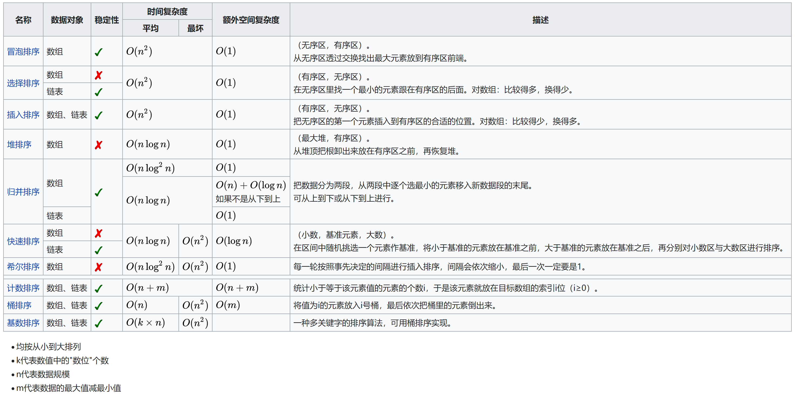

### 排序算法汇总

以升序排序为例

**冒泡**

```c
void bubbleSort(int *A, int n) {
    for (int i = 0; i < n; i++) {
        for (int j = 0; j < n - i - 1; j++) {
            if (A[j] > A[j + 1]) swap(A[j], A[j + 1]);
        }
    }
}
```

**快排**

最基本的快排版本

```c
void quickSort__(int *A, int left, int right) {
    if (left >= right)
        return;
    int val = A[left];
    int i = left, j = right;
    while (i < j) {
        for (; i < j && A[j] >= val; j--);
        A[i] = A[j];
        for (; i < j && A[i] <= val; i++);
        A[j] = A[i];
    }
    A[i] = val;
    quickSort__(A, left, i - 1);
    quickSort__(A, i + 1, right);
}

// 函数入口
void quicksort(int *A, int n) {
    quickSort__(A, 0, n - 1);
}

```

**直接插入**

```c
void insertSort(int *A, int n) {
    for (int i = 1; i < n; i++) {
        int v = A[i];
        int j = i - 1;
        for (; j >= 0 && A[j] >= v; j--)
            A[j + 1] = A[j];
        A[j + 1] = v;
    }
}
```

**希尔**

```c
// 步长初始为n/2
// 内部使用插入排序
void shellSort(int *A, int n) {
    int m = n / 2;
    while (m) {
        for (int i = 0; i < n; i += m) {
            for (int j = i + m; j < n; j += m) {
                int v = A[j];
                int k = j - m;
                for (; k >= 0 && A[k] >= v; k -= m)
                    A[k + m] = A[k];
                A[k + m] = v;
            }
        }
        m -= 1;
    }
}
```

**简单选择**

```c
void selectSort(int *A, int n) {
    for (int i = 0; i < n; i++) {
        int m = A[i];
        int ind = i;
        for (int j = i + 1; j < n; j++) {
            if (A[j] < m) {
                m = A[j];
                ind = j;
            }
        }
        swap(A[i], A[ind]);
    }
}
```

**堆排序**

```c
void heapSort(int *A, int n) {
    //创建最大
    MaxHeap heap = createMaxHeap(A, n);

    for (int i = 0; i < n; i++) {
        // 把堆顶元素放到尾部
        int temp = heap->array[0];
        heap->array[0] = heap->array[heap->size - 1];
        heap->array[heap->size - 1] = temp;
        heap->size -= 1;
        // 重新调整堆
        maxHeapify(heap, 0);
    }
}
```

其中MaxHeap的代码如下

```c
typedef struct max_heap {
    int size;
    int *array;
} max_heap, *MaxHeap;

// 创建最大堆
void maxHeapify(MaxHeap heap, int ind) {
    int min_ind = ind;
    int left = 2 * ind + 1;
    int right = 2 * ind + 2;

    int *arr = heap->array;
    int size = heap->size;

    // 选择root、left、right中的最小元素
    if (left < size && arr[left] > arr[min_ind])
        min_ind = left;
    if (right < size && arr[right] > arr[min_ind])
        min_ind = right;

    if (min_ind != ind) {
        swap(arr[min_ind], arr[ind]);
        maxHeapify(heap, min_ind);
    }
}

MaxHeap createMaxHeap(int *A, int n) {
    MaxHeap heap = (MaxHeap) malloc(sizeof(max_heap));
    heap->array = A;
    heap->size = n;

    for (int i = (n - 2) / 2; i >= 0; i--) {
        maxHeapify(heap, i);
    }

    return heap;
}

MaxHeap createMaxHeap_deep(int *A, int n) {
    MaxHeap heap = (MaxHeap) malloc(sizeof(max_heap));
    heap->array = (int *) malloc(sizeof(int) * n);
    heap->size = n;

    for (int i = 0; i < n; i++) {
        heap->array[i] = A[i];
    }

    for (int i = (n - 1) / 2; i >= 0; i--) {
        maxHeapify(heap, i);
    }

    return heap;
}

int popMaxHeapRoot(MaxHeap heap) {
    int *arr = heap->array;
    // 获取根
    int n = arr[0];
    swap(arr[0], arr[heap->size - 1]);
    heap->size -= 1;
    maxHeapify(heap, 0);
    return n;
}

```

**2路归并排序**

```c
void merge(int *A, int left, int mid, int right) {
    int i, j, k;
    int n1 = mid - left + 1;
    int n2 = right - mid;

    int L[n1];
    int R[n2];

    for (i = 0; i < n1; i++)
        L[i] = A[left + i];
    for (j = 0; j < n2; j++) {
        R[j] = A[mid + j + 1];
    }

    i = j = 0;
    k = left;
    // 放置L、R中的较小元素
    while (i < n1 && j < n2) {
        if (L[i] <= R[j]) {
            A[k++] = L[i++];
        } else {
            A[k++] = R[j++];
        }
    }
    while (i < n1)A[k++] = L[i++];
    while (j < n2)A[k++] = R[j++];

}

void mergeSort_2__(int *A, int left, int right) {
    if (left >= right)
        return;
    int mid = (left + right) / 2;
    mergeSort_2__(A, left, mid);
    mergeSort_2__(A, mid + 1, right);
    merge(A, left, mid, right);
}


// 函数入口
void mergeSort_2(int *A, int n) {
    mergeSort_2__(A, 0, n - 1);
}

```

**计数排序**

```c
void countingSort(int *A, int n) {
    if (n == 0)
        return;
    int C[MAX_SIZE];
    memset(C, 0, MAX_SIZE);

    for (int i = 0; i < n; i++) {
        C[A[i]]++;
    }

    int ind = 0;
    for (int i = 0; i < len(C); i++) {
        while (C[i]--) {
            A[ind++] = i;
        }
    }
}
```

**桶排序**

LinkList是单链表

```c
void bucketSort(int *A, int n) {
    if (n == 0)
        return;
    const int BUCKET_SIZE = 5;

    // use max - min create array can save space
    int max = A[0];
    int min = A[0];
    for (int i = 0; i < n; i++) {
        if (A[i] > max)
            max = A[i];
        if (A[i] < min)
            min = A[i];
    }

    int d = max - min + 1;
    LinkList buckets[d];
    for (int i = 0; i < d; i++) {
        buckets[i] = createEmptyLinkList();
    }

    for (int i = 0; i < n; i++) {
        // map function: f(A[i]) = ((A[i] - min) / BUCKET_SIZE)
        insertNodeHead(buckets[(A[i] - min) / BUCKET_SIZE], A[i]);	//在头部插入结点
    }

    // sort bucket
    for (int i = 0; i < d; i++) {
        sortLinkList(buckets[i]);
    }

    int ind = 0;
    for (int i = 0; i < d; i++) {
        Array a = (Array) transformToArray(buckets[i]);	//链表转数组
        int *arr = a->arr;
        for (int j = 0; j < a->size; j++) {
            A[ind++] = arr[j];
        }
    }
}
```

**基数排序**

```c
int getNumInPos(int num, int pos) {
    while (--pos) {
        num /= 10;
    }
    return num % 10;
}

// n is length , m is max length of number
void radixSort(int *A, int n, int m) {
    const int BASE = 10;
    // 10 base
    LinkList container[10];
    for (int i = 0; i < BASE; i++) {
        container[i] = createEmptyLinkList();	//创建空链表
    }
    // process all position
    for (int i = 1; i <= m; i++) {
        // process all number in given position
        for (int j = 0; j < n; j++) {
            // get current number
            int tmp = A[j];
            // insert to corresponding contain
            insertNodeTail(container[getNumInPos(tmp, i)], tmp);
        }
        // gather number in contain
        int ind = 0;
        for (int k = 0; k < BASE; k++) {
            while (!isEmptyLinkList(container[k]))
                A[ind++] = popFrontVal(container[k]);
        }
    }

}
```


## 第七章 图

> 图的概念非常多，一般出现在选择题和判断题里面
>
> 图的基本算法一定要掌握，不然考到不会写就非常吃亏

### 基本概念

1、图是一种网状数据结构，其中结点之间的关系是任意的，即图中任何两个结点之间都可能直接相关。 

2、顶点：图中的数据元素。 

3、边：图中两个顶点之间的关系。 有向边：由始点指向终点的一条边。

4、有向图：图中的每一条边都是有方向的。 无向图：图中的每一条边都是无向的。

5、邻接点：若顶点（Vi,Vj）是一条边，则 Vi 和 Vj 互为邻接点。 

6、顶点的度：与顶点相关联的边的数目。 出度：在有向图中，以顶点 v 为始点的边的数目。 入度：在有向图中，以顶点 v 为终点的边的数目。

7、无向完全图：有 n(n-1)/2 条边的无向图。 有向完全图：有 n(n-1)条边的有向图。

8、稀疏图：有很少条边或弧的图(e < nlogn) 稠密图：(e>=nlogn)

9、子图：设有图 G=(V，E)和 G’=(V’，E’)，如果V’是 V 的子集，E’是 E 的子集，则称G’是 G 的子图。

10、路径：在图中从顶点 v 到顶点v’所经过的所有顶点的序列。 简单路径：序列中顶点不重复出现的路径。

11、回路或环：第一个顶点和最后一个顶点相同的路径。 简单回路或环：除第一个和最后一个顶点，其余顶点不重复出现的路径。

12、有根图：有向图中，若存在一顶点 v，从该顶点有路径可以到图中其它所有顶点，则称此有向图为有根图，v 称为图的根。

13、连通：在无向图中，如果从 v 到v’存在路径，则称 v 和v’是连通的。 连通图：无向图 G 中如果任意两个顶点 vi,vj 之间都是连通的，则称图 G 是连通图。

14、连通分量：无向图中的极大连通子图。 

15、强连通图：在有向图G 中，如果对于每一对 vi,vjV, vivj，从 vi 到 vj 和从 vj 到 vi 都存在路径， 则称 G 是强连通图。 

16、强连通分量：有向图中的极大强连通子图。 

17、带权图：图的每条边都赋上一个权值。 

18、网络：带权的连通图。 

19、连通图的生成树：是连通图的一个极小连通子图，它含有图中的全部 n 个顶点，但只有足以构成一棵 树的 n-1 条边。

20、有向树：如果一个有向图恰有一个顶点入度为 0，其余顶点入度均为 1，则该图必定是一棵有向树。 

21、有向图的生成森林：由若干棵有向树组成，含有图中全部顶点，但只有构成若干棵不相交的有向树的弧。

22、图的遍历：从图中某一顶点出发按照某种方式系统地访问图中所有结点，并且使每一个结点被访问且 仅被访问一次。

23、路径：如果图中从一个顶点可以到达另一个顶点，则称这两个顶点间存在一条路径。 

24、最短路径：如果图是一个带权图，则路径长度为路径上各边的权值的总和，两个顶点间路径长度最短 的那条路径称为两个顶点间的最短路径，其路径长度称为最短路径长度。

### 图的表示法

邻接矩阵：

最常用的表示法

假设C是一个$N * N$的矩阵，则有


$c_{ij}=1$表示结点i和结点j存在边

邻接表

邻接表表示法将图以邻接表的形式存储在计算机中。所谓图的邻接表，也就是图的所有节点的邻接表的集合；而对每个节点，它的邻接表就是它的所有出弧。


### 图的算法

以邻接矩阵存储方式的图为例

#### DFS遍历

从图的指定顶点 v 出发，先访问顶点 v，并将其标记为已访问过，然后依次从 v 的未被访问过的邻接顶点 w 出发进行深度优先搜索，直到图中与 v 相连的所有顶点都被访问过。如果图中还有未被访问的顶点，则从另一未被访问过的顶点出发重复上述过程，直到图中所有顶点都被访问过为止

```c
// DFS过程
void DFShelper(int graph[][N], int node, int vis[]) {
    if (vis[node] == 1)
        return;
    printf("%d ", node);	//访问节点node
    vis[node] = 1;
    // 检查邻居结点
    for (int i = 0; i < N; i++) {
        if (graph[node][i] == 1 && vis[i] != 1)
            DFShelper(graph, i, vis);
    }
}

void DFS(int graph[][N], int node) {
    // 标记数组
    int vis[N];
    for (int i = 0; i < N; i++) {
        vis[i] = 0;
    }
    printf("DFS visit: ");
    // 从node开始DFS
    DFShelper(graph, node, vis);
    printf("\n");
}
```

#### BFS

借助队列来访问图

```c
void BFS(int graph[][N], int node) {
    int vis[N];
    for (int i = 0; i < N; i++) {
        vis[i] = 0;
    }
    // queue 队列
    int que[MAX_SIZE];
    int q = 0, p = 0;
    que[p++] = node;
    vis[node] = 1;
    printf("BFS visit: ");
    // 队列不为空
    while (q - p != 0) {
        int cur = que[q++];
        printf("%d ", cur);		// 访问当前节点
        // 检查邻居结点
        for (int i = 0; i < N; ++i) {
            // 如果可达并且没有被访问过
            if (graph[cur][i] == 1 && vis[i] != 1) {
                que[p++] = i;
                vis[i] = 1;
            }
        }
    }
    printf("\n");
}
```

图的DFS、BFS都能够用来解决图是否连通，两点之间是否可达等问题，只需要稍微变化一下代码即可

#### 最小生成树算法

##### Prim算法——先选结点

每次迭代选择代价最小的边对应的点，加入到最小生成树中。算法从某一个顶点s开始，逐渐长大覆盖整个连通网的所有顶点。 


时间复杂度$O(E+VlogV)$

##### Kruskal算法——先选边

按照边的权重顺序（从小到大）将边加入生成树中，但是若加入该边会与生成树形成环则不加入该边。直到树中含有$V-1$条边为止。这些边组成的就是该图的最小生成树。


时间复杂度$O(ElogE)$

#### Dijkstra算法

对任意给定的图G(V,E)和起点S和终点T,求从S到T的最短路径

```c
//dijkstra伪代码
//G为图，数组d为源点到达各点的最短路径，s为起点
Dijkstra(G,d[],s){
	初始化;
	for(循环n次){
		u=使d[u]最小的还未被访问的顶点的标号;
		记u已被访问;//vis[u]=true;
		for(从u出发能到达的所有顶点v){
			if(v未被访问&&以u为中介点使s到v的最短距离d[v]更优){
				优化d[v];
			}
		}
	}
}
```

代码

```c
const int MAXV=1000;//最大顶点数
const int INF=1e9;//设INF为一个很大的数
 
//邻接矩阵版
//适用于点数不大(例如V不超过1000)的情况，相对好写
int n,G[MAXV][MAXV];//实际n为顶点数，MAXV为最大顶点数
int d[MAXV];//起点到达各点的最短路径长度
bool vis[MAXV]={false};//标记数组。vis[i]==true表示已访问。初值均为false
 
void Dijkstra(int s){//s为起点
	fill(d,d+MAXV,INF);//[d,d+MAXV)的内存区域全置为INF 即数组d初始化为INF
	d[s]=0;//起点s到达自身的距离为0
	for(int i=0;i<n;i++){//循环n次
		//找到顶点u  u为未访问的顶点中d[]最小的
		int u=-1,MIN=INF;//u使得d[u]最小，MIN存放该最小的d[u]
		for(int j=0;j<n;j++){//找到未访问的顶点中d[]最小的
			if(!vis[j]&&d[j]<MIN){
				MIN=d[j];
				u=j;
			}
		}
 		//找不到小于INF的d[u],说明剩下的顶点和起点s不连通
		if(u==-1) return;
		//优化s到各新点的最短距离
		vis[u]=true;//标记u已经访问
		for(int v=0;v<n;v++){
			//如果v未访问&&u能到达v&&以u为中介点可以使d[v]更优
			if(vis[v]==false&&G[u][v]!=INF&&d[u]+G[u][v]<d[v]){
				d[v]=d[u]+G[u][v];//优化d[v]
			}
		}
 
	}
 
}
```

#### Floyd算法

求任意两个结点的最短路径

原理就是，如果结点i和结点j之间存在结点k，使得结点i到结点j的距离更小，那么更新结点i和结点j的距离为结点i到结点k、结点k到结点j的距离

$O(n^3)$的时间复杂度，了解就好

```c
for(k = 1; k <= n; k++)
    for(i = 1; i <=n; i++)
        for(j = 1; j <=n; j++)
            if(e[i][j] > e[i][k] + e[k][j])   // 以各种顶点为转点判断	
                e[i][j] = e[i][k] + e[k][j];  // 更新最短路径
```

## 第八章 真题题型汇总

### 链表

**04**

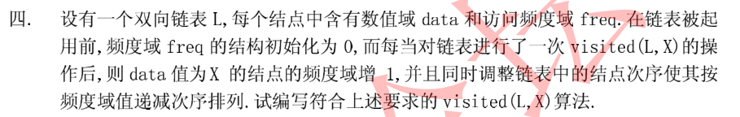


**05**


**06**

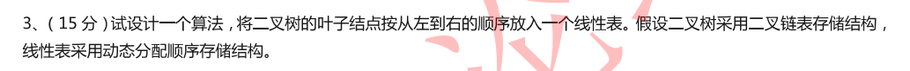


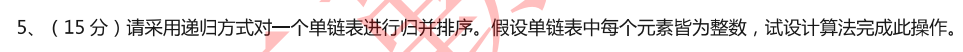


**07** 

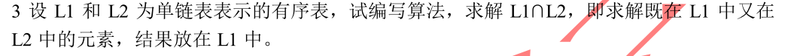


**09**

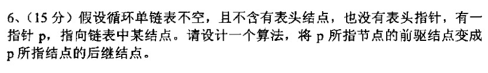


**10**

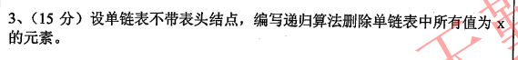


**11**

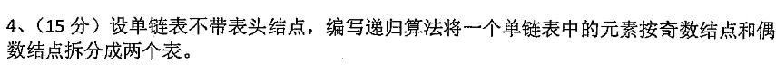


**12-1**

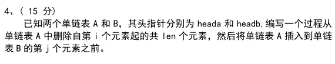


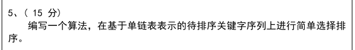


**12-2**

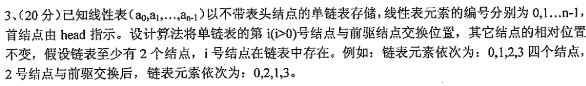


**13**

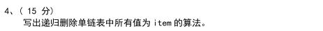


**14**

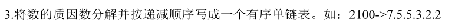


**15**

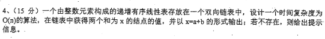


**16**

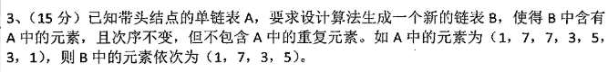


**18**

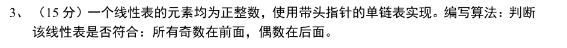


**19**

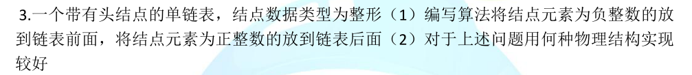


**20**

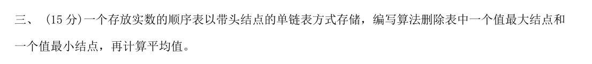

### 树

**04**

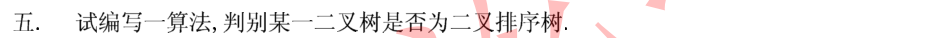


**07** 

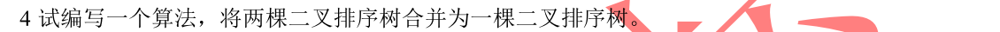


**09**

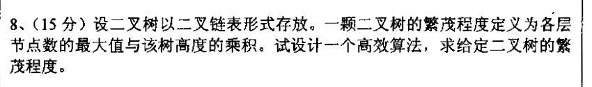


**10**

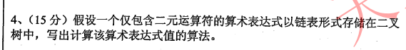


**11**

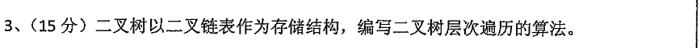


**12-1**

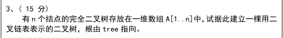


**12-2**

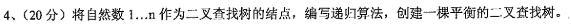


**13** 

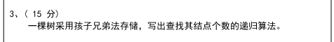


**14**

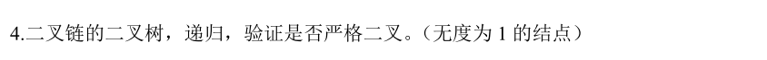


**15**

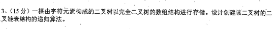


**16**

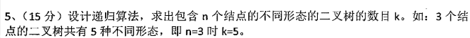

卡特兰数


**17**

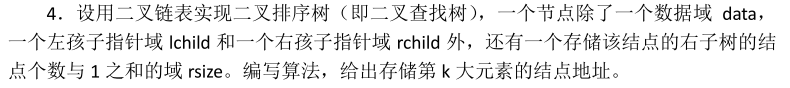


**18**

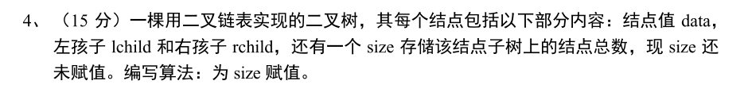


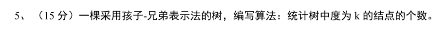


**19**

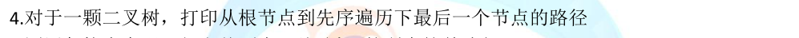


**20**

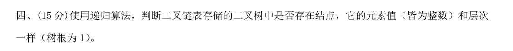


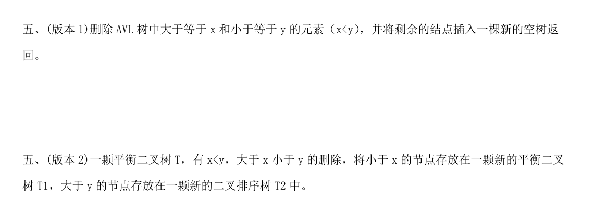


### 图

**04**

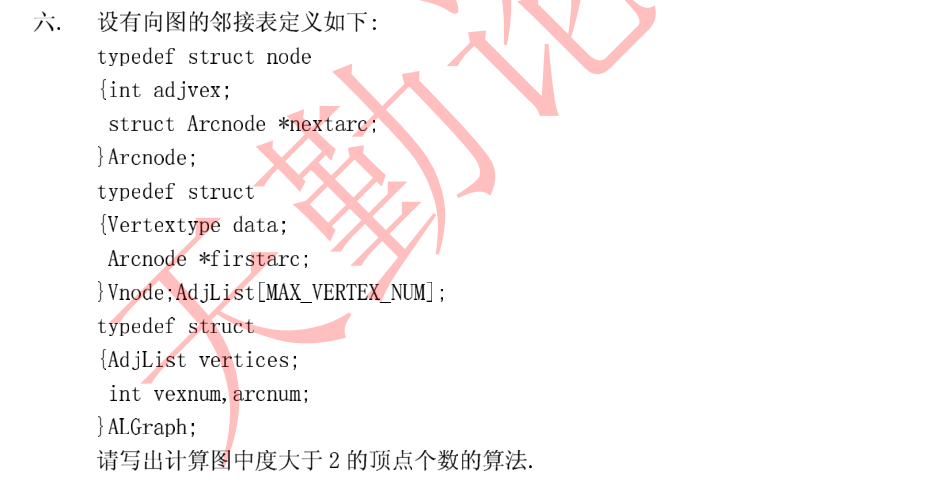


**07**

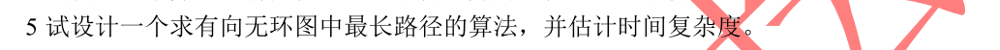


**08**

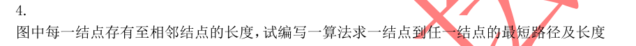


**09**

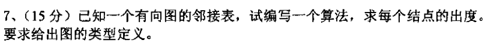


**10**

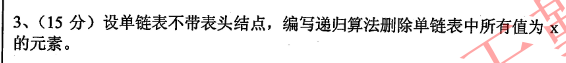


**17**

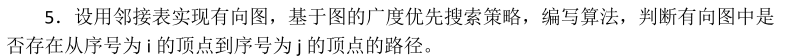


**19**

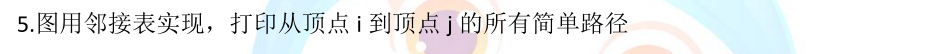


