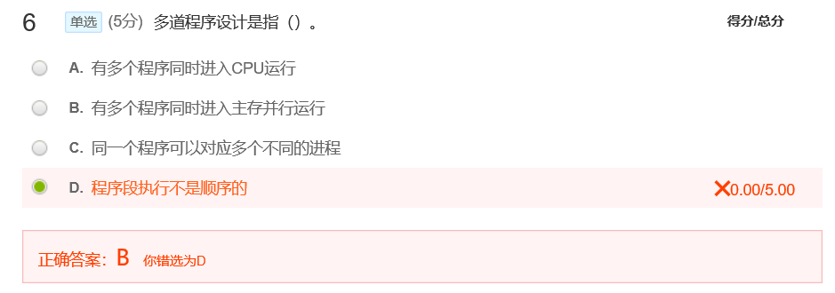
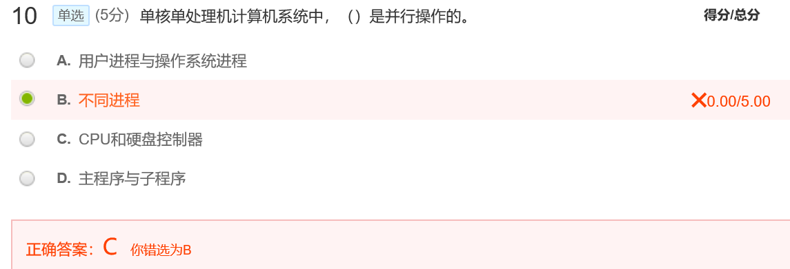
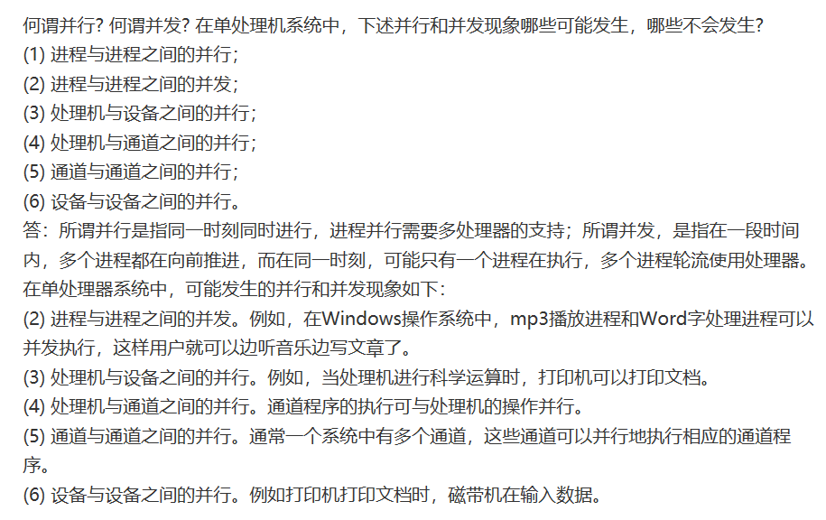
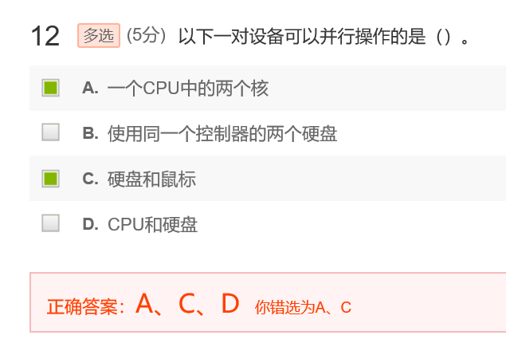
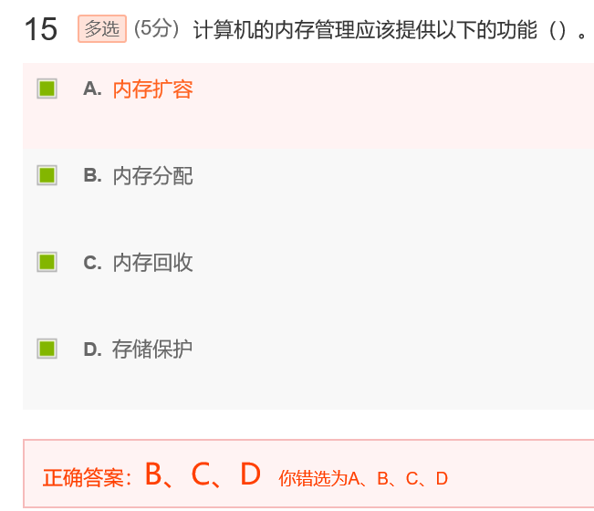
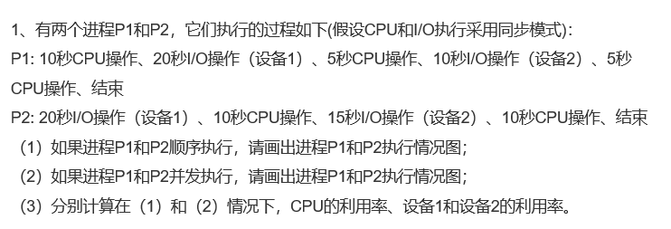
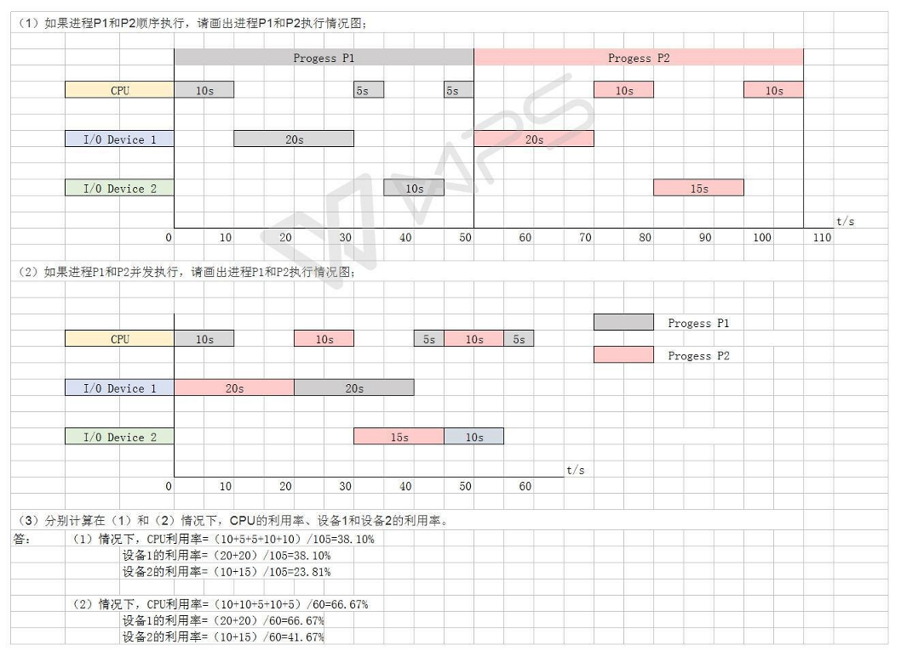
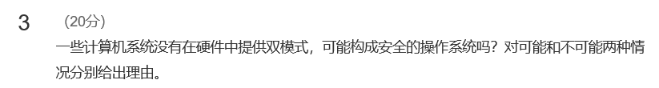

[toc]

# 01 导论

## 检测

正确答案B，有多个程序同时进入主存并行运行。
D的描述是操作系统进中进程的异步性

注意看题目，单核单处理机计算机支持不了进程并行，所以这里的并行是指CPU和硬盘控制器的并行

补充：

接上题目，CPU和硬盘这样的设备之间也是支持并行操作的

记住答案就好，B、C、D就是内存管理定义上需要的功能

## 作业

**答案：**

---

**答案：**

用户态和内核态
 双模态通过限定用户的操作来保护操作系统的安全，比如用户需要读写某些文件的时候，由于读写指令可能会修改系统重要的文件信息，因此这些指令需要从用户态转入内核态操作，而不是直接在用户态下执行

---

**答案：** 

**可能**：     1) 通过软件解释程序（像一些 BASIC，Java，LISP systems），能够提供硬件所不能提供的安全防护。2)  要求所有程序都用高级语言编写，以便于所以目标代码都被编译出来。编译器将会产生硬件忽略的防护性检查（in-line）或功能调用） **不可能**：用户可能会调用引起系统崩溃的指令。  

---

**答案：**

- 联系：多道处理和分时操作技术都可以同时运行多个作业。提高计算机的使用效率。分时操作系统技术同样采用批处理操作系统的多道程序设计技术。
- 不同：多道处理技术是系统分配多个作业同时运行占用处理机，通过合理的调度，让多个作业交替的同时使用不同的资源。所有作业并发执行，直到作业结束。用户中途不能干预其执行。分时操作技术是让多个进程轮流占用处理机，每个进程不管是否结束，在一个时间片内都会强制停止，换下一进程，一直循环执行。每个用户可以感觉系统被他独占，而且可以根据系统响应的结果提出下一个请求。干预每一步的进行。
- 多道处理适用批处理作业，分时适用于交互作业。

---

**答案：**

由于I/O设备都是外部设备，与硬件连接，为了防止用户程序执行非法I/O，导致系统崩溃，因此需要进行I/O保护机制，所有I/O指令都是特权指令，只在内核模式运行。