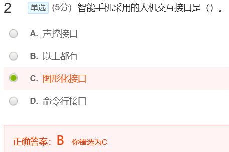
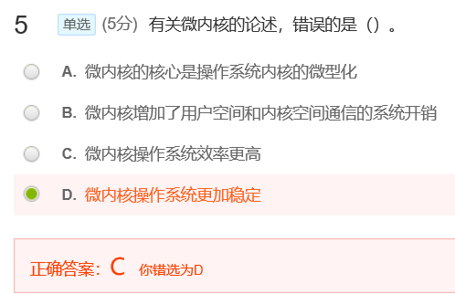
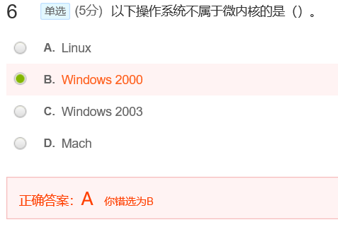
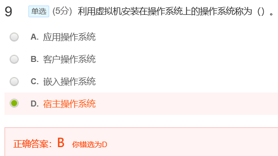
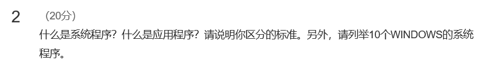

[toc]

# 02 操作系统结构

## 测验

智能手机采用的人机交互接口是声控接口、图形化接口、命令行接口。答案是B

微内核并不能使系统效率更高，因为微内核会导致更频繁的内核态和用户态之间切换，增加系统运行开销，答案是C

记住就好

答案是B

真题出过，答案是B。
从概念上来说：系统调用是一种保护策略，用户接口分为命令接口和程序接口

从理解的角度来说：系统调用并不是提供给用户的，系统调用是给程序编写人员提供的接口。

## 作业

**答案：**

**GUI**

- 优点：GUI由于采用了大量的图形元素，界面会更显得具有艺术性，富有人性化。     相较于枯燥的文本来说，精致且合理的图形大大增强了界面的易用性。给用户提供可视化的界面，在操作过程中给予用户更多方便。
- 缺点：尽管GUI提供了良好的易用性，极大地填补了人机对话的鸿沟，但在另一方面看来，实际上增加了软件开发的成本，缩小了软件的适用范围，同时降低了软件的工作性能，在效率上相比CLI较低。

**CLI**

- 优点：主要以文本方式作为工作元素，并主要以键盘作为输入工具的工作方式。CLI采用直接输入命令和参数的方式直接向计算机发送各种指令，通过组织参数和命令的输入方法来试图提高工作效率。CLI通过简化操作步骤和提供批量处理选项，提高了进行重复工作时的操作效率 ，由于主要使用文本作为界面，CLI软件对计算机的要求也低得多，在同等配置的机器上也要比GUI软件的性能好得多。对于以性能为核心的服务器系统，CLI有更好的适用性。同时，由于具备了比GUI软件好得多的可伸缩性，CLI的适用范围也远比GUI广泛，在因此也适用于很多嵌入式平台上。
- 缺点：相较于GUI而言，CLI通常就不具备什么美观程度，为了提高性能，CLI通常采用纯文本方式工作，因此，对于不熟悉命令集的用户来说，这无疑造成了极大不便。

---

**答案：**

- 区分的标准：系统程序和应用程序对于计算机和用户的用处。
- 系统程序是指控制和协调计算机及外部设备，支持应用软件开发和运行的系统，是无需用户干预的各种程序的集合，主要功能是调度，监控和维护计算机系统，负责管理计算机系统中各种独立的硬件，使得它们可以协调工作。系统程序使得计算机使用者和其他程序将计算机当作一个整体而不需要顾及到底层每个硬件是如何工作的。
- 应用程序是用户可以使用的各种程序设计语言，以及用各种程序设计语言编制的应用程序的集合，分为应用软件包和用户程序。应用软件包是利用计算机解决某类问题而设计的程序的集合，供多用户使用。应用程序是为满足用户不同领域、不同问题的应用需求而提供的那部分软件。     它可以拓宽计算机系统的应用领域，放大硬件的功能。
- 10个WINDOWS系统程序:     任务管理器、时钟管理程序、命令提示符、文件资源管理器、Windows Defender     安全中心、系统设置程序、系统设备控制程序、系统更新和安全保护程序、应用程序管理程序、性能监视器程序等。

---

**答案：**

简单结构：MS-DOS、早期UNIX
层次结构：THE、iOS
微内核结构：Mach、Windows 2000
模块化结构：Solaris、Linux
混合结构：Mac OS X

---

**答案：** 

虚拟机是一种通过软件模拟实现，具有完整硬件系统功能，并运行在一个完全隔离环境中的完整计算机系统。

**好处:**

按照虚拟机种类分：

- 高级语言虚拟机：可以跨平台使用，方便易用；
- 工作站虚拟机：多个操作系统可以同时在一个计算机上使用，一个宿主操作系统，若干个客户操作系统；
- 服务器虚拟机：把一个物理计算机虚拟化为多个虚拟机，安全性好、资源可以共享、可扩展性好、便与隔离、性价比高。

按照虚拟机的用处分：

- 演示环境，可以安装各种演示环境，便于做各种例子；

- 保证主机的快速运行，减少不必要的垃圾安装程序，偶尔使用的程序，或者测试用的程序在虚拟机上运行；

- 避免每次重新安装，对于不经常使用，而且要求保密比较好的应用，可使其单独在一个环境下面运行；

- 如果想测试一下不熟悉的应用，在虚拟机中随便安装和彻底删除；

- 体验不同版本的操作系统，如Linux、Mac；

- 虚拟化技术可以大幅提高系统安全性。

  ---

**答案：**

- 优点：微内核有效地分离了内核与服务，服务与服务，使得它们之间的接口更加清晰，维护的代价大大降低，各部分可以独立地优化和演进，从而保证了操作系统的可靠性。
- 在微内核中客户程序和系统服务通过进程通信相互作用。
- 缺点：因需要频繁地在核心态和用户态之间进行切换，操作系统的执行开销偏大，从而影响系统性能