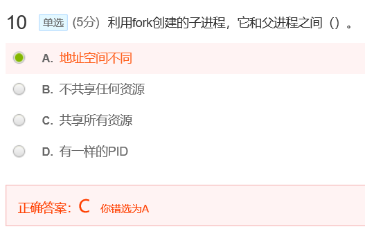
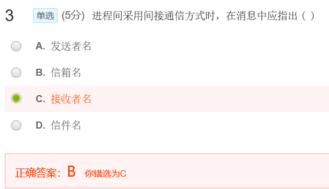
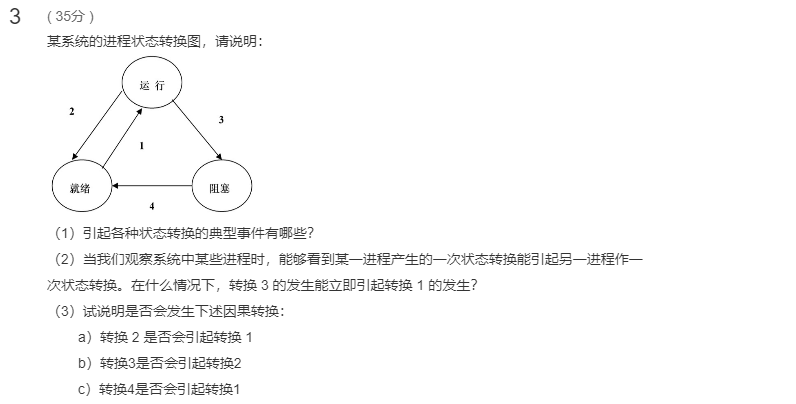

[toc]

# 03 进程

## 测验

父进程撤销时子进程也会撤销

利用fork创建的子进程，它与父进程之间：
1 共享所有资源
2 PID不相同，系统会分配新的PID给子进程
3 地址空间相同

**重点是子进程和父进程的PID不相同，这个容易疏忽**

补充：

更详细的总结

1、父子进程相同点：  所属的环境变量、进程组ID和会话ID、当前工作路径、打开的文件、信号响应函数、整个内存空间。

2、父子进程不同点：  进程号PID
子进程不会继承父进程的：记录锁、挂起的信号；父子进程是并发进行的、父子进程是相互独立的；

进程和程序的并不相同。进程可以视为是程序的运行时，程序的本质是指令集+数据的集合，而程序需要运行得出结果就必须要变成进程运行，程序演变为进程的过程涉及到编译、链接、装入等知识。

指出信箱名即可

## 作业

**答案：**

- 长程调度：又称为作业调度，高级调度，是指将作业在内外存之间调度，每个作业只会被调入调出一次，也就是作业被选中进入内存和作业结束时从内存调出到外存

- 中程调度：又称内存调度，中级调度，是内存和外存之间的调度，作用是提高内存利用率和系统吞吐量，将暂时不能运行的进程挂起到外存等待，但进程的PCB仍然保留在内存中

- 短程调度：又称进程调度，低级调度，是频率最高的调度，操作系统就就绪队列中选中一个进程，将CPU资源分配给它

  ---

**答案：**

- 时间片用完
- 阻塞
- 结束

---

**答案：**

(1)
当进程调度程序从就绪队列中选取一个进程投入运行时引起转换1;
正在执行的进程如因时间片用完而被暂停执行或中断发生就会引起转换2;
正在执行的进程因等待的事件尚未发生而无法执行(如进程请求完成I/O)则会引起转换3;
当进程等待的事件发生时(如I/O 完成)则会引起转换4。

(2)
 如果就绪队列非空，则一个进程的转换3会立即引起另一个进程的转换1。这是因为一个进程发生转换3意味着正在执行的进程由执行状态变为阻塞状态，这时处理机空闲，进程调度程序必然会从就绪队列中选取一个进程并将它投入运行，因此只要就绪队列非空，一个进程的转换3能立即引起另一个进程的转换1。

3) 

1. 
   2->1:当某进程发生转换2时，可能引起另一进程的转换1。当发生转换2时，正在执行的进程从执行状态变为就绪状态，进程调度程序可能会从就绪队列中选取一个进程投入运行，即发生转换1（如时间片用完时）。也可能不会从就绪队列中选取一个进程投入运行（如中断发生时）。

2. 
   3->2:某个进程的转换3决不可能引起另一进程发生转换2。这是因为当前执行进程从执行状态变为阻塞状态，不可能又从执行状态变为就绪状态。

3. 

   4->1:某个进程的转换4可能引起另一进程发生转换1。当处理机空闲且就绪队列为空时，某一进程发生转换4，就意味着有一个进程从阻塞状态变为就绪状态，因而调度程序就会将就绪队列中的此进程投入运行。

---

**答案：**

将CPU切换到另一个进程需要保存当前进程的状态并恢复另一个进程的状态，这一任务称为上下文切换。当发生上下文切换时，内核会将旧进程的状态保存在PCB中，然后装入经调度要执行的并已保存的新进程的上下文。进程上下文用进程的PCB表示，它包括CPU寄存器的值、进程状态和内存管理信息等。通常通过执行一个状态保存来保存CPU当前状态（不管它是内核模式还是用户模式），之后执行一个状态恢复重新开始运行。

---

**答案：**

直接通信，无需第三者参与，两个进程可以通信。需要通信的进程必须显式地命名通信的接收者和发送者。 每一对通信进程间只存在一个连接。

间接通信，需要第三者参与。两个进程才能通信。一般通过邮箱或端口来发送和接收消息。间接通信中，每个连接可同多个进程相关，每一对进程可共享多个通信连接。

直接通信例子：打印进程和计算进程间相互通信

直接通信优点：快速、高效、简单

间接通信缺点：速度慢

间接通信例子：直播进程和客户进程间的一对多通信

直接通信缺点：需要建立大量通信链路，效率差

间接通信优点：只需建立一个信箱，效率高

## 2020年新开课补充的题目和答案

**答案：**
进程控制块(PCB)是操作系统为了运行和管理进程设置的专门数据结构，用它来记录进程的各种信息，描述进程的运动变化过程。

系统利用PCB来控制和管理进程，所以PCB是系统感知进程存在的唯一标志。

PCB中记录了操作系统所需的用于描述进程情况及控制进程运行所需的全部信息。因而它使进程能够在多道程序环境下独立运行，和其它进程并发执行。

---

**答案：**
 进程操作中最重要的一个操作是进程创建。进程在其执行过程中，通过创建进程系统调用创建多个新进程。创建进程称为父进程，而新进程称为子进程。每个新进程再创建其他进程，如此轮流创建下去，构成一棵进程树。

在资源共享方面可以有三种模式：一是父进程和子进程共享所有的资源；二是子进程共享父进程资源的子集；三是父进程和子进程无资源共享，各自独立使用资源。不同的系统可以采用不同的资源共享模式。

在执行方面，也有两种可能：父进程和子进程并发执行；或者父进程等待，直到子进程终止为止。

新进程的地址空间也有两种可能：一是子进程复制父进程的空间，也就是具有与父进程相同的程序和数据。二是子进程装入另一个新程序。在UNIX中，fork系统调用的功能是创建一个新进程，创建时完全复制父进程的空间，这种机制允许父进程与子进程方便地进行通信。

当进程执行完最后的语句并使用系统调用exit请求操作系统删除自身时，进程终止。此时进程可以通过系统调用wait向父进程输出返回值，所有进程资源（包括物理和虚拟内存、打开文件和I/O缓冲）会被操作系统释放。

还有其他结束进程的方式，如通过系统调用abort，由父进程终止子进程的执行。使用这种结束进程的方式可能由以下几种情况引起：一是子进程超量分配资源；二是赋予子进程的任务不再需要；三是父进程终止，一些系统不允许子进程继续存在，因此所有的子进程都需要终止，这种现象称为级联终止，通常由操作系统进行。