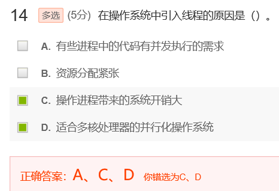

[toc]

# 04 线程

## 测验

线程有自己的堆栈存放各自的变量

记住就好

## 作业

**答案：**

作用:
为程序员提供API来创建和管理线程。
例如：
Java线程库，通过继承Thread类，重写run方法来创建自己的线程。调用start函数就开始执行线程代码。
从Thread类派生一个子类，并创建子类的对象。子类应该重写Thread类的run方法，写入需要在新线程中执行的语句段。
调用start方法来启动新线程，自动进入run方法。

---

**答案：**

有多对一，一对一，多对多映射模型。

多对一：不支持内核线程的操作系统，多个线程不能并行运行在多个处理器上，进程中的用户线程由进程自己管理

一对一：用于支持线程的操作系统，并发性好，但是内核开销大

多对多：并发性和效率兼顾，但增加复杂度

**官方答案：**

- 多对一：将多个用户级线程映射到一个内核级线程，线程管理在用户空间完成。
                特点：用户级线程对操作系统不可见，线程管理在用户空间进行，效率比较高，但当一个线程在使用内核时被阻塞，那么整个进程都会被阻塞，并且，多个线程不能并行地运行在多处理机上。
- 一对一：每个用户级线程映射到一个内核级线程。
                特点：当一个线程被阻塞后，允许另一个线程继续执行，并发能力较强，但每创建一个用户级线程都需要创建一个内核级线程与其对应，这样创建线程的开销比较大，会影响到应用程序的性能。
- 多对多：将n个用户级线程映射到m个内核级线程上，要求m小于等于n。
            特点：折中多对一模型和一对一模型，克服前两者的缺点，又拥有了前两者的优点，集两者之所长。

---

**答案：**

参考web服务器

---

**答案：**

1. 当内核线程的数量少于处理器时，一些处理器将仍然处于空闲状态。
2. 当程序分配的内核线程的数量与处理器相同时，那么有可能所有处理器将同时使用，也有可能存在空闲。
3. 当由程序分配的内核线程的数量大于处理器数量时，封锁一个内核线程并调出，换入另一个准备执行的内核线程。因此，增加多处理器系统的利用率。  