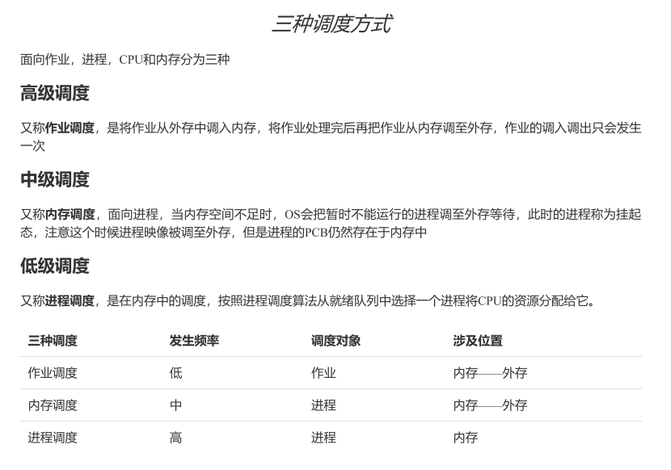
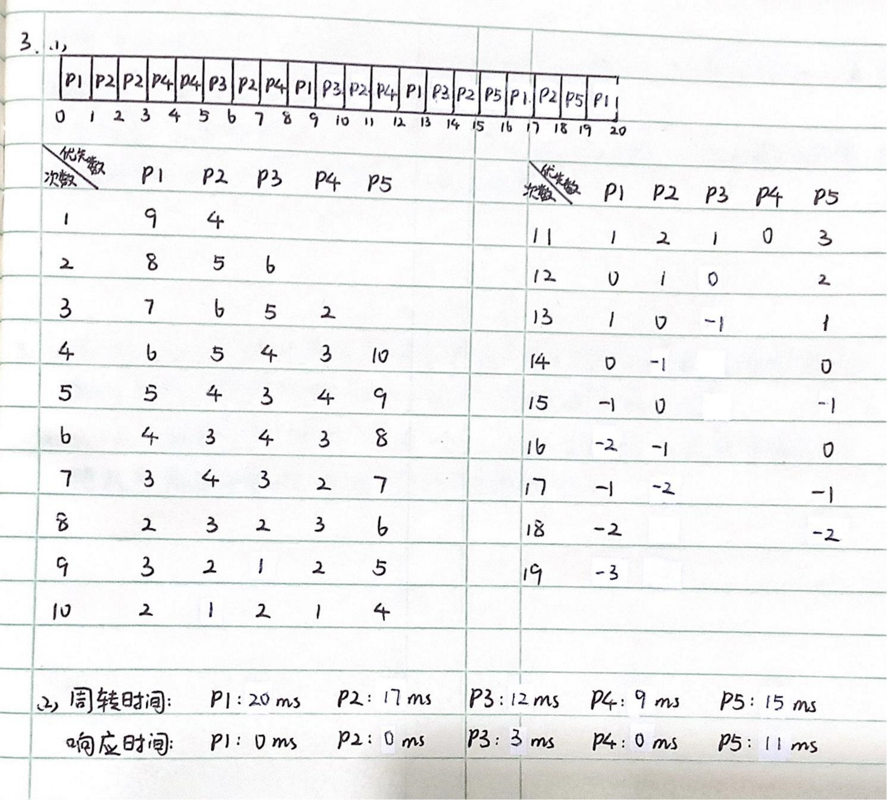

[toc]

# 05 CPU调度

## 测验

新建到就绪的转换，应该是长程调度，也就是我们说的作业调度/高级调度，下图来自 OS中的调度 补充笔记

一道经典的题目，建议自己算一下

新建进程也需要转移到就绪态，并不是一新建就马上能抢占

MLQ调度算法是多级队列调度算法，不需要考虑进程升降级方法

等待时间是指进程等待CPU的时间之和，极端情况下RR算法退化成FCFS算法，此时等待时间一定，当时间片很小的时候会进行多次进程切换导致每个进程等待时间增加，比如说4，4，4本来用FCFS是0，4，8，当时间片为1的时候明显比FCFS长

RR是时间片轮转，PR是优先级调度，SJF是短作业优先，FCFS是先到先服务
PR和SJF都能会产生饥饿

SJF的平均等待时间和平均周转时间最小，并不是响应时间

使用优先级调度算法，可以按照短作业+优先级，FCFS+优先级

## 作业

**答案：**

---

**答案：**

- 抢占式调度:
  进程在运行过程中，如果有重要或紧迫的进程到达（其状态必须为就绪），则现运行进程将被迫放弃CPU，系统将CPU分配给新到达的进程
  适合交互式系统 

- 非抢占式调度:
  一旦把CPU分配给某个进程后，系统不可以抢占已分配的CPU给其他进程
  只有进程自愿释放CPU ，才可把CPU分配到其他进程
  适合批处理系统

---

![3  （ 25 分 ）  考 以 下 的 一 个 基 于 优 先 （ 优 先 数 高 优 先 低 ） 的 调 度 算 法 ， 此 算 法 采 用 根 据 等 待 时 间 和 运 行  时 间 对 优 先 数 进 行 动 态 老 化 算 法 ， 具 体 算 法 如 下 ：  a) 处 于 等 待 队 列 中 的 进 程 的 优 先 数 p 根 据 等 待 时 间 t （ 每 毫 秒 计 算 一 次 ） 进 行 变 化 ， p=p-ti  处 于 运 行 状 态 的 进 程 的 优 先 数 p 根 据 运 行 时 间 t （ 每 毫 秒 计 算 一 次 ） 进 行 变 化 ， p=p+t ；  c) 优 先 数 p 每 隔 1 毫 桫 重 新 计 算 ；  d) 采 用 抢 占 式 调 度 筱 略 ：  根 据 下 表 给 出 的 5 个 送 程 的 到 达 时 间 、 执 行 时 间 回 答 下 面 的 问 ·  相 同 时 ， 先 进 入 就 绪 队 列 的 进 程 优 先 ）  0  2  3  4  （ 时 间 以 毫 秒 为 单 位 ， 当 优 先 级  8  4  6  2  10  （ 1)  （ 2 ）  5  6  3  4  2  请 画 出 5 个 进 程 执 行 的 甘 特 图 。  根 据 以 上 的 调 度 算 法 ， 分 别 计 算 出 每 个 进 程 的 周 转 时 间 和 响 应 时 间 。 ](MdAsset/05 CPU调度/clip_image001-1603973679192.png)

这道题很坑，题目想表达的是p=p-1，但给的是p=p-t，参考18年的题目，并且优先级相同的时候就是按照第一次入队的顺序来选择的

老师的回复:

答案：

---

**答案：**

从切换频率角度看，进程调度切换频率高，速度快；而作业调度切换频率低，切换慢。因为每个进程在其生命周期中只有一次作业调度，而有很多次进程调度。    从切换开销角度分析，进程调度切换开销小，而作业调度切换开销大。因为作业调度需要把进程的代码和数据从外存调入内存，这些        I/O 操作很耗时。    在多数操作系统中，进程调度是必需的，而作业调度则是可选的。       

---

 

**答案：**

1. 先到先服务（FCFS）算法。
   β>α>0说明进程在队列中等待CPU和在运行时，优先级都在提高，都会比刚进入就绪队列的进程大，因此在队列中等待CPU的进程和运行的进程不会被刚进入的进程抢占；又因为β>α，运行的进程的优先级会始终大于在等待的进程的优先级，因此正在运行的进程不会被等待的进程抢占。

2. 后进先出（LIFO）算法。
   α<β<0说明进程在队列中等待CPU和在运行时，优先级都在降低，都会比刚进入就绪队列的进程小，因此在队列中等待CPU的进程和运行的进程会被刚进入的进程所抢占；又因为α<β，运行的进程的优先级会始终大于在等待的进程的优先级，因此正在运行的进程不会被等待的进程所抢占。