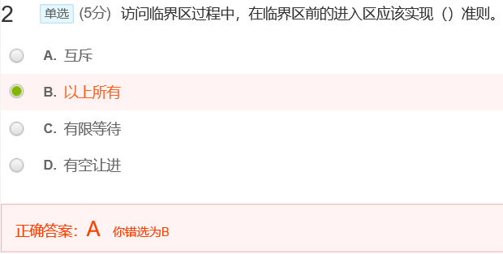
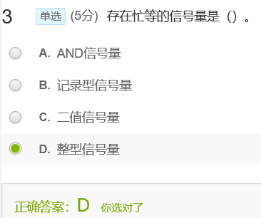
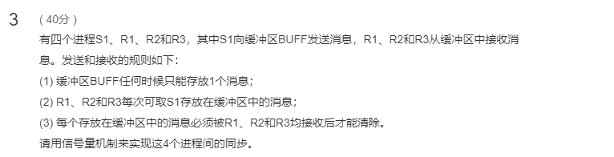
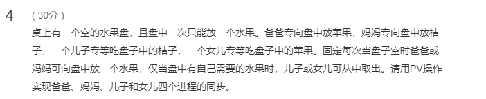

[toc]

# 06 进程同步

## 测验

问的是进入区，应该实现互斥准则

**AND型信号量**

上述的进程互斥问题，是针对各进程之间只共享一个临界资源而言的。在有些应用场合，是一个进程需要先获得两个或更多的共享资源后方能执行其任务。假定现有两个进程A和B，他们都要求访问共享数据D和E。当然，共享数据都应作为临界资源。为此，可为这两个数据分别设置用于互斥的信号量Dmutex和Emutex，并令它们的初值都是1;

**AND同步机制**的基本思想是：将进程在整个运行过程中需要的所有资源，一次性全部地分配给进程，待进程使用完后再一起释放。只要尚有一个资源未能分配给进程，其它所有可能为之分配的资源也不分配给它。亦即，对若干个临界资源的分配，采取原子操作方式：要么把它所请求的资源全部分配到进程，要么一个也不分配。由死锁理论可知，这样就可避免上述死锁情况的发生。为此，在wait操作中，增加了一个“AND”条件，故称为AND同步，或称为同时wait操作

**二进制信号量(binary semaphore)：**

​    只允许信号量取0或1值，其同时只能被一个线程获取。

二值型信号量就是书上的pv(mutex)

四种方法

第一种破坏循环等待，第四种破坏请求并保持

## 作业

**官方答案：**

临界区：
访问临界资源的那段代码。

准则：

- 互斥，如果有进程在某个临界区执行，其他进程将被排斥在临界区外，有相同临界资源的临界区都需要互斥，无相同临界资源的临界区不需要互斥。

- 有空让进，临界区内无进程执行，不能无限期地延长下一个要进入临界区的进程的等待时间。

- 有限等待，每个进程进入临界区前的等待时间必须有限，不能无限等待。

  ---

**答案：**

1. 大于0表示该资源剩余的数量
2. 等于0表示该资源刚好分配完
3. 小于0时，其绝对值的意思是正在等待该资源的进程数

---

真题考察过，重视

---

