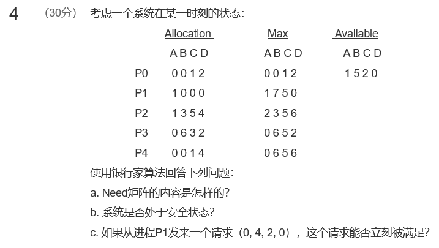

[toc]

# 07 死锁

## 测验

辨析这道题：
A存在某个不在环中的结点，申请某个已经分配出去的资源导致自己也死锁了
有环必有死锁，有死锁必有环

书上的定义

A预防死锁，不给死锁发生的可能
B避免死锁
C检测死锁
D解除死锁

死锁预防是静态，避免是动态

## 作业

**真题考察过，重视**

**答案：**

由于每个进程最多申请使用 x 个资源，在最坏情况下，每个进程都得到了 (x-1) 个资源，并且现在都需要申请最后一个资源。此时系统剩余资源数为：m-n(x-1)。
如果系统剩余数>1，即系统还有一个资源可以使用，就可以使系统中的一个进程获得所需的全部资源，从而每个进程都可以执行完毕，然后释放出所占有的资源，供其他进程使用。
因而，当 m-n(x-1)>=1 时，即 n(x-1)+1<=m 时，系统不会发生死锁。

---

**答案：**

死锁：
指多个进程因竞争共享资源而造成的一种僵局，若无外力作用，这些进程将永远不能向前推进，这种状态称为死锁。

原因：
竞争不可抢占性资源。
进程推进顺序不当。
竞争可消耗资源。

---

**真题考察过，重视**

**答案：**

假设max(i)表示第i个进程的最大资源需求量，need(i)表示第i个进程还需要的资源量，alloc(i)表示第i个进程已分配的资源量。根据题中条件可知：
$max(1)+...+max(n)=need(1)+...+need(n)+alloc(1)+...+alloc(n) < m+n$

说明如果这时系统发生死锁，那么这m个资源应该全部分配出去，即：

$alloc(1)+...+alloc(n) = m$

另外，系统中所有进程将陷入无限等待状态。

由上述两式可知，$need(1)+...+need(n) < n$

这表示n个进程还需要的资源量之和小于n，意味着此刻至少存在一个进程i，need(i)=0，即它已获得了所需要的全部资源。那么它就能执行完成并释放它占有的资源，这与前面的假设矛盾。从而证明在这个系统中不可能发生死锁。

---

Need=Max-Allocation

1. Need矩阵的内容是：

P0 (0 0 0 0)

P1 (0 7 5 0)

P2 (1 0 0 2)

P3 (0 0 2 0)

P4 (0 6 4 2)

2. 存在某个安全序列that能够按此分配资源而不发生死锁就是安全状态

此时是安全的

3. 如果立刻满足P1，那么Available=1,1,0,0，可以获得P0的资源A=1，0，1，2，然后获得P3的资源，A=3，3，6，7.
             存在安全序列0,2,3,4,1可以满足哦。