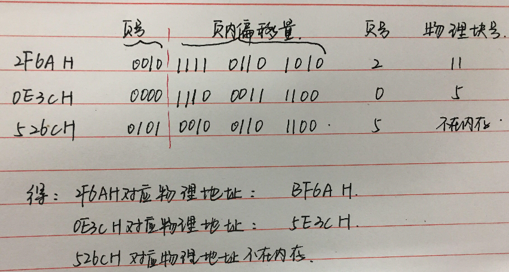
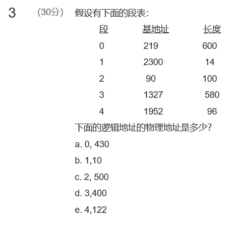
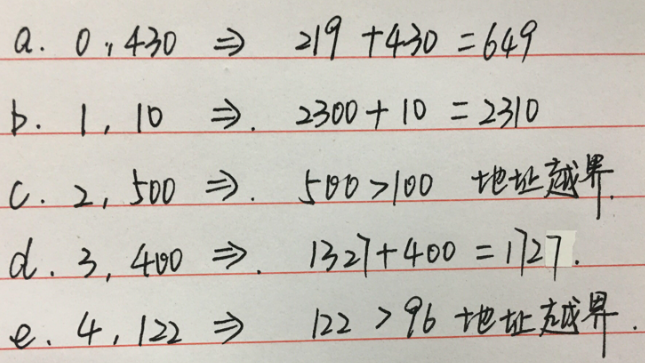
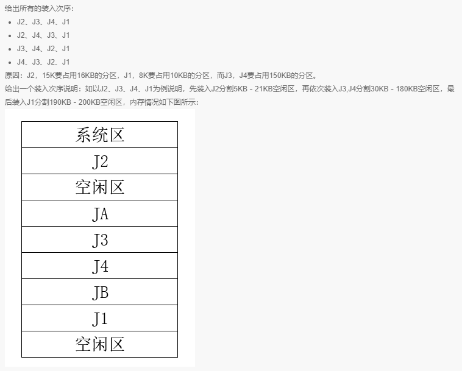
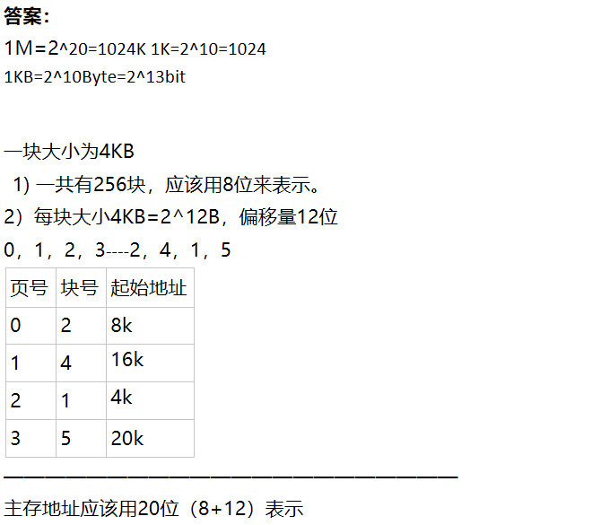
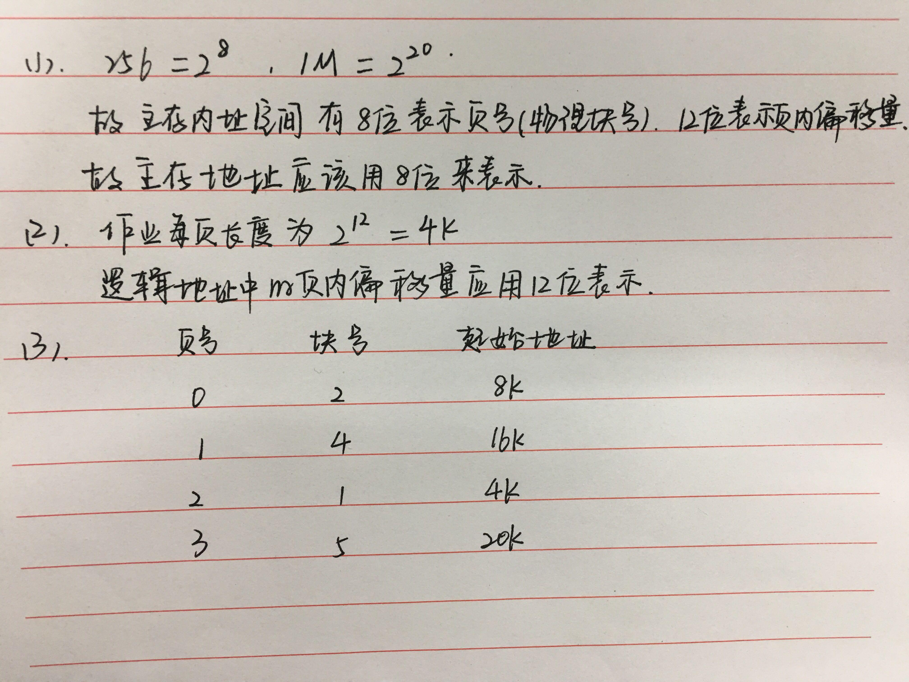

[toc]

# 08 内存管理

## 测验

页表是分页存储管理的，位示图是表示剩余空间，段表是分段存储管理

单一连续分配内存中只存在一个进程

这个要思考一下，起始地址不变+空闲区数不变，起始地址不变表示插入的空闲块不能是第一块之前的，空闲区数不变表示要合并

![11  囗  [ ] （ 5 分 ） 里 个 分 区 的 存 储 菅 理 可 采 用 下 列 技 木 檑 大 存 储 窒 间 的 量 的 呈 0  A. 对 损  & 缓 冲  D. 紧 缩  在 答 ： A 、  C 你 佬 选 为 A ． C. 0 ](MdAsset/08 内存管理/clip_image001-1603975415864.png)

紧缩不是增大，是调整进程在内存中的位置以获得更大的空闲区，交换和覆盖是概念上的增大

![12  囗  [ 0 ] （ 5 分 ） 在 固 定 分 区 存 菅 理 中 ， 力 了 高 王 存 窒 间 的 利 用 辜 ， 可 采 用 （ ） 技 木  A. 分 大 小 的 排 列 顺 划 分 分 区 ， # 按 从 小 到 大 的 顺 存 依 次 记 录 莊 分 区 分 配 表 中  B. 人 作 业 可 以 申 谲 0 个 分 区  C. 按 经 常 出 现 作 业 大 小 来 划 分 分 区  D. 不 同 作 廿 谲 求 队 列 中 的 作 可 以 申 谲 相 同 的 分 区  正 礴 跹 A 、 C 你 镶 选 为 A 、 B 、 c ](MdAsset/08 内存管理/clip_image001-1603975439389.png)

一个作业只能放入一个分区

这里的可变分区应该是指动态分区，固定分区有两种方式（分区大小相等，分区大小不等）。只有固定分区存储管理是不会在内存中移动的，所以不需要用到动态重定位

这个王道视频里面讲过，分页的话不好有可能某一页的一半数据是可共享的，另一半数据是不可共享的。分段的话一段能共享就是一整段能共享

与我之间整理的表格一致

看清楚解析

## 作业

**答案：**

重定位:装入时对目标程序中指令和数据从逻辑地址转换为物理地址的修改过程。

重定位种类:静态重定位，动态重定位。

静态重定位:地址变换通常在装入时一次完成。

动态重定位:在程序运行之前只装入他的部分代码立刻投入运行，然后在程序运行期间，根据需要动态申请分配内存。

---

16位，4KB=2^12B，12位，表示余下4位是页号，那这个就简单了，写出二进制之后只用转换前四位就行了

2F6AH=0010 1111 0110 1010，第二页，对应物理块11，转换结果为

 =1011 1111 0110 1010=BF6AH

0E3CH=0000 1110 0011 1100 第0页对应第5块，转换结果为

=0101 1110 0011 1100=5E3CH

526CH=0101 0010 0110 1100 第五页不存在，发生缺页

---

**答案：**

逻辑转物理

1. 0号段对应219+430=649
2. 1号段对应2300+10
3. 2号段长度只有100，但是偏移量500>100，发生错误
4. 3号段1327+4000=1727
5. 4号段同c发生错误

---

---

**答案：**

页表在内存中

1. 单级页表，200+200=400ns
2. 三级，前三次得到页的物理地址，第四次根据地址访问内存200+200+200+200=800ns
3. 0.9\*(10+200)+0.1*(10+200+10+200)=231ns

快表命中：10ns访问快表，200ns访问内存

快表未命中：10ns访问快表发现页不在快表中，200ns访问页表发生缺页，调入后访问快表再访问内存

官方答案：

官方答案和上面答案不同的地方在于：

缺页置换完成后，上面的答案直接访问内存，而没有访问快表，所以少了10ns的运行时间

不同的原因请参考第九章第二题的答案

---

老师贴的答案有误，主存地址是20位

