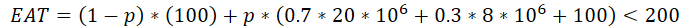
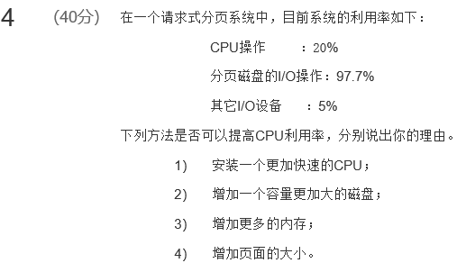

[toc]

# 09 虚存

## 测验

虚存最大实际容量=min（内存+辅存，位数）

## 作业

![某 系 统 采 用 页 式 虚 拟 存 储 管 理 ， 贮 存 每 块 为 128 个 字 节 ， 现 在 要 把 一 个 128 冂 28 的 二 维 数 组 置 初 值  为 “ 0 ” 。 在 分 页 时 把 数 组 中 的 元 素 每 一 行 放 在 一 页 中 ， 假 定 系 统 只 分 给 用 户 一 页 数 据 区 。  (1) 对 如 下 数 据 段 ， 执 行 完 要 产 生 多 少 次 缺 页 中 断 ？  128 〕 of array Cl. ． 128 」 of integer;  var A ： array[ 1.  = 1 to 128  do for i:=l to 128  do Ali ， j]: = 0 ；  （ 2 ） 为 减 少 缺 页 中 断 的 次 数 ， 请 改 写 上 面 的 程 序 ， 使 之 仍 能 完 成 所 要 求 的 功 能 ， 并 统 计 缺 页 次  数 。 ](MdAsset/09 虚存/clip_image001-1603975723607.png)

**答案：**

参考王道P200第15题。

1）每块128个，两重循环先行后列，每访问一个元素发生一次缺页，一共128*128=2^14次缺页

2）改成A[j,i]即可，这样每访问一行就发生一次缺页，一共128次

---

**答案：**

1s=1000ms 1ms=1000us 1us=1000ns

设缺页率为p，则

计算出p约为0.613%

**官方答案：**

计算有效存取时间公式：EAT=(1-p)*100ns+p*t<=200ns，其中p为缺页率，t为缺页时的有效访问时间。

t的计算公式，t=8ms*（1-70%）+20ms*70% =16.4ms

代入EAT公式，求出最大p为1/163，约为0.613%。

**区别：**

1 官方答案中没有换算单位，按照ns和ms混合计算，我的做法直接换算成ns计算，两种方式都可以

2 官方答案中，发生缺页时，置换完成后不需要100ns的存储器存取时间，原因是mooc上有些算EAT的题目认为

一旦缺页置换完成后，直接访问页面即可，不需要额外的访问存储器，也不需要额外的访问页表

而我的做法是发生缺页后，CPU从头开始执行访问，即按照快表（如果有的话）-》页表的顺序访问，这也是王道操作系统上计算EAT的方式

在备考过程中我发现，MOOC老师对于两种做法都认可（可以翻阅历年的讨论区，有不少询问EAT的问题），之所以会出现两种做法，是因为具体的操作系统实现机制不同，有一些操作系统会在置换后直接访问页面，有一些操作系统置换后会从头开始执行访问过程，两种做法都合理，考试的时候写出自己的思路和依据即可。

如果实在不放心，可以按照MOOC上的做法答题

---

**官方答案：**

---

**答案：**

分析：当前CPU和其它I/O设备利用率低，而分页磁盘的I/O操作利用率很高，说明当前系统正在频繁的调入调出页面

1）不行，当前CPU利用率不高，提高CPU速度效果不明显

2）不行，磁盘的I/O操作与磁盘容量无关

3）可以，缺页的主要原因时内存空间不足

4）不行，增加页面的大小导致内存可以存储的页面更少，会更频繁的缺页

王道P196选择题32题，快速的磁盘交换区，增加磁盘容量，使用更快速的CPU都不行

**官方答案：**

（1）使用更快速的CPU。系统处于频繁的换入/换出过程中，CPU处于空闲状态，利用率不高，提高CPU的速度无济于事。

（2）增大磁盘交换区的容量。因为系统实际已处于频繁的换入/换出过程中，不是因为磁盘交换区容量不够，因此增大磁盘交换区的容量无用。

（3）增大内存的容量。增大内存可使每个程序得到更多的页面，能减少缺页率，因而减少换入/换出过程，可提高CPU的利用率。

（4）增加页面大小将导致减少页面错误，如果数据访问随机，则可能读入更多不访问的数据，这种变化可以减少CPU利用率或者增加CPU利用率。所以，可能增加CPU利用率

上述答案只有第四点不同，选择认为合理的答案理解即可

---

## 课堂笔记

系统32位，2^32，可寻址4GB

虚存的实际容量=min（内外存容量之和，CPU寻址范围）

交换(swapper） 交换技术

swapper是对整个进程进行交换

请求分页中的调页(pager）

是对进程的单个页进行操作

两者的单位粒度不同

 

缺页中断步骤

 

请求分页需要硬件支持：

带有有效无效位的页表

交换空间

指令重启

 

**请求分页的性能**

EAT有效访问时间

设缺页率为p

EAT=（1-p)*内存访问数据+p*页错误时间

 

页错误时间是指缺页中断时间

主要包含：

处理缺页中断时间

读入页时间

重启进程开销

页面交换出去的时间（不是每次都需要，只有内存中页满的时候才需要选择一页换出，并且此页被修改过才需要写回内存）

**缺页中断时间（一般并入系统开销）+  [页交换出去时间（假如需要写出，不需要没有这个时间） ]  + 读入页时间  + 重启进程系统开销**

---

15000\*2000=30*10^6us=30s，表示缺页中断的时间是30s，内存容量扩大后，缺页中断的时间变为15秒，30+15=45

记住就好