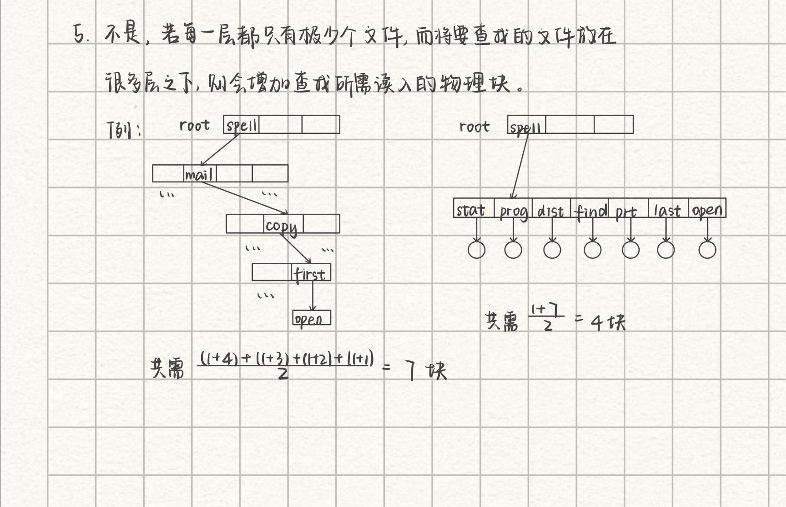

[toc]

# 10 文件系统接口

## 测验

树形目录不能实现文件共享，只有图型目录可以

不存在按用户名方式访问

没有间接访问方式

不存在随机文件
索引文件有索引表，会浪费空间
直接文件按照最大记录长度存储每一条记录，是最浪费空间的存储方式
顺序文件是直接存放，不支持随机访问，但是最节省空间

## 作业

**答案：**

- 单级目录：
            40个下级文件，一共4个物理块
            最少读入一个就能找到文件的目录项
            最多读入4块
- 二级目录：
            最少的情况读入第一块目录，然后里面就有目标文件的FCB，读入一块即可
            最多的情况，一级目录全都存放目录文件，指向40个目录，40个目录都存满了文件，一共40*40=1600个文件

最多的情况是在二级目录的最后一个物理块找到，所以一共要读入4+160块，共164块

**官方答案：**

---

**官方答案：**

与PPT上的例子类似

---

**答案：**

符号链接是软链接的一种，为每个共享文件的用户创造一个LINK类型的新文件，LINK文件存放的是该文件的实际路径，每次访问LINK的时候系统根据LINK文件访问路径找到对应文件访问。
优点：可以连接任意文件、目录，占用空间小
缺点：当目标文件移动时，软连接就失效了

扩展：
硬连接，建立文件的索引结点，共享文件的用户的目录中指向这个索引结点，当用户需要访问共享文件的时候，通过索引结点找到该文件。同时索引结点存有一个计数器，计数器的值是当前共享该文件的用户，当计数器为0的时候会删除该文件

**官方答案：**

---

**官方答案：**

顺序文件:
由一系列记录按照某种顺序排列形成，其中的记录通常是定长记录，因而能够用较快的速度查找文件中的记录，适用于对诸记录批量存取，即每次要读或写一大批记录，比如处理工资单，也只有顺序文件才能存储在磁带上，并能有效的工作。

直接文件:
是在直接存取存储设备上，记录的关键字与其地址之间可以通过某种方式建立对应关系，利用这种关系实现存取的文件。这种存储结构是通过指定记录在介质上的位置进行直接存取的，记录无所谓次序。此外，这种存储结构又不需要索引，节省了索引存储空间和索引查找时间。
**这种存储结构用在不能采用顺序组织方法、次序较乱、又需在极短时间内存取的场合，比如对于实时处理文件、操作系统目录文件、编译程序变量名表等特别有效。**

**扩展：**

逻辑文件分类：顺序文件，直接文件，索引文件
顺序文件适合大文件，不需要随机访问
直接文件适合需要直接访问并且对速度要求高的场景
索引文件一般情况下是最佳的选择，除非题目暗示要选顺序、直接文件（例如题目中出现 大文件、依次读写，对访问速度要求高等关键字）

---

**答案：**

不是，如果目录层次多不便于查找文件，如下所示，查找一个文件需要读入多个物理块

**官方答案：**

