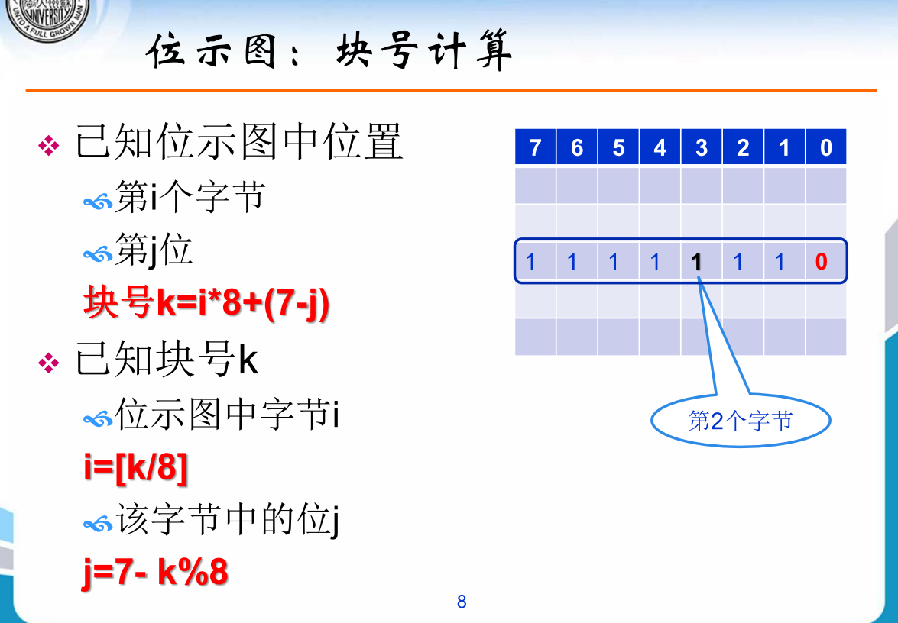
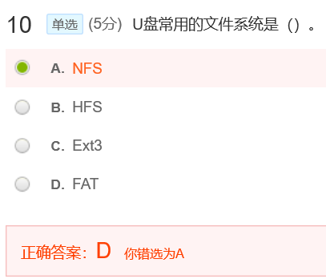
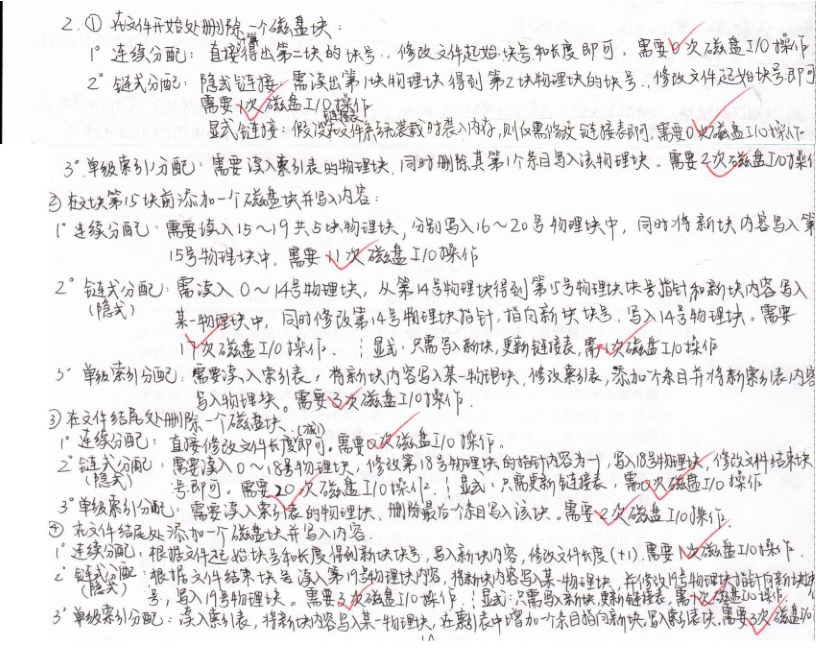
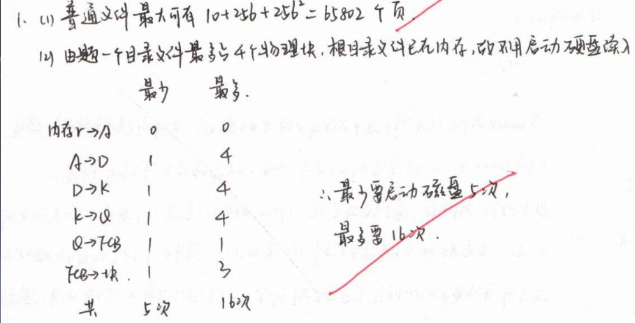
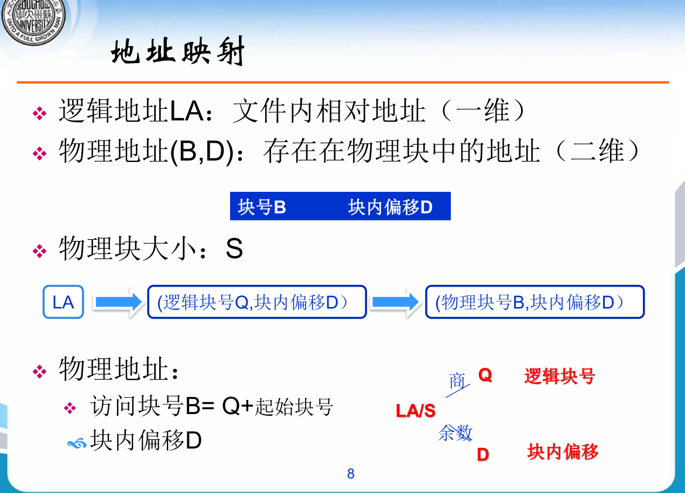
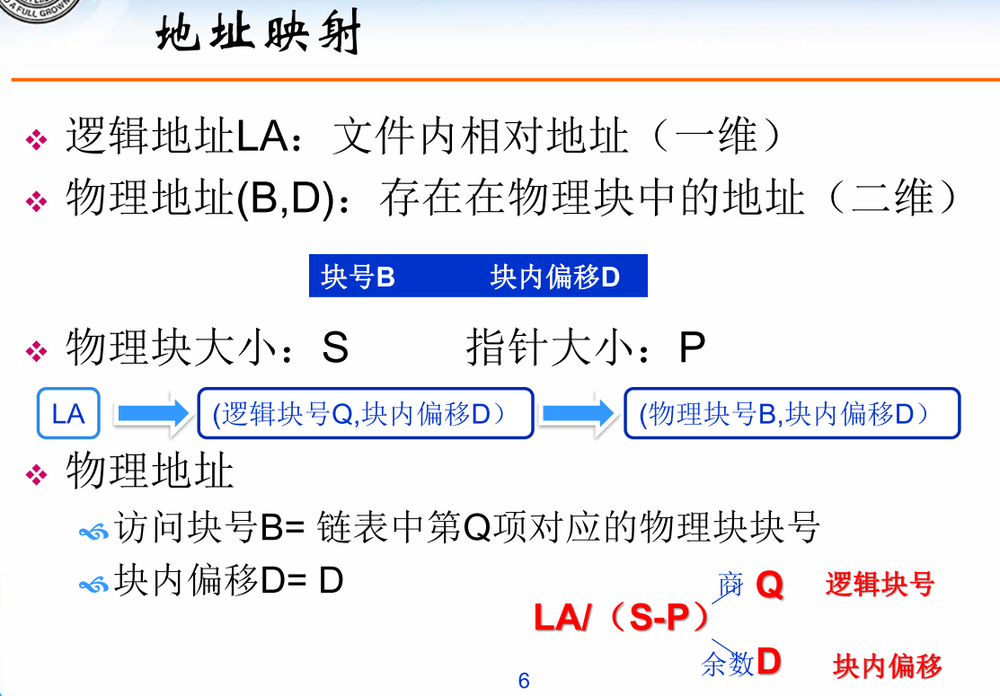
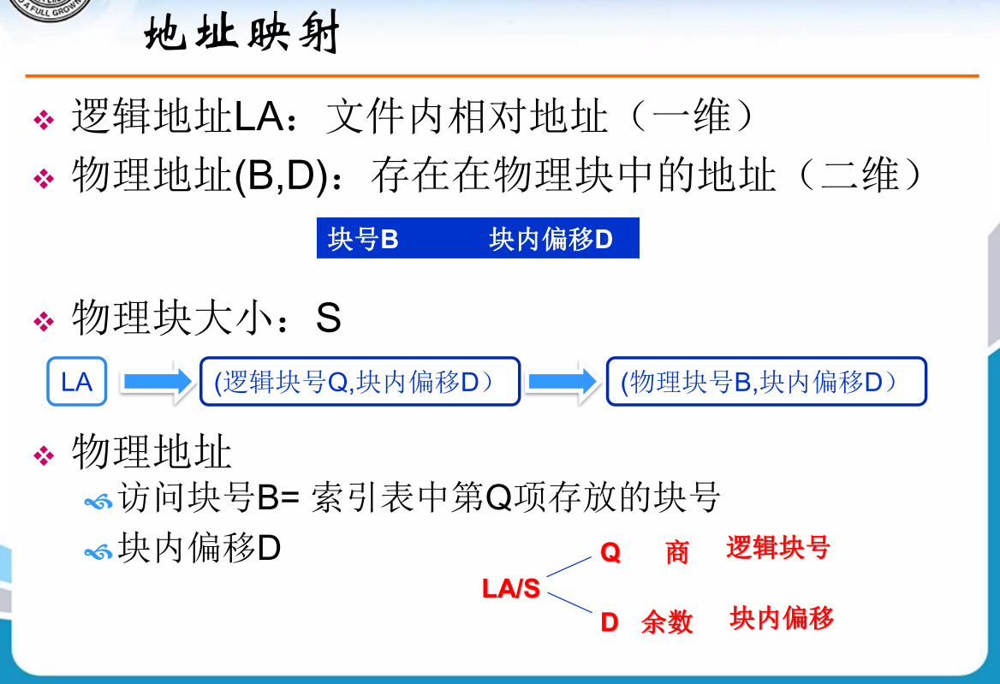
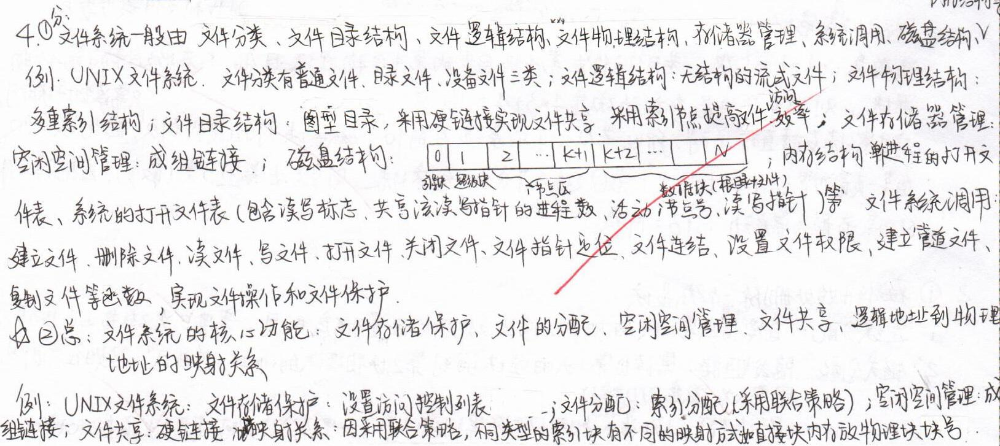

[toc]

# 十一 文件系统实现

## 测验

![2  0  0  1  单 选 （ 5 分 ） 设 某 文 件 为 昴 式 妾 文 件 ， 由 5 个 辑 i 己 录 绢 成 ， 每 个 逻 辑 记 录 的 大 刁 磁  块 大 刁 \ 相 等 ， 均 为 IKB 字 节 ， 并 依 次 存 放 在 50 、 121 、 75 、 、 63 号 磁 盘 块 上 ． 若 要 存 取  文 僻 的 逻 辑 地 址 为 2569 处 的 信 息 ， 要 访 问 的 磁 盘 块 分 别 是 0 ．  0  A. 80  0  B. 63  0  C. 3  D. 75  正 答 案 ： D 你 选 对 了  A. 63  C. 5  年 选 （ 5 分 ） 设 某 立 件 为 显 式 到 妾 文 件 ， 由 5 个 逻 辑 i 己 录 绢 成 ， 衝 个 逻 辑 记 录 们 大 小 与 磁 盘  块 大 刁 、 等 均 为 IKB 字 节 ， 并 依 次 存 放 在 50 、 121 、 75 、 、 63 号 磁 盘 块 上 · 若 要 存 取  文 亻 逻 辑 i 訕 上 为 60 開 处 的 信 息 ， 要 访 问 的 磁 盘 块 分 别 是 0 ·  B. 其 它  D. 地 址 越 界  得 分 虑 分  5 ． 00 / 5 ． 00  得 分 虑 分  × 0 ． ／ 5 ． 00  正 确 答 案 ： D 你 适 选 为 A ](MdAsset/11 文件系统实现/clip_image001.png)

这两题要辨析一下：

2569/1024=2，余521，逻辑号为2，逻辑号从0开始，说明是第三块，对应75

6000/1024=5，5号逻辑对应6号块，此时内存中只有5个块，地址越界了

如512/1024=0，此时是0号，对应第一块

很经典的一道题目，2^35/2^12=2^23块，要用23bit来表示，取整为24bit,3Byte,再取整为4Byte，2^12/4=2^10，一个物理块能存2^10个指针，那么二级索引能存2^20个指针，大小一共是2^20*2^12=2^32=4GB

答案是806

参考苏大的位示图计算公式，第十一章第五节 PPT

> 位     7 6 5 4 3 2 1 0 
>
> 盘块 0 1 2 3 4 5 6 7
>
> 位为1对应第6个盘块，答案为8*100 + 6=806

第一个逻辑块0号，对应200号物理块，则第12块逻辑块号对应的是`0,1...12`中的12号，对应212物理块

记住就好

二级索引+目标物理块，三块

$2^{32}/2^{9}=2^{23}$块，$2^{23}$块应该用$2^{23}$bit来表示，那么$2^{23}$bit=1MB

连续分配

记住就好

物理块号133 逻辑块号11

## 作业

**本章作业特别重要！**

**答案：**

文件头部无空闲,FCB在内存中

**连续分配：**

- 直接修改FCB **0次**

- 第十五块前，需要把15~19块移动一次，每一块对应两次IO，一共10次IO，最后一次写入磁盘块，共**11次**

- 直接修改FCB，**0次**

- 写入磁盘块，修改FCB，**1次**

**链接分配(隐式）：**

- 读入FCB，读入首块磁盘获取指针，把指针写回FCB，**1次**
- 读入0~14块，15次，把第14块的指针给要写入的新块并且将新块写入磁盘，1次，更新第14块的指针，写回第14块，1次，**15+1+1=17次**
- 读入FCB，读入0~18块，19次，修改18块的指针指为NULL，写回第18块，1次，共**20次**
- 读入尾指针，写入新块，修改19块的指针并写回，共**1+1+1=3次**

**链接分配(显式）：**

1. 假设FAT不在内存

- 读入FAT，修改FAT，写回FAT，共**2次**
- 读FAT,写入新块，修改FAT中的指针，写回FAT共**3次**
- 读入FAT,修改FAT，写回FAT次，共**2次**
- 读入FAT，写入新块，写回FAT，**3次**

2. 假设FAT已经在内存中，则依次为**0，1，0，1次I/O**

**单级索引分配：**

索引表不在内存中

- 读，修改，写回 **2次**
- 读入索引表，写入磁盘块，修改索引表，写回索引表，**3次**
- 读，修改，写回，**2次**
- 读，写，修改，写回，**3次**

老师贴的答案：

---

![2  （ 30 分 ）  目 录 文 件 采 用 链 接 式 ， 每 个 磁 盘 块 存 放 10 个 下 级 文 件 的 眉 述 ， 最 多 存 放 40 个 下 级 文 件 ， 若 下 级 文  件 为 目 录 文 件 ， 上 级 目 录 僭 向 该 目 录 文 件 的 筆 一 一 块 ， 否 则 指 向 晋 涌 文 件 的 文 件 控 制 块 · 晋 涌 文 件  采 用 二 级 索 引 形 式 ， 文 僻 控 制 块 中 给 出 12 价 盘 块 地 址 ， 前 10 个 磁 盘 块 地 址 指 出 前 10 页 的 物 理 地  址 ， 筆 11 个 磁 盘 块 地 址 指 向 一 级 索 引 表 ， 一 级 索 引 轰 给 出 2 弱 价 盘 块 地 址 ， 闞 指 出 该 文 件 塋 10 页  至 265 贞 的 地 址 ， 12 个 磁 盘 块 地 址 指 向 二 级 索 引 表 ， 二 级 索 引 表 中 指 出 2 弱 价 一 级 索 引 表 的 地  址 · 崮 问 ：  1 〕 该 文 件 系 统 中 的 晋 通 文 件 最 大 可 有 多 少 页 ？  2 〕 若 要 读 文 件 / D / Q 中 的 某 一 页 ， 最 少 要 启 动 磁 盘 丿 ' L 次 ？ 最 多 要 启 动 磁 盘 ， 欠 ？ （ 衝 读 一 个 磁 ](MdAsset/11 文件系统实现/clip_image001-1603976909030.png)

注意区分**目录文件，文件目录**和**FCB**的区别
 第二问是具体到某一页，对应是内存了，然后Q目录下是访问某个文件的FCB

**答案：**

题目条件：

一个目录文件最多40个下级文件，最多4个磁盘块。
如果是目录文件则指向此目录文件的第一块，普通文件二级索引形式。
FCB中有12个磁盘块地址，10个直接指针，1个一级指针，指向10~265页的地址，1个二级指针。
索引表有256个地址

**注意：默认情况下根目录存在于内存中**

1）

**10+256+256*256页**
10个直接指针对应10页
一个一级指针对应256页
二级指针指向1个二级索引表，二级索引表指向256个一级索引表，1个一级索引表对应256页

2）

默认情况下，根目录存在于内存中：

/A/D/K/Q，一共四个目录，查找第四个目录下的某个文件。

- 最少情况下ADKQ均位于目录文件的第一块，由于根目录已经读入，而根目录下有A目录的信息，只用依次读入DKQ三个目录共读3次，再读入该文件的FCB，1次，再加上找到的文件也位于第一块，1次，共**5次**
- 最多情况下，ADKQ均位于目录文件中的第四个磁盘块，而根目录中有A目录的信息，只需要读入DKQ，读入供需要3*4=16次访盘，读入该文件的FCB,1次，此时欲访问的也在二级索引中，访问磁盘2次得到页的物理地址，再访问物理地址1次，共**12+1+2+1=16**次

老师贴的答案：

注意这里根目录读入到内存了，则根目录下面的所有文件访问都不用再读盘了，所以A不用读磁盘块。
 如果题目特别说明根目录不在内存中，则这道题最少是6次，加上读取根目录

最多是20次，加上读取根目录的4次

---

**答案：**

这题的第1问07年真题考过

老师贴的答案：

**补充：**

**1** **连续分配**

**2** **隐式链接**

**3** **显示链接的地址映射** **PPT中并未给出，参考答案即可**

**4** **索引分配**

---

**答案：**

文件目录：存放文件目录项（FCB）的目录
目录文件：存放文件目录的数据结构，即文件目录形成的文件，存储再磁盘中
FCB：文件控制块。默认情况下等同于文件目录项

老师贴的答案：

## MOOC补充测验内容

**同样很重要**

<u>*第一题*</u>

**答案：**

100块，文件控制块在内存中，相当于文件目录在内存中，找到对应的FCB只需要访存不需要读磁盘。但需要注意题目中没有提到索引表在内存中，此时视为索引表在磁盘，访问索引表需要先读入，修改索引表后需要写回
 并且文件尾部有空闲磁盘块，**言下之意是头部没有空闲磁盘块**

同时注意题目中的第50块的含义，计算机地址从0开始

如果是数量上的第五十块，则对应49号块

如果是编号上的第五十块，则对应50号块

这里采用编号上的方法来做题，如果考试的时候不能确定，可以加以说明，或者两个都写上。

**1）**

- 连续分配：
  读FCB，移动100块磁盘块，写入一块，修改FCB信息
  每移动一次磁盘块，对应读+写共两次I/O。
  上述过程是**200+1=201次I/O**

- 隐式链接分配：
  读FCB，将新添加磁盘块的指针指向旧的首块磁盘，写入新磁盘块
  **1次I/O**

- 索引分配：
  读FCB，获取索引表的指针，读到索引表的信息，写入一块磁盘，再修改索引表然后将索引表写回内存中
  **1+1+1=3次I/O**

**2）**

- 连续分配：
  读FCB，得到首地址，将50到99共50块磁盘往后挪，写入磁盘块（此时不用写数据，题目中说明），修改FCB
  共**50\*2=100次**

- 隐式链接分配：
  读FCB，得到首地址，读入依次读入0~49，共50块地址信息，然后得到第49块指针，然后将新的磁盘块指针指向第49块的指针指向的地址（即原先第50块），**写入新的磁盘块**，将49块指针指向新块，**写回第49块**
  共**50+1+1=52次I/O**

  注：严格来说，隐式链接分配，新盘块虽然本身不用写数据，但是它要保存指向下一块的指针，所以这里还是要一次写入
  
- 索引分配：读FCB，得到索引表地址，读索引表，写入新块，修改索引表并写回
  **2次I/O**
  
  此时不用写入数据

**3)**

- 连续分配：
  读FCB，得到首块地址，删除第50块，**将51~99共49块向前移动一次**
  共**98次I/O**

- 隐式链接分配：
  读FCB，得到首块地址，依次读入0~49共50块，再读入第50块，然后第49块将指针指向50块的下一块，然后删除50块，接着把修改后的第49块写回磁盘中
  **共50+1+1=52次I/O**
  
- 索引分配：读FCB，得到索引表地址，访问索引表，修改索引表指针，将第50块的指针置为空

  **共2次I/O**

  

  注意，删除并不需要对目标盘块进行额外操作，只需要把指向它的指针清空即可

**4)**

文件结尾处删除一块磁盘块

- 连续分配：
  读FBC直接删除第99块，然后修改FCB即可，不需要IO。默认FCB存在尾指针 

- 隐式链接分配：
  读FCB得到首块地址，读入前0~98块，修改第98块的指针指向NULL，写回修改后的98块
  **共99+1次I/O**

-  索引分配：读入FCB得到索引表地址，读入索引表，修改索引表信息，写回索引表
  **共2次I/O**

---

<u>*第二题*</u>

**答案：**

>  10块，FCB和索引表都在内存中，问连续、链接（显式、隐式）、单级索引三种分配方式。假设FAT也在内存中

1）

- 连续分配：
  这里读入FCB，然后修改FCB的首块地址为第一块即可，不需要移动
  **0次I/O**

- 显式链接分配：

  读入FAT，修改FAT中该文件的首块指针，保存FAT

  **共0次I/0**

- 隐式链接分配：
  读入FCB得到首块磁盘地址，读入第0块磁盘得到其指向下一块地址的指针，修改FCB为第一块的地址
  **1次I/O** 

- 索引分配：
  读入FCB，读入索引表，修改索引表
  **0次I/O**

2）

- 连续分配：
  读入FCB得到首块磁盘地址和长度信息，然后在最末尾写入一个磁盘块，修改FCB

  **1次I/O**

- 显式链接分配：

  读入FAT，找到该文件最后一个指针和一个空闲磁盘块，写入磁盘块，修改FAT表中的指针链接，保存FAT表

  **1次I/0**

- 隐式链接分配：
  **FCB是带有首尾地址的**，在结尾处添加直接访问最后一块的地址，然后写入新块，修改其指针指向新块,修改FCB，将旧块FCB写回内存即可
  一共是读旧尾块，写新尾块，修改旧尾块指针，写回旧尾块
  一共**1+1+1=3次I/O**

- 索引分配：
  读入FCB，读入索引表，写入磁盘，修改索引表
  **1次I/O**

3)

1. 文件结尾处删除一块磁盘

- 连续分配：
  读入FCB然后修改FCB中length信息即可
  **0次I/O**

- 显式链接分配：

  读入FAT，修改FAT表中的指针链接，保存FAT表

  **0次I/0**

- 隐式链接分配：
  读入FCB得到首块地址，读入前0~8前9块磁盘块，然后修改第8块磁盘块指针指为NULL，写回第8块
  **共9+1=10次I/O**

- 索引分配：
  读入FCB，读入索引表，然后修改索引表即可
  **0次I/O**

---

*<u>第三题</u>*

**答案：**

100块，0~99，后面有空闲区，文件控制块，索引表都不在内存中，连续，隐式，单级索引分配，求IO操作次数

1）开始处删

- 连续
  读入FCB得到首块地址，修改FCB的首块地址为第一块地址，然后将FCB写回磁盘
  **共1+1=2次I/O**

- 隐式
  读入FCB得到首块地址，读入第0块得到其指针，然后将FCB中的首块地址修改为第1块，写回FCB
  **共1+1+1=3次I/O**

- 索引
  读入FCB，读入索引表，修改索引表的首块地址

  **共1+1+1=3次I/O**

2）第50块前添加并写入

- 连续
  读入FCB，在50块前添加，把50~99共50块向后移动一次，对应100次I/0，写入新块，由于长度变了，修改FCB，将其写回内存
  **1+50\*2+1+1=103次I/O**

**注意FCB的参数，何时要修改何时不要**

- 隐式
  读入FCB，读入前49块共50块，将新块的指针指向旧的第50块，写入新块，将第49块指向新块，写回第49块
  **共1+50+1+1=53次I/O**
- 索引
  读入FCB，读入索引表，写入新块，修改索引表
  **共1+1+1+1=4次I/O**

3）在文件结尾处删除一块

- 连续
  读入FCB，修改FCB长度，写回FCB
  **共1+1=2次I/O**

- 隐式链接
  读入FCB，依次读入0~98共99块，将第98块指针置为NULL，写回第98块，修改FCB的尾指针指向第98块，写回FCB
  **共1+99+1+1=102次I/O**

- 索引
  读入FCB，读入索引表，修改索引表，写回索引表
  **共3次I/O**

4）结尾处增加一块

- 连续
  读入FCB，写入新块，修改FCB长度，写回FCB
  **共1+1+1=3次I/O**

- 隐式链接
  读入FCB得到尾指针，读入旧尾块，写入新块，修改旧尾块的指针指向新块，写回旧块，修改FCB的尾指针，写回FCB
  **共1+1+1+1+1=5次I/O**
- 索引
  读入FCB，读入索引表，写入新块，修改索引表，写回索引表
  **共1+1+1+1=4次I/O**

**总结：**

注意这里的访问过程

把磁盘块读入内存后，进行任何修改都不会有磁盘I/O操作！所有操作处理完后，在内存中修改过的磁盘块需要重新写回磁盘中，没有修改过的磁盘块不需要写回（这也是缺页时修改过的磁盘块需要花更多时间处理的原因）