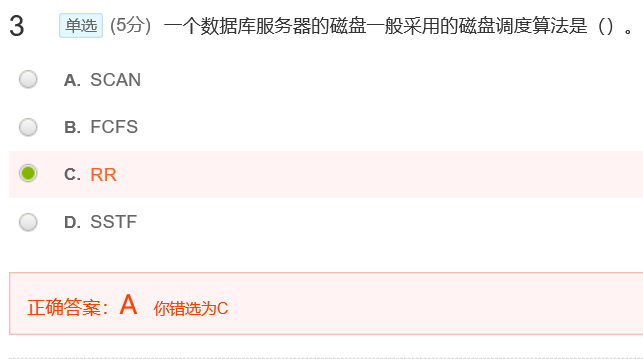
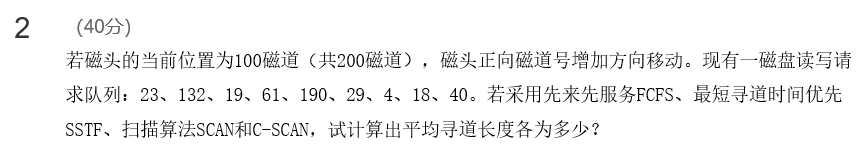
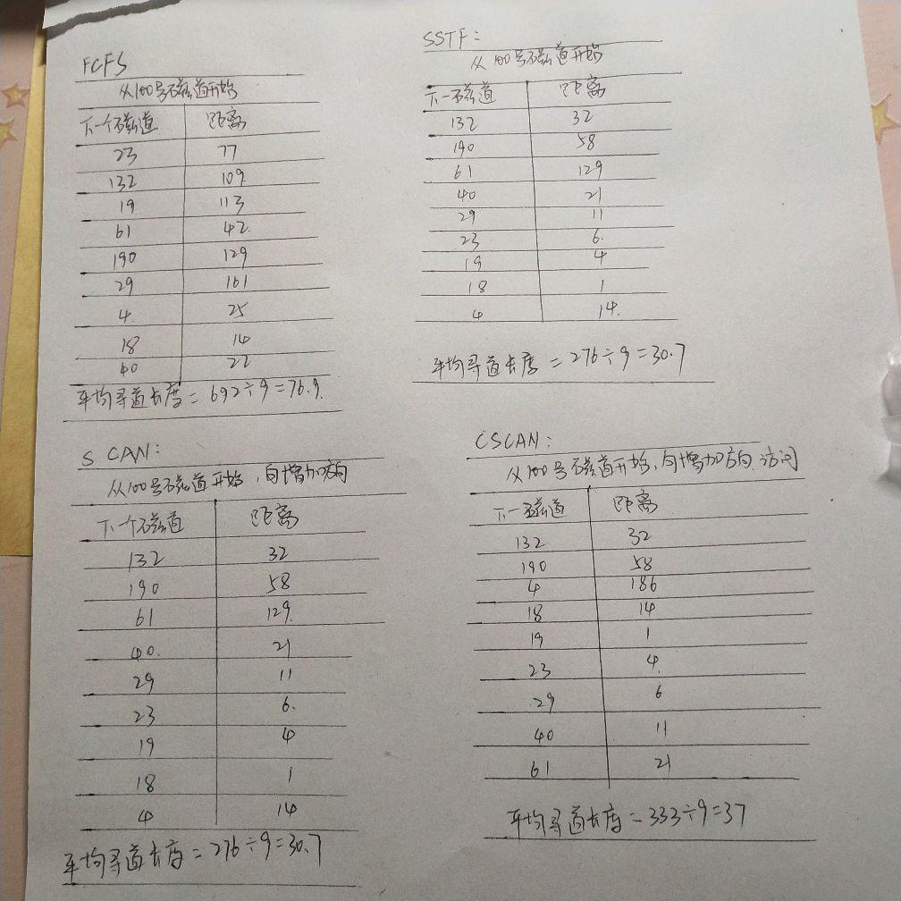
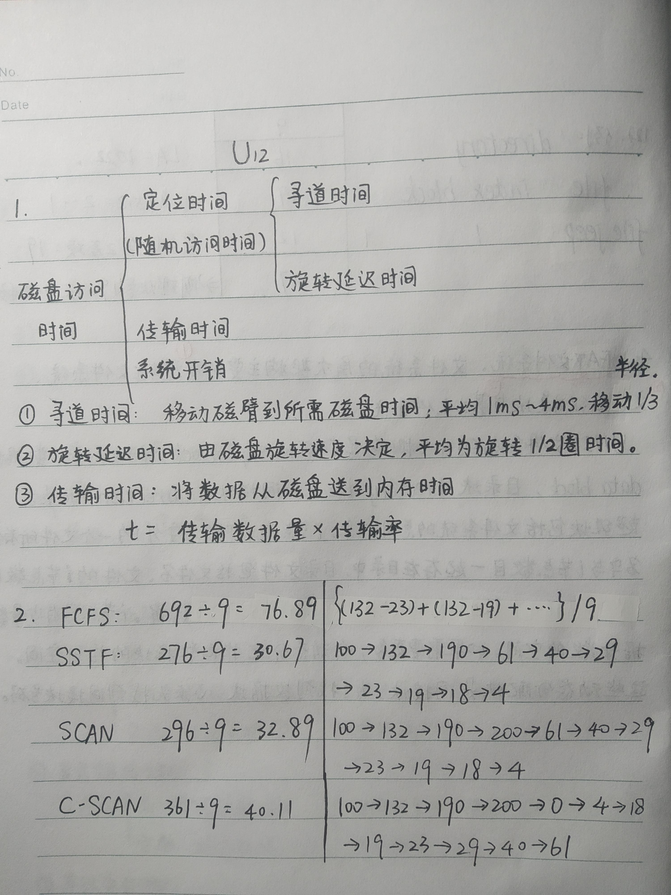
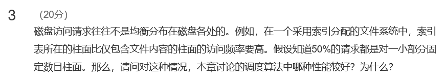
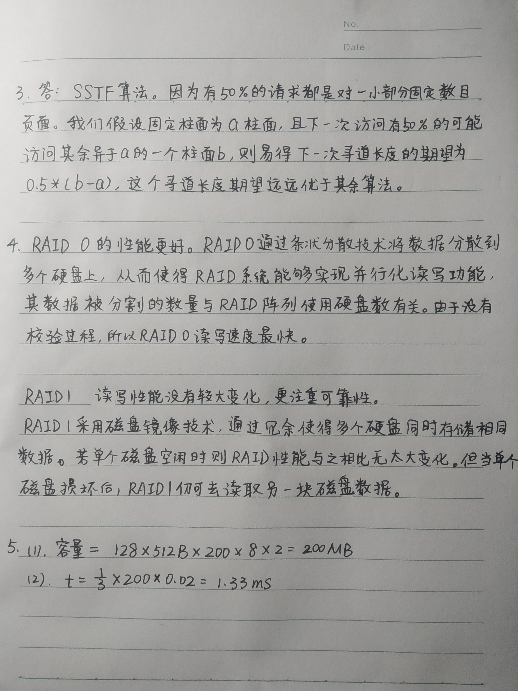

[toc]

## 12 大容量存储器结构

## 测验

记住就好

注意是Gb，不是GB

先读入第i个指针，得到起始地址，再读入i+1个指针，得到下一个文件的起始地址，然后两个地址相减就是文件长度，根据起始地址和长度进行访问文件

有可能LOOK在掉头完成后，突然又增加了一大批请求在磁道末尾，此时SCAN能扫到但是LOOK算法扫不到

## 作业

**答案1：**

寻找时间Ts：启动磁臂+移动磁道

寻道时间Tr：1/2r，r是转速，1/2为了表示平均时间

读取时间Tt：数据量/读取速度

 

**答案2：**

磁盘访问时间由定位时间、传输时间和系统开销三部分组成。

从控制器发出命令到需要读取数据移动到磁头下面的时间称为定位时间或随机访问时间，由两个部分组成：寻道时间和旋转延迟时间，前者是指移动磁臂到所需磁道（即寻找时间）的时间，后者是指等待扇区移动到磁头下的时间（即寻道时间）

旋转延迟时间由磁盘旋转速度决定，一般磁盘的转速为60 – 250转/秒。磁盘有一个参数RPM（每分钟旋转次数），如7200RPM的磁盘的转速是120转/秒。平均旋转延迟时间为旋转1/2圈的时间，即1/ (2*RPM/60)。例如，一个7200RPM的旋转延迟时间为：1/240秒=4.17毫秒。此表给出了常用的RPM对应的平均旋转延迟。

多数磁盘的平均寻道时间为1ms -4ms，大约移动1/3半径。

传输时间为传输的数据量乘以传输率。传输率是磁盘的一个参数。

---

**答案：**

FCFS:100-23+132-23+132-19+61-19+190-61+190-29+29-4+18-4+40-18=692/9=76.9

SSTF:最短作业优先，132-100+190-132+190-4=276/9=30.7

走到底的版本：

SCAN:往大的走，走到尽头200再折返，200-100+200-4=296，296/9

C-SCAN:200-100+200+40=340，340/9，注意C-SCAN从一端走到另一端的距离也算的

不走到底的版本：

SCAN:276/9=30.7

C-SCAN:333/9=37

LOOK算法：90+186=270

C-LOOK算法：90+186+57=333

老师贴的答案：

---

第一、二题的答案 老师补充：

**答案：**

SSTF算法比较好。

因为百分之50请求对一小部分固定数目柱面。

假设现在访问了索引块所在的柱面索引块在100柱面 下一次访问有0.5的可能访问别的柱面x，有0.5的可能访索引块所在柱面

平均寻道长度 为0.5*（x-100）这远远比其他任意一种磁盘调度算法要优越。

---

**答案：**

RAID 0 最好（因并行性而提高）

在RAID0模式中，数据被分割为一定数量的数据块(Chunk)交叉写在多个硬盘上，一般的来说在RAID0系统中数据被分割的数量同RAID阵列所使用的硬盘的数量是有关的，比如RAID0中采用了3块硬盘，那么数据将会被分为三份依次的写入三个硬盘，通俗的说这种模式其实就是利用RAID技术让系统认为三块硬盘组成一个容量更大的硬盘，因为这个过程没有数据校验所以这种RAID模式是读写速度最快的一种。

RAID 1 读和单个磁盘无区别，写则要写两边

RAID1模式是让组成RAID1模式的硬盘互为镜像，当你向硬盘中写入数据的时候，两个硬盘同时存储相同的数据，这样即使其中一个硬盘出现了故障，系统利用另外一个硬盘一样可以正常运行。RAID1相对于单块硬盘来说它的数据读取性能会更好一些，因为当一块硬盘处于忙的状态时，RAID控制器可以去读取另一块硬盘中同样的数据，但是写入数据性能不但没有增长而且可能会有轻微下降。当其中一块硬盘出现故障之后，新的数据可以写入仍然能够正常工作的硬盘，当使用新的硬盘替换掉原来的硬盘之后，RAID控制器会自动的把数据复制到新的硬盘上。RAID1模式的最大特点就是冗余性高，但是由于大部分的功能是利用软件来实现的，所以它会增加处理器的负担。这种RAID模式非常适合对数据的安全性有极高要求的人。

---

8*200*128=204800=2^11*100

**答案：**

1）容量=8*2*200*128*512B=200MB  一个盘片2个面

2）0.02*200/3=1.33ms  多数磁盘的平均寻道时间为1ms -4ms，大约移动1/3半径。

---

第三、四、五题老师补充答案

