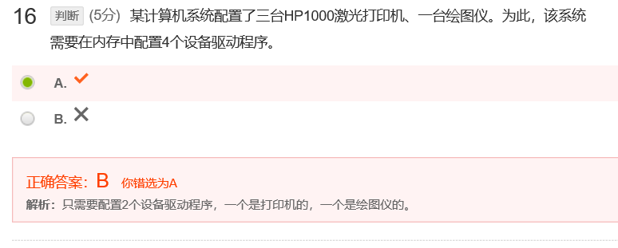
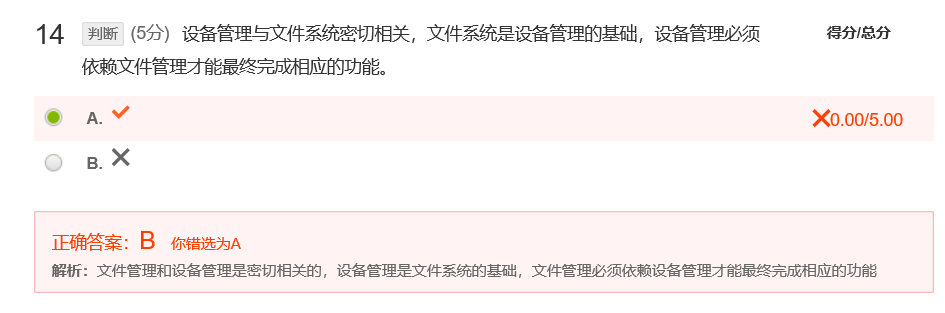

[toc]

# 13 I/O系统

## 测验

对

20年选择题考过

记住就好

记住就好

## 作业

**答案：**

缓冲技术是指开辟一块内存空间作为缓冲池，按照一定规则读取输入，当缓冲区满的时候CPU读取数据，当缓冲区空的时候写入数据。引入缓存机制主要为了解决输入输出速度不对等，例如键盘等I/O设备输入速度很慢，通过把数据读入到缓冲区，再提醒CPU取缓冲区数据的方式，能减少CPU中断次数，提高系统效率

**官方答案：**

现代操作系统中，几乎所有的I/O设备在与CPU交换数据时都用了缓冲区。缓冲区是用来保存两个设备之间，或者设备和应用程序之间所传输数据的一个存储区域，可以有专门的硬件组成，更多的是用内存。

引入缓冲的理由有三个：

一个理由是解决设备之间的速度差异。例如，假如从调制解调器接收一个文件，并保存到磁盘上。调制解调器的速度大约比硬盘慢千倍。这时，可以在内存中创建缓冲区以累积从调制解调器处接收到的字节。当缓冲区填满时，就可以通过一次操作将缓冲区写入到磁盘中。

缓冲的第二个用途是协调传输数据大小不一致的设备。这种不一致在计算机网络中特别常见。缓冲常常用来处理消息的分段和重组。在发送端，一个大消息分成若干小网络包，这些包通过网络传输，接收端将他们放在重组缓冲区中，以生成完整的源数据镜像。

缓冲的第三个用途是支持应用程序I/O的复制语义。例如某应用程序需要将缓冲区内的数据写入到磁盘。它可以调用write()系统调用，并给出缓冲区的指针和所写字节的数量。当系统调用返回时，如果应用程序改变了缓冲区中的内容，为了维持复制语义，操作系统在write()系统调用返回到应用程序之前，将应用程序缓冲区复制到内核缓冲区。磁盘写会在内核缓冲区中执行，这样后来应用程序缓冲区的改变就没有影响。这样做，尽管会有一定的开销，却获得了简洁的语义。

---

**答案：**

P274

程序直接控制，论询，此时没有中断技术，CPU必须不断查询有没有新的数据输入，运行效率低

中断驱动方式，引入中断机制，当输入时会中断CPU来读入数据

DMA控制方式：引入缓冲区，以数据块为单位传输数据，DMA会将数据直接存入内存中，数据的输入过程不必经过CPU，只有开始和结束时候才需要中断

通道控制方式：通道是一种硬件，可以执行指令，使用通道可以对多组数据进行读写，数据传输结束时才需要中断，一个通道可以控制多台设备与内存的数据交换

 

**官方答案：**

轮询（程序直接控制）方式

- 特点：控制简单，也不需要多少硬件支持；CPU利用率大大降低                                                         

中断控制方式

- 特点：能实现CPU与设备以及设备与设备间的并行操作，CPU的利用率提高；缺点是如果配置的外设数目较多，且都是以中断方式进行并行操作，可能耗去大量CPU时间或因CPU来不及处理而造成数据丢失。

DMA控制方式

- 特点：相比中断，大大减少了CPU进行中断处理的次数；有一定的局限性，如对外设的管理和某些操作仍有CPU控制，多个DMA的使用也不经济。

通道控制方式

- 特点：通道是专用I/O处理机，CPU只需发出I/O指令，由通道具体完成，大大减轻了CPU的工作，同时一台通道能控制多台外设；通道价格较高。

---

**官方答案：**

I/O设备在许多方面都有很大差异。这张表给出了不同设备的特点以及典型代表。

这些特点可以用来作为设备分类的标准，形成设备的类型。详细来说，可以有以下分类，当然不限于这些分类。

- 按信息交换的单位分，分为块设备和字符设备，字符设备按一个字节一个字节地传输，如终端；块设备以块为单位进行传输，如磁盘。
- 按访问方法分，分为顺序访问与直接（随机）访问，顺序访问设备按其股东顺序来传输数据，如调制解调器；随机访问设备可寻找任意数据存储位置，如CD-ROM。
- 按传输速率分，分为低速、中速、高速设备。低速设备如键盘、鼠标器、语音的输入和输出等，中速设备如行式打印机、激光打印机等；高速设备如磁带机、磁盘机、光盘机等。
- 按设备的共享属性分，分为独占设备和共享设备。独占设备是指在一个时间上只能由一个进程使用，如打印机、扫描仪等；共享设备可以被多个进程并发使用，如磁盘。
- 按I/O方向分，可分为只读、只写和读写设备。如CD-ROM为只读设备，图像控制器为只写设备，磁盘为读写设备等。

---

**答案：**

CPU每执行完一条指令就去扫描中断寄存器，检查是否有中断发生，若没有中断就继续执行下条指令；若有中断发生就转去执行相应的中断处理程序。中断处理过程可粗略的分为以下四个过程： 

① 保护当前正在运行程序的现场； 

② 分析是何种中断，以便转去执行相应的中断处理程序； 

③ 执行相应的中断处理程序； 

④ 恢复被中断程序的现场。 

 

**官方答案：**

中断处理过程基本上由3部分组成：

- 第一部分为准备部分，其基本功能是保护现场，对于非向量中断方式则需要确定中断源，最后开放中断，允许更高级的中断请求打断低级的中断服务程序；

- 第二部分为处理部分，即真正执行具体的为某个中断源服务的中断服务程序；

- 第三部分为结尾部分，首先要关中断，以防止在恢复现场过程中被新的中断请求打断，接着恢复现场，然后开放中断，以便返回原来的程序后可响应其他的中断请求。中断服务程序的最后一条指令一定是中断返回指令。

  ---

**答案：**

将打印机这一互斥资源改造为共享资源。在内存中开辟空间，当有进程请求打印机资源的时候，先接受请求但不是马上打印数据，而是把数据放入开辟的空间中，当打印机空闲的时候按照先后请求顺序将数据打印。引入SPOOLing技术之后请求的进程能够不进入阻塞状态，提高系统运行效率P292

 

**官方答案：**

为了缓和CPU的高速性与I/O设备的低速性间的矛盾而引入了SPOOLING技术。

基本原理是：利用其中的一道程序，模拟脱机输入时的外围控制机功能，把低速I/O设备上的数据传送到高速磁盘上；用另一道程序来模拟脱机输出时外围控制机的功能，把数据从磁盘传送到低速输出设备

这样，就可以在主机的直接控制下，实现脱机输入、输出功能。此时的外围操作与CPU对数据的处理同时进行，这种在联机情况下实现的同时外围操作称为SPOOLing或假脱机技术。

 

利用共享打印机的例子来说明SPOOLing技术。

打印机属于独占设备，利用SPOOLing技术，可将之改造为一台可供多个用户共享的设备，从而提高设备的利用率，也方便了用户。如今，共享打印机技术已被广泛用于多用户系统和局域网络中。

假脱机打印系统主要由以下三部分：

磁盘缓冲区：是一块磁盘空间用来暂存用户程序的输出数据，也就是输出井。

打印缓冲区：设在内存，暂存从磁盘缓冲区送来的数据，也就是输出缓冲区。

假脱机管理进程和假脱机打印进程：假脱机管理进程为每个要求打印的用户数据建立一个假脱机文件，并放入文件队列中。假脱机打印进程依次对队列中的文件进行打印

 

当用户进程发出打印请求时，假脱机打印系统并不是立即把打印机分配给该用户进程，而是由假脱机管理进程完成两项工作：

①在磁盘缓冲区中为之申请一个空闲盘块，并将要打印的数据送入其中暂存；

②为用户进程申请一张空白的用户请求打印表，并将用户的打印要求填入表中，再将该表挂到假脱机文件队列上。完成这两项工作后，对用户程序而言，其打印请求已经得到满足。

真正的打印输出由假脱机打印进程负责：当打印机空闲时，进程从请求打印队列的队首取出一张请求打印表，根据表中的要求将要打印的数据，从输出井传送到内存缓冲区，再由打印机进行打印；打印完，进程再次察看请求打印队列，若非空，重复上述工作，直到队列为空。此后进程才将自己阻塞起来。仅当下次再有打印请求时，进程才被唤醒。