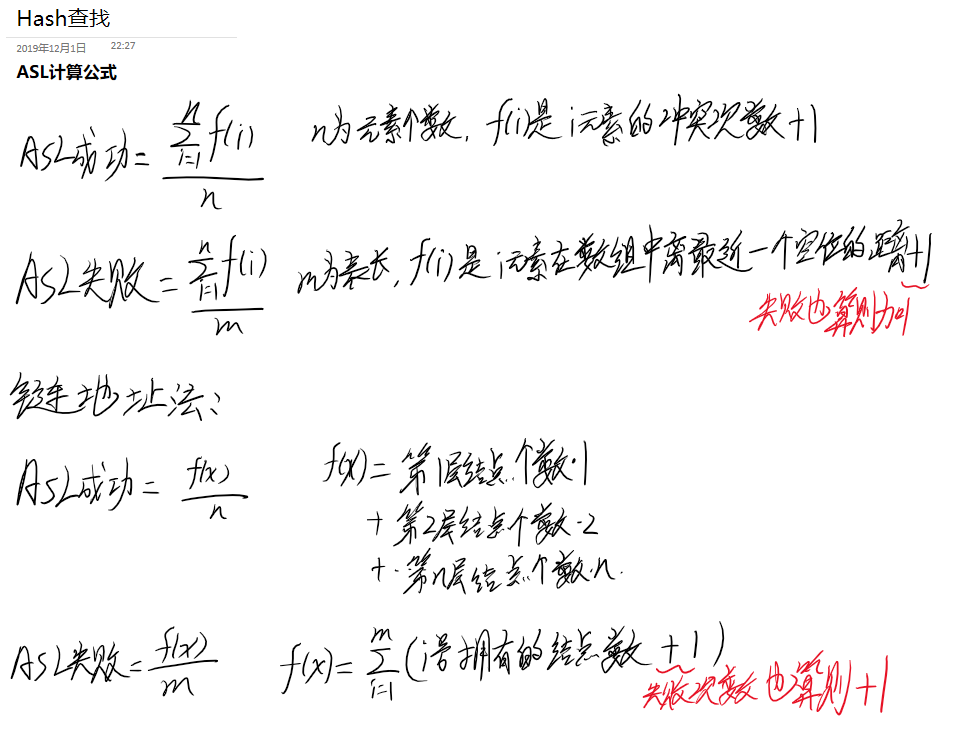

[toc]

# 一些零散的题目和知识点

这些是没有汇总起来的题目和知识点，简单看看就好

## 内存管理相关

同一页表下的页表项需要连续存放

不同页表之间可以不连续，但是逻辑上连续

采用分级页表之后，低级页表最大就是一个页大小，而顶级页表不一定。这是因为低级页表经常需要调入调出，如果超过一个页大小， 每次调入的时候需要寻找连续的块给它分配。所以低级页表最大就是一个页大小。

如果采用纯页式存储，多级页表，那么各级页表不能超过一页

优点：不需要大量连续空间

缺点：增加访存次数，移动页表项次数，读盘次数

## 索引表和FAT

内存管理里的虚拟地址，里面的表项存的也是**物理块号**！！

 

4和20题都是文件系统的题目，索引表里都是存的是地址块号

第四题是算索引表，索引表里面存的是指针，指针需要指向的是**地址范围**

第20题算的是FAT，FAT里面的指针，需要指向的是**物理块范围**

 

第20题给出的是500MB的主存空间，一块大小1KB，那么500MB一共有500*2^10块，500小于2^9，也就是块数一共约有2^19块，需要19bit来表示，19bit转换为指针需要3B

一个指针大小3B，500\*1K块，那么总共有500*3KB=1500KB大小的FAT

## 零散知识点

1. 虚拟设备 虚拟机技术
2. 二叉树的查找成功/失败的概率

1. **操作系统的结构**

https://baike.baidu.com/item/操作系统结构/20925176

1. 整体结构：早期开发并没有分类
2. 模块化结构：按照功能分为若干个模块，每个模块实现一个特定的功能，模块之前的通信使用预先设定好的接口进行

好处时：结构变得清晰，模块具有一定独立性，减少了复杂的调用关系

缺点：如何划分模块是一个问题

1. 层次结构，把所有模块按照功能调用次序分层若干曾，每层只能访问相邻的层次。

优点是：把功能实现的无序性改为有序性，可显著提高设计的准确性。把模块化的复杂依赖关系改为单项依赖关系，即高层软件依赖于底层软件

1. 微内核结构：微内核是实现OS功能的小型内核，微内核将那些不需在核心态执行的功能移动到用户态执行，从而降低了内核设计的复杂性

优点：降低设计的复杂性，有效的分离了内核和服务，服务与服务，使得他们之间的接口更将清晰，维护的成本降低

缺点是性能问题，需要频繁的在用户态和核心态切换

1. 独占设备，虚拟设备，虚拟技术。

## Hash查找的计算公式

