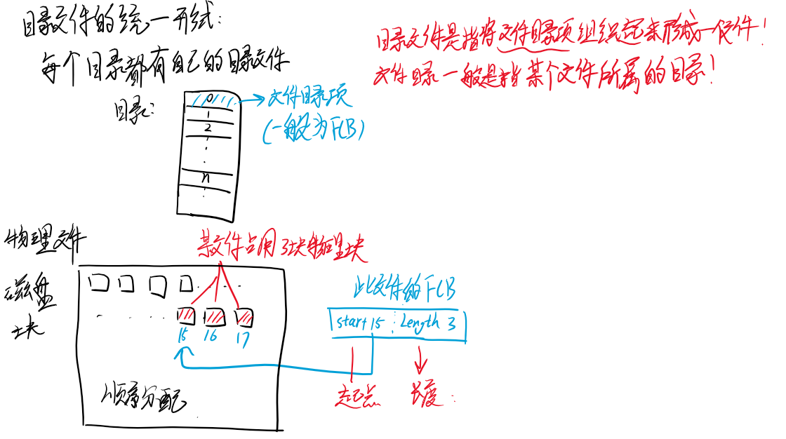
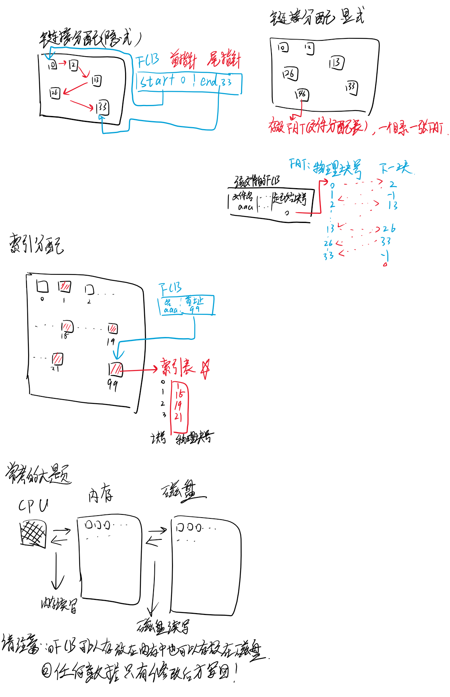
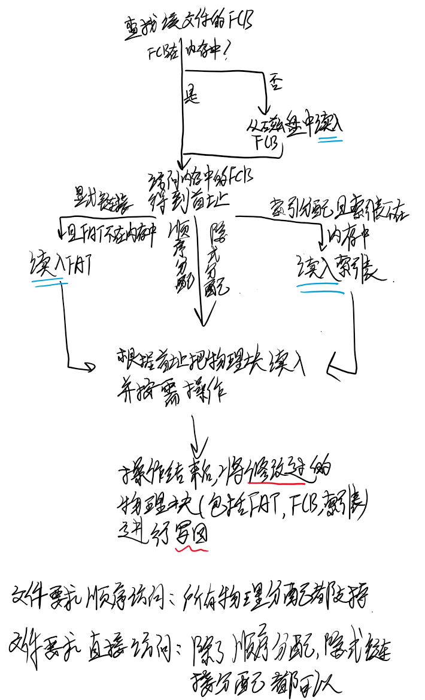

# 文件系统总结

1. 基本概念

CPU不直接跟磁盘等存储器打交道，它需要的数据都从内存里面拿。（原因是磁盘I/O实在太久了，先把数据存到内存中就快很多）

内存是没有记忆性的，断电里面的数据都消失了

所以数据是存放在磁盘，磁带等存储设备里面的，需要的时候再读入内存。

磁盘等设备里面是分成一块一块的，每一块称之为物理块

1. CPU访问步骤

每次CPU要操作数据，**如果内存中有数据直接访问内存**，**如果数据在磁盘中，则访问磁盘将数据调入到内存中**

调入调出数据的过程涉及到访问内存，访问磁盘，访问FCB，访问物理块等操作

3. **逻辑文件分类有三种**：

逻辑文件，目录文件，物理文件

逻辑文件就是对用户来说的，按照不同的使用方式有不同的类型。

两大类是流式文件和结构文件。结构文件里面又分为多种

顺序文件，最常用，它的每条记录存储不等长，不能随机访问！！

直接文件，每条记录等长，类似于数组，因此可以随机访问

索引文件，就是索引表+顺序文件，能够实现随机访问

上述三种文件，文件需要的存储空间大小顺序<索引<直接

文件平均访问磁盘块次数直接<索引<顺序

你会发现直接文件是访问速度最快但是空间最大的！顺序文件是访问速度最慢但是空间最小的！

 

上述三种文件是最典型的了，而我们应该想到，这三种文件的存储结构对应三种不同的物理分配方式，也就是在内存中的结构不一样

4. **物理文件同样有三种**

顺序分配，链接分配，索引分配是三种物理分配方式

顺序文件的特点我们自然想到在内存中连续存放，因此有了顺序分配

但是内存中经常无法满足连续存放，联想到链表这一数据结构，可以把文件数据散开存储，通过指针链接起来，需要注意的是指针也占有一定量空间

而链接又分为隐式链接和显示链接，隐式链接是将文件的数据块首尾相连，隐式链接是建立一张FAT（文件分配表）,将文件的物理块对应位置存储在FAT中

前面说到索引文件对应索引分配，是指在内存中建立一张索引表，里面对应着该文件的数据存放位置

 

看起来物理分配很完善了，但是我们还缺了一点东西，文件数据已妥善的存放，但是文件信息(如类型，大小，位置，权限）怎么处理？不可能每次查看文件信息的时候都统计依次信息，思考一下如何存储文件信息？

os中引入了**FCB**(FILE CONTROAL BLOCK)来存放每一个文件的信息，与PCB对应。我们直到系统中会存放多个文件，而每个文件又对应一个FCB，文件存放我们已经讨论过了，FCB应该如何存放呢？

大多数操作系统把当前目录下的所有FCB合并为一个文件存储，称之为**目录文件**。请注意这里我们引入了一个新的概念“目录”。最早的目录是**单级目录**，慢慢发展到**二级**，**树形**，**有向无环图目录**。一个目录下的所有文件的FCB集中存放起来形成了目录文件，通常我们把目录里面的每一项称为文件目录项，文件目录项在大多数操作系统中就是FCB

 

看到这里，应该想到**目录文件是逻辑文件和物理文件之间的桥梁**。

对用户来说，逻辑文件的存储方式和物理文件的具体细节都是对用户不可见的，用户打开某个文件文件都是通过目录来打开（例如用路径名访问某个目录下的文件）。打开文件时，我们先查找该目录下的目录文件，然后根据**文件名**找到FCB，OS再通过FCB得到文件的具体信息，然后OS就可以对文件进行如增删查改等操作。

上面我们提到一个特别重要的数据结构，搞清楚它存放在哪里有很大的帮助。

 

了解到这逻辑文件和物理文件还有目录文件，可以看一下流程了

（平板不方便写字，字写得潦草，请见谅）

暂时不考虑某个顺序

访问某个文件的顺序：

如果FCB不在内存中：

1. 从磁盘中读入FCB，此时FCB在内存中
2. 读FCB得到文件信息，从磁盘中读取需要的物理块
3. 处理完之后把**修改过的**FCB和物理块写回磁盘

如果FCB在内存中

1. 从内存中读FCB得到文件信息
2. 从磁盘中读取需要的物理块
3. 处理完之后把**修改过的**物理块写回磁盘

