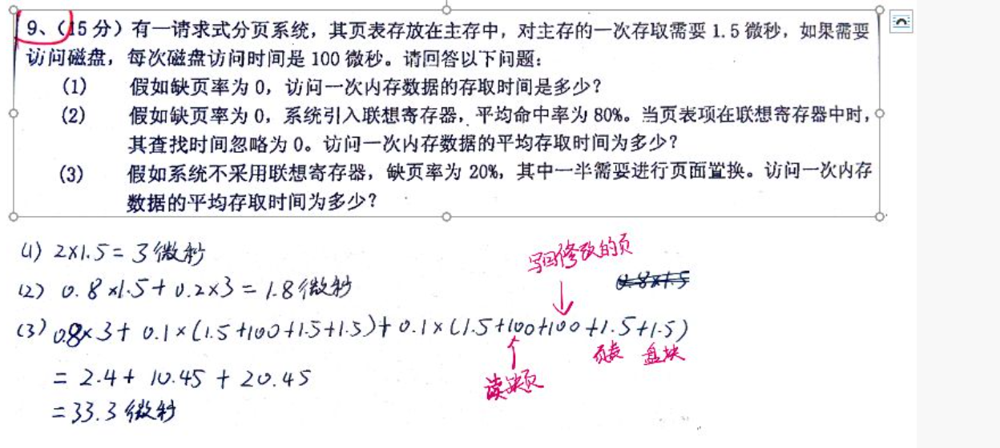
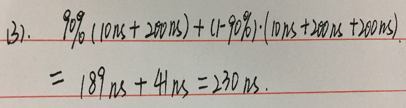
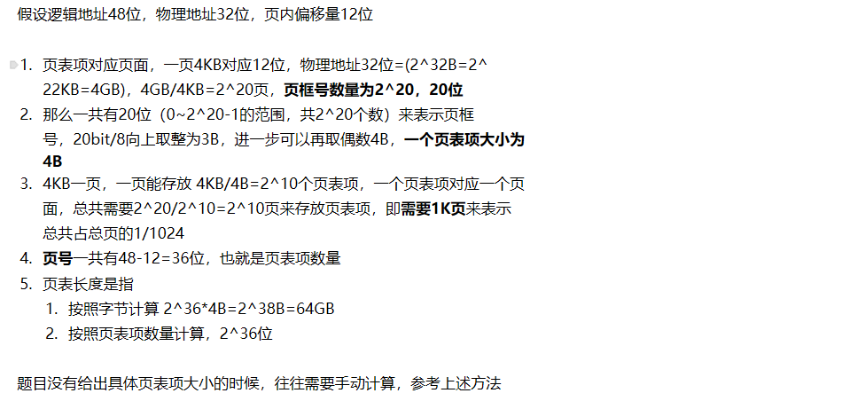
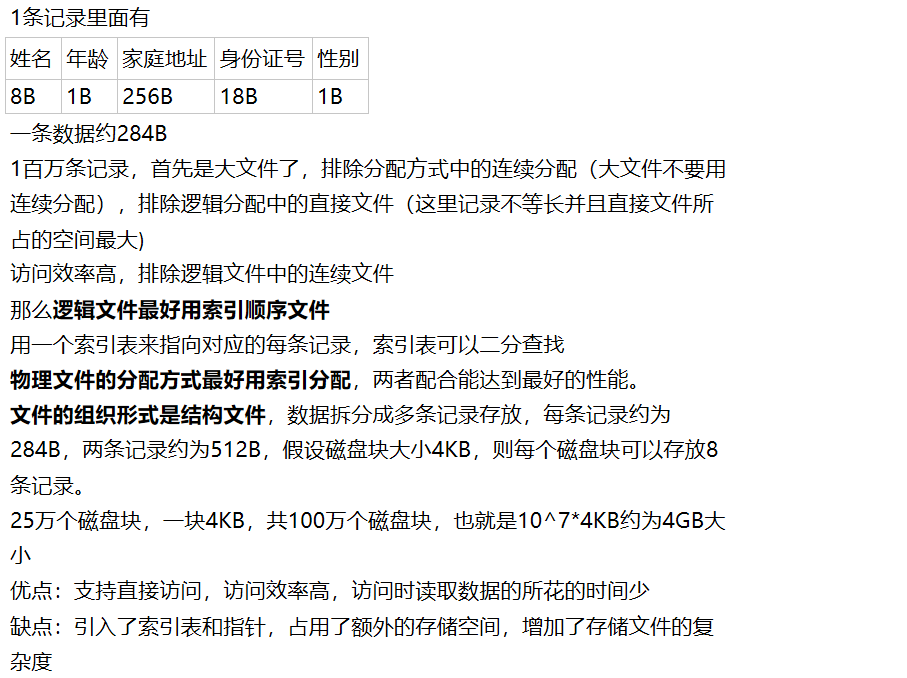

[toc]

# 重点提问汇总

整理了一些备考时候评论区经常问到的问题

## PV相关

### 19年PV

![个 进 程 Sl 、 S2 、 RI 和 R2 ， 其 中 Sl 、 向 缓 冲 区 B F 发 送 消 息 ， RI 和 R2 从 缓 冲 区  FF 接 收 消 息 。 发 送 和 接 收 规 贝 刂 如 下 ：  间 Sl ， S2 向 有 可 以 存 放 两 个 消 息 的 缓 冲 区 发 送 消 息  进 程 SI 发 送 消 息 MI ， M2 ， 进 程 S2 发 送 El,E2;  闷 缓 冲 区 只 能 存 放 一 Sl 发 送 的 消 息 和 一 个 S2 发 送 的 消 息 ， 不 能 存 放 同 一 进 程 发 送 的 两 个 消  息 ； （ 一 共 有 四 种 可 能 < Ml ， El > ， < M2 ， El > ， < Ml ， E2 × M2 ， E2 > ）  接 收 进 程 RI 只 能 接 收 < MI ， El × MI ， E2 > 接 收 进 程 R2 只 能 接 收 < M2 ， El × M2 ， E2 >  间 当 接 收 进 程 接 收 完 成 后 清 空 缓 冲 区  请 用 信 号 量 机 制 来 实 现 这 4 个 进 程 间 的 同 步 。 ](MdAsset/重点提问汇总/clip_image001.jpg)

和06年PV有异曲同工之妙

总有一个发送进程是备胎来到的

某些进程发送的信号量决定了谁来接收

把这个信号量写在前面，就行了

两道题目很像

```
E1=E2=1
F1=F2=F3=0
S1(){
	P(E1)
	if 发送消息是M1 than
		V(F1)
	else
		V(F2)
}

S2(){
	P(E2)
	// S2发的消息不决定是谁接收，不关键
	V(F3)
}

R1(){
	P(F1)
	P(F3)
	读取两个消息
	V(E1)
	V(E2)
}

R2(){
	P(F2)
	P(F3)
	读取两个消息
	V(E1)
	V(E2)
}
```

S2发送的消息并不关键，关键的是S1发的消息，如果S1发送M1，则只能由R1接收，如果发送M2则只能由R2接收

---

### 06年的PV

![（ 4 ） cache  （ 5 ） LRU 算 法  8 ： （ 15 分 ） 在 虚 拟 存 储 技 术 中 ， 系 统 将 进 程 运 行 时 所 缺 的 页 面 调 入 内 存 的 时 机 有  预 调 页 策 略 和 请 求 调 页 策 略 两 种 。 请 说 明 各 自 的 原 理 并 3 实 例 比 较 它 们 的 优 劣 。  9 ： （ 15 分 ） 有 一 个 数 据 采 集 和 处 理 系 统 ， 由 3 个  。 集 的 设 备 ， ！ 个 缓 冲 区 和  2 个 数 据 处 理 程 序 组 成 。 其 工 作 原 理 如 下 ： 0  (1) ： 每 个 采 集 数 据 的 设 备 分 别 由 一 个 进 J' 标 记 为 DI 、 D2 、 D3' 并 且 每  次 采 集 到 的 数 据 大 小 为 K.  （ 2 ） ： 缓 冲 区 的 大 小 为 2K （ 可 以 存  （ 3 ） ： 两 个 数 据 处 理 程 序 运 行 后 演 变 为 两 个 进 程 PI 、 P20  （ 4 ） ： 仅 当 缓 冲 区 中 有 DI 和 ， D 》 集 到 的 各 一 份 数 据 时 ， PI 取 出 并 处 理  （ 5 ） ： 仅 当 缓 冲 区 中 有 DI 0@屎 集 到 的 各 一 份 数 据 时 ， p2 取 出 并 处 理  请 用 信 号 量 机 制 实 现 上 进 程 的 同 步 ， 并 保 证 系 统 不 会 发 生 死 锁 。  有 32000 条 记 录 ， 每 条 记 录 结 构 如 下 ：  10 ： （ 15 分 ） 有 一  字 段  类 型  地 址  字 符  年 龄  数 字  1  专 业  字 符  字 符 ](MdAsset/重点提问汇总/clip_image001-1603980193680.jpg)

```
E1=E2=1
F1=F2=F3=0

D1(){
	P(E1)
	write data
	V(F1)
}

D2(){
	P(E2)
	write data
	V(F2)
}

D3(){
	P(E2)
	write data
	V(F3)
}

P1(){
	P(F2)
	P(F1)
	get data
	V(E1)
	V(E2)
}

P2(){
	P(F3)
	P(F1)
	get data
	V(E1)
	V(E2)
}
```

同时这里只可能同一时刻有P1或者P2取出数据，而此时不再有发送进程发数据，所以不用mutex

## 磁盘访问相关题目

### 一

![七 、 1 目 录 麦 什 采 用 链 接 式 ， 每 个 磁 盘 块 存 放 10 个 下 级 文 件 的 描 述 ， 最 多 存 放  40 个 下 级 文 件 ， 若 下 级 文 件 为 目 录 文 件 ， 上 级 目 录 指 向 该 目 录 文 件 的 第 一 块 ，  否 则 指 向 普 通 文 件 的 文 件 控 制 块 。 普 通 文 件 采 用 二 级 索 引 形 式 ， 文 件 控 制 块 中  给 出 12 个 磁 盘 块 地 址 ； 前 10 个 磁 盘 块 地 址 指 出 前 10 页 的 物 理 地 址 ， 第 Il 个 磁  盘 块 地 址 指 向 一 级 索 引 表 ， 一 级 索 引 表 给 出 256 个 磁 盘 块 地 址 ， 即 指 出 该 文 件  第 10 页 至 第 265 页 的 地 址 ， 第 12 个 磁 盘 块 地 址 指 向 二 级 索 引 表 ， 二 级 索 引 表  中 指 出 256 个 一 级 索 引 表 的 地 址 。  (1) 该 文 件 系 统 中 的 普 通 文 件 最 大 可 有 多 少 页 ？  （ 2 ） 若 要 读 文 件 / A/D / K / Q 中 的 某 一 页 ， 最 少 要 启 动 磁 盘 几 次 ？ 最 多 要 启 动  磁 盘 几 次 ？  第 二 问 最 多 访 问 多 少 次 ：  我 算 的 最 多 情 况 下 从 根 目 录 找 AO 次 ， d4 次 ， k4 次 ， q4 次 ， q 的 fcbl 次 ， 最 后 从 二 级 索 引 表 读 出 页 表 3 次 ， 共 16 次 ， 但 是 网 上 说 是  19 次 而 且 思 路 和 我 的 不 一 样 ， 所 以 想 问 一 下 老 师 最 多 情 况 是 怎 么 访 问 的 。 ](MdAsset/重点提问汇总/clip_image001-1603980316645.png)

**答案：**

注意只是指向了FCB，应该还要再读入1次FCB到内存中

如果根目录不在，16+1+3

如果根目录在，12+1+3

### 二 17年大题


![假 如 立 件 崆 制 块 在 内 存 ， 除 A 的 一 个 物 理 块 最 多 读 写 磁 盘 2 次 （ 读 写 索 引 块 各 一 次 ） ， 在 尾 部 捱 入 一 一 个 物 理 块 为 3 次 （ 读 后 索 引 块 售 一  次 生 据 块 写 ． RI 次 ）  假 如 文 件 崆 制 块 在 内 存 ， 删 除 B 的 一 个 物 畦 块 最 多 读 写 一 级 素 引 块 2 次 （ 读 写 索 引 块 各 一 次 ） + 读 写 2 级 紊 引 块 1K ． 2 次 （ 假 如 这 个 文 件 用 了  1K 个 2 级 索 引 块 ， 删 除 该 文 件 的 第 一 个 块 ， 二 级 索 引 表 要 前 移 一 个 索 引 项 ）  在 尾 部 插 入 一 个 物 理 块 在 2 十 2048 基 础 上 再 加 上 数 麾 块 写 入 1 次 ；  一 一 这 个 不 对  在 尾 部 插 入 一 个 物 理 块 为 4 次 ， 读 入 一 级 索 引 表 1 次 ， 写 出 一 级 索 引 表 1 次 （ 如 果 二 级 索 引 表 最 启 一 个 物 理 块 没 有 窒 项 ， 要 为 二 级 索 引 表 增  加 一 釒 理 块 ， 一 级 索 引 表 需 要 增 加 一 项 ） ， 写 出 二 级 索 引 表 1 项 （ 新 块 ） ， 数 庭 块 写 出 1 次 ； 如 果 二 级 索 引 表 最 后 一 筋 理 块 有 空 项 ，  读 入 一 级 引 轰 1 次 ， 读 入 二 级 索 引 轰 1 次 ， 写 出 二 级 素 引 表 1 项 （ 新 块 ） ， 数 哐 块 写 出 1 次 ， 同 样 是 四 次 ·  如 果 在 三 级 索 引 文 件 C 中 牖 除 第 一 理 块 ， 笙 三 级 索 引 表 中 的 索 弓 顺 需 要 征 前 移 动 。 那 么 肯 定 需 要 读 取 二 级 索 引 表 才 能 确 定 三 级 索 引 表  的 位 首 ． 那 么 就 是 1 〔 读 一 级 牽 引 轰 一 次 ） 丰 1k （ 读 1k 个 二 级 紊 引 袤 1 次 ） 40k 对 k （ 读 写 1 1k 个 三 级 牽 引 轰 一 次 ） ．  在 C 尾 部 陆 ， \ 一 一 ' i ． 物 理 块 ： 5 次 。 ](MdAsset/重点提问汇总/clip_image001-1603980429443.png)

一张索引表的内容是连续存放的，但是索引表指向的文件内容不是连续存放的

二级索引表中，一张表的索引项必须连续存放，而不同表之间的索引项不用连续存放，但是它们**逻辑上是连续**的，也就是说逻辑上是连续分配，比如删除第一块，那么剩下的所有块都要移动到上一块的位置里面。因为索引表项之间不能留空，否则逻辑地址转换的时候，有可能访问到空块，我想是不是这么个情况

 

二级索引的话，二级索引表有1K个，每个索引表有1K个页表项，总共有1K*1K个页表项，然后一个磁盘块能存放1K个页表项，1K*1K个页表项，总共要用1K个磁盘块来存储，删除第一张表的第一个页表项，二级索引表里所有索引项都要移动到前一个索引项的位置，也就是说删除第一个索引项，会引起1K个磁盘块的内容发生变化，所以一共要读1K次，然后写1K次，才能把上述的索引项移动的操作处理好

 

同理，三级索引删除一块的最多IO次数是这样的

读入1级索引表，读入第一张2级索引表，读入第一张3级索引表，删除掉第一张3级索引表的第一个页表项，

1级索引表1个，2级索引表1K个，三级索引表1K*1K个，然后3级索引表项1K*1K*1K个，三级索引表项总共要1K*1K个磁盘块来存储，移动三级索引表的表项，需要IO 1K*1K个磁盘块。然后由于3级索引表都要移动，所以二级索引表也都要读入，总共1K个二级索引表

### 三


FAT中删除FCB中的第0块的话，需要修改FCB，因为FCB指向的是该文件在FAT的首地址


## EAT计算相关题目

### 一



注意需要缺页置换的意思是，内存中的页修改过了，需要换出，而外存中的页要写入，所以一共要2次访问磁盘

12题一样

第三题按照王道的写法

0.8*3+0.2*(1.5+0.5*(100)+0.5*(100+100)+1.5+1.5)

0.8未缺页，缺页时：读页表，50%直接写入，50%需要写出和写入，访问页表，访存

但是按照MOOC上面的写法，应该是

0.8*3+0.2*(1.5+0.5*(100)+0.5*(100+100)+1.5)

缺页时：读页表，50%写入和50%写入写出，**直接访存** 

**如果没有特殊说明，按照王道的做法即可，写的时候加以说明**

---

## 磁盘块存目录项问题


目录文件是存储该目录下的所有FCB，所以目录文件是可以占用多个物理块连续存储的

题目第一句话应该是一个目录有1000个文件，一个文件的目录项为1.3KB

他第二种做法是认为目录文件中，目录项不能在两个页之间存放上下数据，实际上是可以的，一般我们的做法就是第一个

## 逻辑文件问题

![逻 辑 文 件 的 一 些 问 题  逻 辑 文 件 是 面 向 用 户 的 文 件 ， 分 为 顺 序 文 件 ， 百 接 文 件 ， 索 引 文 件 ， 那 么 作 系 统 中 在 哪 里 存 放 这 些 逻 辑 文 件 ？ 完 勺 文 件 问  流 程 是 不 是 ：  1 ． 先 访 问 文 件 目 录 ， 找 到 该 文 件 的 文 件 目 录 项 (FCB)  2 ． 根 据 FCB 获 得 起 始 块 地 址 （ 競 者 索 引 表 地 址 ）  3 、 根 据 逻 辑 地 址 转 懊 后 勿 理 地 址 访 问 对 应 的 磁 盘 块  假 如 我 们 逻 辑 文 件 采 用 的 是 索 引 文 件 ， 物 理 分 配 万 式 采 用 的 是 索 引 分 配 ， 那 悍 作 系 统 中 》 找 逻 帽 上 的 索 引 文 件 从 而 访 「 酮 寸 应 数  哕 辑 文 件 和 物 理 文 件 到 底 皇 两 种 不 同 的 文 件 ， 还 是 对 于 相 同 文 件 内 宕 的 不 同 表 达 形 式 ？  涉 辑 文 亻 大 小 是 不 是 就 是 文 件 赦 据 的 大 小 ？  问 题 有 点 多 ， 这 一 ． 块 知 况 一 ． 直 不 太 清 楚 ， 希 望 老 师 解 答 下 ， 万 分 感 谢 ！  ykt149941757 一 12 月 9B ](MdAsset/重点提问汇总/clip_image001-1603980603023.png)

很重要的问题

![逻 辑 文 件 决 定 用 户 如 伺 存 放 文 件 ， 用 户 根 据 逻 憬 文 件 的 结 来 作  ， 仂 肥 一 一 个 人 员 朕 系 表 可 以 存 为 很 多 种 辑 文 件 的 形 式 ：  月 索 引 文 件 ， 按 照 姓 名 做 索 引  2 ） 不 定 长 文 本 文 件 ， 每 个 人 一 行  司 定 长 文 本 文 件 ， ， 衝 个 人 一 行 ， 长 度 一 样  物 理 文 件 你 是 看 不 到 的 ， 系 统 根 据 物 理 文 件 咿 吉 构 来 为 你 存 取 數 据 ·  例 ， 你 要 张 三 稍 訕 匕  加 入 文 件 采 用 索 引 结 构 ， 你 查 索 引 表 ， 在 第 100 项 找 涨 三 ， 根 据 索 引 表 中 尥 址 ， 矯 首 张 三 訕 上 存 放 在 之 件 傭 侈 为 1 佣 的 地 方 ·  以 上 涉 及 辑 文 件 “  下 面 ， 你 就 向 系 统 发 出 一 一 个 读 文 件 的 系 统 调 read (handle, 10000,length). 下 面 是 系 纟 〕 事 情 ， 涉 及 物 理 文 《  加 入 物 理 文 件 是 单 级 索 引 ， 每 筋 理 块 1K ， 物 理 块 号 的 长 度 为 2 个 字 节 · 10 0 ／ 1024 · = 9 余 7 ·  则 系 统 根 据 FCB 戎 到 存 放 索 引 表 的 物 理 块 ， 找 到 九 顶 读 筋 理 块 号 为 12 弘 “ 月 仫 ， 把 12 块 读 入 内 存 （ 文 件 系 统 以 块 为 单 位 进 行 存  取 ） ， 偏 召 为 78 ‰ 长 度 为 《 ength 就 是 你 要 的 内 容 了 “  4 0 评 论 （ 0 ） 举 报 ](MdAsset/重点提问汇总/clip_image001-1603980610709.png)

 补充：


## 缺页中断处理流程

这一部分老师回答得摸棱两可，参考一下即可：


老师的回答意味着不用加上访问快表的时间

参考下题第三问




 

![关 于 EAT 时 间 中 快 表 的 修 改 时 间 问 题  有 效 访 问 时 间 { E A T J  0 找 'TIL 噌 需 娄 0  蒲 回 内 存 、 需 要 100n s  申 为 '30 ％ 。 錮 在 刊 ， 中 。 那 么 要 2 咖 到  老 师 参 与  如 果 来 命 中 杰 那 么 果  词 间 丿 所 以 一 翌 22 琥  翎 河 时 间 Y-QTL B 访  情 问 对 于 快 表 的 修 改 不 箅 时 司 〔 包 括 在 虚 似 内 存 管 理 中 也 有 汶 种 问 题 〕 吗 ？ 〔 题 目 中 沿 有 说 修 改 快 表 的 时 间 忽 略 不 计 ， 也 沿 说 修  改 快 轰 要 多 久 ） 。 其 他 参 考 书 一 般 说 改 快 表 时 间 等 十 访 问 快 表 时 间 · 希 望 老 帅 能 够 解 答 一 下 汶 种 怙 况 一 般 怎 么 笪 ？  m00C15302926 一 11 月 7 日 来 自 课 生 教 学 视 频 ．  共 2 回  + 关 汪  回 复 的 0 0  排 序 方 式 ： 回 复 时 司 ：  举 报  投 栗 数  对 于 TLB 不 命 中 如 何 处 畦 有 多 种 方 法 ： 如 1 ） 把 这 次 访 问 的 页 表 项 加 到 TLB ； 2 ） 当 TLB 不 命 中 时 产 生 一 个 中 断 ， 把 对 应 页 表 顶 装 入 TLB 冉  新 执 行 僭 令 ； 3 ） 不 汶 次 访 问 的 页 表 顶 加 到 TLB ， 而 是 有 悍 作 系 统 统 一 处 理 ．  由 于 没 有 明 确 处 理 方 法 ， 所 以 可 以 不 考 虑 更 新 TLB 的 时 间 ·  李 培 峰 0 11 月 8 日  0 0 评 论 { 0 ） 举 报 ](MdAsset/重点提问汇总/clip_image003.png)

注意苏大的访问方式跟王道的很不一样！！！

苏大的题目里面没有给出更新TLB的时间的时候不要加上TLB访问时间！！

 

 

![第 三 问 ， 题 目 说 产 生 缺 页 中 断 是 否 就 不 需 要 考 虑 命 中 率 了  老 师 参 与  9 、 （ 15 分 ） 假 设 某 系 统 采 用 一 级 页 表 ， TLB 命 中 率 为 98 ％ ， TLB 访 问 时 间 是 Ions,  内 存 访 问 时 间 是 loons, 页 面 置 换 时 间 是 200ns ， 并 假 设 当 TLB 访 问 失 败 时 才 开 始  访 问 内 存 ， 求 ：  (1) TLB 命 中 时 的 平 均 访 问 时 间 是 多 少 ？  2 不 命 中 时 的 平 均 访 问 时 间 是 多 少 ？  （ 3 ） 产 生 缺 页 中 断 ， 并 进 行 页 面 置 换 后 的 平 均 访 问 时 间 是 多 少 ？  古 柠 薄 荷 yktl 一 11 月 9B  0 0 0  已 关 注  回 复 的 0 0 举 报  共 2 回 0  李 培 峰 0  排 序 方 式 ： 回 复 时 司 ：  投 票 数  11 月 1 1 日  访 问 贞 表 ， 访 问 快 表 ， 缺 页 首 换 ， 访 问 内 存  老 师  0 0 哣 评 论 （ 2 ） 举 报  凸 0 举 报  老 师 那 第 三 问 答 案 是 多 少 ？ 是 10 + 100 + 200 + 10 + 100 = 420 吗 ？ 流 程 是 访 司 页 表 ， 访 问 快 表 。 缺 页 首 换 访  问 快 表 ， 访 问 内 存  1 1 月 1 1 日  ykt 9941757 “  凸 0 除 举 报 ](MdAsset/重点提问汇总/clip_image004.png)

从题目意思来看，苏大的缺页中断是不加快表时间的，谨记！！

 

关于分页存储的有效访问时间问题

老师参与

  问题1: 使用了快表（题目给出了快表的访问时间）的计算机，先访问了快表在未命中的情况下，OS要访问页表，再更新快表然后访存，请问这个时候修改快表的时间要不要计算呢？

  问题2: 我在题目中有见到 缺页处理时间 和 调入调出时间，两者区别是不是前者包括了置换和修改页表的时间，而后者在计算的时候要考虑修改页表的时间。

1、是否更新快表由快表的更新算法决定。如果没有说明可以不考虑。

2、 两者没有重合地方。缺页处理时间是操作系统处理缺页所花费的系统CPU开销，调入调出时间是进行页面换进换出的I/O时间。

## 王道的文件目录问题

![某 个 文 件 系 统 中 ， 外 存 为 硬 盘 ． 物 理 块 大 小 为 512B ， 有 文 件 A 包 含 598 条 回  记 录 ， 每 条 记 录 占 255B ， 每 个 物 理 块 放 2 条 记 录 · 文 件 A 所 在 的 目 录 如 下  图 所 示 ． 文 件 目 录 采 用 多 级 树 形 目 录 结 构 ， 由 根 目 录 结 点 、 作 为 目 录 文 件 的 囟  中 间 结 点 和 作 为 信 息 文 件 的 树 叶 组 成 ， 每 个 目 录 项 占 127B ， 每 个 物 理 块 放 4 个 目 录 项 ，  根 目 录 的 第 一 块 常 驻 内 存 ． 试 问 ：  1 ） 若 文 件 的 物 理 结 构 采 用 链 式 存 储 方 式 ， 链 指 针 地 址 占 2B ， 则 要 将 文 件 A 读 入 内  存 ， 至 少 需 要 存 取 几 次 硬 盘 ？  2 ） 若 文 件 为 连 续 文 件 ， 则 要 读 文 件 A 的 第 487 ． 条 记 录 至 少 要 存 取 几 次 硬 盘 ？  3 〕 一 般 为 减 少 读 盘 次 数 ， 可 采 取 什 么 措 施 ， 此 时 可 减 少 几 次 存 取 操 作 ？  2020 年 操 作 系 统 考 研 复 习 指 导  №  dev  ot  dirl  广 一 ． T 爿  老 师 请 问 这 题 第 一 一 问 是 访 问 了 5 次 磁 盘 还 是 六 次 磁 盘 ](MdAsset/重点提问汇总/clip_image001-1603980694914.png)


### 页表项计算相关


### 页表长度计算相关




## 文件系统设计的问题

![10 、 （ 巧 分 ） 有 一 批 数 据 ， 共 有 32 仪 条 记 录 ， 每 条 记 录 的 结 构 如 下 ：  字 段  类 型  姓 名  字 符  地 址  字 符  0 一 100  数 字  字 符  长 度 （ 字 节 ） 4 一 8  该 数 据 的 内 容 固 定 不 变 ， 其 用 途 主 要 是 用 于 根 据 姓 名 来 检 索 其 他 相 关 信  息 。 现 把 这 些 数 据 以 文 件 形 式 存 放 在 磁 盘 上 ， 该 磁 盘 的 物 理 块 大 小 为 4KB0  请 设 计 存 放 该 批 数 据 的 文 件 的 逻 辑 结 构 （ 可 以 不 存 储 在 一 个 文 件 中 ） 和 物 理  结 构 （ 在 磁 盘 上 的 存 储 结 构 ） ， 使 得 检 索 操 作 能 尽 可 能 少 访 问 磁 盘 。 并 计 算  在 该 结 构 下 ， 每 次 检 索 平 均 需 要 访 问 多 少 个 物 理 块 。 （ 假 设 文 件 的 目 录 己 经  调 人 内 存 ， 文 件 存 放 在 外 存 ）  青 柠 薄 荷 yktl 一 旧 3  共 1 回 复  没 有 标 准 答 案 ， 只 要 合 理 就 行 。  另 外 ， 为 了 计 算 ， 在 设 计 的 方 案 中 应 该 给 出 数 据 ， 否 则 没 有 办 法 计 算 ．  + 关 注  排 序 方 式 ](MdAsset/重点提问汇总/clip_image001-1603980828580.png)

一道例题

![关 于 文 件 存 储 的 问 题  老 师 参 与  10 、 （ 巧 分 ） 有 一 个 含 有 1 百 万 条 记 录 的 文 本 文 件 ， 每 条 记 录 包 括 以 下 内 容 ： 姓 名 〈 长 度 为 2 ． 个  汉 字 ， 平 均 长 度 4 个 汉 字 ） 、 年 、 家 庭 地 址 （ 长 度 最 长 256 个 汉 字 ， 平 均 长 度 128 个 汉 字 冫 、 身 份  证 号 码 和 性 别 · 对 该 文 件 的 操 作 主 要 是 根 据 姓 名 进 行 记 录 询 · 请 为 该 文 件 设 计 一 种 逻 辑 文 件 和 物 理  文 件 的 方 案 ， 使 该 文 件 具 有 访 问 效 率 高 和 存 储 空 间 省 的 优 点 ， 并 在 你 设 计 方 案 的 基 础 上 ， 请 回 答 以 下  问 韙 ：  (I) 假 设 磁 盘 块 大 小 为 IKB, 该 文 件 需 要 多 少 个 磁 盘 块 ？  〈 2 ） 查 询 姓 名 为 “ 安 娜 " 的 记 录 ， 平 均 需 要 访 问 多 少 个 磁 盘 块 ？ （ 假 设 该 文 件 的 目 录 己 在 内 存 ）  吉 彳 宁 薄 yktl ．  共 1 回 复  11 月 7 日  + 关 注  回 复 的 1 举 报  排 序 疴 式 ： 回 复 时 间 ：  投 票 数  这 个 题 目 可 以 有 不 同 的 答 案 · 忘 的 来 说 ， 需 要 回 答 以 下 问 题 ：  1 、 设 计 一 个 方 案 ， 制 定 辑 文 件 的 形 式 ， 结 构 和 物 理 文 件 的 形 、 结 构 · 给 出 1 百 万 记 录 文 件 的 组 织 形 （ 可 以 分 成 多 个 文 件 存 放 〕  用 的 存 储 空 间 等 。  2 、 讨 论 该 方 案 的 优 点 和 点 ；  3 、 根 倨 你 的 万 案 回 答 2 个 问 题 ． （ 性 能 要 好 ， 可 以 不 是 最 优 ， 但 不 能 性 能 差 ） ](MdAsset/重点提问汇总/clip_image001-1603980845813.png)

答案 仅供参考：



## 逻辑文件和物理文件

![老 师 您 好 我 想 请 问 文 亻 牛 逻 辑 结 构 和 物 理 结 构 的 关 系  比 如 我 想 存 储 一 个 学 校 的 学 生 信 息  老 师 参 与  逻 辑 上 采 用 索 引 文 件 卣 旬 某 个 信 息 时 通 过 二 分 查 找 索 引 表 得 到 某 个 学 生 信 息 记 录 那 么 这 条 记 怎 么 从 物 理 块 上 读 出 来 ？ 物 理 结 构  上 是 如 何 实 现 的 ？  不 矯 首 自 己 表 述 清 楚 了 没 有 。  阿 飞 m C379 11 月 29 日 来 自 课 件 “ 课 件 "  共 2 回 复  逻 辑 结 构 需 要 和 物 理 结 构 配 合 使 用 ， 才 能 有 好 的 性 能 。  逻 辑 上 采 索 引 文 件 物 理 上 采 用 连 续 分 配 是 没 有 问 题 的 。  但 是 ， 逻 辑 上 采 用 索 引 结 构 ， 物 理 上 采 用 显 式 链 接 结 构 是 苜 司 题 的 ， 没 有 办 法 使 索 引 结 构 的 优 点 ， 只 能 漏 历 文 件 。  老 师  + 关 注  回 复 0 0 0  排 序 方 式 ： 回 复 时 间 ：  举 报  投 票 数  心 0  又 或 者 逻 辑 上 采 用 索 引 文 件 ， 物 理 上 采 用 连 续 分 配 ， 这 样 能 实 现 吗 ？  阿 飞 m 佣 C379 11 月 29 日  评 论 （ 0 ） 举 报  评 论 （ 0 ） 举 报 ](MdAsset/重点提问汇总/clip_image001-1603980879083.png)

逻辑上采用索引文件，物理上最好也采用索引文件吧

补充：

![辑 上 采 佣 索 引 文 《 物 理 上 采 佣 连 续 分 配 是 没 有 回 题 的 ·  但 是 ， 澧 上 采 厍 索 引 结 构 ， 物 理 上 采 式 链 接 结 构 是 司 送 的 ， 沿 有 办 法 使 索 引 结 〕 优 点 ， 只 能 遍 历 文 件 。  孛 培 崆 0 12 月 1 日  0 评 论 （ 2 ） 举 幄  老 师 秘 问 一 一 下 导 式 角 FAT, 直 怙 浅 FAT 表 就 行 了 吧 ， 不 峦 要 历 文 件 ， 式 才 峦 要 历 文 件  另 外 ， 辑 上 采 索 引 构 ， 那 幺 某 个 记 昃 的 索 引 点 存 放 百 该 条 记 录 对 应 的 物 理 地 地 还 是 岁 地 址 ？  录 的 具 体 信 息 ？  心 0  老 帅 伺 一 下 式 接 有 FAT, 百 接 百 找 FAT 衮 就 行 了 吧 ， 不 要 迎 历 文 件 ， 式 链 接 才 要 迎 历 文 件  另 外 ， 逻 辑 上 采 索 引 结 构 ， 那 么 个 记 索 引 结 点 存 放 该 景 记 呈 对 应 的 物 理 地 址 还 是 辑 地 址 ？  具 体 信 ？  麻 烦 老 帅 帮 看 下 ， 感 ·  12 层 1 日  y 14gg41757 ·  添 加 评 论  0  利 除 ](MdAsset/重点提问汇总/clip_image001-1603980888602.png)

## 物理块、磁盘块、索引表、索引块


索引表物理上是由索引块构成，逻辑上是由索引目录项构成
索引块是指存放索引信息的物理块
索引表，FCB都需要连续存放，物理上必须相连

## 碎片问题


## 抖动问题

![发 生 抖 动 时 候 不 同 处 理 方 式 带 来 的 影 响  增 加 贞 面 大 小 会 导 致 抖 动 得 申 频 擎 吗 ？  老 师 参 与  我 的 理 解 是 ， 内 存 大 小 不 变 ， 增 加 页 面 大 小 会 髫 致 内 存 中 的 页 变 得 更 少 ， 就 会 致 更 频 擎 的 缺 页 ， 加 重 抖 动 现 象 ， 这 个 说 法 有 错  减 少 页 面 大 小 会 缓 解 抖 动 吗 ？  还 是 说 这 两 者 造 成 的 影 胴 都 不 大  yktl 49941757 一  11 月 30 日  共 1 回 复  增 加 贞 面 大 小 会 导 致 抖 动 得 申 频 繁 吗 ？  排 序 方 式 ： 回 复 时 间 ：  投 票 数  我 的 理 解 是 ， 内 存 大 小 不 变 ， 增 加 页 面 大 小 会 导 致 内 存 中 的 贞 变 得 更 少 ， 就 会 导 致 更 频 繁 的 缺 页 ， 加 重 料 动 现 象 ， 这 个 说 法 有 错 吗 ？  减 少 页 面 大 小 会 缓 解 抖 动 吗 ？  一 这 个 理 解 没 错 。  还 是 说 这 两 者 造 成 的 影 响 都 不 大  一 也 有 可 能 缓 解 斟 动 。 一 个 极 端 例 子 ， 如 果 整 个 内 存 分 为 1 个 页 面 ， 那 只 能 一 个 讲 程 使 用 ， 也 就 没 有 料 动 了 “  老 师  0 0 评 论 （ 0 ） 《 举 报 ](MdAsset/重点提问汇总/clip_image001-1603980942868.png)

## FCB总结

连续分配的FCB包含：（文件名，起始地址，长度）

隐式链接分配的FCB包含：（文件名，首块指针，尾块指针）

显式链接的FCB包含：（文件名，FAT表中的始位置）

索引分配的FCB包含（文件名，索引表的位置）