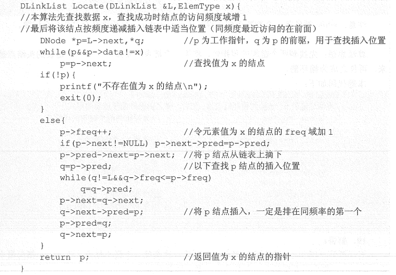
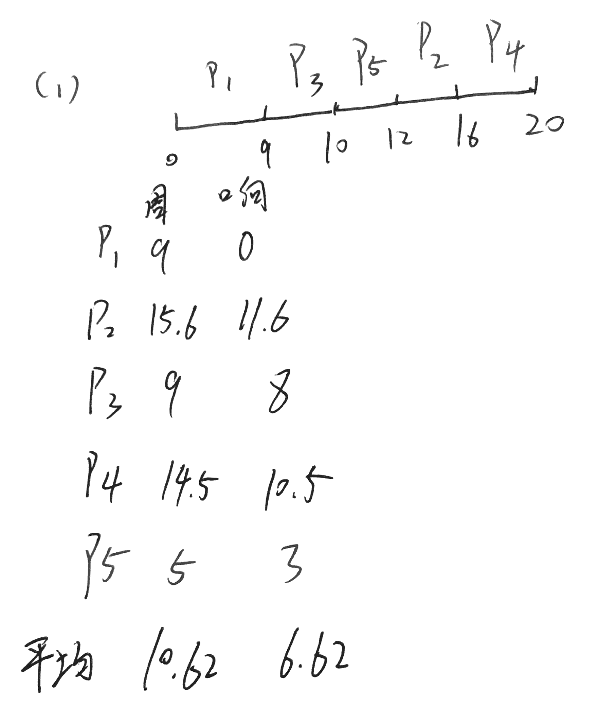
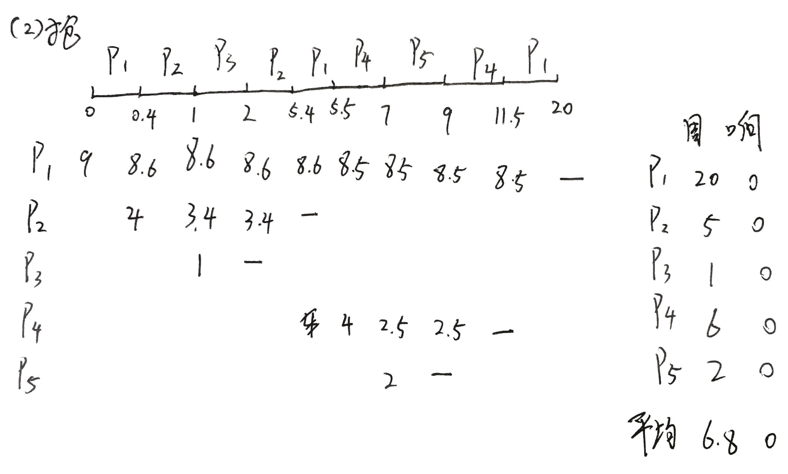
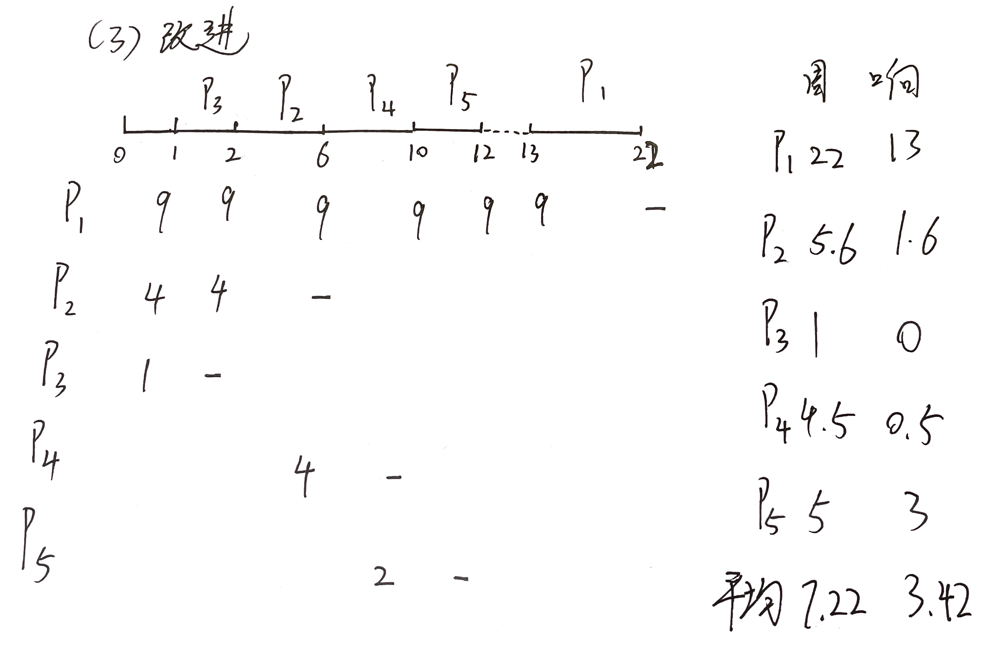

[toc]

# 04年真题答案

## DS

### 1 设计操作序列 

答案：tsttsttsssttss

### 2 排序算法比较

| 名词     | 最好     | 最坏   | 平均     |
| -------- | -------- | ------ | -------- |
| 插入排序 | O(n)     | O(n^2) | O(n^2)   |
| 快速排序 | O(nlogn) | O(n^2) | O(nlogn) |

### 3 递归算法求数组中的最大值

```c++
int func(int a[], int i, int n, int &max) {
    if (i >= n)return max;
    if (a[i] > max)
        max = a[i];
    func(a, i + 1, n, max);
}
```

### 4 链表排序结点

思路就是访问某个结点x后，保存它的后继和前驱，然后往前找到它合适的存放位置的前驱，找到之后修改x的前驱后继，然后插入到合适的位置，这道题王道链表T20原题，21版王道数据结构的第58页



### 5 判断二叉排序树

```c
bool func(Tree T) {
    if (!T)return true;
    if (T->right)
        if (T->right->val < T)return false;
    if (T->left)
        if (T->left->val > T)return false;
    return func(T->left) && func(T->right);
}
```

### 6 图邻接表求度大于2的结点

假设有向图的度=出度+入度

```c
typedef struct node {
    int adjvex;
    struct Arcnode *nextarc;
} Arcnode;
typedef struct {
    Vertextype data;
    Arcnode *firstarc;
} VNode, AdjList[MAX_VERTEX_NUM];
typedef struct {
    AdjList vertices;
    int vexnum, arcnum;
} ALGraph;

//假设即统计出度又统计入度
int func(ALGraph G) {
    int sum = 0;
    int degree[G.vexnum] = {0};
    Arcnode *t = NULL;
    for (int i = 0; i < G.vexnum; i++) {
        t = G.vertices[i]->firstarc;
        while (t) {
            degree[i]++;    //该顶点的出度++
            degree[t->data]++;    //该结点指向的顶点的入度++
            t = t->next;
        }
    }
    for (int i = 0; i < G.vexnum; i++)
        if (degree[i] >= 2)sum++;
    return sum;
}
```


## OS

### 1 线程与进程区别

什么是线程和进程？举例说明应用场景

进程是OS资源分配的最小单位，是作业的一次执行过程，拥有独立的地址空间，堆栈，代码段等资源，进程可以创建多个线程，引入线程后，线程就是OS调度的最小单位。线程依赖于进程。只拥有一小部分的必要空间，其余的资源都来自于父进程，并且线程没有独立的地址空间。

**多线程优点：**

创建速度快，方便高效的数据共享 

共享数据：多线程间可以共享同一虚拟地址空间；多进程间的数据共享就需要用到共享内存、信号量等IPC技术；

较轻的上下文切换开销 - 不用切换地址空间，不用更改寄存器，不用刷新TLB。 
提供非均质的服务 
如果全都是计算任务，但每个任务的耗时不都为1s，而是1ms-1s之间波动；这样，多线程相比多进程的优势就体现出来，它能有效降低“简单任务被复杂任务压住”的概率；

**适用的场景：**

1 线程间有数据共享，并且数据是需要修改的（不同任务间需要大量共享数据或频繁通信时）； 
 2 提供非均质的服务（有优先级任务处理）事件响应有优先级； 
 3 单任务并行计算，在非CPU Bound的场景下提高响应速度，降低时延； 
 4 与人有IO交互的应用，良好的用户体验（键盘鼠标的输入，立刻响应）

**进程的应用场景：**

几乎所有的web server服务器服务都有多进程的，至少有一个守护进程配合一个worker进程，例如apached,httpd等等以d结尾的进程包括init.d本身就是0级总进程，所有你认知的进程都是它的子进程； 

编程相对容易；通常不需要考虑锁和同步资源的问题。 
更强的容错性:比起多线程的一个好处是一个进程崩溃了不会影响其他进程。 
有内核保证的隔离：数据和错误隔离。 
对于使用如C/C++这些语言编写的本地代码，错误隔离是非常有用的：采用多进程架构的程序一般可以做到一定程度的自恢复；（master守护进程监控所有worker进程，发现进程挂掉后将其重启）

### 2 抖动相关

抖动的由来和工作集模型

抖动是指进程频繁的发生缺页调度导致操作系统不断发出缺页中断从而不断换入换出页面的现象。原因是内存中的驻留集大小小于工作集大小。工作集是指某段时间进程要访问的页面集合，当驻留集小于工作集大小的时候，就要给该进程增加页面，防止发生抖动

王道答案：让操作系统跟踪每个进程的工作及，并为进程分配大于其工作及的物理块。落在工作集内的页面需要调入驻留集中，而落在工作集外的页面可以从驻留集中换出，若还有空闲物理块，则可以在掉一个进程到内存以增加多道程序数。若所有进程的工作集之和超过了可用物理块的总数，则操作系统会暂停一个进程，将其页面调出并将其物理块分配给其他进程，防止出现抖动现象

### 3 文件删除IO

块号0~99，FCB在内存中

1. 开始处添加（需要写入数据
   1. 连续：移动100块，写入新块，修改FCB的长度，共201次
   2. 隐式链接：将新块的next指针指向FCB中首地址，写入新块，修改FCB，共1次
   3. 显示链接：读入FAT，将新块写入,修改FAT并写回，共3次。（如果FAT也在内存，则只用写入）
   4. 索引分配：读入FCB，读入索引表，写入新块，修改索引表并写回，共3次（如果索引表在内存中，则1次）
2. 在50块前添加一块（不需要写入数据
   1. 连续：移动后50块，共100次IO，由于不用写入数据，直接修改FCB即可，100次
   2. 隐式链接：读FCB获得首地址，一次读入0~49共50块，将新块的指针指向49指向的地址并写入（此时还是要写入磁盘，不然就找不到50块了）修改49块指针并写回，共50+1+1=52次
   3. 显示链接：读FCB获得FAT表地址，读入FAT表，由于不需要写入数据，直接修改FAT表并写回即可，此时共2次
   4. 索引分配：读FCB获得索引表地址，读入索引表，修改索引表并写回，共2次
3. 删除第50块
   1. 连续：读FCB，移动后49块，98次IO，修改FCB，共98次
   2. 隐式链接：读FCB获得首地址，依次读入0~49共50块，再读入第50块，将49块的指针指向第50块的指针指向的地址，写回第49块，一共50+1+1=52次
   3. 显示链接：读FCB获得FAT表地址，读入FAT表，修改FAT表并写回，2次
   4. 索引分配：读FCB获得索引表地址，读入索引表，修改并写回，2次
4. 删除最后一块：
   1. 连续：直接修改FCB 0次
   2. 隐式链接：依次读入0~98共99块，修改第98块指针指向NULL，写回第98块，共99+1=100次IO
   3. 显示链接：读入FCB获得FAT表首地址，读入FAT表，修改FAT表并写回，2次
   4. 索引分配：读入FCB获得索引表地址，读入索引表，修改索引表并写回，2次

### 4 地址转换


### 5 进程调度

第三问比较难算

| 进程名 | 到达时间 | 运行时间 |
| ------ | -------- | -------- |
| P1     | 0        | 9        |
| P2     | 0.4      | 4        |
| P3     | 1        | 1        |
| P4     | 5.5      | 4        |
| P5     | 7        | 2        |

- 非抢占

  

- 抢占

  

- 改进

  
  
  注意0秒时，P1等待1秒
  
  12秒时，P1仍然等待1秒

### 6 PV

FCFS的读写者问题

```c
semaphore wm=1,rm=1,m=1;
int count=1;
writer(){
	while(1){
        P(m);
        P(wm);
        writing...;
        V(wm);
        V(m);
    }
}
reader(){
	while(1){
        P(m);	//相较于最开始的版本，这里加了一个m的互斥量，当有写者到达时候，之后的读写者都会阻塞，当之前的读完或者写完之后，按照顺序来恢复进程访问序列
        P(rm);
        if(count==0)
            P(wm);
        count++;
        V(rm);
        V(m);
        reading...;
        P(rm);
        count--;
        if(count==0)
            V(wm);
        V(rm);
    }
}
```

扩展：真正的写者优先,与读者优先相比主要是添加了wcount变量来记录等待中的写者

```c
semaphore file=1,wm=1,rm=1;
int wcount=0,rcount=0;
writer(){
    while(1){
        P(wm);	//修改wcount
        if(wcount==0)
       		P(rm);	//阻塞读者
        wcount++;	//记录写者数
        P(file);	//互斥访问文件
        V(wm);	
        
        writing...;
        V(file);	//释放文件
        
        P(wm);
        wcount--;
        if(wcount==0)
            V(rm);	//无写者，读者可以读了
        V(wm);
    }
}
reader(){
    while(1){
        P(rm);
        if(rcount==0)
            P(file);	//尝试获取文件读
        rcount++;
        V(rm);
        
        reading...;	//读者访问并不互斥
    	
        P(rm);
       	rcount--;
    	if(rcount==0)
            V(flie);	//如果当前队列中有写者，那么写者就会卡住rm不让后继读者进来，并且一旦当前读者释放file，那么不管当前读者和第一个写者之间有多少个读者，总是会优先分配给写者，从而实现真正的写者优先
        V(rm);
    }
}
```

