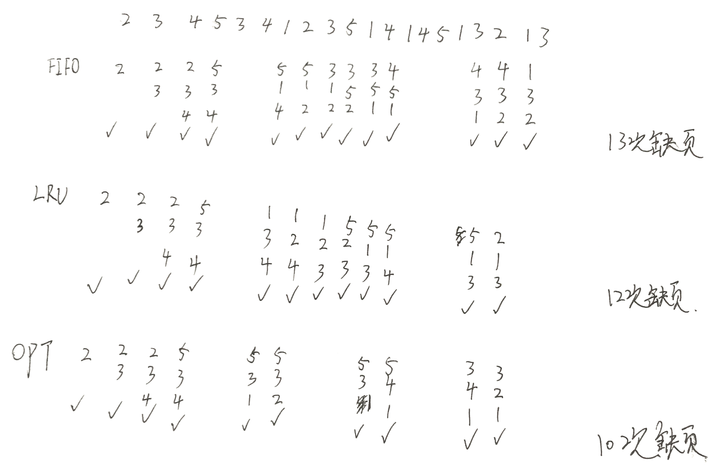

[toc]

# 05年真题答案

## DS

### 1 平衡二叉树

平衡二叉树：平衡二叉树是一颗对每个结点来说它高度差不超过1的二叉查找树。对所有节点，其左子树的结点的值都小于当前结点，其右子树结点的值都大于当前结点，并且它的左右子树高度之差不超过1.

查找AVL树的结点，时间复杂度是$O(logn)$,因为它的查找过程就是二分查找的过程，并且查找次数不会超过树高$h=log_2n$

### 2 排序算法比较

1000个无序，最快的速度选出10个最大的数据来。
答案：堆排序，建堆的最快时间复杂度是$O(n)$，然后取十次最大数就行了。
相比之下快排和归并排序都需要$O(nlogn)$的时间复杂度来排序才能确定10个最大数，而基数排序取决于数列的状态，一般情况下基数排序的性能没有快排好

### 3 删除多余结点

单向链表删除值相同的多余的结点~=递归删除单链表

```c++
void func(List &L, int x) {
    if (!L) return;
    if (L->val == x) {
        L = L->next;
        func(L, x);
    } else func(L->next, x);
}
```

### 4 计算矩阵转置

计算M矩阵的转置N，时间复杂度O(n+t)

用Python语言描述

```python
def transformMatrix(M):    
    # 转置后的矩阵
    ans = []
    # 设row，col分别是矩阵M的行、列数
    # 相当于C中的 for(int i=0;i<row;i++)
    for i in range(len(M[0])):
        tmp = []
        # 相当于C中的 for(int j=0;j<col;j++)
        for j in range(len(M)):
            # 在tmp的末尾添加M[j][i]
            tmp.append(M[j][i])
        # ans中添加tmp
        ans.append(tmp)
    return ans
```


### 5 生成全排列

```c
//生成n!个全排列，初始flag={0} select={0},k=0,为了方便表示，这里数组起始从1开始

// n个数，生成它的全排列
// flag是标记数组，flag[i]=1表示i被选了，flag[i]=0表示1没被选 
// select里面存放的是我们选择的全排列
// k是当前选择了第几个数 
void DFS(int n,int *flag,int *select,int k){
	// 如果当前选择了k==n，即n个数生成一个全排列，输出选择的结果select 
	if(k==n){
		for (int i=0;i<n;i++)
			cout<<select[i]<<" ";
		cout<<endl;		
	}else{
		// 对n个数，选择它们可能构成的全排列 
		for(int i=0;i<n;i++){
			// 如果i没选没选 
			if(!flag[i]){
				// 标记i选择了 
				flag[i]=1;
				// 存放i+1 
				select[k]=i+1;
				// 选择第k+1个数 
				DFS(n,flag,select,k+1);
				// 清空标记，i不选 
				flag[i]=0;
			}
		}
	}
}
```

## OS

### 6 名词解释

1. 共享设备和独占设备： 共享设备是可以供多个进程分时使用的设备。一段时间内只能由一个进程在运行，其它进程只有等待当前进程释放，才能申请使用的设备称为独占设备，如打印机等
2. SMP和ASMP：同步多核(SMP)，异步多核(aSMP)
   同步多核是指多个CPU核心一起以相同频率和电压完成同一任务;异步多核中，多个核心以相同或不同频率及电压单独执行处理指令,不需要多个一起开动来完成一个任务而造成不必要的能耗。
   同步异步的区别：同步的多个CPU是一个整体，无论多少个任务指令，都同时合力先完成一个，然后再完成下一个，和电脑CPU相似。
   异步的多个CPU可独立工作，分别完成不同的任务。
3. 物理地址和逻辑地址：在引入分页管理机制之后，内存中可以运行更大的进程，从而使用逻辑地址来表示逻辑上进程的地址，而物理地址是数据实际存放的地址，操作系统通过将逻辑地址转化为物理地址后访问数据

### 7 简答题

1. 目录在文件系统中的作用：目录存储着文件目录项，文件目录项存储着对应文件的信息，有了目录之后操作系统可以现在目录中查找文件，从而获得文件的信息再去访问文件，不必再遍历所有文件统计信息才能找到目标文件。目录加快了访问和查询的速度
2. 操作系统中引入现成的好处：
3. **设计操作系统时的结构**：模块结构，按照功能分为每个模块，多个模块可以交互；层次结构，按照功能分成多层结构，每层只能访问相邻的结构

### 8 页面置换算法



### 9 PV操作

生产者消费者PV问题

```
empty=1
F1=F2=0
Waiter(){
	P(empty)
	if 放香蕉
		V(F1)
	else if 放草莓
		V(F2)
}

Man(){
	P(F2)
	拿草莓
	V(empty)
}

Woman(){
	P(F1)
	拿香蕉
	V(empty)
}
```

### 10 证明题 

**18年证明题再次出现**

设同类资源m个，共有n个进程

假设max(i)表示第i个进程的最大资源需求量，need(i)表示第i个进程还需要的资源量，alloc(i)表示第i个进程已分配的资源量。根据题中条件可知：

max(1)+...+max(n)=need(1)+...+need(n)+alloc(1)+...+alloc(n) < m+n                                                     

说明如果这时系统发生死锁，那么这m个资源应该全部分配出去，即：

alloc(1)+...+alloc(n) = m

另外，系统中所有进程将陷入无限等待状态。 

由上述两式可知，need(1)+...+need(n) < n。

这表示n个进程还需要的资源量之和小于n，意味着此刻至少存在一个进程i，need(i)=0，即它已获得了所需要的全部资源。那么它就能执行完成并释放它占有的资源，这与前面的假设矛盾。从而证明在这个系统中不可能发生死锁。

