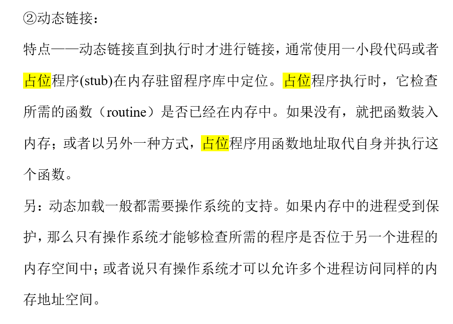
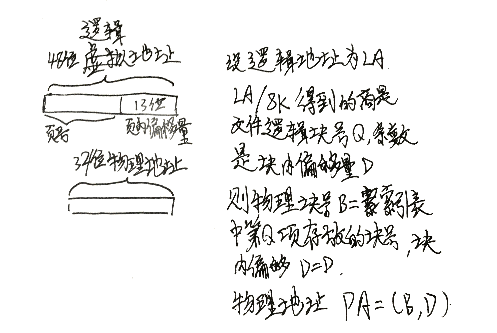

[toc]

# 07年真题答案

## DS

### 1 名词解释

1. 逆波兰表达式：后缀表达式，操作符放在数据后面，方便计算机计算的表达式

2. **自由树**：**自由树**，是一个连通的、无环的无向图。一般情况下，我们提到一个图是树时，会省略掉形容词“自由”。称一个可能不连通的无向无环图为**森林**。许多树的算法对森林也适用。

   https://www.cnblogs.com/mtcnn/p/9421350.html

3. **外部排序**：当欲排序的数据过多时，不能把数据全都加载到内存排序，每次先把一部分数据加载到内存中排序，再归并已经排序的序列，多次排序合并后就能排完了

4. 邻接表：P190，图的一种存储方式，对图中每个顶点i建立一个单链表，顶点i的单链表中的节点表示依附于顶点i的边，结点中存放着边指向的顶点信息。这个单链表被称为**边表**，边表的头指针和顶点的数据信息采用顺序存储（称为顶点表）

5. **占位程序**：

   占位程序是在动态链接的时候用于在内存驻留程序库中定位的程序
   
   

### 2 队列的实现方法

**顺序存储**：

设置头尾指针，在数组中存储队列，其中队满和队空的条件都是r==q

优点：实现简单，直观

缺点：有假溢出现象，造成存储空间的浪费

**循环队列**：

设置头尾指针，也是数组中存储，但是修改了队满和队空的条件，避免假溢出现象。常用的方法有：牺牲一个存储单元，增加size属性，增加tag标记

优点：有效地利用存储空间

缺点：队列长度固定，不能有效的扩容

**链表队列**：

使用链表来存储队列，带头指针，方便的出队入队

优点：符合FIFO特性，队列大小能有效增长

缺点：不能随机访问（感觉这不算是缺点）

**队列的应用**：

在CPU调度中：FCFS算法

在磁盘调度中：FCFS算法

### 3 求有序表的交集

方法有很多种

第一种是直接头插回头结点

设置两个指针，依次比较，碰到相同的就头插

在设置一个尾指针，最后把它指向NULL

不过生成的链表会逆序存放

第二种方式是从尾指针插入，可以保持相对顺序

这里用的是第二种

```c++
typedef struct node {
    int val;
    struct node *next;
} Node, *List;

List func(List A, List B) {
    if (!A || !B)return NULL;
    Node *pa = A->next;
    Node *pb = B->next;
    Node *r = A;
    while (pa && pb) {
        if (pa->val == pb->val) {
            while (r->next != pa) {
                t = r->next;
                r->next = t->next;
                delete t;
            }
            r = pa;
            pa = pa->next;
            pb = pb->next;
        } else if (pa->val < pb->val) pa = pa->next;
        else pb = pb->next;
    }
    return A;
}
```

### 4 合并成一颗二叉排序树

思路也就是在A树中查找B结点

```c++
typedef struct node {
    int val;
    struct node *L;
    struct node *R;
} Node, *Tree;

void func(Tree A, Tree B) {
    if (!B)return;
    Node *left = B->L;
    Node *right = B->R;
    B->L = B->R = NULL;
    insertNode(A, B);
    func(A, B->L);
    func(A, B->R);
}

void insertNode(Tree A, Tree B) {
    if (!A)	A = B;    //查找到了空结点，直接插入
    else if (A->val > B) insertNode(A->L, B);
    else if (A->val < B) insertNode(A->R, B);
    else if (A->val == B) return;
}
```

### 5 有向无环图的最长路径

权值取负值，直接上Floyd，然后遍历找到最小的值，返回负的值即可

```c
void func(Graph G) {
    for (int i = 0; i < n; i++)
        for (int j = 0; j < n; j++)
            A[i][j] = -G[i][j];
    for (int k = 0; k < n; k++)
        for (int i = 0; i < n; i++)
            for (int j = 0; j < n; j++) {
                if (A[i][j] > A[i][k] + A[k][j])
                    A[i][j] = A[i][k] + A[k][j];
            }
    int max = 0;
    for (int i = 0; i < n; i++)
        for (int j = 0; j < n; j++)
            if (A[i][j] < max)
                max = A[i][j];
    return -max;
}
```


## OS

### 6 判断题

1. 对，分时的基础必须要多道程序设计，否则没有办法容纳多个进程，没有中断也无法切换用户

2. 错，程序是指令的集合，进程是程序的运行状态

3. 错，存储保护的功能是防止地址越界

4. 错，位示图适用于表示外存磁盘块的使用情况

### 7 分页管理大题

**第一问**

16G物理内存，48位虚拟地址，每页大小8K字节

一页大小8KB对应$2^{13}$B，页内偏移量为13位，则虚拟地址一共48位，其中13位为页内偏移量，剩下35位为虚拟页号

16G物理内存地址对应34位，每页大小8K字节对应13位，最多有$2^{34}/2^{13}=2^{21}$块，则指针最少应该3Byte，指针大小向上取整为4Byte（为了方便计算使得指针大小为2的n次幂）

则一页可以存放$2^{13}/2^2=2^{11}$个指针，**对应$2^{11}$个页表项**

$2^{11}$个页表项，每个指针4Byte，则占空间$2^{11}*2^2=2^{13}$Byte，最大大小为8KB

1.1 映射过程：



1.2 页表最多的页表项数：**$2^{11}$个页表项**

1.3 页表的最大尺寸：**8KB**


**第二问**

采用多级页表，单级页表可能会需要占用内存中很多连续的空间，而连续空间在内存中往往比较少，当拆分成多级页表后，对内存空间的要求就降低，从而能更高效的存储页表

### 8 文件大题

1. 大文件顺序访问：链接分配

   顺序访问意味着不需要随机访问，而大文件常常要占用很大的空间，使用连续分配没有链接分配效果好

2. 大文件直接访问：Unix inode

   当大文件需要直接访问时，Unix inode是三个中最好的选择

3. 小文件直接访问：连续

   小文件占用空间不大，可以使用连续分配来存储

### 9 虚拟设备

虚拟设备是指通过虚拟技术将一台独占设备虚拟成多台逻辑设备，供多个用户进程同时使用，通过把这种经过虚拟的设备称为虚拟设备。

引入虚拟设备的动机是变独占设备为共享设备，以提高并发，提升系统效率。例如，利用SPOOLing技术把低速的独占设备改造成为高速的共享的虚拟设备，或利用软件方法把共享的设备分割为若干台虚拟设备。

### 10 哲学家PV

(1)

```CQL
semaphore chopstick[5]={0};
semaphore mc=1,mutex=1;
int flag[5]={1,1,1,1,1},mcflag=1;

// 哲学家进程
phi()
{
    while(1)
    {
        p(mutex);
        // 如果左右两边有筷子，修改flag或mcflag变量，拿起筷子进食
        // 否则 当左右筷子和中间筷子能够凑成一对，拿起筷子进食
        if(flag[i]+flag[(i+1)%5]==2){
            flag[i]=flag[(i+1)%5]=0;
            P(chopstick[i]);
            P(chopstick[(i+1)%5]);
            eating...;
            // 吃完后释放资源
            flag[i]=flag[(i+1)%5]=1;
            V(chopstick[i]);
            V(chopstick[(i+1)%5]);
            thinking...;
        }
        else if(flag[i]&&mcflag){
            flag[i]=mcflag=0;
            P(chopstick[i]);
            P(mc);
            eating...;
            flag[i]=mcflag=1;
            V(chopstick[i]);
            V(mc);
            thinking...;
        }
        else if(flag[(i+1)%5]&&mcflag){
            flag[(i+1)%5]=mcflag=0;
            P(chopstick[(i+1)%5]);
            P(mc);
            eating...;
            flag[(i+1)%5]=mcflag=1;
            V(chopstick[i]);
            V(mc);
            thinking...;
        }
        // 释放信号量
        v(mutex);
    }
}
```

 (2)

上述方案中，只有哲学家在三种组合中两根都可用的时候才能拿起
好处就是不会死锁，当哲学家附近有两只可用筷子的时候就能拿起
坏处就是每个进程判断的时间开销大，在代码的最外面加锁，释放资源速度慢