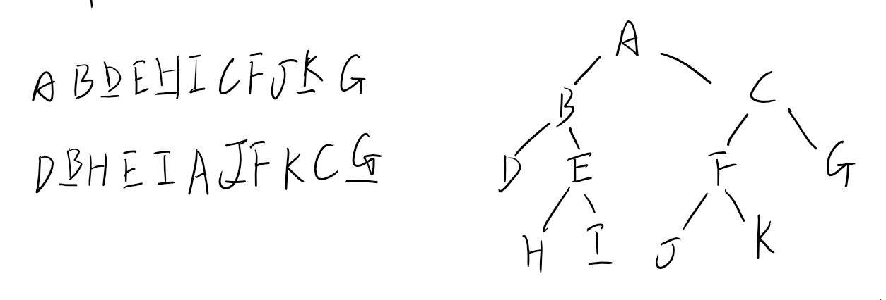

[toc]

# 08年真题答案

## DS

### 1 名词解释

1. 线索二叉树

   链表存储的二叉树有n+1个空链域，为了利用它们，可以使结点的左空链域存放它在中序遍历中的前驱，右空链域存放后继，从而加快查找前驱和后继的速度

2. 堆

   堆分为大顶堆和小顶堆，大顶堆的定义如下：

   1. 当前堆顶的元素比它的左右孩子元素都大
   2. 左右孩子构成的堆也是大顶堆

   通过堆可以方便的取得当前集合里面的最值。取n次最值就是堆排序

3. 邻接矩阵

   图的表示法的一种（邻接矩阵，邻接表）

   二维数组 $G[i][j]=val$表示i到j的路径权值为val。邻接矩阵可以存储有向图和无向图

4. 稳定排序

   稳定是排序算法的一个性质，它是指排序完成后，相等的元素保持着原来序列的相对顺序。

   稳定排序的算法有：冒泡排序，直接插入排序，归并排序，基数排序

5. 析构函数

   某个类的实例被销毁时，会调用此函数完成清理工作，与之相对应的函数有构造函数。

### 2 构造树



### 3 查找算术表达式

```c
bool func(string str) {
    Stack st;
    for (int i = 0; i < str.size(); i++) {
        if (str[i] == '{' || str[i] == '(' || str[i] == '[')
            st.push(str[i]);
        else if (str[i] == '}' || str[i] == ')' || str[i] == ']') {
            switch (str[i]) {
                case '}':
                    if (st.top() != '{')
                        return false;
                    break;
                case ')':
                    if (st.top() != '(')
                        return false;
                    break;
                case ']':
                    if (st.top() != '[')
                        return false;
                    break;
            }
        }
    }
    return true;
}

```

### 4 求最短路径和长度

dijkstra算法求最短路径和长度，长度很好求，最短路径比较麻烦

查了一下这篇文章有讲到最短路径，用Floyd来求的

https://blog.csdn.net/jyl1159131237/article/details/78498013

```C
void Floyd(int dist[][MAXSIZE], int path[][MAXSIZE], int n)   
{   
    int  i, j, k;   
    //初始化path，让起始点直接到达目的点   
    for (i = 0; i<n; i++)    
        for (j = 0; j < n; j++)   
            path[i][j] = -1;   
    for (k = 0; k <n; k++)   
        for (i = 0; i < n; i++)   
            for (j = 0; j < n; j++)   
                //如果发现一条路径比dist[i][j]的距离短，那么就通过那条路径   
                if (dist[i][j] > dist[i][k]+dist[k][j]) {   
                    //path记录i到j通过的顶点  
                    path[i][j] = k; 	
                    dist[i][j] = dist[i][k]+dist[k][j];   
                }   
}  
```

### 5 shell排序

```c++
/* function to sort arr using shellSort */
int shellSort(int arr[], int n) 
{ 
    // Start with a big gap, then reduce the gap 
    for (int gap = n/2; gap > 0; gap /= 2) 
    { 
        // Do a gapped insertion sort for this gap size. 
        // The first gap elements a[0..gap-1] are already in gapped order 
        // keep adding one more element until the entire array is 
        // gap sorted  
        for (int i = gap; i < n; i += 1) 
        { 
            // add a[i] to the elements that have been gap sorted 
            // save a[i] in temp and make a hole at position i 
            int temp = arr[i]; 
  
            // shift earlier gap-sorted elements up until the correct  
            // location for a[i] is found 
            int j;             
            for (j = i; j >= gap && arr[j - gap] > temp; j -= gap) 
                arr[j] = arr[j - gap]; 
              
            //  put temp (the original a[i]) in its correct location 
            arr[j] = temp; 
        } 
    } 
    return 0; 
} 
```


## OS

### 6 判断对错

1. 磁盘访问的最小单位是扇区，OS以扇区为单位存储和读取数据

   对，扇区就是磁盘块

2. 错，特权指令只能在内核态执行

3. 对

4. 编址空间=min(操作系统位数，内外存之和)，32位的操作系统对应4GB的虚存地址

### 7 缺页中断过程

1. 根据逻辑地址得到页号和页内偏移量，判断页号是否越界
2. 查找页表发现缺页，操作系统缺页中断
3. 操作系统根据页面置换算法换入换出页，然后恢复到中断前的指令

硬件中断是设备发出的，如打印机发出中断提示CPU当前的I/O任务已经完成，打印机处于空闲状态

### 8 电子转账

题目不全，答题时从死锁的知识点入手，例如增加信号量机制，破坏死锁产生的条件等