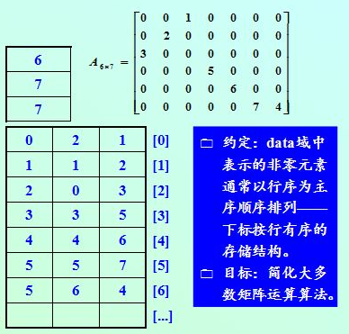
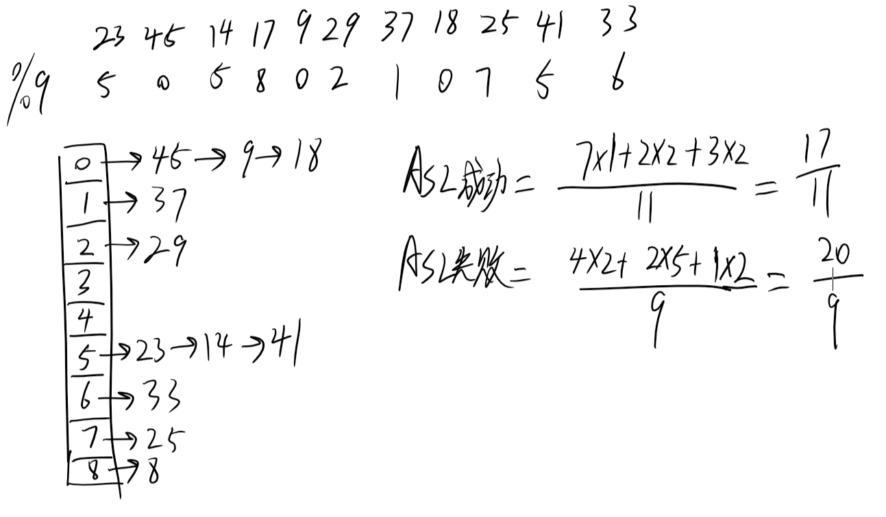
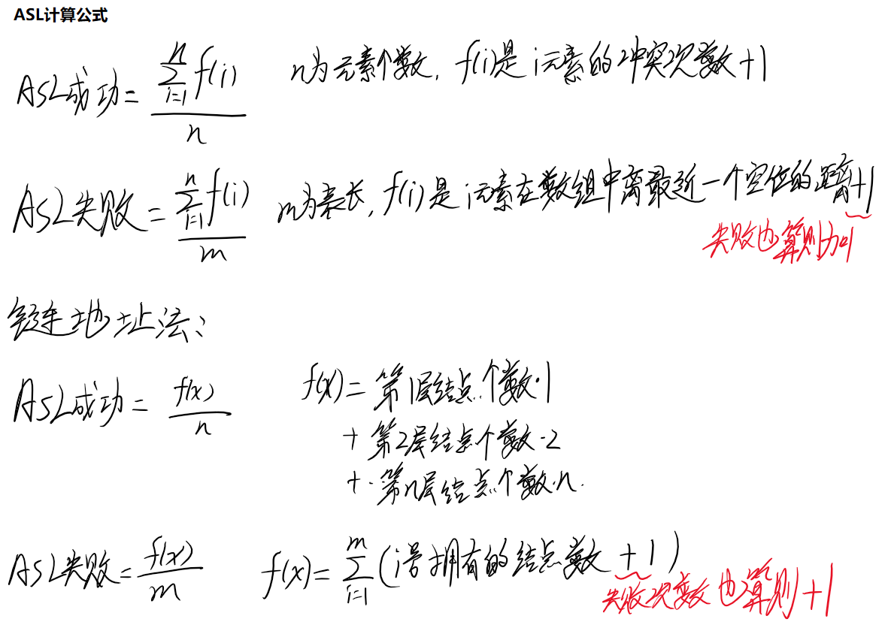

[toc]

# 09年真题答案

这一年只有DS，前面三道大题是软件工程相关的考题，没有参考价值

## DS 

### 4 名词解释

1. 循环队列：为了解决假溢出，从逻辑上把队列的首尾相连，然后更改判断条件来判断队满还是队空

2. 快速排序：每次排序确定一个元素的最终位置，然后根据这个元素的位置划分左右区间继续排序

   ```c
   void quickSort(List L, int left, int right) {
       if (left < right) {
           mid = part(L, left, right);
           quickSort(L, left, mid - 1);
           queckSort(L, mid + 1, right);
       }
   }
   
   int part(List L, int i, int j) {
       int t = L[i];
       while (i < j) {
           while (i < j && L[j] >= t)j--;
           L[i] = L[j];
           while (i < j && ary[i] <= t)i++;
           L[j] = L[j];
       }
       L[i] = t;
       return i;
   }
   ```
   
3. 满二叉树

   高度为h，则拥有$2^h-1$个结点，并且叶子节点都集中在一层。

   完全二叉树

   与满二叉树对应的树，度为1的结点数只有一个

4. 是压缩矩阵中存储点的方式，结构为(i,j,val)，表示i行j列处值为val

   

5. 串的模式匹配是指在串中定位某一子串的起始位置

### 5 hash大题



第一步 先写出所有数字

第二步 取余

第三步 按照取余后的结果分配到链地址中

第四步 计算ASL成功、失败



### 6 链表题

题目意思就是 在循环链表中，给定一个结点指针p，把结点的前驱结点变成后继结点

```c++
typedef struct Node {
    int val;
    Node *next;
} Node, *LinkList;

void func(Node p) {
    Node q = p;
    // 找到P结点前驱的前驱
    while (q->next->next != p)
        q = q->next;
    // p结点的前驱
    Node t = q->next;
    // t指向p的后续
    t->next = p->next;
    // p指向t
    p->next = t;
    // 更新q结点的next指针
    q->next = p;
}
```

### 7 邻接表求每个结点的出度

```c++
typedef struct ArcNode {
    int adjvex;    //边指向的顶点
    struct ArcNode *nextarc;
} ArcNode;
typedef struct VNode {
    int data;//顶点数
    ArcNode *firstarc;    //第一个结点
} VNode, AdjList[MVNum];
typedef struct {
    AdjList vertices;
    int vexnum, arcnum;
} ALGraph;

//求每个结点的出度
int outdegree(ALGraph Graph) {
    //总出度
    int sum = 0;
    ArcNode *tArcNode = NULL;
    //遍历所有点
    for (int i = 0; i < Graph.vecnum; i++) {
        int isum = 0;
        tArcNode = Graph.vertices[i]->firstarc;
        while (tArcNode) {
            sum++;
            isum++;
            tArcNode = tArcNode->next;
        }
        Graph.vertices[i].data = isum;    //每个结点的出度
    }
    return sum;
}

//求每个结点的入度
//思路：遍历邻接表中的结点，取到每个结点的值，+1
int indegree(ALGraph Graph) {
    int sum = 0;
    ArcNode *tArcNode = NULL;
    for (int i = 0; i < Graph.vecnum; i++) {
        tArcNode = Graph.vertices[i]->firstarc;
        while (tArcNode) {
            int inx = tArcNode->adjvex;
            Graph.vertices[inx].data++;    //假设这里data是指inx结点的入度
            sum++;
        }
    }
    return sum;
}
```

### 8 求树的繁茂程度

层次遍历+更新最大层的size

```c
typedef struct node {
    int val;
    struct node *left;
    struct node *right;

    node(int v) {
        val = v;
        left = right = NULL;
    }
} Node, *Tree;


int func(Tree T) {
    if (!T)
        return 0;
    // 高度
    int layer = 0;
    // 各层结点数的最大值
    int size = 0;
    queue<Node *> que;
    que.push(T);
    Node *t = NULL;
    while (!que.empty()) {
        // 对于每一层
        int len = que.size();
        // 更新最大层结点数
        if (len > size)
            size = que.size();
        // 添加结点进入队列
        for (int i = 0; i < len; i++) {
            // 取队首元素
            t = que.front();
            // 弹出队首元素
            que.pop();
            if (t->left)que.push(t->left);
            if (t->right)que.push(t->right);
        }
        // 更新树高
        layer++;
    }

    return size * layer;
}
```
补充：

层次遍历统计结点数和高度的代码

```cpp
// 统计这棵树的结点数
int countNodeNum(Tree T) {
    if (!T)
        return 0;
    int num = 0;

    queue<Node *> que;
    que.push(T);
    Node *t = NULL;
    while (!que.empty()) {
        // 添加结点进入队列
        t = que.front();
        que.pop();
        if (t->left)que.push(t->left);
        if (t->right)que.push(t->right);
        // 更新这棵树的高度
        num++;
    }
    return num;
}

// 统计这棵树的高度(层次)
int countTreeLayer(Tree T) {
    if (!T)
        return 0;
    int layer = 0;

    queue<Node *> que;
    que.push(T);

    Node *t = NULL;
    while (!que.empty()) {
        int len = que.size();
        for (int i = 0; i < len; i++) {
            // 添加结点进入队列
            t = que.front();
            que.pop();
            if (t->left)que.push(t->left);
            if (t->right)que.push(t->right);
        }

        // 更新这棵树的高度
        layer++;
    }
    return layer;
}
```
