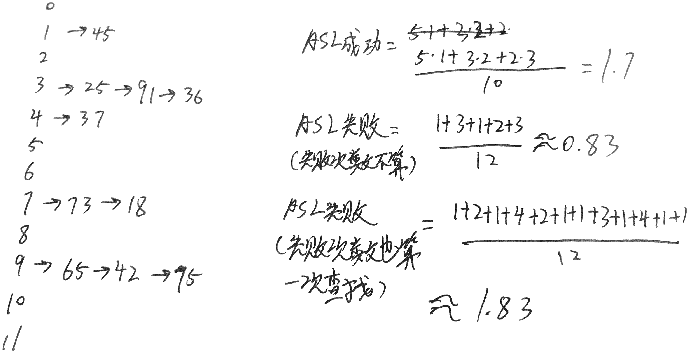
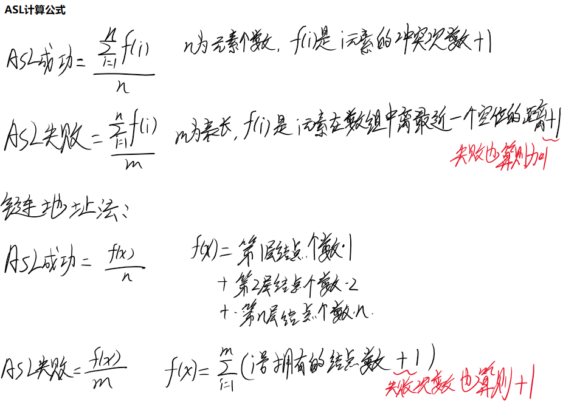

[toc]

# 12版本2-答案

## DS

### 1 简答

**连通分量**

- 无向图的**极大连通子图**称为连通分量，连通分量具有以下特性
  - 它是图的子图
  - 连通分量是连通的
  - 连通子图里面含有极大顶点数
  - 含有依附于这些顶点的所有边

**最小生成树**

- **最小生成树**是一个连通加权无向图中一棵权值最小的生成树，它具有以下性质
  - 包含图中所有顶点
  - n个顶点具有n-1条边
  - 一个图中最小生成树的形状可能有很多，但是它们的权值是相同的

**堆排序**

- 堆排序利用特殊数据结构**堆**来进行排序
  - 堆有最大堆、最小堆之分，堆是一颗二叉树，以最大堆为例，它的定义是当前结点的值大于左右孩子结点的值，同时左右子树也是堆
  - 利用堆的性质，将待排序的数列构造成堆，每次弹出堆顶元素并调整，重复n次操作后即可获取有序的数列

**双端队列**

- 双端队列是两边都可以插入、删除的队列

**稀疏矩阵的压缩存储方法**

- 稀疏矩阵是指矩阵元素大部分为0的矩阵，由于其稀疏的特性，可以用特定的数据结构标记矩阵中非零元素，节省空间
- 常见的存储方法有
  - 三元组顺序表
  - 行逻辑连接的顺序表
  - 十字链表

### 2 散列

注，HT[12]表示空间大小12，下标0~11，**散列函数取余数p一般取小于等于空间大小的最大素数**，这里12不是素数，最大的素数是11，**应该取p=11进行散列**

| key    | 37   | 65   | 25   | 73   | 42   | 91   | 45   | 36   | 18   | 75   |
| ------ | ---- | ---- | ---- | ---- | ---- | ---- | ---- | ---- | ---- | ---- |
| key%11 | 4    | 9    | 3    | 7    | 9    | 3    | 1    | 3    | 7    | 9    |




补充：ASL计算公式



### 3 链表模拟

不带头结点的单链表

```C
// i>0 
List func(List head,int i){
	// 不失一般性，手动加上一个前驱结点
	Node* H = new Node(-1);
	H->next = head; 
	// pre是第i号结点的前驱 
	Node* pre = H;
	// p指向第i号结点 
	Node* p = pre->next;
	i-=1;
	while(i!=0 && p){
		pre = pre->next;
		p = p->next;
		i-=1;	
	}
	if(!p->next){
		// i越界，不交换 
		return H->next;
	}
	
	Node* q = p->next; 
	pre->next = q;
	p->next = q->next;
	q->next = p; 	

	return H->next;
}
```


### 4 创建平衡的二叉查找树

要求平衡，我们按照递归的思想构造

1. 取得当前序列的中间数A[mid]，生成头结点
2. 传递left...mid构造头结点的左子树
3. 传递mid...right构造头结点的右子树

```c
typedef struct Node{
 	int val;
    Node* left;
    Node* right;
    Node(int v){
        val = v;
        left = right = NULL;
    }
}

// 调用入口
Tree func(int A[],int n){
	if(!A)
        return NULL;
    return helper(A,0,n-1);
}

Tree helper(int A[],int left, int right){
    if(left>right){
        return NULL;
    }
    int mid = (left+right)/2;
    Node* root = new Node(A[mid]);
    root->left = helper(A,left,mid-1);
    root->right = helper(A,mid+1,right);
    return root;
}
```

注意按照这种方法生成的树和我们手动插入、调整生成的树不相同，但是上述方法能够保持平衡和二叉查找树的性质

## OS

### 5 名词解释

**内碎片**

- 内碎片是指分配给进程的内存空间中没有利用到的内存

**补充：**

- 可能出现内碎片的分配方式有
  - 单一连续分配
  - 固定分区分配
  - 分页式分配
  - 段页式分配

**微内核**

- 微内核，是一种[内核](https://zh.wikipedia.org/wiki/内核)的设计架构，由尽可能精简的[程序](https://zh.wikipedia.org/wiki/程式)所组成，以实现一个[操作系统](https://zh.wikipedia.org/wiki/作業系統)所需要的最基本功能，包括了底层的[寻址空间](https://zh.wikipedia.org/wiki/定址空間)管理、[线程](https://zh.wikipedia.org/wiki/執行緒)管理、与[进程间通信](https://zh.wikipedia.org/wiki/进程间通讯)。
- 微内核中只存放支撑系统运行必要的功能和数据，将系统服务分离出来
- 微内核的优点是提高了系统的可扩展性、可靠性，缺点是略微的降低了操作系统的运行效率

**中级调度**

- 又称内存调度，面向进程，当内存空间不足时，OS会把暂时不能运行的进程调至外存等待，此时的进程称为挂起态，注意这个时候进程映像被调至外存，但是进程的PCB仍然存在于内存中

**用户级线程**

- 用户级线程是指不需要内核支持而在用户程序中实现的线程，它的内核的切换是由用户态程序自己控制内核的切换，不需要内核的干涉。但是它不能像内核级线程一样更好的运用多核CPU

- 优点：

  （1） 线程的调度不需要内核直接参与，控制简单。

  （2） 可以在不支持线程的操作系统中实现。

- 缺点：

  （1） 一个用户级线程的阻塞将会引起整个进程的阻塞。

  （2） 用户级线程不能利用系统的多重处理，仅有一个用户级线程可以被执行。

**死锁**

- 死锁是指两个或两个以上的进程在执行过程中，由于竞争资源或者由于彼此通信而造成的一种阻塞的现象，若无外力作用，它们都将无法推进下去。此时称系统处于死锁状态或系统产生了死锁，这些永远在互相等待的进程称为死锁进程


### 6 分页系统相关

地址转换：逻辑地址到物理地址的转换，需要重定位寄存器等硬件的支持
缺页率：指的是访问页面失败次数除以进程页面访问总次数，设访问成功次次数为S，访问失败次数为F，访问总次数A=S+F，缺页率f=F/A
内存分配策略：将内存分配为固定大小的分区，称为页框或页帧

核心问题是内存分配策略，如何选择页框大小很重要，因为这关系到缺页率和地址转换的实现，如果页框过小，那么进程会被分割为很多页，使得进程里一些本来应该在一起的资源（代码、数据等）分开，如果页框过大，那么会导致页框总数不足，导致更频繁的缺页（极端情况下内存只有一页）

理想的解决方案应该是预估需要装入的进程大小，设计合理的页框大小

### 7 PV

规定顺序pv即可

S1等待缓冲区为空直接发出去就行了，然后V提示S2S3S4取消息，接着维护一个int count,count=3的时候就清空缓冲区，置count等于0就行了，注意修改变量要加count


### 8 I/O次数

>  10块，FCB和索引表都在内存中，问连续、链接（显式、隐式）、单级索引三种分配方式。假设FAT也在内存中

1）

- 连续分配：
  这里读入FCB，然后修改FCB的首块地址为第一块即可，不需要移动
  **0次I/O**

- 显式链接分配：

  读入FAT，修改FAT中该文件的首块指针，保存FAT

  **共0次I/0**

- 隐式链接分配：
  读入FCB得到首块磁盘地址，读入第0块磁盘得到其指向下一块地址的指针，修改FCB为第一块的地址
  **1次I/O** 

- 索引分配：
  读入FCB，读入索引表，修改索引表
  **0次I/O**

2）

题目说的是**添加**，如果此时不需要往新盘块写入数据，那么只需要修改指针、FCB等表示出这里有一块新盘块即可。

- 连续分配：
  读入FCB得到首块磁盘地址和长度信息，修改FCB中的长度信息+1，表示添加了一块新盘块，保存FCB

  **0次I/O**

- 显式链接分配：

  读入FAT，找到该文件最后一个指针和一个空闲磁盘块，修改FAT表中的指针链接指向新的空闲磁盘块表示添加一块磁盘块，保存FAT表

  **0次I/0** （假设FAT在内存中） 

  **2次I/0** （假设FAT不在内存中，读入一次，写回一次） 

- 隐式链接分配：
  **FCB是带有首尾地址的**，在结尾处添加直接访问最后一块的地址，修改其指针指向一块空闲块，修改FCB，将旧块FCB写回内存即可
  一共是读旧尾块，修改旧尾块指针，写回旧尾块
  一共**1+1=2次I/O**

- 索引分配：
  读入FCB，读入索引表，修改索引表
  **0次I/O**

如果是**写入**，那么我们添加的时候要一次I/O写入新数据

- 连续分配：
  读入FCB得到首块磁盘地址和长度信息，然后在最末尾写入一个磁盘块，修改FCB

  **1次I/O**

- 显式链接分配：

  读入FAT，找到该文件最后一个指针和一个空闲磁盘块，写入磁盘块，修改FAT表中的指针链接，保存FAT表

  **1次I/0** （假设FAT在内存中）

  **3次I/O** （假设FAT不在内存中，读入FAT、写入磁盘块，在内存中修改FAT，保存FAT）

- 隐式链接分配：
  **FCB是带有首尾地址的**，在结尾处添加直接访问最后一块的地址，然后写入新块，修改其指针指向新块,修改FCB，将旧块FCB写回内存即可
  一共是读旧尾块，写新尾块，修改旧尾块指针，写回旧尾块
  一共**1+1+1=3次I/O**

- 索引分配：
  读入FCB，读入索引表，写入磁盘，修改索引表
  **1次I/O**

3)

1. 文件结尾处删除一块磁盘

- 连续分配：
  读入FCB然后修改FCB中length信息即可
  **0次I/O**

- 显式链接分配：

  读入FAT，修改FAT表中的指针链接，保存FAT表

  **0次I/0**

- 隐式链接分配：
  读入FCB得到首块地址，读入前0~8前9块磁盘块，然后修改第8块磁盘块指针指为NULL，写回第8块
  **共9+1=10次I/O**

- 索引分配：
  读入FCB，读入索引表，然后修改索引表即可
  **0次I/O**


注：此题与MOOC操作系统课程的第十一章文件系统实现补充作业类似


### 9 简答题

题目中出现多核、CPU、操作系统、计算等名词，由此联想到多线程、并行、任务调度等知识，从这方面入手

**答案：**

想要适应现代的多核环境，操作系统可以从以下方面优化：

- 合理的任务调度机制和策略，充分的利用多核心的计算能力
- 安全的内存保护、临界资源保护，因为在多核的环境下，计算机的存储区可能会被多个核心访问，对内存的访问可能会成为操作系统性能的瓶颈
- 合理的安排任务处理，让多个核心合作推进任务，而不是让单核处理任务，其它核心空闲

