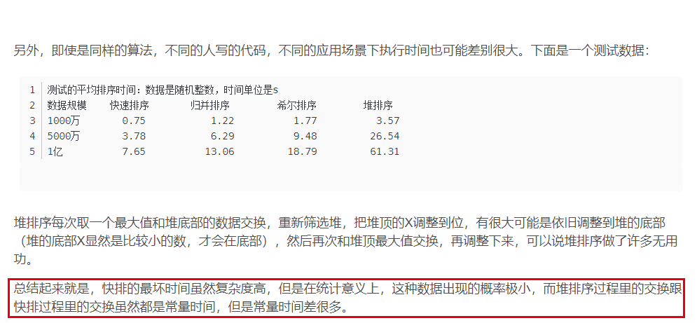

[TOC]

# 15年真题答案

## DS

### 1 判断题

1. 错误，第一个元素是100，第50个元素是51

2. 对

3. 错误，很容易举出一个反例

4. 正确

5. 错误，最小生成树的权值一定，但形态不一定，所以不有一颗生成树

   注：树和二叉树的区别是，二叉树可以是空树

### 2 堆排序相关

堆排序的算法思想：维护一个最大最小堆，依次取出堆顶元素并把最后一个元素放到堆顶，然后调整堆，重复上述步骤直到取出所有数，此时排序完成。

与快排相比的优势：当所输入的元素基本有序时，快排会退化，而堆排序不会，并且堆排的辅助空间是$O(1)$，但是快排的辅助空间是$O(logn)到O(n)$。明显堆排序最好啊

与归并相比的优势：归并排序的空间复杂度是O(n)，但是堆排的辅助空间是O(1)

选k个最大数，明显是堆

排序比较的博文 https://blog.csdn.net/qq_39521554/article/details/79364718

下面的比较只是扩展知识：




### 3 递归数组构建完全二叉树

这道题记住公式就好了，vt[i]是根节点，则$vt[2*i+1]$和$vt[2*i+2]$分别是左孩子和右孩子

```c
Node *func(int a[], int n) {
    if (i > n)return NULL;
    if (a[i] == -1)return NULL;
    Node *T = new Node;
    T->val = a[i];
    T->left = func(a, 2 * i + 1);
    T->right = func(a, 2 * i + 2);
}
```

### 4 双向链表求x=a+b

two point思想

```c
typedef struct node {
    int val;
    struct node *next;
    struct node *pre;
} node, *List;

//假设A不带头节点的非循环双向链表,A递增有序
void func(List A, int x) {
    if (!A) {
        printf("error");
        return;
    }
    node *p = A;
    node *q = A的尾结点；
    while (p && q && q != p) {
        int vp = p->val;
        int vq = q->val;
        if ((vp + vq) == x) {
            printf("x=%d+%d", vp, vq);
            return;
        } else if ((vp + vq) > x) {
            q = q->pre;
        } else if ((vp + vq) < x) {
            p = p->next;
        }
    }
    //特判是否相同结点的两个值是否等于x
    if (p && q && p->val + q->val == x)
        printf("%d=%d+%d",)
}
```

### 5 两个顺序表的中间值

测试了一些样例发现没有问题

```c
const int M = 100;
typedef struct list {
    int ary[M];
    int size;
} list, *List;

int func(List A, List B) {
    if (!A && !B)return -1;
    int n = A->size + B->size;
    if (n % 2 != 0)n = n / 2 + 1;
    else n /= 2;
    int ai = 0;
    int bi = 0;
    int i = 0;
    int midV = -1;
    while (i < n && ai < A->size && bi < B->size) {
        if (A->ary[ai] <= B->ary[bi]) {
            midV = A->ary[ai++];
        } else midV = B->ary[bi++];
        i++;
    }
    while (i < n && ai < A->size)midV = A->ary[ai++];
    while (i < n && bi < B->size)midV = B->ary[bi++];
    return midV;
}

int main() {
    List A = new list;
    List B = new list;
    A->size = 0;
    B->size = 0;
    for (int i = 1; i <= 7; i++) {
        if ((i % 2) == 0)
            A->ary[A->size++] = i;
        else
            B->ary[B->size++] = i;
    }
    printf("%d", func(A, B));
}
```


## OS

### 6 判断题

1. 错误，进程可以被挂起，调出内存(作业调度)
2. 正确
3. 错误，其实只有SSTF会饥饿（但SSTF性能很诱人）SCAN,C-SCAN都不会
4. 错误，当缺页频繁时，增加进程数反而会降低内存的利用率
5. 错误，引入TLB减少平均访问时间

### 7 分页管理综合题

1. 1GB=$2^{30}B$，一页大小$2^{12}B$ 一共有$2^{18}$页，一页大小$2^{12}$，一共要18+12=30位表示

2. $2^{18}$页

3. 12位

4. 页号为3，对568页框，偏移为1

   $568*1024*4+1$再转换成16进制=2326529=00068001H

   直接乘得到数字也可以

5. $2^{18}$页要用$2^{18}bit$来表示，$2^{18}bit=2^{15}Byte=2^5KB=32KB$

### 8 进程调度题 与18年第2题类似

周转时间是完成时间-到达时间

响应时间是系统第一次响应时间-到达时间

优先数相同时，在执行的进程继续执行，可以计算出12243311355


### 9 PV操作

```c
semaphone flag[n]={0};
semaphone mutex=1,empty=1;
int count=0;
B(){
    while(1)
    {
        p(empty);
        p(mutex);
        send message...
        for(int i=0;i<n;i++)
        {
			V(flag[i]);
        }
        v(mutex);
    }
}
Ai()
{
    p(flag[i]);
    p(mutex);
    get message...;
    count++;
    if(count==n)
    {
        count=0;
        v(empty);
    }
    v(mutex);
    
}
```

### 10 文件系统混合题

注意一个汉字大小为一个字（word），一个字大小为2Byte

1条记录里面有

| 姓名 | 年龄 | 家庭地址 | 身份证号 | 性别 |
| ---- | ---- | -------- | -------- | ---- |
| 8B   | 1B   | 256B     | 18B      | 1B   |

一条数据约284B

1百万条记录，首先是大文件了，排除分配方式中的连续分配（大文件不要用连续分配），排除逻辑分配中的直接文件（这里记录不等长并且直接文件所占的空间最大)

访问效率高，排除逻辑文件中的连续文件

那么逻辑文件最好用索引顺序文件，通过按首字母分组来存放记录，然后索引表可以用二分查找法，

用一个索引表来指向对应的每条记录

物理文件的分配方式最好用索引分配，两者配合能达到最好的性能。

文件的组织形式是结构文件，数据拆分成多条记录存放，每条记录约为284B，两条记录约为512B，假设磁盘块大小4KB，则每个磁盘块可以存放8条记录。

25万个磁盘块，一块4KB，**共100万个磁盘块**，也就是10^7*4KB约为4GB大小

访问安娜，平均的磁盘数就是（1+100万）/2个磁盘块数

也就是1+最大的磁盘块数/2

优点：支持直接访问，访问效率高，访问时读取数据的所花的时间少

缺点：引入了索引表和指针，占用了额外的存储空间，增加了存储文件的复杂度