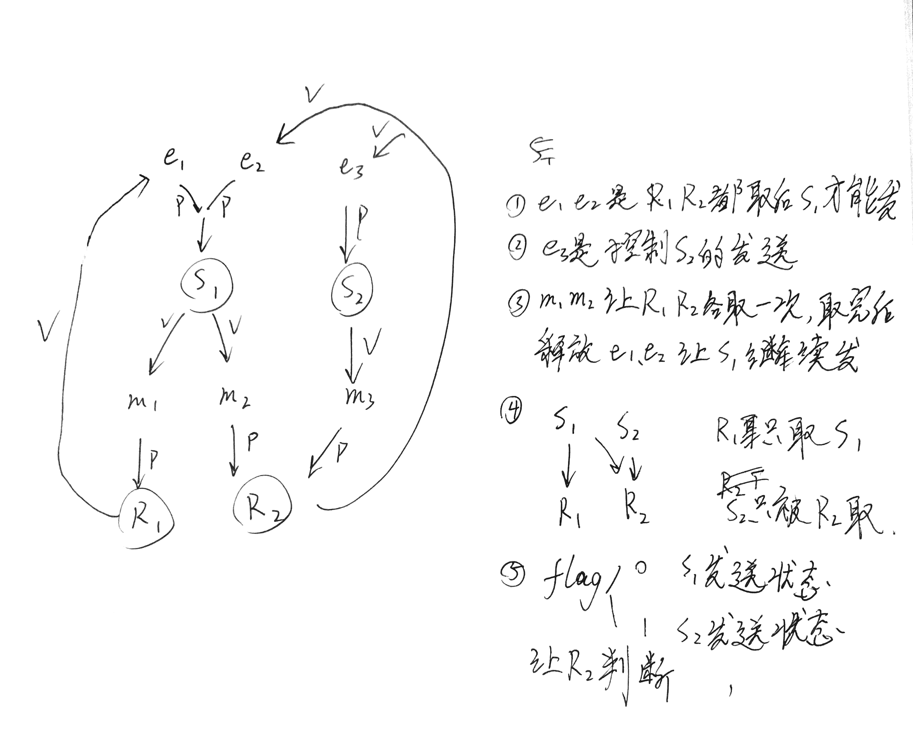

[TOC]

# 16年真题答案

## DS

### 1 hash概念题

20版王道 P263

哈希函数：一个把查找表的关键字映射成该关键字对应的地址的函数，形式为$H(key)=Addr$。

哈希查找：根据哈希函数并结合冲突解决方法在已经构造的哈希表中查找关键字的一种查找方法

解决冲突的方法有

1.开放定址法:顺序散列法，平方探测散列法，再散列法，链地址法等。

2.链地址法

顺序：1，2，3，...m-1

平方探测法: $1^2,-(1^2),2^2,-(2^2)...$

再散列法：两个hash函数[hash1(key)+i*hash2(key)]%m

影响算法的性能有哈希函数的选取，解决冲突的方法，装填因子

不合适的hash函数解决冲突方法会导致冲突次数增加

装填因子=表中记录数/表长 装填因子越大，冲突可能性越大

### 2 查找树相关

二叉查找树是指这颗树的根节点大于它的左孩子同时小于它的右孩子，其左右孩子同样也是二叉查找树。
AVL树是带有平衡属性的二叉查找树，其任意一个结点左右孩子的高度之差不超过1。

标准定义：二叉查找树要么是一个空树，要么是具有以下性质的树

1：若左子树非空，则左子树的结点的关键字都小于当前节点的关键字

2：若右子树非空，则右子树的结点的关键字都大于当前节点的关键字

3：左右子树同时也是二叉查找树

50，40，30，60，70，10，20，80

​			       40

​		  20 		    60

​	10	   30     50 	70

​					                   80

### 3 链表去重

大概有几种方法：用辅助空间；先排序A，再加入B；每次插入B之前判断B有没有重复元素。链表排序反而写得复杂了，可以用最后一种方法写

```c
typedef struct node {
    int val;
    struct node *next;
} Node, *List;

// 1 用辅助空间
void func(List A, List B) {
    // M是A里面最大元素的值，此处省去寻找M的步骤
    // 开M空间，flag[i]表示i元素出现过的次数
    int flag[M] = {0};
    Node *pa = A->next;
    Node *pb = B;
    while (pa) {
        if (!flag[pa->val]) {
            flag[pa->val] = 1;
            Node *t = new Node;
            t->val = pa->val;
            t->next = NULL;
            pb->next = t;
            pb = t;
        }
        pa = pa->next;
    }
}

// 2 插入前判断
// 2 插入前判断
void func(List A, List B) {
    if (!A)
        return;
    Node *p = A->next;
    Node *tail = B;
    while (p) {
        int v = p->val
        Node *t = B->next;
        bool flag = true;
        while (t) {
            if (t->val == v) {
                flag = false;
                break;
            }
            t = t->next;
        }
        if (flag) {
            Node *n = new Node(v);
            n->next = tail->next;
            tail->next = n;
            tail = n;
        }
        p = p->next;
    }
}

```

### 4 dp,最大子序和 

DP首先自己要能推出来状态转移方程，不然没办法往下做的。时间复杂度$O(n)$。

dp[i]表示第i个数位置，最小的子序和，最后还要遍历一下dp[i]取出最小值

对于序列中第$i$个数，假设$dp[i-1]$是第i-1个元素位置的最小子序和，那么dp[i]只有两种可能

- dp[i-1]+a[i]，意味从dp[i-1]已经计算出的结果上选择当前第i个数
- a[i]，意味着只选择第i个数是最小的子序，例如 1 2 -6 7 ，dp[2]此时等于-6

由上推导出状态转移方程，$dp[i]=min(dp[i - 1] + a[i], a[i])$

```CQL
int func(int a[], int n) {
    int dp[n] = {0};
    dp[0] = a[0];
    for (int i = 1; i < n; i++) {
        dp[i] = min(dp[i - 1] + a[i], a[i]);
    }
    int minx = 0;
    for (int i = 0; i < n; i++)
        if (dp[i] < minx)
            minx = dp[i];
    return minx;
}
```

还有一个算法叫联机算法，大意是，如果选了某个数使得当前区间和大于0，则不选这个数。可以模拟一下，查看temp的变化，体会下算法的思想。时间复杂度仍然是$O(n)$

```c++
int func(int a[], int length) {
    int min = 0, temp = 0;
    for (int i = 0; i < length; i++) {
        temp = temp + a[i];
        if (temp > 0) {
            temp = 0;
        } else {
            if (temp < min)
                min = temp;
        }
    }
    return min;
}
```

当然还有暴力方法，从当前数到最后一个数判断累加值，时间复杂度$O(n^2)$。

```c++
int func(int a[], int length) {
    int min = a[0];
    for (int i = 0; i < length; i++) {
        int sum = 0;
        for (int j = i; j < length; j++) {
            sum += a[j];
            if (sum < min)
                min = sum;
        }
    }
    return min;
}
```

### 5 二叉树形态

一般这种求形态的都是卡特兰数

前几个序列是1 1 2 5 14，凡是符合这个规律的序列，都可以带这个公式算，比如栈的合法出栈可能数等

通项公式最好记一下：

$a_n=\frac{C^n_{2n}}{n+1}$	

下面是求卡特兰数的递推做法

```c
unsigned long long catalan(int n)
{
    unsigned long long cn = 1;
    int i;
 
    for(i=1; i<=n; i++)
        cn = (4 * i - 2) * cn / (i + 1);
 
    return cn;
}
```

如果不会卡特兰数的话，这道题可以直接递归求形态，需要推导一下

设f(n)是求n个结点的二叉树形态数，则$f(0)=f(1)=1$

n=2时，固定根节点，考虑左右子树，共有两种可能，$f(2)=f(1)+f(1)=2$

n=3时，固定根节点，考虑左右子树，共有三种可能，$f(3)=f(2)*f(0)+f(1)*f(1)+f(0)*f(2)=5$

归纳得知，$f(n)=f(n-1)*f(0)+f(n-2)*f(1)+...+f(0)f(n-1)$

可写出代码

```c++
int func(int n){
	if(n<0)
		return -1;
	if(n<2)
        return 1;
    int ans=0;
    if(n>=2){
        for(int k=n-1;k>=0;k--)
            ans+=func(k)*func(n-k-1);
    }
    return ans;
}
```

## OS

### 6 判断题

1. 对


1. 错，AC分别于B互斥执行就行了

2. 错，单一连续和段页式都存在内部碎片

3. 错，2^32/2^9=2^23块，需要2^23bit，2^23/2^3=2^20B=1MBa

4. 对

5. 错，层次结构

6. 错，用户级线程对内核不可见，当一个用户级线程阻塞时，该进程下的所有线程都会阻塞，此时就浪费了性能。应该考虑用内核级线程，或者组合方式
   P37。多对一，一对一，多对多

7. 错，永远不会发生死锁，可以证明

8. 对，SPOOLing在内存中开辟缓冲池，在磁盘中开辟输入输出井。

   输入：输入设备首先通过内存中的输入缓冲池输入到输入井中，当CPU需要数据的时候输入井就输入数据到内存中的输入缓冲池，CPU再取内存中的缓冲池

   输出：CPU首先把输出数据通过内存中的输出缓冲池输入到输出井中，当设备空闲时，输出井再把数据输入到输出缓冲池供设备读取。

9. 错，发生7次缺页

### 7 内存管理+磁盘管理

1. 一级页表，$100+100=200ns$

2. 平均寻道时间$5ms$，延迟时间$1/240s=25/6ms$，传输时间$2^2/2^{17}=1/2^{15}s=1000/2^{15}ms$，控制开销时间0.1ms

   总时间$T=5+25/6+1000/2^{15}+0.1 ms$

   延迟时间通过RPM计算，王道书上有计算公式，传输时间根据题目条件计算（磁盘块大小/传输速度），这里题目是1Gb/s，需要转换成1GB/s(看清题目是Gb还是GB)

3. 王道版本：$0.99*(200)+0.01*(100+0.8*(T)+0.2*(T+T)+100+100)$,其中x是第二问的答案

   MOOC版本：$0.99*(200)+0.01*(100+0.8*(T)+0.2*(T+T)+100)$，更新后直接访存

   注意发生缺页时，如果页面被修改，要访问磁盘两次，第一次将修改过的页写入磁盘，第二次将置换的页写入内存
   如果没有被修改，则直接把要置换的页写入内存即可，只访问一次磁盘

### 8 文件系统设计

目录结构，逻辑结构，物理结构

目录结构树形目录
FCB分解为索引指针和索引结点，索引结点存放在外存
逻辑结构：索引结构
物理结构：索引分配

树形目录节约磁盘空间，
逻辑结构拆分为索引结构，支持随机访问，同时记录可以连续存放，节约空间
物理结构使用索引分配，在需要少量空间存储索引表的情况下，检索速度快

### 9 PV操作



R1->S1

R2->S1 S2

```c
semaphore e1=e2=e3=1;
semaphone m1=m2=m3=0;
int flag[2]={0,0};
S1(){
    P(e1);
    P(e2);
   	send...;
    flag[0]=1;
    V(m1);
    V(m2);
}
S2(){
    P(e3);
    send...;
    flag[1]=1;
    V(m3);
}
R1(){
    P(m1);
    get s1 message...;
    if(!flag[0] && !flag[1]){
        clear s1 message...;
    }
    V(e1);
    
}
R2(){
	if(flag[1]){
        P(m3);
        flag[1]=0;
        get s2 message...;
        clear s2 message...;
        v(e3);
    }
    if(flag[0]){
        P(m2);
        get s1 message;
        flag[0]=0;
        V(e2);
    }
    if(!flag[0] && !flag[1]){
        clear s1 message...;
    }
}
```

