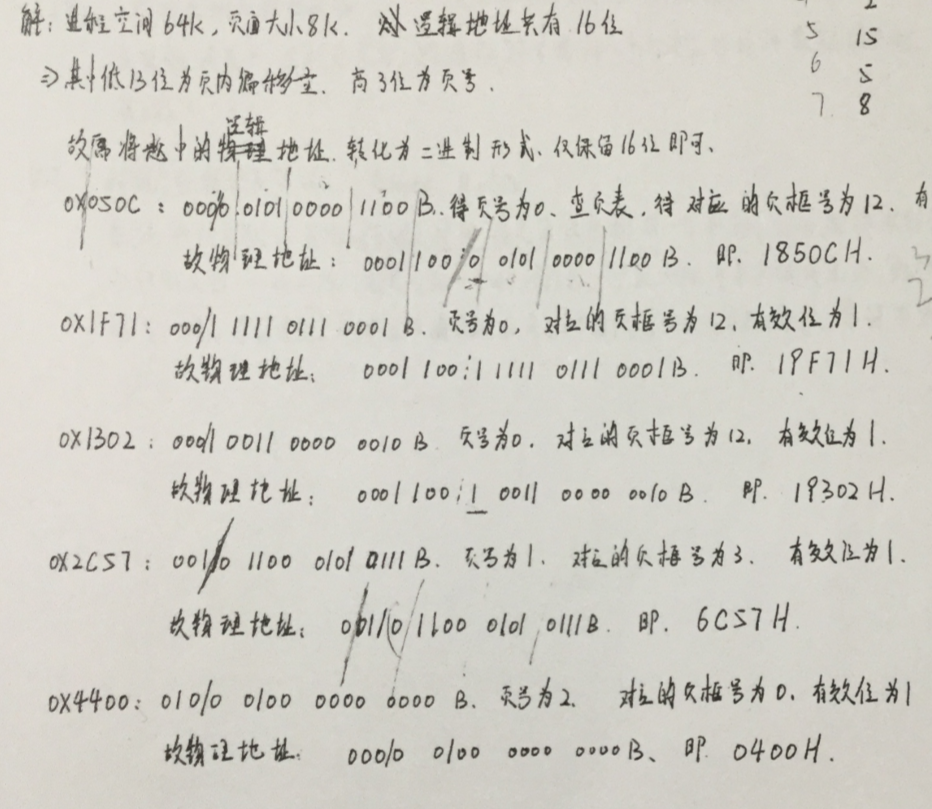

[TOC]

# 17年真题答案

## DS

### 1

加快之后就不用不用判越不越界了，相当于少了一个if，单链表由于加入少哨兵已经需要遍历整个链表到表尾，所以增加哨兵对单链表来说并不能加快查找速度。代码如下

```c
int func(int a[], int x) {
    for (int i = 0; i < n; i++)
        if (a[i] == x)
            return i;
    return -1;
}

int func2(int a[], int x) {
    //添加临时的x后，a[n]一定是x
    for (int i = 0; a[i] != x; i++);
    return i;
}
```

### 2 基数排序


### 3 递归求一个特殊数列中最小的100个数

1生成的数列，只要这个数能被2，3，5整除为1，那么他一定在这个数列中

```c
bool inL(int n) {
    if (n == 1)return 1;
    if (n % 2 == 0)return inL(n / 2);
    if (n % 3 == 0)return inL(n / 3);
    if (n % 5 == 0)return inL(n / 5);
    return 0;
}

// 函数入口，i为需要寻找的数量
void func(int i) {
    int n = 1;	//n从1开始判断是否在数列中
    while (i) {
        // 如果在该数列中
        if (inL(n)) {
            cout << n << " ";
            i--;
        }
        n++;
    }
} 
```

### 4 特殊二叉排序树查找第K大数

是找第K大个数，比如1，2，3，4，5，那么第1大就是5，第2大就是4，第5大就是1

```c
typedef struct node {
    int val;
    struct node *left;
    struct node *right;
    int rsize;
} node, *Tree;

node func(Tree T, int k) {
    if (!T)return NULL;
    if (T->rsize == k)return T;
    else if (T->rsize > K)return func(T->right, k);
    else if (T->rsize < k)return func(T->left, k - T->rsize);
}
```

拓展：

剑指 Offer 54. 二叉搜索树的第k大节点 https://leetcode-cn.com/problems/er-cha-sou-suo-shu-de-di-kda-jie-dian-lcof/

给定一棵二叉搜索树，请找出其中第k大的节点。
这道题和考研题十分类似，值得一做，下面是通过后的python代码

**方法一**

首先输入是一颗二叉搜索树，满足左小右大的定义，输入数据k不会越界
观察规律发现，如果k=1并且当前节点没有右孩子时，当前根节点就是要找的结点 —— 边界情况
继续观察，设lnum为根节点左子树结点个数，rnum为根节点右子树结点个数，那么当k-rnum==1时，当前结点就是要找的结点 —— 一般情况
根据一般情况推导，我们发现k-rnum还有另外两种可能

> k - rnum < 1 —— 意味着我们要往右子树寻找
> k - rnum > 1 —— 意味着我们要往左子树寻找

回到实际意义
k - rnum小于1的时候，表示右子树结点个数足够多，我们要找的结点存在于右子树
k - rnum大于1的时候，表示右子树结点个数不够多，我们要找的结点存在于左子树，例如k=8，rnum=5的时候，明显此时右子树没有符合的结点，应该往左子树走

目前为止我们有了边界情况、一般情况下的三种状态，现在我们还需要完善另外两种状态的处理

1. 当我们往右子树走的时候，k不需要改变，因为右子树此时必然存在目标结点，并且在递归过程中总会满足 k-rnum==1 这个状态，所以能找到目标结点
2. 当我们往左子树走的时候，k需要改变大小，因为我们往左子树走的过程中，相当于构造一颗新树，这颗新树是当前树舍去根结点和右子树形成的，此时我们相当于递归找第k-rnum-1个结点

方法一的伪代码

```python
void func(Tree T,int k){
	// 1 边界情况
	如果k==1并且T->right==null,返回T->val
	否则		// 2 一般情况
	获得右子树的结点数rnum
	val = k - rnum
	if val == 1:
		返回T->val	// 2.1
	else if val>1:
		return func(T->left,val-1);	// 2.2
	else:
		return func(T->right,k);	// 2.3
}
```

代码

```python
# Definition for a binary tree node.
# class TreeNode:
#     def __init__(self, x):
#         self.val = x
#         self.left = None
#         self.right = None

class Solution:
    def kthLargest(self, root: TreeNode, k: int) -> int:
        # 边界情况
        if k==1 and not root.right:
            return root.val
        
        rnum = self.getNum(root.right)
        val = k-rnum
        if val == 1:
            return root.val
        elif val > 1:
            return self.kthLargest(root.left,val-1)
        else:
            return self.kthLargest(root.right,k) 
        
    def getNum(self,root):
        if not root:
            return 0 
        if not root.left and not root.right:
            return 1
        return self.getNum(root.left)+self.getNum(root.right)+1
```

**方法二**

大意就是，二叉搜索树按照左-中-右的顺序遍历时，得到的结果是升序序列，按照右-中-左的顺序遍历时，得到的结果是降序序列，那么寻找第k大个数，相当于寻找降序序列中第k个结点

我们按照右-中-左的顺序遍历，遍历过程中，如果k==0，则表示当前节点就是答案，否则k-=1，继续递归

```python
class Solution:
    def kthLargest(self, root: TreeNode, k: int) -> int:
        def dfs(root):
            if not root: 
            	return
            dfs(root.right)
            if self.k == 0: 
            	return
            self.k -= 1
            if self.k == 0: 
            	self.res = root.val
            dfs(root.left)

        self.k = k
        dfs(root)
        return self.res
```

整体代码量和比方法一简单

### 5 邻接表，BFS，求有向图中是否有i到j的路径

（从i开始bfs，找到j即可）

亲测可行

```c
typedef struct node {
    int val;
    struct node *next;
} node, *List;
//List ary[M];
//EdgeList是存储M个List元素的数组
typedef List EdgeAry[M];
//声明ary，之后调用一样的
EdgeAry ary;

//这样写好看一点
bool check(int i, int j) {
    if (i == j)return 1;
    //flag标记入过队的结点
    int flag[M] = {0};
    int que[100];
    int q = 0, p = 0;
    que[p++] = i;
    while (q != p) {
        int tinx = que[q++];
        if (tinx == j)return 1;
        if (flag[tinx])continue;
        flag[tinx] = 1;
        node *t = ary[tinx];
        while (t->next) {
            que[p++] = t->next->val;
            t = t->next;
        }
    }
    return 0;
}

//BFS版本
//i起点，j目标点
bool checkDFS(int i, int j, int &flag[M]) {
    if (i == j)return 1;
    else {
        flag[i] = 1;
        node *t = ary[i];
        while (t->next) {
            if (!flag[i])
                checkDFS(t->next->val, j);
            t = t->next;
        }
    }
    return 0;    //找了一圈了都没有遇到j，溜了
}
```


## OS

### 6 判断题

1. 对，中断的时候需要硬件支持

   补充：双模式是指用户模式和系统模式，从用户模式切换到系统模式需要陷入中断trap，系统模式权限更高，可能造成隐患的指令都需要在系统模式下运行，为了标识这两种模式，计算机硬件增加了模式位来表示当前模式

2. 错，多处理机模式，可能有多个进程同时运行

3. 错，进程是资源分配的最小单位，引入线程后，线程是调度的最小单位

4. 错，1<k<=m

5. 错，触摸屏是输入设备

6. 错，2.5ms

7. 对，顺序文件常用于磁盘和磁带

8. 错，根本原因是，内存中的工作集大于驻留集

9. 错，无环图可以

10. 对

### 7 管程实现读者优先

```
//假设管程中已经完成wait(),signal()方法的编写
monitor reader_writer{
	condition: wq,rq;//这里填上有多少种进程,本题中wq表示表示写进程，rq表示读进程
    bool write_flag;
    int rcount;
    initialization_code()	//这里是信号量的初始代码
    {
        write_flag=false;
    	rcount=0;
    }
    void start_write(){
        if(rcount>0||write_flag) //如果有读者，或者有其它写者
            wait(wq);	//阻塞该写者进程
        write_flag=true;	//可以写了，我先修改write_flag为true，提醒读者和其它写者现在轮到我了
    }
    
    void end_write(){
        write_flag=false;	//写完修改标记
        if(rq)signal(rq);	//读者优先，先叫醒管程中的读者
        else signal(wq);
    }
    
    void start_read(){
	if(write_flag)
        wait(rq);	//阻塞该读者进程
    rcount++;
    signal(rq);	//前面提到过读者进程可以同时读
	}
    
    void end_read(){
        rcount--;
        if(rcount==0)	//没有读者了，唤醒读者
            signal(wq);
    }
}
```


### 8 页表，16进制转换

注意这里页号是隐含的，有陷阱，然后可能转换后的页号超过0~7，那么就多补一位



### 9 文件系统大题

1. 4KB大小的磁盘块，索引项大小为32bit=4B

   1. 4MB,4GB,4TB

   2. **删除任意一块**，FCB在内存中，但是索引表不在内存中
      
      最少情况是删除最后一块
      
      1. 一级，读入索引表，修改索引表，写回索引表，**2次**
      2. 二级，读入1级索引表，读入2级索引表，修改2级索引表，写回2级索引表，**3次**
      3. 三级，一次读入到3级索引表，然后修改3级索引表，写回3及索引表，**4次**
      
      最多情况是删除第一块
      
      1. 一级，写入，修改，写回，**2次**
      2. 二级，读入1级索引表，此时分为两种情况，
         1. 二级索引表全都满了，则修改第一个物理块，对应二级第一个索引表的第一项删除，由于二级索引表有1K张，对应1K个索引块，需要读入写入1K个磁盘块的内容，次数是2*1K,总次数是**1+2 * 1K次**
         2. 二级索引表的最后一张页表只有一个索引项，则需要读1K次磁盘，写1K-1次，然后还要再修改1次顶级页表，那么总次数是1+1K+1K-1+1，也是**1+2*1K次**
      3. 三级，读入1级，最多情况同2，所以要修改所有三级索引表的磁盘块的内容，三级索引表对应1K* 1K个，所以要移动1k* 1K个,总共是**1+1K+1K * 1K * 2**次
      
   3. **在尾部增加**，FCB在内存中，索引表不在内存中

      1. 读索引块，修改索引块并写入 2 （如果插入块需要写入3）
      2. 读一级索引块，读二级索引，写二级索引 写一级索引（二级索引增加一个块（前面的已经用完）） 4 （如果插入块需要写入5）
      3. 读一级索引块，读二级索引，读三级索引，写三级索引 写二级索引 写一级索引 6 （如果插入块需要写入7）

      **扩展部分**

      **在首部增加**（假设始终有空位置增加）：

      1. 一级，读入1级索引表，修改1级索引表，每个索引项往后移，写入新的磁盘块，写回索引表，共两次
      2. 二级，读入1级索引表，读写2级索引表共2*1K次（腾出第一个位置）写入新块，修改第一张二级索引表并写回，共1+ 2 *1K+1次
      3. 三级，读入1级表索引表，读入1K张二级索引表，读写1K*1K张三级索引表共2 *1K *1k次，则一共1+1K+2 *1k *1K次

参考答案：

第1、3问

[操作系统_中国大学MOOC(慕课) (icourse163.org)](https://www.icourse163.org/learn/SUDA-1001752241?tid=1461149447#/learn/forumdetail?pid=1319847738)

第2问

[操作系统_中国大学MOOC(慕课) (icourse163.org)](https://www.icourse163.org/learn/SUDA-1001752241?tid=1461149447#/learn/forumdetail?pid=1320044615)


### 10 进程调度

举例子说明FCFS,SJF,RR之间的特点

同网上答案，举几个简单例子计算就行

注意复习一下CPU调度算法的指标，不要搞混了

周转时间：完成时间-到达时间

带权周转时间：周转时间/实际运行时间

响应时间：从提交到首次运行等待的时间

等待时间：进程等待的总时间数

