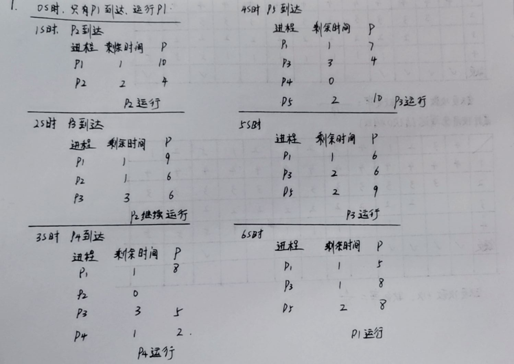
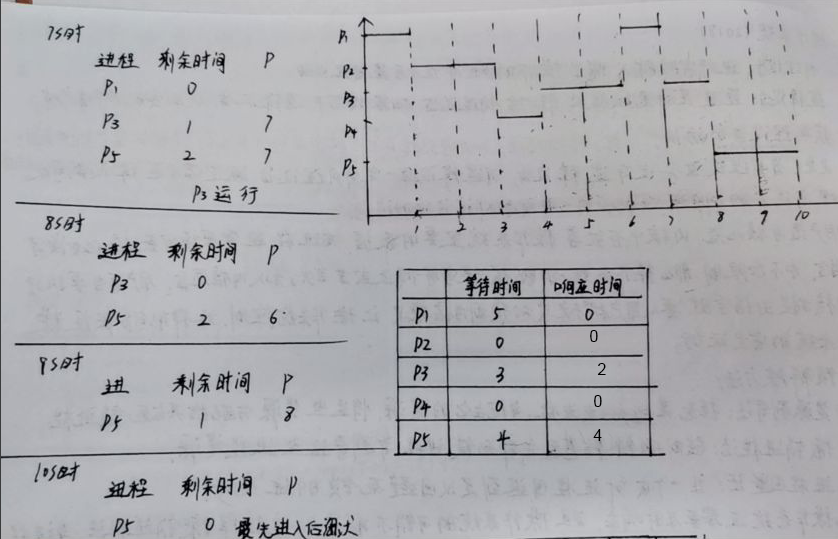

[toc]

# 18年真题答案

## DS

### 1 判断题

1. 错误，装填因子=实际存储的数/存储空间的大小，装填因子不可能大于1
2. 对，AVL树上是折半查找
3. 对
4. 错误，顺序存储不利于扩展和减少表的长度，应该用链式存储
5. 错，应该用栈来存储操作数和操作符

### 2 题目要求排序+O(1)次插入+O(n)次查找最大值

堆排序和二叉排序树都要建堆，$O(logn)$的时间复杂度

<u>平均情况</u>

虽然两种情况都基本相同，但是第二问选择了堆，这一问建议选择二叉排序树

| 结构       | 查找           | 插入           | 排序       |
| ---------- | -------------- | -------------- | ---------- |
| 二叉排序树 | $O(n)*O(logn)$ | $O(1)*O(logn)$ | $O(nlogn)$ |
| 堆         | $O(n)*O(logn)$ | $O(1)*O(logn)$ | $O(nlogn)$ |

排序：

二叉排序树的排序时间复杂度是$O(nlogn)$，也就是对n个数，一边查找它在树中的位置一边插入

而堆排序由于要建堆和调整，所以时间复杂度是$O(nlogn)$

查找：

此时二叉排序树的查找过程是折半查找，时间复杂度是$O(logn)$

而堆排序查找最大值的时间复杂度有两种情况，如果考虑查找后不弹出堆，那么查找一次就是O(1)，如果考虑查找后弹出堆，那么查找一次后还需要调整，为O(logn)

插入：

对二叉排序树的插入，寻找插入位置其实也是二分查找的过程，所以时间复杂度是$O(logn)$

堆排序的插入由于还需要调整，所以也是$O(logn)$

<u>最坏情况</u>

最坏情况应该使用堆。

| 结构       | 查找           | 插入           | 排序       |
| ---------- | -------------- | -------------- | ---------- |
| 二叉排序树 | $O(n)*O(n)$    | $O(1)*O(n)$    | $O(n^2)$   |
| 堆         | $O(n)*O(logn)$ | $O(1)*O(logn)$ | $O(nlogn)$ |

排序：

二叉排序树最坏情况会退化成单链表，排序需要$O(n^2)$ ，而堆排序仍然需要$O(nlogn)$

二叉排序树退化成单链表后，插入$O(n)$，再遍历一次$O(n)$，所以排序是$O(n*n)$的复杂度，相当于直接插入排序

查 找：

对单链表查找最大值的时间复杂度是$O(n)$，而对堆排序查找的时间复杂度是$O(1)$,如果需要调整则为$O(logn)$，考虑最坏情况，为$O(logn)$

插入：单链表插入时需要$O(n)$的时间复杂度，堆排序插入则需要$O(logn)$的时间复杂度

### 3 判断链表 

```c
typedef struct node {
    int val;
    struct node *next;
} Node, *List;

bool func(List L) {
    int flag = 0;
    if (!L)return 1;
    Node *p = L->next;
    while (p) {
        // 遇到第一个偶数
        if (p->val % 2 == 0)flag = 1;
        else {
            // 如果碰到了奇数，但是之前碰到了偶数，说明有奇数位于偶数之后，返回false
            if (flag)
                return false;
        }
        p=p->next;  // 往后遍历结点
    }
    return true;
}
```

### 4 给size赋值

递归第一句应该是判断不存在的情况，不存在肯定返回的0

由于有了这个不存在，接下来的递归就不用加if条件了

然后再写返回的情况，返回给父结点的数，应该是这一个结点的size+1，即该结点的孩子数+该结点本身

有了这两句话，就再写获取左孩子和右孩子就可以了

```c
typedef struct node {
    int val;
    int size;
    struct node *L;
    struct node *R;
} Node, *Tree;

int func(Tree &T) {
    //不存在 返回0
    if (!T)return 0;
    int lchild = func(T->L);
    int rchild = func(T->R);
    T->size = lchild + rchild;
    return T->size + 1;
}
```

### 5 孩子兄弟表示法的树，也是递归

关键是这道题到底求的是这棵树对应二叉树的度，还是这棵树本身的度

返回类型肯定是int类型

为空肯定返回0

如果不为空，那么统计它的孩子和它孩子的兄弟，就知道这个结点有多少个度了

```c
typedef struct node {
    int val;
    struct node *child;
    struct node *bro;
} Node, *List;

int func(Tree &T, int k) {
    if (!T)return 0;
    //que队列 
    Node *que[maxn];
    int p = 0, q = 0;
    que[p++] = T;
    int ans = 0;
    while (q < p) {
        Node *t = que[q++];
        int num = 0;
        //一定是存在的节点才会入队
        if (!t->child) {
            if (num == k)ans++;
            continue;
        }
        t = t->child;
        num++;
        que[p++] = t;
        while (t->bro) {
            t = t->bro;
            num++;
            que[p++] = t;
        }
        if (num == k)ans++;
    }
    return ans;
}
```


## OS

### 6 简答

1. 物理设备就是实实在在的设备，比如说磁盘，打印机，键盘等，每一个物理设备都有自己的名称，逻辑设备是抽象的物理设备，它通过将物理设备命名为0，1...n等等，用户在使用物理设备的时候不必知道物理设备具体的名称，按照逻辑设备名使用即可，区分物理设备和逻辑设备让用户更方便的管理物理设备资源，同时满足操作系统的设备独立性

   王道P278答案：

   用户使用逻辑设备名来请求某类设备，在系统执行的时候必须将逻辑设备名映射成物理设备名。逻辑设备是物理设备的抽象，

2. 内核模式和用户模式。内核中存放着操作系统重要的数据，而进程通常要读写数据，比如读写指令等，如果不加以限制，那么操作系统的数据很容易被修改或者丢失，造成错误。加入内核态后，用户每当要执行内核相关的指令时，就从用户模式切换到内核模式，让操作系统来进行控制。这样做能保证操作系统的安全运行

3. 死锁解除的方法有：

   剥夺进程资源：从其它进程剥夺资源；

   销毁进程：kill掉死锁的进程；

   撤销法：操作系统保存了进程之前的状态，发生死锁的时候退回到之前的状态；

   手机操作系统需要性能和及时响应，并且操作系统的开销不能过大，应该使用销毁进程的方法，当进程死锁的时候，杀掉死锁进程。

   MOOC上的答案：

   死锁的解除方法有两类，一类是进程终止，另一类抢占资源

   进程终止分为：中断所有死锁进程和依次中断进程直到死锁消失，怎么选择中断进程有很多指标，主要有进程有的优先级，进程使用的资源，进程所需的时间等。

   抢占资源：选择一个牺牲品，回滚到安全状态等

### 7 CPU调度 与15年第8题类似

优先数相同时，在执行的进程继续执行，可以计算出：1224331355






### 8 最先进入后淘汰，最近使用先淘汰两种方法页面置换，物理块数4

都是缺页6次，缺页率6/13

### 9 证明不会死锁

同05年证明题

设同类资源m个，共有n个进程

假设max(i)表示第i个进程的最大资源需求量，need(i)表示第i个进程还需要的资源量，alloc(i)表示第i个进程已分配的资源量。根据题中条件可知：

max(1)+...+max(n)=need(1)+...+need(n)+alloc(1)+...+alloc(n) < m+n                                                     

说明如果这时系统发生死锁，那么这m个资源应该全部分配出去，即：

alloc(1)+...+alloc(n) = m

另外，系统中所有进程将陷入无限等待状态。 

由上述两式可知，need(1)+...+need(n) < n。

这表示n个进程还需要的资源量之和小于n，意味着此刻至少存在一个进程i，need(i)=0，即它已获得了所需要的全部资源。那么它就能执行完成并释放它占有的资源，这与前面的假设矛盾。从而证明在这个系统中不可能发生死锁。

### 10 文件系统IO题

FCB和索引表都不在主存中，100个盘块，设块号编号为0~99

设在中间添加是在第49块后添加

1. 开头删除

   连续：读取FCB获得起始地址，修改起始地址和文件长度，写回FCB，一共**2次IO**

   链接：读取FCB获得起始地址，读取第一块盘块获得它的指针，将指针的值赋给FCB，然后修改FCB，写回FCB，一共**3次IO**

   索引：读取FCB获得索引表地址，读取索引表，修改索引表内容，写回索引表，一共**3次I/O**

2. 中间写入一块应该是在49块后新增一块

   连续：读取FCB，移动后50块，共100次IO，然后写入一块，再修改FCB，写回FCB，一共**103次I/O**

   链接：读取FCB，依次读入0~49共50块，获取第49块的指针，把指针的内容赋给新的块，然后写入新块，再修改原有的49块指针内容，写回第49块，一共**53次I/O**

   索引：读取FCB，读取索引表，写入新块，修改索引表，写回索引表，共**4次I/O**

3. 末尾处删除

   连续：读取FCB，修改FCB的length，写回FCB，共**2次I/O**

   链接：读取FCB，依次读入0~98块，将98块的指针指向NULL，修改FCB的尾指针为98块，然后写回98块，写回FCB，共**102次I/O**

   索引：读取FCB，读入索引表，修改索引表，写回索引表，共**3次I/O**