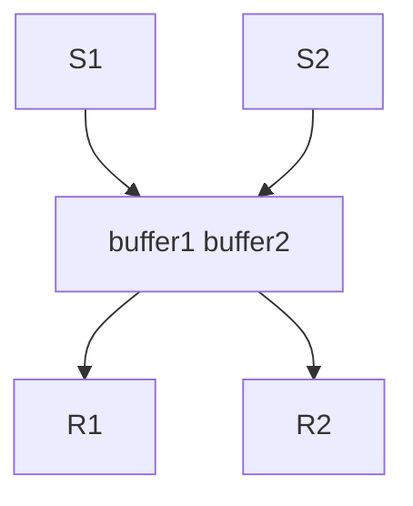
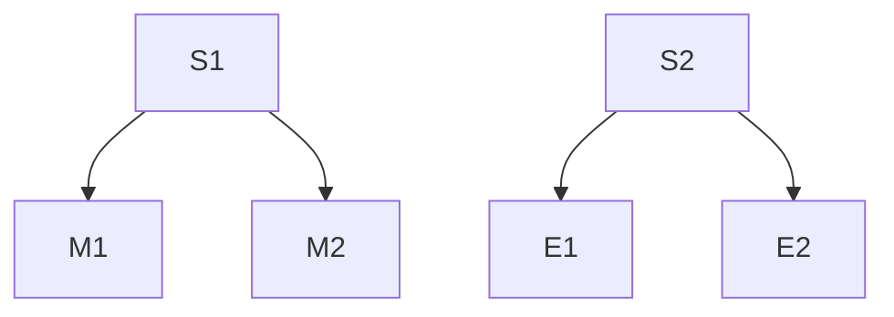
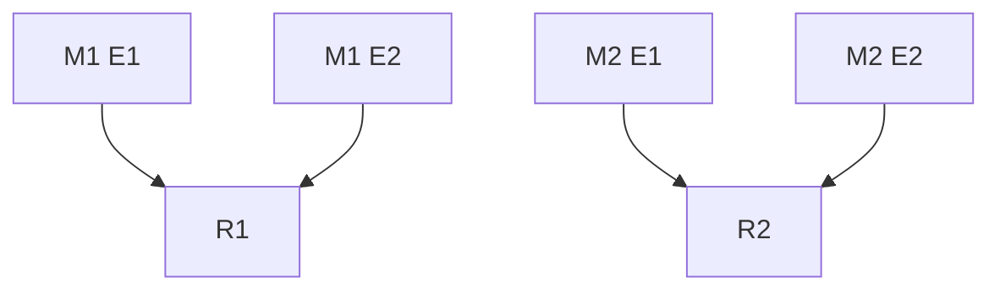

[toc]

# 19年专业课答案

## DS

### 1 选择题

1. A

2. Prim 稀疏点

   Kruskal 稀疏边

3. 没有题目

### 2 判断题

1. 对的，栈是只能在一端输入输出的双端队列，而队列是只能在一端输入，只能在另一端输出的双端队列

2. 错，二叉树不是树的特例

   二叉树的孩子节点有次序之分，而树的孩子节点无序

   
### 3 单链表交换

```c++
typedef struct Node {
    int val;
    struct node *next;
} Node, *List;

//遍历结点，碰到负结点就头插回起点
void func(List &L) {
    if (!L || !(L->next))return;
    Node *p = L->next;
    Node *pre = L;
    Node *H = L;
    Node *t = p;
    if (p->val < 0) {
        p = p->next;
        pre = pre->next;
    }
    while (p) {
        if (p->val < 0) {
            t = p;
            p = p->next;
            pre->next = p;
            t->next = H->next;
            H->next = t;
        } else {
            pre = p;
            p = p->next;
        }
    }
}

   
```

最好用顺序存储来实现，可以实现随机访问，很快的交换
补充：

物理(存储）结构分为顺序存储和链式存储。
逻辑结构分为线性结构（线性表，一对一）和非线性结构（树，图）

### 4 打印到先序遍历的最后一个节点的路径

先序遍历的最后一个结点总是在“右边”

```c++
typedef struct node {
    int val;
    struct node *left;
    struct node *right;
} Node, *Tree;

void func(Tree T) {
    if (!T)return;
    cout << T->val << " ";
    if (T->right)func(T->right);
    else func(T->left);
}
```

### 5 邻接表打印i到j的所有简单路径

   ```c++
//解法一思路： 从起点开始DFS找路径，借助访问数组，和栈
void DFS(Graph G, int i, int j, Stack &S, int visited[M]) {
    visited[i] = 1;
    S.push(i);
    if (i == j) {
        //输出从栈底到栈顶的顶点
    } else {
        for (w = FirstAdjVex(G, i); w >= 0; w = NextAdjVex(G, i, w))
            if (!visit[w])DFS(G, w, j, S, v);
    }
    visited[i] = 0;
    S.pop(i);
}

//可运行代码
//DFS判断是否存在路径
void DFS(int i, int j, int &flag, int inq[], stack<int> &st) {
    inq[i] = 1;
    st.push(i);
    node *t = ary[i];
    if (i == j) {
        //输出路径 
        stack<int> tst = st;
        cout << "road:";
        while (!tst.empty()) {
            cout << tst.top() << " ";
            tst.pop();
        }
        cout << endl;
        flag = 1;
    } else {
        while (t->next) {
            int val = t->next->val;
            if (!inq[val])    //图中剩下不属于当前路径的结点才访问 
                DFS(val, j, flag, inq, st);
            t = t->next;
        }
    }
    inq[i] = 0;
    st.pop();
}
   
   ```

   

## OS

### 6 判断题

1 错，ALTO
2 错，可能处于死锁状态，此时系统中还是存在进程
3 错，-(m-1)到1，
  当信号量 <= 0 代表已有进程占用临界区
      m个进程，最多- （m -1) 代表有m -1个进程在等待临界区资源，即处于等待队列
  当信号量 > 0 即 = 1，代表没有进程进入临界区
4 错，读和执行
5 错，使用内存
缓冲区有两块:高速缓存区（物理存在）和磁盘缓存区（逻辑存在，实际是内存一块），都不在外存（硬盘）

### 7 进程调度大题

1. 高响应比算法，处于等待的进程优先级会增长得比正在运行得进程优先级大，从而等待进程不断抢占运行中的进程
2. 后到先服务算法，a，b都小于0，说明处于运行和等待的进程优先级都在减少，并且处于等待的进程减少速度更快，当后面进程到达的时候，它的优先级总是比前面到达的优先级要大，所以后到的进程会先得到服务

### 8 文件系统设计

一百万条记录，每条16KB到32KB不等，物理块4KB

目录结构：树形目录，便于存放不同类别的记录，通过类别来查找记录加快查找速度。实现：使用哈希表

1. 优点是查找速度快

   目录文件的实现 P238

2. 逻辑结构：索引文件，索引表中按顺序存放着记录名，通过二分查找可以更快速的查找记录，并且索引文件占用空间大小介于顺序文件和直接文件之间

3. 物理结构：采用索引分配，因为一百万条记录最小是16*10^6KB约为2GB，最少需要2^19块磁盘块，采用连续分配不能分配这么大的连续空间，而隐式连接分配不能随机访问，显式链接分配FAT可能过大，唯有索引分配的性能是最好的，索引表可以散列存放，并且可以随机访问，也不需要连续空间

4. 访问磁盘顺序，目录文件（读入了FCB），找到相应的FCB，然后访问磁盘读入索引表，然后查找索引表得到地址，根据地址访问记录即可

   
   
   ### 9 磁盘大题 16年第七题原题
   
   1. 一级页表，$100+100=200ns$
   
   2. 平均寻道时间$5ms$，延迟时间$1/240s=25/6ms$，传输时间$2^2/2^{17}=1/2^{15}s=1000/2^{15}ms$，控制开销时间0.1ms
   
      总时间$T=5+25/6*10^3+1000/2^{15}+0.1 ms$
   
   3. 王道版本：$0.99*(200)+0.01*(100+0.8*(T)+0.2*(T+T)+100+100)$,其中x是第二问的答案
   
      MOOC版本：$0.99*(200)+0.01*(100+0.8*(T)+0.2*(T+T)+100)$，更新后直接访存
   
      注意发生缺页时，如果页面被修改，要访问磁盘两次，第一次将修改过的页写入磁盘，第二次将置换的页写入内存
      如果没有被修改，则直接把要置换的页写入内存即可，只访问一次磁盘 

### 10 PV大题 与06年、16年PV类似

题目条件：

- 缓冲区大小为2
- S1、S2发送消息，缓冲区不能存放两条同一个进程发送的消息
- R1、R2接收消息

由此可以设计信号量等条件，count用来表示缓冲区内消息数量，mutex是修改count需要用到的锁

```
semaphore E1=E2=1
semaphore F1=F2=F3=0
semaphore mutex = 1
int count = 0
```

其中Ei是缓冲区容量，Fi是标识发送消息，关于Fi具体代表情况，请看后面的内容

下面分析组合情况

**整体情况**



**发送情况**

S1发送

- M1
- M2

S2发送

- E1
- E2



由此我们可以设计出Si发送进程的大概框架，以S1为例

```
S1(){
	P(E1)
	if 发送消息是Mi than
		V(Fi)
	else
		V(Fi)
}
```

我们分析完接收情况后就可以修改Fi变为具体的信号量

**接受情况**

R1接收

- M1，E1
- M1，E2

R2接收

- M2，E1
- M2，E2



分析上述组合发现，S1发送的Mi消息决定了由谁接收消息，如果发送M1，则接收者一定是R1，如果发送M2，则接收者一定是R2

所以我们之前的信号量`semaphore F1=F2=F3=0`可以解释为

- F1 —— S1发送M1
- F2 —— S2发送M2
- F3 —— S3发送消息，由于不关键，我们只表示S3发送了消息

由此发送消息的内容可以修改为

```C
S1(){
	P(E1)
	if 发送消息是M1 than
		V(F1)
		P(mutex)
		count++
		V(mutex)
	else
		V(F2)
         P(mutex)
		count++
		V(mutex)
}

S2(){
	P(E2)
	// S2发的消息不决定是谁接收，不关键
	V(F3)
    P(mutex)
    count++
    V(mutex)
}
```

而接收组合的消息可以设计为

```
R1(){
    P(mutex)
    if(count==2){
        P(F1)
        P(F3)
        读取两个消息
        清空缓冲区
        V(E1)
        V(E2)
        count=0
    }
    V(mutex)
}

R2(){
	P(mutex)
	if(count==2){
	    P(F2)
	    P(F3)
        读取两个消息
        清空缓冲区
        V(E1)
        V(E2)
        count=0
	}
    V(mutex)
}
```


```C
semaphore E1=E2=1
semaphore F1=F2=F3=0
semaphore mutex = 1
int count = 0
    
S1(){
	P(E1)
	if 发送消息是M1 than
		V(F1)
		P(mutex)
		count++
		V(mutex)
	else
		V(F2)
         P(mutex)
		count++
		V(mutex)
}

S2(){
	P(E2)
	// S2发的消息不决定是谁接收，不关键
	V(F3)
    P(mutex)
    count++
    V(mutex)
}

R1(){
    P(mutex)
    if(count==2){
        P(F1)
        P(F3)
        读取两个消息
        清空缓冲区
        V(E1)
        V(E2)
        count=0
    }
    V(mutex)
}

R2(){
	P(mutex)
	if(count==2){
	    P(F2)
	    P(F3)
        读取两个消息
        清空缓冲区
        V(E1)
        V(E2)
        count=0
	}
    V(mutex)
}
```

