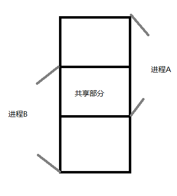
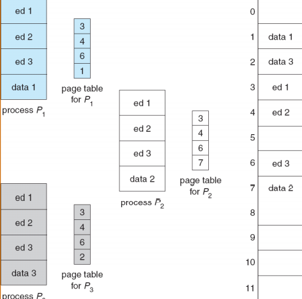
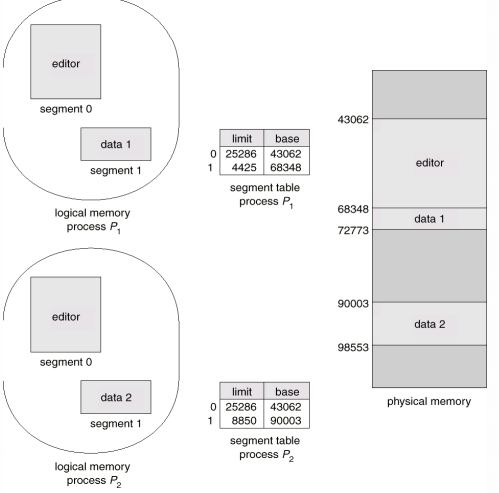
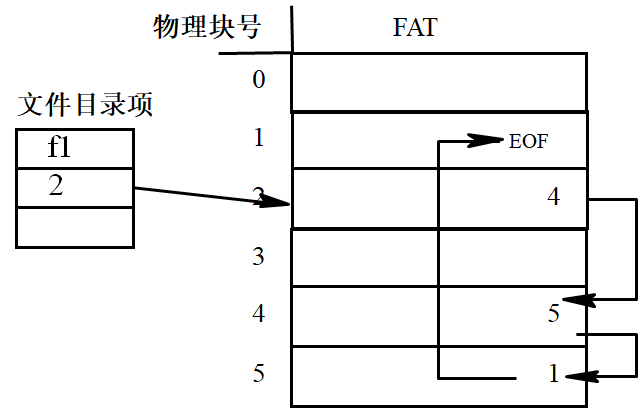
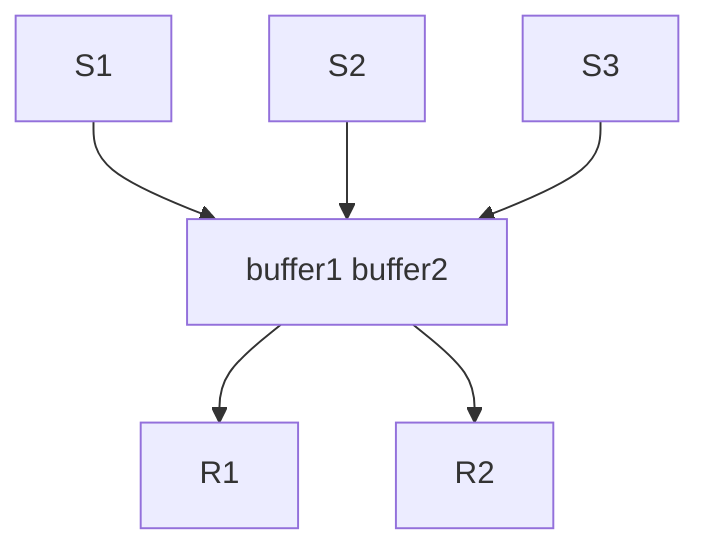
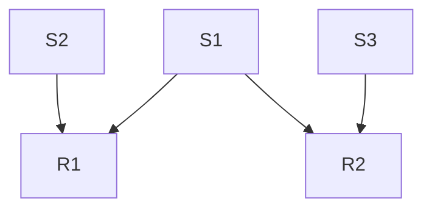
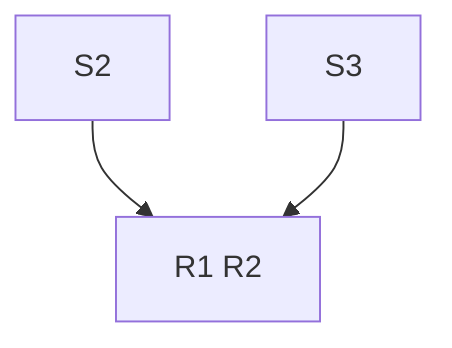
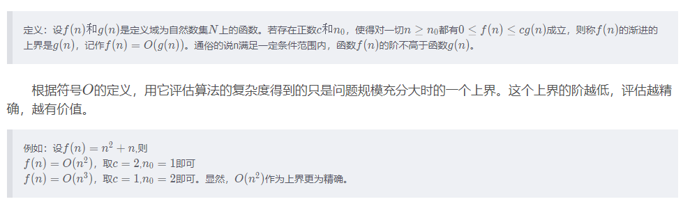
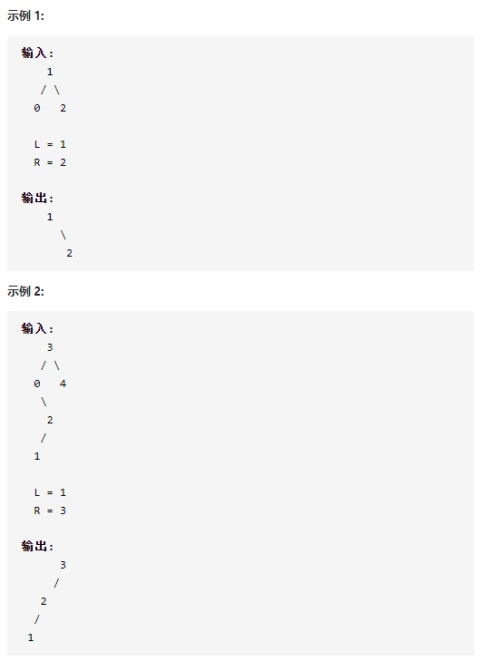

[toc]

# 20-答案

## OS

### 一 判断题

1. 错，型号一样的设备驱动程序相同，共需要两个设备驱动程序
2. 对，只有核心态有权限运行特权指令
3. 对，C-SCAN算法只在从低编号到高编号的方向移动时处理请求，磁盘的磁道从外侧开始向内侧编码，故从内侧到外侧是高到低的方向，此时磁头不处理请求。
4. 错，有可能CPU处理中断，此时有n个进程都处在就绪队列。
5. 错，最早的是ALTO
6. 对，极端情况下5个进程各有1个资源
7. 题目不全
8. 错，线程对内核不可见，内核视为10个进程，A占1/10时间
9. 题目不全
10. 错，在内存中查询命中能大大减少检索时间

### 二  进程调度

>​					p1 p2 p3 p4
>
>到达			1	2	3	4
>
>优先级		2 	3	4	5
>
>执行时间	2	1	3	2

定义：

- 非抢占式优先权算法：系统一旦把处理机分配给就绪队列中优先权最高的进程后,该进程便一直执行下去,直至完成。

- 抢占式优先权调度算法：系统同样把处理机分配给优先权最高的进程,使之执行.但在其执行期间,只要又出现了另一个其优先权更高的进程,进程调度程序就立即停止当前进程(原优先权最高的进程)的执行,重新将处理机分配给新到的优先权最高的进程。

非抢占式执行顺序：

>P1 P1 P2 P3 P3 P3 P4 P4

抢占式执行顺序：

> P1 P1 P3 P3 P3 P4 P4 P2

由此计算出平均周转时间 非抢占式 3.25秒，抢占式 4秒

先到达的进程被后面优先级高的进程不断抢占，那么抢占式的平均周转时间就会更长

---

本题的切入点：先到达的进程如果没有及时被执行，那么它的周转时间会很大，设计一个调度序列，让先到达的进程不断被抢占即可

注：

如果对非抢占式安排策略不清楚的同学看下面的内容，如果搞懂了就不需要看

非抢占式的就绪队列里面：
1 如果当前执行进程没有运行结束，继续执行
1 如果执行进程刚好结束，有已经安排好的进程，执行安排好的
2 如果执行进程刚好结束并且没有安排好的进程，就绪队列中存在多个进程同时达到，执行里面优先级最高的

抢占式的就绪队列里面：
1 永远执行优先级最高的进程

### 三 

连续分配：

- 单一连续分配

  内存中只存放一道程序，不需要内存共享和数据保护

- 固定分区分配

  分区大小固定并且只存放相应进程，无法实现内存共享

- 分区分配

  分区大小不固定，但是之存放相应进程，无法实现内存共享

页式分配：

可重入代码可以在进程间共享，共享的代码块必须出现在所有进程逻辑地址空间的相同位置。不同进程的页表，部分页表项指向相同的块，从而实现共享。通过硬件避免访问越界完成数据保护

段式分配：

实现方式和页式分配类似，通过段表可以共享数据。通过硬件避免访问越界完成数据保护

---

@快刀切草莓君 提供的答案：

1. 内存共享

   - 连续分配方式：可以让内存中相邻的两个进程共享一部分内存空间。

     

   - 页式分配方式：可重入代码可以在进程间共享，共享的代码必须出现在所有进程逻辑地址空间的相同位置。不同进程的页表，部分页表项指向相同的块，从而实现共享。

     

   - 段式分配方式：实现方式和页式分配方式类似，通过段表共享进程的部分段。

     

2. 数据保护

   -   连续分配方式：方案较为简单，通常未实现数据保护。
   -   页式分配方式：页表中每个页表项设置有效位，有效则表示是合法的页，否则表示页不在进程的逻辑地址空间中；读/写/执行权限控制。
   -   段式分配方式：段表有效位，类似页表中的有效位；段表基址寄存器，段表限长寄存器，限定段的长度防止越界访问；读/写/执行权限控制。

### 四 文件系统题

根目录dir1的FCB常驻内存

1. 目录文件中的内容
   - dir1:
     - dir2--34
     - file1--63
   - dir2:
     - file2--32
     - file3--53
2. 在dir2中写入file4的过程：
   1. 读入FAT和根目录dir1的FCB
   2. 从根目录的FCB中获取dir1的文件目录
   3. 从dir1的文件目录中获取dir2的FCB，按照FCB和FAT将dir2读入内存
   4. 将文件file4从内存中写入磁盘，更新FAT表
   5. 为dir2的文件目录中增加目录项 file4--起始块号
   6. 将FAT和修改后的dir2文件目录写回磁盘
3. 删除file3的过程
   1. 读入FAT和根目录dir1的FCB
   2. 从根目录的FCB中获取dir1的文件目录
   3. 从dir1的文件目录中获取dir2的FCB，将dir2读取内存
   4. 修改dir2的文件目录，删除file3的信息
   5. 更新FAT表
   6. 将更新后的FAT表和dir2的文件目录写回磁盘
4. 读入dir1/dir2/file2的第2000个字节过程
   1. 读入FAT和根目录dir1的FCB
   2. 从根目录的FCB中获取dir1的文件目录
   3. 从dir1的文件目录获取dir2的FCB，读入块号34，1次读盘
   4. 从dir2的文件目录中找到file2的FCB
   5. 每一块大小为1KB，需要读第2000个字节，这需要读入一块磁盘，即10
   6. 综上所述，共两次读盘


注意，FAT虽然存储了每一个文件的内存地址，但是FAT只是做了记录，并不知道哪块对应着文件的入口，只有FCB里面才存放着文件的首块指针，所以打开一个文件，要先获取FCB，获得里面的首指针，才能知道文件的入口

其次根目录的FCB是常驻内存的，否则不知道根目录的FCB，就找不到根目录，更找不到目录下的文件了



---

@快刀切草莓君 提供的答案

1.  目录文件中的内容
    -   dir1：['dir2', 34], ['file1', 63]
    -   dir2：['file2', 32], ['file3', 53]
2.  在 dir2 中写入 file4 的过程：
    1.  若 FAT 和 dir1(block 2) 未读入内存，则将其读入内存
    2.  从 dir1 的目录项中检索到 dir2 的块号，将 dir2 (block34) 读入内存
    3.  将文件 file4 从内存写入磁盘，同时在 FAT 中加入 file4 的块号， 将 FAT 表写回磁盘。
    4.  为 dir2 增加目录项 ['file4', '开始地址'],  将修改后的dir2 从内存写回磁盘。
3.  删除 file3 的过程
    1.  若 FAT 和 dir1(block 2) 未读入内存，则将其读入内存
    2.  从 dir1 的目录项中检索到 dir2 的块号，将 dir2 (block34) 读入内存
    3.  读取 file3 的第一个簇号，修改 dir2 删除file3的目录项，将修改后的 dir2 (block34) 写回磁盘。
    4.  根据簇号找到并删除 FAT 表中 file3，将修改后的 FAT表写回磁盘。

### 五、进程同步题

### 五 PV

分析题目：

缓冲区大小为2，存放的消息不能相同

>  应设置`int count`来标记缓冲区存在的消息数量

三个发送进程S1、S2、S3

> 每个进程都尝试发消息，应该设置互斥量 `E1=E2=E3=1` ，而发送消息我们使用信号量`F1=F2=F3=0`来标记目前谁发送了消息，同时为了使用if条件来判断发送情况，设置`int s1=s2=s3=0`来帮助判断，由于涉及到int值的修改，我们需要信号量`mutex`来加锁

两个接收进程R1、R2 

> R1和R2根据缓冲区内的组合接收消息

信号量等条件：

```
semaphore E1=E2=E3=1
semaphore F1=F2=F3=0
semaphore mutex=1
int count=0,s1=0,s2=0,s3=0
```

整体情况



细分组合

R1接收

- S1、S2
- S2、S3

R2接收

- S1、S3
- S2、S3

情况1 接收各自的组合



情况2 S2+S3，此时R1和R2都能接收



分析得出结论，S1发送的消息“不关键”，而S2和S3发送的消息才决定了是谁接收消息

所以我们对发送进程R1和R2，**让他们先判断S2、S3的发送情况**

如果S2发送了，那么组合区里面只有两种情况

> 1. S1+S2，此时只能由R1接收
> 2. S2+S3，此时R1和R2都能接收

上述情况，在S2已经发送的情况下，R1一定能接收缓冲区里面的组合

如果S3发送了，同样的组合区情况为

> 1. S1+S3，此时只能由R2接收
> 2. S2+S3，此时R1和R2都能接收

那么同理，只要S3发送，R2一定能接收缓冲区里面的组合

目前为止我们可以写出发送进程的代码，以S1为例，为了避免重复发送，要用count和s1来辅助判断

```
S1(){
    P(mutex)
    // 缓冲区没满
	if(count!=2&&s1!=1){
        P(E1)	// 尝试发
        send message
        V(F1)	// 提示S1已经发送
        s1=1	// 标记S1已经发送
        count++	// 缓冲区数量+1
	}
    V(mutex)
}
```

按我们按照之前的思路，写出R1接收方法，**需要注意的是，我们接收进程必须要在缓冲区满的时候才能P(Fi)，因为我们之前的分析是基于缓冲区内存在着两条消息的组合，如果只存在一条消息我们进行P(Fi)，会导致死锁**，同时我们要判断缓冲区内的组合，先用int值来判断，然后再P信号量

```c
R1(){
    P(mutex)
    if(count==2){
        if(s1==1&&s2==1){
	        P(F2)
	        P(F1)
            get message 
            clear buffer
            // 释放资源
            V(E1)	
            V(E2)
            // 重置变量
            s1=s2=s3=0
            count=0
        }else if(s3==1&&s2==1){
            P(F2)
            P(F3)
            get message
            clear buffer
            // 释放资源
            V(E3)
            V(E2)
            // 重置变量
            s1=s2=s3=0
            count=0
        }
    }
    V(mutex)
}
```

结合上面的代码，完整代码如下：

```
E1=E2=E3=1
F1=F2=F3=0
mutex=1
int count=0,s1=0,s2=0,s3=0;

s1(){
    P(mutex)
	if(count!=2&&s1!=1){
        P(E1)
        send message
        V(F1)
        s1=1	
		count++
	}
    V(mutex)
}

s2(){
    P(mutex)
	if(count!=2&&s2!=1){
    	P(E2)
        send message
        V(F2)
        s2=1
        count++
	}
    V(mutex)
}

s3(){
    P(mutex)
	if(count!=2&&s3!=1){
    	P(E3)
        send message
        V(F3)
        s3=1
        count++
	}
    V(mutex)
} 

R1(){
    P(mutex)
    if(count==2){
        if(s1==1&&s2==1){
	        P(F2)
	        P(F1)
            get message 
            clear buffer
            // 释放资源
            V(E1)	
            V(E2)
            // 重置变量
            s1=s2=s3=0
            count=0
        }else if(s3==1&&s2==1){
            P(F2)
            P(F3)
            get message
            clear buffer
            // 释放资源
            V(E3)
            V(E2)
            // 重置变量
            s1=s2=s3=0
            count=0
        }
    }
    V(mutex)
}

R2(){
    P(mutex)
    if(count==2){
        if(s1==1&&s3==1){
	        P(F3)
	        P(F1)
            get message 
            clear buffer
            // 释放资源
            V(E1)	
            V(E3)
            // 重置变量
            s1=s2=s3=0
            count=0
        }else if(s2==1&&s3==1){
            P(F3)
            P(F2)
            get message
            clear buffer
            // 释放资源
            V(E3)
            V(E2)
            // 重置变量
            s1=s2=s3=0
            count=0
        }
    }
    V(mutex)
}
```


## DS

### 一 选择题

1. 
   广搜是V+E
2. 稀疏图：边很少
   稠密图：边很多
   k适合稀疏图，因为它先选边
   prim适合稠密图，因为它先选点，稠密图的点相对于边较少
   1、2正确
   答案是1、2、4
3. 
   C
4. n(n-1)/2
5. 堆排序、快速排序、希尔排序、直接选择排序是不稳定的排序算法

### 二 判断题

1 错，O(n)是指在问题规模增大的时候运行时间的增长速度在**最坏情况**下成线性关系，并且$O$表示法只是**最坏情况**下的近似，代表该算法执行时间上界，并不能说n扩大一倍，算法执行时间就扩大一倍。算法的运行时间与硬件、代码实现等细节挂钩，不存在问题规模增加，时间按照相应倍数增加的关系

注：算法导论中关于$O$表示法的严格定义



2 对，拓扑排序完成后，如果图中还有结点没有遍历，那么图中存在环，或者图不连通

3 对

4 错，增加头节点是为了插入删除的一致性

5 对

### 三 链表计算

```c
// 假设带头节点
double func(List L) {
    int max = 0, min = INT_MAX;
    int sum = 0;
    int num = 0;
    Node *max_node = L;
    Node *min_node = L;
    Node *t = L;
    while (t->next) {
        int val = t->next->val;
        sum += val;
        num++;
        if (val > max) {
            max = val;
            max_node = t;
        } else if (val < min) {
            min = val;
            min_node = t;
        }
        t = t->next;
    }
    if (num <= 2) {
        L->next = NULL;
        return 0;
    }
    t = max_node->next;
    max_node->next = max_node->next->next;
    delete t;
    t = min_node->next;
    min_node->next = min_node->next->next;
    delete t;
    return (sum - max - min) / (n - 2);
}
```

### 四 判断二叉树

```c
bool func(Tree tree, int layer = 1) {
    if (!tree)
        return false;
    return tree->val == layer || func(tree->left, layer + 1) || func(tree->right, layer + 1);
}
```

### 五 按条件生成树

题目：一颗**AVL树**T，有x<y，将树T中值小于x或大于y的结点删除，将小于x的结点存放在一颗新的**二叉排序树**T1，将大于y的结点存放在一颗新的**二叉排序树**T2

这道题首先是解析，然后才是答案


看清题目：

二叉排序树（BST）：

(1) 若它的左子树不空，则 **左子树** 上所有结点的值 **均小于** 它的根结点的值；

(2) 若它的右子树不空，则 **右子树** 上所有结点的值 **均大于** 它的根结点的值；

(3) 它的 **左、右子树又分别为二叉排序树** 。

AVL树：在二叉排序树的基础上要求**平衡**

**解析**：

问题需要两个功能，一个是**删除**，另一个是**插入**。删除需要我们对树T操作，插入需要我们对树Ti操作

首先我们来看**插入**：

如果题目要求我们生成**二叉排序树（BST）**，那么我们的插入代码很简单

```c++
void insertNode(Tree T, Node n) {
    if (T == NULL) {
        T = n;
        return;
    }
    if (T->val > n->val)
        insertNode(T->left, n);
    else if (T->val < n->val) {
        insertNode(T->right, n);
    }
}
```

如果题目要求我们生成**AVL树**，那么插入部分的代码和数据结构的定义会复杂一些（作为算法题，生成AVL树代码量太大了，这部分作为补充知识）

```c++
// C++ program to insert a node in AVL tree 

// An AVL tree node 
class Node 
{ 
	public:
	int key; 
	Node *left; 
	Node *right; 
	int height; 
}; 

// A utility function to get the 
// height of the tree 
int height(Node *N) 
{ 
	if (N == NULL) 
		return 0; 
	return N->height; 
} 

// A utility function to get maximum
// of two integers 
int max(int a, int b) 
{ 
	return (a > b)? a : b; 
} 

/* Helper function that allocates a 
new node with the given key and 
NULL left and right pointers. */
Node* newNode(int key) 
{ 
	Node* node = new Node();
	node->key = key; 
	node->left = NULL; 
	node->right = NULL; 
	node->height = 1; // new node is initially
					// added at leaf 
	return(node); 
} 

// A utility function to right
// rotate subtree rooted with y 
// See the diagram given above. 
Node *rightRotate(Node *y) 
{ 
	Node *x = y->left; 
	Node *T2 = x->right; 

	// Perform rotation 
	x->right = y; 
	y->left = T2; 

	// Update heights 
	y->height = max(height(y->left),
					height(y->right)) + 1; 
	x->height = max(height(x->left),
					height(x->right)) + 1; 

	// Return new root 
	return x; 
} 

// A utility function to left 
// rotate subtree rooted with x 
// See the diagram given above. 
Node *leftRotate(Node *x) 
{ 
	Node *y = x->right; 
	Node *T2 = y->left; 

	// Perform rotation 
	y->left = x; 
	x->right = T2; 

	// Update heights 
	x->height = max(height(x->left), 
					height(x->right)) + 1; 
	y->height = max(height(y->left), 
					height(y->right)) + 1; 

	// Return new root 
	return y; 
} 

// Get Balance factor of node N 
int getBalance(Node *N) 
{ 
	if (N == NULL) 
		return 0; 
	return height(N->left) - height(N->right); 
} 

// Recursive function to insert a key
// in the subtree rooted with node and
// returns the new root of the subtree. 
Node* insert(Node* node, int key) 
{ 
	/* 1. Perform the normal BST insertion */
	if (node == NULL) 
		return(newNode(key)); 

	if (key < node->key) 
		node->left = insert(node->left, key); 
	else if (key > node->key) 
		node->right = insert(node->right, key); 
	else // Equal keys are not allowed in BST 
		return node; 

	/* 2. Update height of this ancestor node */
	node->height = 1 + max(height(node->left), 
						height(node->right)); 

	/* 3. Get the balance factor of this ancestor 
		node to check whether this node became 
		unbalanced */
	int balance = getBalance(node); 

	// If this node becomes unbalanced, then 
	// there are 4 cases 

	// Left Left Case 
	if (balance > 1 && key < node->left->key) 
		return rightRotate(node); 

	// Right Right Case 
	if (balance < -1 && key > node->right->key) 
		return leftRotate(node); 

	// Left Right Case 
	if (balance > 1 && key > node->left->key) 
	{ 
		node->left = leftRotate(node->left); 
		return rightRotate(node); 
	} 

	// Right Left Case 
	if (balance < -1 && key < node->right->key) 
	{ 
		node->right = rightRotate(node->right); 
		return leftRotate(node); 
	} 

	/* return the (unchanged) node pointer */
	return node; 
} 

// A utility function to print preorder 
// traversal of the tree. 
// The function also prints height 
// of every node 
void preOrder(Node *root) 
{ 
	if(root != NULL) 
	{ 
		cout << root->key << " "; 
		preOrder(root->left); 
		preOrder(root->right); 
	} 
} 


```

然后我们来看**删除**操作：

如果题目不要求保持树T的结构，那么我们可以在**后序遍历**的基础上遍历每个节点，然后把符合条件的结点置为空（删除操作）并加入到对应的树Ti中

```c++
void func(Tree T, Tree T1, Tree T2, int x, int y) {
    if (T == NULL)
        return;
    // 采用后序遍历删除
    func(T->left, T1, T2, x, y);
    func(T->right, T1, T2, x, y);
    if (T->val < x) {
        insertNode(T1, new Node(T->val));
        // 直接置空
        Node *temp = T;
        T = NULL;
        delete temp;
    } else if (T->val > y) {
        insertNode(T2, new Node(T->val));
        // 直接置空
        Node *temp = T;
        T = NULL;
        delete temp;
    }
}
```

如果题目需要我们**保持树T的结构**，那么需要我们定义新的数据结构，这个方法出自《算法》的3.2节，描述语言是Java，算法实现原理这里就不说了，感兴趣的读者可以翻阅《算法》的3.2节。

关键的函数是delete，对于这一题，当我们要delete的时候再用插入代码插入到对应树就行

```java
public class BST<Key extends Comparable<Key>, Value> {
    private Node root;             // root of BST

    private class Node {
        private Key key;           // sorted by key
        private Value val;         // associated data
        private Node left, right;  // left and right subtrees
        private int size;          // number of nodes in subtree

        public Node(Key key, Value val, int size) {
            this.key = key;
            this.val = val;
            this.size = size;
        }
    }

    /**
     * Initializes an empty symbol table.
     */
    public BST() {
    }

    /**
     * Returns the number of key-value pairs in this symbol table.
     *
     * @return the number of key-value pairs in this symbol table
     */
    public int size() {
        return size(root);
    }

    // return number of key-value pairs in BST rooted at x
    private int size(Node x) {
        if (x == null) return 0;
        else return x.size;
    }

    /**
     * Removes the smallest key and associated value from the symbol table.
     *
     * @throws NoSuchElementException if the symbol table is empty
     */
    public void deleteMin() {
        if (isEmpty()) throw new NoSuchElementException("Symbol table underflow");
        root = deleteMin(root);
        assert check();
    }

    private Node deleteMin(Node x) {
        // 如果当前节点是最小节点，返回这个结点的右子树
        // 回到递归上层，相当于把左子树指针指向删除结点(最小节点)的右子树
        if (x.left == null) return x.right;
        x.left = deleteMin(x.left);
        x.size = size(x.left) + size(x.right) + 1;
        return x;
    }

    /**
     * Removes the specified key and its associated value from this symbol table
     * (if the key is in this symbol table).
     *
     * @param key the key
     * @throws IllegalArgumentException if {@code key} is {@code null}
     */
    public void delete(Key key) {
        if (key == null) throw new IllegalArgumentException("calls delete() with a null key");
        root = delete(root, key);
        assert check();
    }

    private Node delete(Node x, Key key) {
        if (x == null) return null;

        int cmp = key.compareTo(x.key);
        if (cmp < 0) x.left = delete(x.left, key);
        else if (cmp > 0) x.right = delete(x.right, key);
        else {
            if (x.right == null) return x.left;
            if (x.left == null) return x.right;
            Node t = x;
            x = min(t.right);
            x.right = deleteMin(t.right);
            x.left = t.left;
        }
        x.size = size(x.left) + size(x.right) + 1;
        return x;
    }


    /**
     * Returns the smallest key in the symbol table.
     *
     * @return the smallest key in the symbol table
     * @throws NoSuchElementException if the symbol table is empty
     */
    public Key min() {
        if (isEmpty()) throw new NoSuchElementException("calls min() with empty symbol table");
        return min(root).key;
    }

    private Node min(Node x) {
        if (x.left == null) return x;
        else return min(x.left);
    }
}
```

**答案：**

#### 后序

**不考虑原树T操作后的平衡与否**，**也不考虑树T操作后是否会断链**，采用后序遍历的方法进行递归，每次碰到符合条件的结点直接置空删除，然后往对应的树Ti插入结点即可，这样做能保证生成两颗新的二叉排序树

```c++
typedef struct Node {
    int val;
    Node *left;
    Node *right;

    Node(int v) {
        val = v;
        left = right = NULL;
    }
} Node, *Tree;

void insertNode(Tree T, Node* n) {
    if (T == NULL) {
        T = n;
        return;
    }
    if (T->val > n->val)
        insertNode(T->left, n);
    else if (T->val < n->val) {
        insertNode(T->right, n);
    }
}

void func(Tree T, Tree T1, Tree T2, int x, int y) {
    if (T == NULL)
        return;
    // 采用后序遍历删除
    func(T->left, T1, T2, x, y);
    func(T->right, T1, T2, x, y);
    if (T->val < x) {
        insertNode(T1, new Node(T->val));
        // 直接置空
        Node *temp = T;
        T = NULL;
        delete temp;
    } else if (T->val > y) {
        insertNode(T2, new Node(T->val));
        // 直接置空
        Node *temp = T;
        T = NULL;
        delete temp;
    }
}
```

上面代码已经通过本地测试，这道题解法不唯一，大家可以探索其它解法

#### 扩展

一道扩展题目，补充用

力扣的[669. 修剪二叉搜索树](https://leetcode-cn.com/problems/trim-a-binary-search-tree/)，与上面的题目很相似

给定一个二叉搜索树，同时给定最小边界L 和最大边界 R。通过修剪二叉搜索树，使得所有节点的值在[L, R]中 (R>=L) 。你可能需要改变树的根节点，所以结果应当返回修剪好的二叉搜索树的新的根节点



但是这里是二叉搜索树，并不是平衡二叉树，不过也有按照区域$[low,high]$修剪树的需求。下面是题解

注意这是一颗二叉搜索树，应该能利用到二叉搜索树的性质来遍历
然后给定区间是$[low,high]$
一颗二叉搜索树的定义是左小右大的，那么一共还是三种情况，设根节点的值是val
则

1. low<=val<=high
	无事发生，但是要继续判断左右子树，删除掉值域外的结点
2. val<low
	根节点都小于low了，根据二叉搜索树的性质来看，此时根节点的左子树所有value都会小于low，无需递归左子树，但是可能右子树会大于low，所以要递归判断右子树
3. val>high
	根节点的值大于high，是val<low的镜像情况，无需递归右子树，但是左子树仍然可能存在符合的结点

根据上述三种情况，我们**假设**trimBST能够根据low和high的范围来修建一个二叉搜索树，并且返回修剪后的结点
然后依次设计trimBST里面的三个操作

1. 边界情况 
	root为空的时候我们直接返回root就行
	还有一个特殊情况，就是这个根节点无左右孩子，但是它当前的值不属于$[low,high]$这个区间，那么我们也是直接返回None，表示删除了这个节点
2. 一般情况（当前层次需要执行的操作）
	其实就是我们上面分析的三种情况，唯一麻烦的地方，就是我们要更新根节点，但是更新根节点的情况只会在2、3这两种情况下发生，发生的时候必有一颗子树被舍弃，我们直接将另一个孩子结点作为新的根节点返回即可
3. 返回
	依然是根据三种情况来返回
	1 返回root，其左右子树更新为trimBST(root.left,...)，trimBST(root.right,...)
	2 返回trimBST(root.right,...)
	3 返回trimBST(root.left,...)
	

写出伪代码

```python
# Definition for a binary tree node.
# class TreeNode:
#     def __init__(self, val=0, left=None, right=None):
#         self.val = val
#         self.left = left
#         self.right = right
	def trimBST(root,low,high):
		if 根节点为空:
			return None
		if 根节点左右子树为空，并且根节点的值不属于[low,high]
			return None
		if low<=root.val<=high:
			root.left = trimBST(root.left,low,high)
			root.right = trimBST(root.right,low,high)
			return root
		elif root.val<low:
			return trimBST(root.right,low,high)
		elif root.val>high:
			return trimBST(root.left,low,high)
```

通过了


总结：只需要考虑
1 边界条件——特殊情况
2 当前操作——一般情况
3 返回值
这三个情况，题目迎刃而解

上述代码的if逻辑有些混乱，更改后更加简洁，无左右孩子子树的情况不需要额外放出来

```python
# Definition for a binary tree node.
# class TreeNode:
#     def __init__(self, val=0, left=None, right=None):
#         self.val = val
#         self.left = left
#         self.right = right
class Solution:
    def trimBST(self, root: TreeNode, low: int, high: int) -> TreeNode:
        # 边界情况
        if not root:
            return root
        
        val = root.val
        if val<low:
            return self.trimBST(root.right,low,high)
        elif val>high:
            return self.trimBST(root.left,low,high)
            
        root.left = self.trimBST(root.left,low,high)
        root.right = self.trimBST(root.right,low,high)
        return root
```


