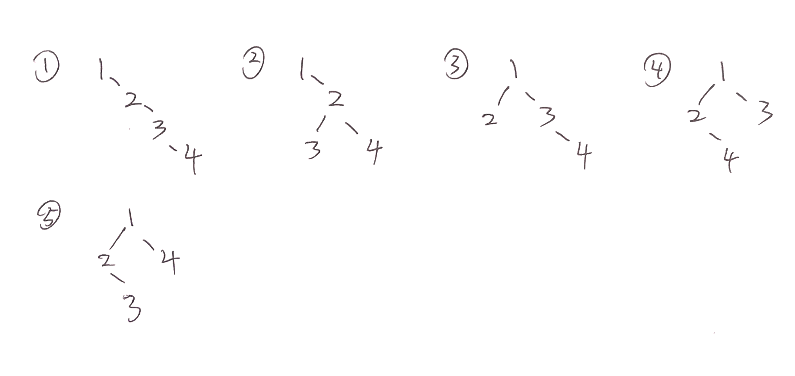

[toc]

# 21-答案

## OS

### 1 判断

1. 错，用户级线程不需要内核的支持。

2. 这道题描述不清楚，正确的调用程序是：用户程序、系统调用、内核、设备驱动程序、设备。

   **用户程序**发起请求；**系统调用**响应用户请求，发送中断请求给内核；**内核**捕获中断，处理并且传递信号给相应的设备驱动程序；**设备驱动程序**将i/o指令传递给设备；设备进行相应的i/o

3. 对。

4. 对。

   解释：引入线程的操作系统中，通常都是把进程作为资源分配的基本单位，而把线程作为独立运行的基本单位。

5. 错。

   一个信号量对应一个临界资源，初始时有资源，所以信号量初始值一般都是1，当有进程占用临界区时，-1
      当信号量  <= 0 代表已有进程占用临界区
          m个进程，最多- （m -1) 代表有m  -1个进程在等待临界区资源，即处于等待队列
      当信号量 > 0 即 = 1，代表没有进程进入临界区

6. 错，如果采用非抢占式调度，就绪队列中就算存在优先级比较高的进程，也会等待正在运行的进程执行完毕。

   解释：

   这里的非等待状态指的是就绪状态，等待状态（waiting）指的是阻塞的进程。

   假设优先级数值越高越优先，考虑t=0时，只存在一个优先级为1的进程，它执行需要5个时间片，此时只有一个进程，执行它。第t=2时进来了3个优先级分别为3、4、5的进程，但是此时采用非抢占式调度，后面的进程必须等优先级为1的进程执行完毕。此时正在运行的进程优先级是最低的

7. 错，当进程处于临界区时，说明进程正在占用处理机，只要不破坏临界资源的使用规则，是不会影响处理机调度的。

   解释：

   引发新的调度的几个时刻：

   1、新进程到来；

   2、当前进程时间片用完；

   3、进程结束阻塞状态；比如退出系统调用并返回；

   而对于临界区中是否可以进行进程调度，一般而言是可以的；比如当进程访问外部设备时，进程由运行态转为阻塞态，此时进程重新调度。

### 2 死锁

有，**系统存在一个不安全状态**，介于死锁和安全状态之间。

**安全状态**，是指系统能够按某种进程推进顺序（P1,P2,…,Pn）为每个进程分配其所需资源，直至满足每个进程对资源的最大需求，使每个进程都可顺利的执行完成。其中进程的推进顺序（P1,P2,…,Pn）被称为安全序列。如果系统中能找到这样一个安全序列，则称系统处于安全状态。

如果系统找不到任何一个安全序列，那么此时系统处于不安全状态。当系统处于不安全状态时，有可能因为不恰当的任务推进顺序导致系统陷入死锁状态。

举例：

假定系统中有三个进程P1、P2和P3，进程P1总共要求10台磁带机，P2和P3分别要求4台和9台。假设在T0时刻，进程P1、P2和P3已分别获得5台、2台和2台磁带机，尚有3台空闲未分配，如下表所示

| 进程 | 最大需求 | 已分配 | 还需 |
| ---- | -------- | ------ | ---- |
| P1   | 10       | 5      | 5    |
| P2   | 4        | 2      | 2    |
| P3   | 9        | 2      | 7    |

此时我们有3台设备可用，可以找到（P2，P1，P3）这个安全序列，此时系统处于安全状态

如果此时P3又请求了一台设备，并且系统分配给了P3，此时还剩两台设备

| 进程 | 最大需求 | 已分配 | 还需 |
| ---- | -------- | ------ | ---- |
| P1   | 10       | 5      | 5    |
| P2   | 4        | 2      | 2    |
| P3   | 9        | 3      | 6    |

在这种情况下，系统找不到安全序列，此时处于不安全状态，如果再把剩下的设备分配给P1或P3，那么系统此时处于死锁状态

三种状态的关系:


### 3 文件设计

拼音输入法 （1） 设计文件逻辑结构 ，说明理由（2）设计存储结构 （3）同时使用输入法，码表如何存放

1. 文件逻辑结构采用**索引顺序文件**

   以检索 吃(chi) 为例

   使用索引，能实现随机存取，帮助我们快速检索到符合chi的汉字，符合拼音输入法要求快速的特点

   在索引的基础上结合顺序，使得拼音相同的汉字能够划分为一组，当我们输入拼音时，可能有多个匹配项，例如输入 chi 后，可能出现 吃、持、赤、池等汉字，我们不需要为每个拼音相同的汉字都建立一个索引，而是把它们归为一组，在此基础上通过顺序搜索得到想要的汉字

   因此，索引顺序文件适合拼音输入法的逻辑结构

2. 存储结构采用**顺序存储**

   由于汉字数量固定，我们可以将汉字按照拼音顺序排序，然后顺序存储的方式保存在磁盘中。顺序分配的好处是读取快速，能够直接根据地址访问目标。

3. 码表如何存放？

   回忆版题意不明

   码表按照**索引分配**的方式存放，同拼音的汉字作为存放在同一个文件中，用拼音作为索引，当我们需要读取码表时，首先用拼音检索文件，然后在文件中存储。

### 4 PV

PV答案不唯一，仅供参考

假设A、B两个队列表示两个方向的车辆，当A，B中有一个队列为空时，剩下不为空的队列可以通过多辆（需要检测队列是否为空的变量），当A和B都不为空时，必须要轮流通过（需要通知对方通过的变量）

```
// A优先通过
semaphore Apass=1,Bpass=0
// 汽车的数量
int Acount=n,Bcount=m
A(){
	// 有车时，尝试通过
	if(ACount!=0){
        if(Bcount == 0){
			// 尝试通过车辆，直到无车可以通过，或者B来车
			while(Bcount == 0 and ACount != 0){
				通过一辆A车
				Acount -= 1
			}
        }else{
            P(Apass)
            通过一辆A车
            Acount -= 1
            V(Bpass)
        }	
	}else{
		// 无车时，等待A来车
		if(来车)
			ACount += 1
	}
}

B(){
	// 有车时，尝试通过
	if(BCount!=0){
        if(Acount == 0){
        	// 尝试通过车辆，直到无车可以通过，或者A来车
        	while(Acount == 0 and BCount != 0){
        		 通过一辆B车
				Bcount -= 1
    		}
        }else{
            P(Bpass)
            通过一辆B车
            Bcount -= 1
            V(Apass)
        }	
	}else{
		// 无车时，等待B来车
		if(来车)
			Bcount += 1
	}

}
```

### 5 内存管理

1. 页的大小为2^12B=4KB，页表项个数为 $2^{32}/2^{12}=2^{20}$个，则一级页表最大为$2^{20}*4B=4MB$

2. 二级页表的结构

   | 页目录号（10位） | 页表索引（10位） | 页内偏移量（12位） |
   | ---------------- | ---------------- | ------------------ |
   |                  |                  |                    |

   页目录号可表示为(((unsigned int)(ADD))>>22) & 0x3FF

   页表索引可表示为(((unsigned int)(ADD))>>12) & 0x3FF

   页内偏移量可表示为((unsigned int)(ADD)) & 0xFFF

   解释：

   `0x3FF` 用二进制表示是 `1111111111`，10个1

   如果求目录号，右移22位，然后和0x3FF按位与运算，即可得到对应的目录号，求页表索引同理

   `0xFFF` 用二进制表示是12个1，直接按位与就能得到页内偏移量的值

3. 设计一个系统，既有4MB的页，又有4KB的页，说出逻辑地址到物理地址的转换过程

   （这题答案不确定，写了两种答案，读者最好自己思考下这题应该怎么写）
   
   **第一种答案：**两种页表
   
   4MB的页，页内偏移量为22位，页表项个数最多为$2^{32}/2^{22}=2^{10}$个
   
   4KB的页，页内偏移量为12位，页表项个数最多为$2^{32}/2^{12}=2^{20}$个
   
   使用两种页表，假设逻辑地址是ADD
   
   第一种页表
   
   |      | 页表索引（10位） | 页内偏移量（22位） |
   | ---- | ---------------- | ------------------ |
   |      |                  |                    |
   
   页表索引：(((unsigned int)(ADD))>>12) & 0x3FF
   
   页内偏移量：((unsigned int)(ADD)) & 0x3FFFFF
   
   第二种
   
   |      | 页表索引（20位） | 页内偏移量（12位） |
   | ---- | ---------------- | ------------------ |
   |      |                  |                    |
   
   页表索引：(((unsigned int)(ADD))>>12) & 0xFFFFF
   
   页内偏移量：((unsigned int)(ADD)) & 0xFFF
   
   **第二种答案**：二级页表
   
   设计的二级页表，结构为
   
   | 页目录号（6位） | 页表索引（4位）  | 页内偏移量（22位） |
   | --------------- | ---------------- | ------------------ |
   | 页目录号（6位） | 页表索引（14位） | 页内偏移量（12位） |
   
   也就是页表索引是根据页面大小调整的
   
   页目录号：(((unsigned int)(ADD))>>26) & 0x3F
   
   如果是指向前4位页表索引
   
   页表索引：(((unsigned int)(ADD))>>22) & 0xF
   
   1. 页内偏移量：((unsigned int)(ADD)) & 0x3FFFFF
   
   如果是指向后14位页表索引
   
   页表索引：(((unsigned int)(ADD))>>12) & 0x3FFF
   
   页内偏移量：((unsigned int)(ADD)) & 0x3FF

## DS

### 1 选择

1. 题目意思不明

2. 右旋转，此时A没有右孩子，A左孩子有一个左孩子节点（LL型）

3. 题目不全

4. 要求稳定，首先排除堆排序、快速排序，要求快速，选择归并排序。

   归并排序平均时间复杂度$O(nlogn)$，而插入排序平均时间复杂度为$O(n^2)$

5. 5种

   

### 2 判断

1. 对

2. 对

3. 错，如果图中存在环，则最后一个节点出度不是0

4. 对

   

### 3 路径总和

题目：二叉树的路径长度是指根节点到每个叶子节点的路径长度之和，计算二叉树的路径长度总和(即根结点到每个结点的路径和)

python 代码

```python
# Definition for a binary tree node.
# class TreeNode:
#     def __init__(self, val=0, left=None, right=None):
#         self.val = val
#         self.left = left
#         self.right = right
def PathSum(self, root: TreeNode) -> bool:
    if not root:
        return 0
    if not root.left and not root.right:
        return root.val

    L = self.PathSum(root.left)
    R = self.PathSum(root.right)

    return L + R + root.val
```

### 4 链表

[24. 两两交换链表中的节点 - 力扣（LeetCode） (leetcode-cn.com)](https://leetcode-cn.com/problems/swap-nodes-in-pairs/) 原题

python 代码

```python
def swapPairs(self, head: ListNode) -> ListNode:
    # 如果head不存在 返回None
    if not head or not head.next:
        return head
    # 交换后面的n-2个结点
    tail = self.swapPairs(head.next.next)
    # 交换当前结点
    t = head.next
    t.next = head
    head.next = tail    # 将当前结点指向交换后的链表首结点tail
    # 返回首结点
    return t
```

### 5 加油站

贪心算法，假设油量能够坚持d的距离，那么我们的贪心策略是：尽量选取d距离内能走到最远的加油站

重复这个贪心策略，直到遇到不能达到的加油站，或者走完所有的加油站

python 代码

```python
def func(A, d):
    # 存储加油站的下标
    ind = []
    # 能够达到最远的加油站的
    last = None
    ori = d
    for i in range(len(A)):
        # 下一个加油站就算加满油也无法达到
        if A[i] > ori:
            break
        # 如果能达到下一站
        if A[i] <= d:
            last = i + 1  # 更新加油站下标,i+1是最后能达到的加油站
            d -= A[i]  # 更新走过的路程
        else:
            # 不能达到下一个站点,那么应该在last处加油
            if last != None:
                ind.append(last)
                last = i + 1  # 加满油后，下一个站点是最后一个站点
            d = ori  # 补充油量
            d -= A[i]  # 更新走过的路程

    return ind
```

上面代码的简化版本是

```python
def func2(A, d):
    # 存储加油站的下标
    ind = []
    # 能够达到最远的加油站的
    last = None
    ori = d
    for i in range(len(A)):
        # 下一个加油站就算加满油也无法达到
        if A[i] > ori:
            break
        # 不能达到下一个站点,那么应该在last处加油
        if A[i] > d:
            ind.append(last)
            d = ori  # 补充油量

        last = i + 1  # 更新走过的加油站
        d -= A[i]  # 更新走过的路程

    return ind
```

对于测试样例

```python
    A1 = [3, 1, 2, 1, 4, 2, 1]
    print(func(A1, 4))
    
    A2 = [4, 1, 2, 3]
    print(func(A2, 2))
    
    A3 = [2, 5, 3, 2, 1, 6, 3, 4, 4]
    print(func(A3, 10))
```

输出结果：

```python
[2, 4, 5]
[]
[3, 6, 8]
```

