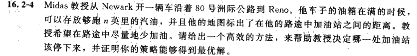

[toc]

# 2021 年 872 真题

> 文件来自苏州大学计算机考研群： 1094796091
>
> 题目由考生回忆，不是很全，如果还记得题目内容大家可以进群补充

## OS

### 1

判断题，如果错误说明理由。

1. 内核线程和用户级线程都需要内核支持
2. 磁盘i/o的顺序是 用户程序、 系统调用程序 、设备驱动程序 、系统调用
3. 键盘输入登录系统，最先收到响应的是中断程序
4. 不管系统是否支持线程，进程都是资源分配的基本单位
5. 一个互斥信号量，实现m个进程互斥访问，则信号量的取值范围是1到-m
6. 基于优先级的进程调度在任何时候 正在运行的进程优先级都比处于非等待状态的进程优先级高
7. 单处理器多个进程系统，程序在临界区时不能进行处理机调度

 ### 2

有没有安全和死锁以外的状态，有举例，没有证明

### 3

拼音输入法

（1） 设计文件逻辑结构 ，说明理由（2）设计存储结构 （3）同时使用输入法，码表如何存放

### 4 

pv题： 一座桥，两方两个队列， 一方无车时可以通过多辆，两方有车时，甲通过一辆乙通过一辆，要求实现此桥的PV

### 5

逻辑结构和物理结构都是32位，页表项4B，页偏移12位

1. 一级页表，页面多大，页表最大多少字节

2. 二级页表，页目录页索引各10位，设逻辑地址为ADD，求页目录和页索引

3. 设计一个系统，既有4mb的页，又有4kb的页，说出逻辑地址到物理地址的转换过程

## DS

### 1

选择题

1. x 为树的非根结点，bt 为 x 所在的二叉树，x 是双亲节点的右孩子，则 x（）

   A.一定是叶子节点 B.一定有左兄弟 C.一定没有右兄弟 D.

2. 平衡二叉树旋转，A是最小不平衡子树，它的左孩子的平衡因子为 1，右孩子平衡因子为 0，（左子树高度减去右子树）需要做什么调整（）

3. dijkstra，给了一个序列，让你选择哪个是对的。

4. 完全无序 相对顺序不变 选择稳定快速的排序算法，堆归插快四选一

5. 规则:双亲不大于孩子，左孩子不大于右孩子，1，2，3，4 个结点的二叉树分别有几种形态

### 2

判断题：

1. 后缀表达式用栈的数据结构

2. 高度为h的二叉树最多有2的h-1次方个叶结点

3. 拓扑排序最后一个结点出度一定是0

4. n个点无向图，边刚好成回路，则有n－1个生成树 

### 3

二叉树的路径长度是指根节点到每个叶子节点的路径长度之和，计算二叉树的路径长度总和(即根结点到每个结点的路径和)

### 4

递归算法，成对逆置单链表如1-2-3-4-5变为2-1-4-3-5

等于这道题：[24. 两两交换链表中的节点 - 力扣（LeetCode） (leetcode-cn.com)](https://leetcode-cn.com/problems/swap-nodes-in-pairs/)

当k = 2时，题目同：[25. K 个一组翻转链表 - 力扣（LeetCode） (leetcode-cn.com)](https://leetcode-cn.com/problems/reverse-nodes-in-k-group/)

### 5

加油站，数组A为需要消耗的路程有n个，A[i]为第i到第i+1的路径，准备一个数组存储需要加油的号码，初始汽车油量为d，设计算法，返回经过的加油站序号数组，要求经过的加油站最少。

返回，需要加油时加油站的序号的数组

> 此题出自算法导论第16章贪心算法课后习题 16.2-4

