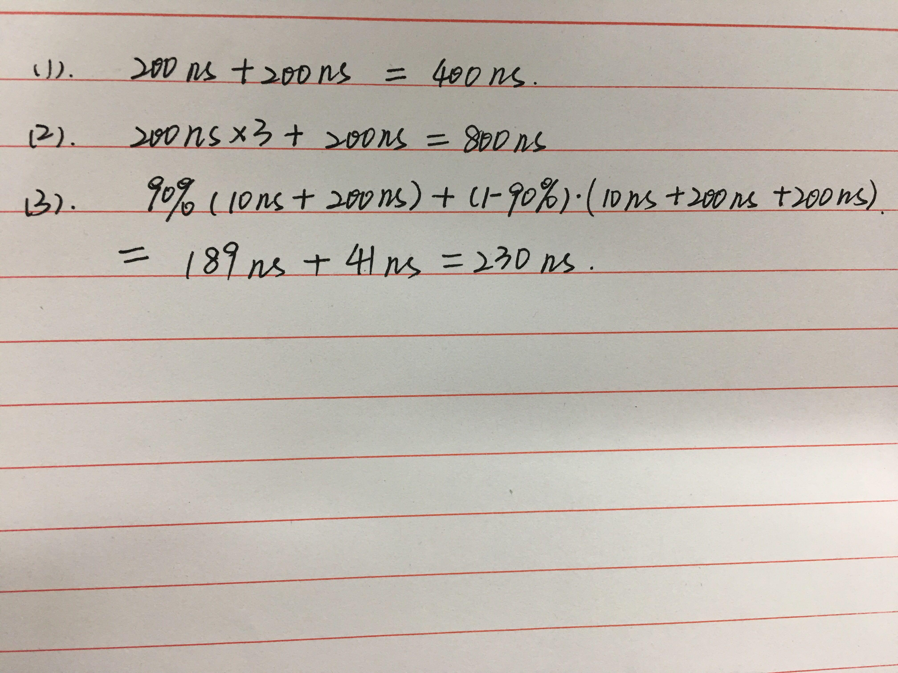
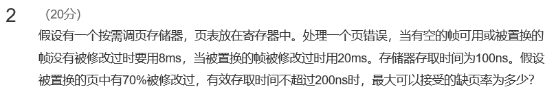
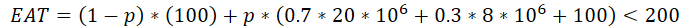

# MOOC上计算EAT的说明

  **答案：**  

页表在内存中     

1. 单级页表：200+200=400ns   

2. 三级，前三次得到页的物理地址，第四次根据地址访问内存：200+200+200+200=800ns       

3. 0.9*(10+200)+0.1*(10+200+10+200)=231 ns
   快表命中：10ns访问快表，200ns访问内存  
   快表未命中：10ns访问快表发现页不在快表中，200ns访问页表发生缺页，调入后访问快表再访问内存    

官方答案：

  

官方答案和上面答案不同的地方在于：  

**缺页置换完成后，上面的答案直接访问内存，而没有访问快表，所以少了10ns的运行时间  不同的原因请看最后的说明**  

**答案：**

1s=1000ms 1ms=1000us 1us=1000ns

设缺页率为p，则

计算出p约为0.613%

**官方答案：**

计算有效存取时间公式：EAT=(1-p)*100ns+p*t<=200ns，其中p为缺页率，t为缺页时的有效访问时间。

t的计算公式，t=8ms*（1-70%）+20ms*70% =16.4ms

代入EAT公式，求出最大p为1/163，约为0.613%。

**区别：**

1 官方答案中没有换算单位，按照ns和ms混合计算，我的做法直接换算成ns计算，两种方式都可以

2 官方答案中，发生缺页时，置换完成后不需要100ns的存储器存取时间，原因是mooc上有些算EAT的题目认为

一旦缺页置换完成后，直接访问页面即可，不需要额外的访问存储器，也不需要额外的访问页表

而我的做法是发生缺页后，CPU从头开始执行访问，即按照快表（如果有的话）-》页表的顺序访问，这也是王道操作系统上计算EAT的方式

## 释疑

在备考过程中我发现，MOOC老师对于两种做法都认可（可以翻阅历年的讨论区，有不少询问EAT的问题），之所以会出现两种做法，是因为具体的操作系统实现机制不同，有一些操作系统会在置换后直接访问页面，有一些操作系统置换后会从头开始执行访问过程，两种做法都合理，考试的时候写出自己的思路和依据即可。

如果实在不放心，可以按照MOOC上的做法答题