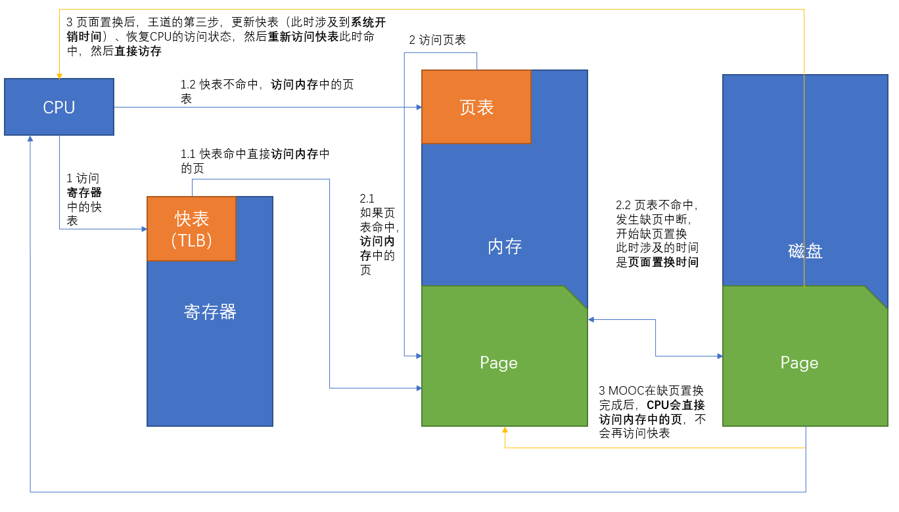
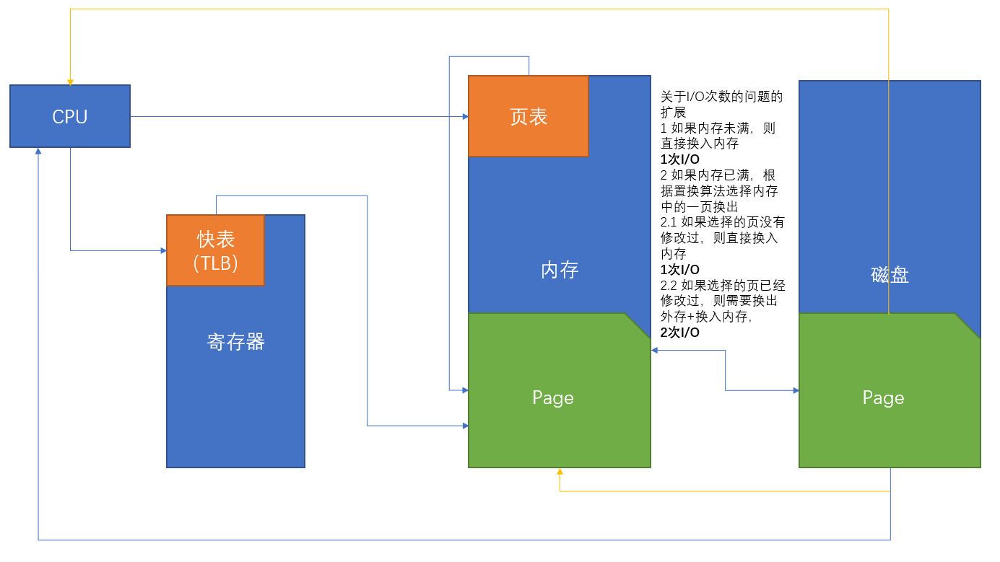

[toc]

# 分页管理中访问页面的流程

## 出处

> QQ：475679136制作
>
> 微店：黄学长的笔记

## 概述

之前

首先我们明确几个名词具体的意思

> TLB = 快表 = cache = 寄存器 
>
> 存储器 = 内存
>
> 硬盘 = 磁盘 = 外存
>
> 系统开销 =》 当发生中断时，系统一系列的开销，包括更新快表的时间
>
> 置换时间 =》 发生缺页置换的时候，置换流程所需要的时间
>
> 置换时间、系统开销两者没有重合关系

然后给出一个平均访问时间的流程图，仅仅以1级页表+TLB为例，多级页表可以扩充

王道的做法和苏大MOOC的做法唯一不同的时，当缺页置换完成后，王道会更新页表，恢复CPU的访问状态，按照快表->内存的顺序访问，而苏大MOOC的做法是，置换完成后直接访问内存中的页

然后分析一下题目中会提供给我们的时间

- 访问TLB的时间 x1
- 访问快表的时间 x2
- 访问内存的时间 x3
- 系统开销（这个很少提及） t
- 页面置换时间 r

由此，我们可以写出MOOC版缺页置换的流程

1. 访问TLB——x1
   1. 命中，直接访问内存中的页——x3
   2. 不命中
      1. 访问页表——x2
         1. 命中，直接访问内存中的页——x3
         2. 不命中，发生缺页中断，进行页面置换——r
            1. 置换完成后，<u>更新页表——这个时间包含于系统开销时间t中</u>（如果有给出系统开销时间，加上，没有给出则不加），然后访问页面中的内存——x3

## I/O次数补充内容

关于I/O次数的一点补充

