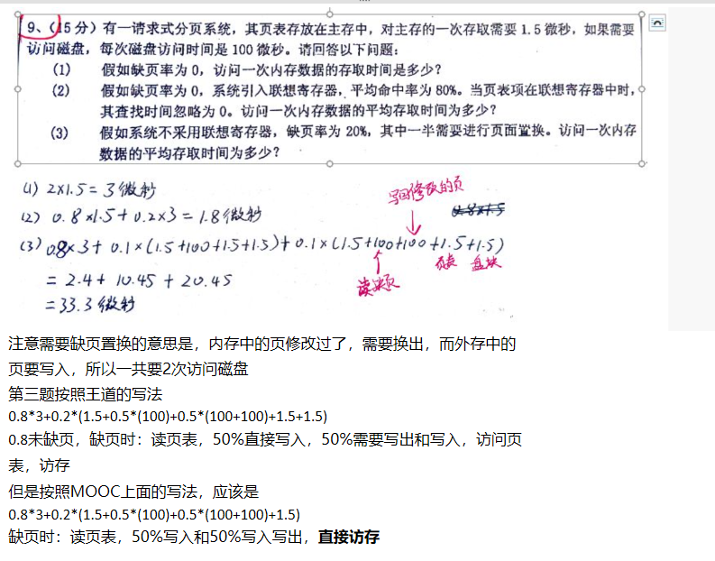
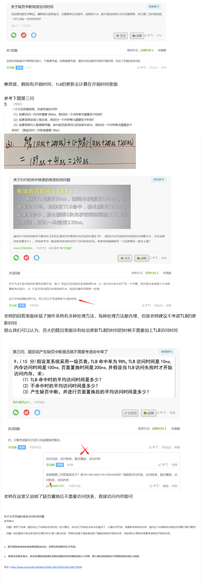

[toc]

# 缺页置换的流程

## 问题来源

王道关于缺页流程的描述：

CPU得到访问页面命令，去查表，发现缺页，此时发生中断，然后缺页置换，此后的页面置换流程对CPU来说**不可见**，置换时包括**更新页表**等一系列操作，置换完毕后**恢复CPU中断前的状态**，最关键的地方，**对CPU来说仿佛没有发生缺页一样**，此时CPU得到访问页面命令，<u>然后去访问页表</u>，发现目标页在内存中，直接访问页面

整体的流程如上述，有的同学纠结的是画线的地方

也就是置换后，到底是下述的哪种做法

1. 直接访问内存中置换进来的页面？
2. 从头开始访问快表/页表？

对于上述疑问，**其实涉及到的是操作系统的具体实现**，每种操作系统的实现不同，有的操作系统为了优化性能，绕过访问快表/页表的环节直接访问页面，有的操作系统则是从头开始访问页面

而上述的第二种做法，也是王道书上计算平均访问时间的方法，很多同学一开始做的是408的操作系统题目，转到苏大的MOOC题目后非常不适应，因为在做苏大OS的MOOC时候发现有些题目**会直接省略掉访问快表/页表的时间**，**有些题目又会加上**，于是就会产生上述的疑惑

## 分析

**理论上两种做法都正确**，只要正确的写出思路即可，如果实在不放心，**可以按照方法1来做题**，**建议也按照方法1来做题**，因为毕竟这是自主命题的考试，没有408考试那么严谨，大家还是按照官方的方法做题比较好，**即更新后直接访存**，毕竟MOOC上有一些题目的答案是用方法1来做题的

---

## 提问区汇总

下面贴一些我备考的时候汇总的关于平均访问时间的提问，**请大家自行整理总结**，因为最终决定怎么理解、用什么方法做题的是你，加油

按照MOOC上的做法，应该是下面那个式子，直接访存，不需要访问页表
但是看下图，老师对这种方法是肯定的，可见王道的计算方法也是可以用的

![麻 烦 老 师 看 一 下 我 这 样 写 对 不 对  0  9 、 5 分 ） 有 一 请 求 式 分 页 系 统 ， 其 页 表 存 放 在 主 存 中 ， 对 主 存 的 一 次 存 取 需 要 1.5 微 秒 ， 如 果 需 妥  访 问 磁 盘 ， 每 次 磁 盘 访 问 时 间 是 1 佣 微 秒 。 请 回 答 以 下 问 题 ：  (I) 假 如 缺 页 率 为 0 》 访 问 一 次 内 存 数 据 的 存 取 时 间 是 多 少 ？  〈 2 ） 假 如 缺 页 率 为 0 ， 系 统 引 入 联 想 寄 存 器 ， 平 均 命 中 率 为 8 · 当 页 表 项 在 联 想 寄 存 器 中 时 ，  其 查 找 时 间 忽 略 为 0 。 访 问 一 次 内 存 数 据 的 平 均 存 取 时 间 为 多 少 ？  （ 3 ） 假 如 系 统 不 采 用 联 想 寄 存 器 》 缺 页 率 为 2 》 其 中 一 半 需 要 进 行 页 面 置 換 · 访 问 一 次 内 存  数 据 的 平 均 存 取 时 间 为 多 少 ？  2 刈 ． 氵 = 3 彳 抄  眨 ） 伊 对 ． 氵 寻 3 二 彳 觳 钐  O) 口 g < 3 子 0 」 区 在 孓 到 00 ． 氵 引 5 ） 0 ． 凵 烈 00 却 孬 0 ． ． 氵 丿  = 2 4 地 孓 十 20 氵  二 33B 彳  1 1 月 22 日  m00C70963020 一  共 1 回 复  对 。  老 师  老 师 参 与  排 序 方 式 ： 回 复 时 间 ：  举 报  投 票 数  的 0 哣 评 论 （ 1 ） 《 举 报 ](MdAsset/缺页置换的流程/clip_image001.png)

下面是一张长图，是我备考的时候对提问区里面关于访问时间问题的汇总

---

### 最新答复

老师的意思是如果题目提到系统开销，则加上系统开销直接访盘，如果没有提到系统开销，置换后直接访盘
