[toc]

# 真题PV汇总

> QQ：475679136制作
>
> 微店：黄学长的笔记
>
> B站：一条黄学长
>
> 只提供题目，答案见资料

## 04年 FCFS的读写者PV

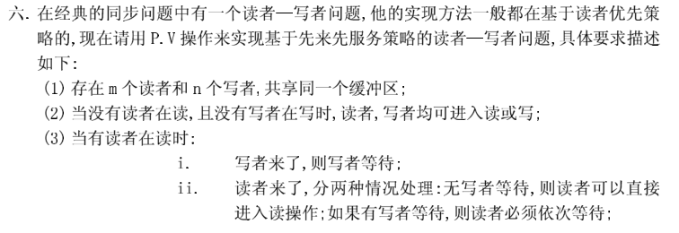

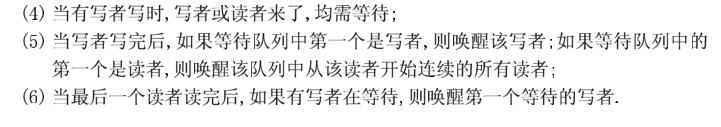

## 05 年 服务员-男顾客-女顾客 PV

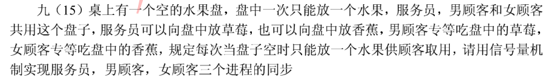

## 06 年 PV

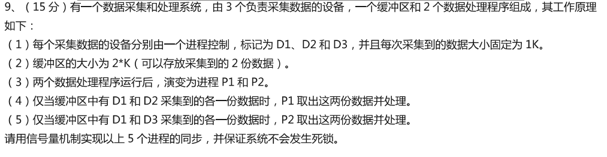

## 07年 多加了一根筷子的哲学家PV

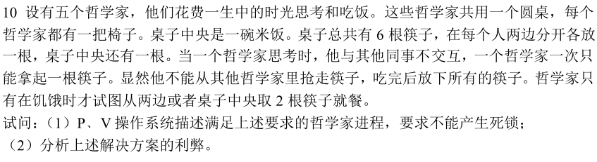

## 11年 自己设计一个PV

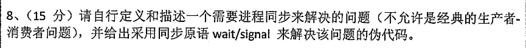

## 12年 理发师PV问题

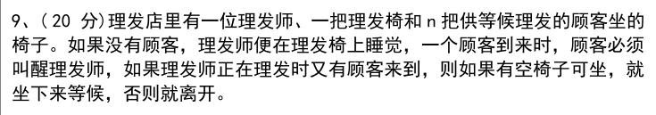

## 12年 版本2 PV

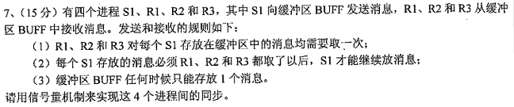

## 14年 PV 题目同12年

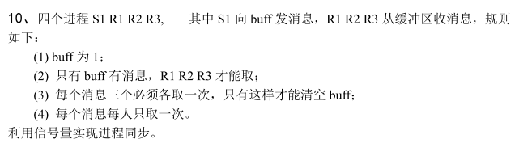

## 15年 PV

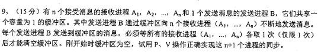

## 16年 PV

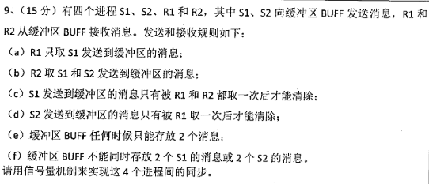

## 17年 管程实现读者优先PV

注意这一年考的是管程PV，真题答案最后有一个笔记是专门分析如何写出管程读写者PV的，可以参考思路

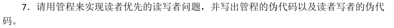

## 19年 PV

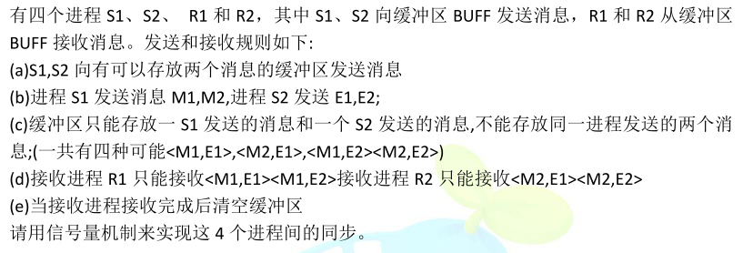

## 20年PV

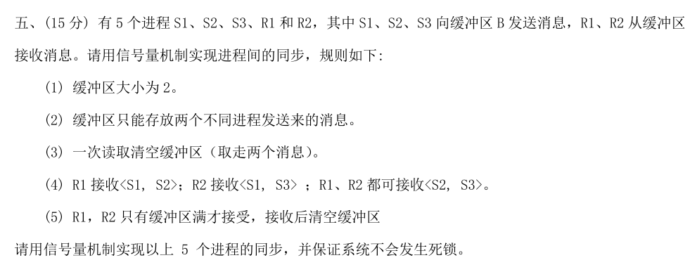

## 分析

04~20年共17年，考察了13次PV，而15~20年这6年考察了5次PV，可见PV是很高频的考点。
另外从14年的PV开始，喜欢考察多个进程发消息，多个进程接消息，缓冲区带限制，接收消息有组合限制这种题型，最早是12年版本2的真题提出，14年又考察了一次，16年开始PV大题开始变复杂，而19、20年两道PV大题和16年非常相似。