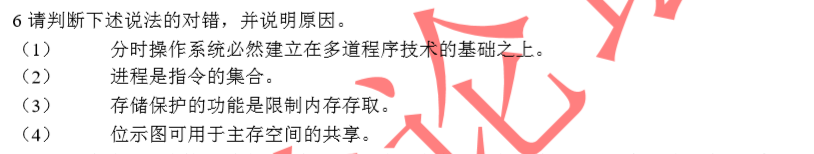
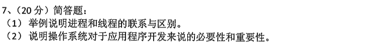

[toc]

# 操作系统简答题汇总

> QQ：475679136制作
>
> 微店：黄学长的笔记
>
> B站：一条黄学长
>
> 只提供题目，答案见资料

之前汇总了**I/O次数、PV、内存管理、调度、文件系统**，共五个题型，这次整理操作系统的简答题
由于苏大的判断题需要说明理由，所以判断题也归类为简答题

汇总完之后，结合上述的5个汇总，覆盖真题操作系统的所有题目

本次整理主要是将上述五个题型里面遗漏的简答题、判断题归类

一道题分类为简答题的依据是：不涉及计算，不涉及对题目的分析，仅仅是对知识点的判断、解释，或对知识点的归纳总结。

凡是涉及到计算、分析的题目，均已经被归类为相应的题型（如内存管理、调度等），凡是题型很明显的题目（如文件系统设计）也已经被归类
一些有必要被归类为简答题但已经被上面5个题型收纳的题目，会在题目后说明该题之前被归类到哪个题型

为减轻负担，减少题型归纳里面的交集，按照上面的依据进行分类。

## 判断题

### 06年

### 07年

### 08年

### 11年

### 13年

### 14年

### 15年

### 16年

### 17年

## 简答题

### 04年

### 05年

### 06年

### 07年

### 08年

### 10年

10 年的题目都是简答题的形式，其中7、8、9题已经归类到相应的文件系统、内存管理、调度题型中

### 11年

### 12年

7题已经整理到文件系统题型

### 12年版本2

### 13年

10题被归类到文件系统题型

### 14年

7题被归类到文件系统题型

### 18年

### 20年

三题已经整理到内存管理题型中

