[toc]

# 文件系统题型汇总

> QQ：475679136制作
>
> 微店：黄学长的笔记
>
> B站：一条黄学长
>
> 只提供题目，答案见资料

只提供题目，答案见资料

## 06年 设计文件系统

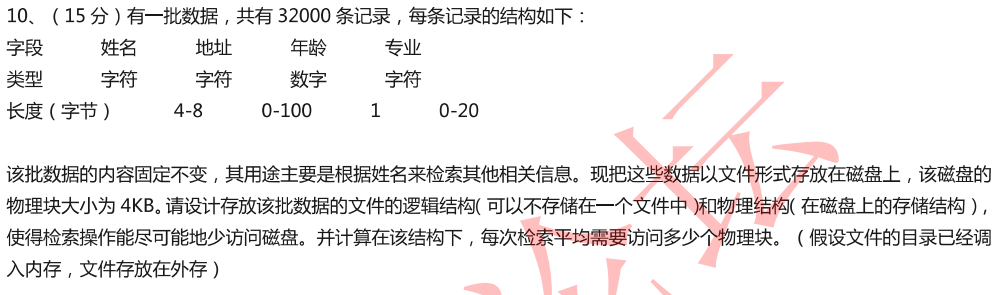

## 07年 文件访问方式

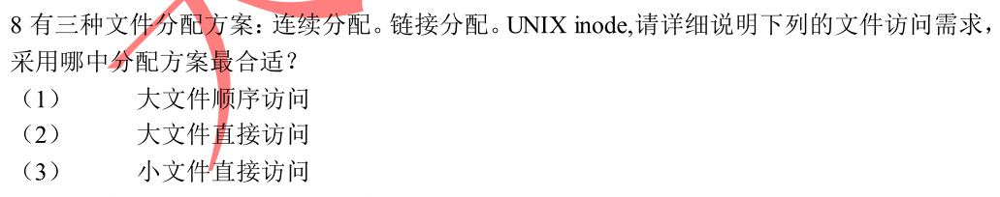

## 10年 文件目录项、文件目录、目录文件区别

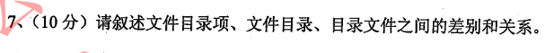

## 12年 文件目录结构

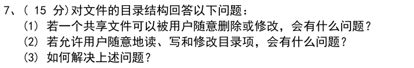

## 13年 目录相关

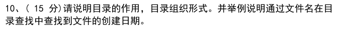

## 14年 如何提高存取速度

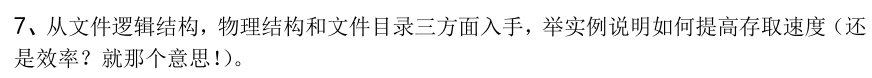

## 15年 设计文件系统

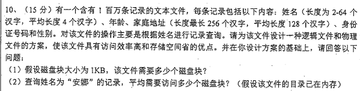

## 16年 设计文件系统

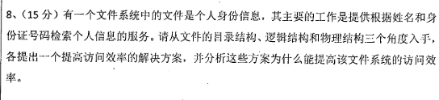

## 17年 综合题

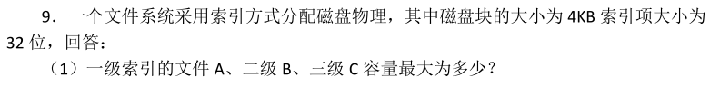

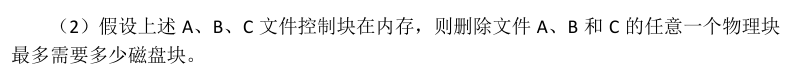

## 19年 设计文件系统

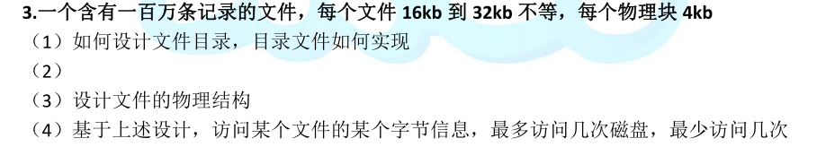

## 20年综合题

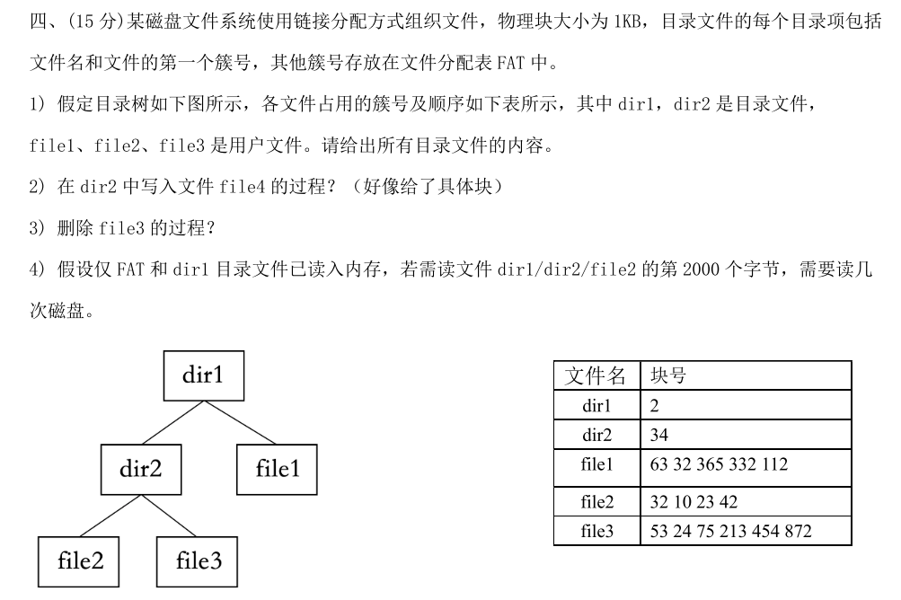

