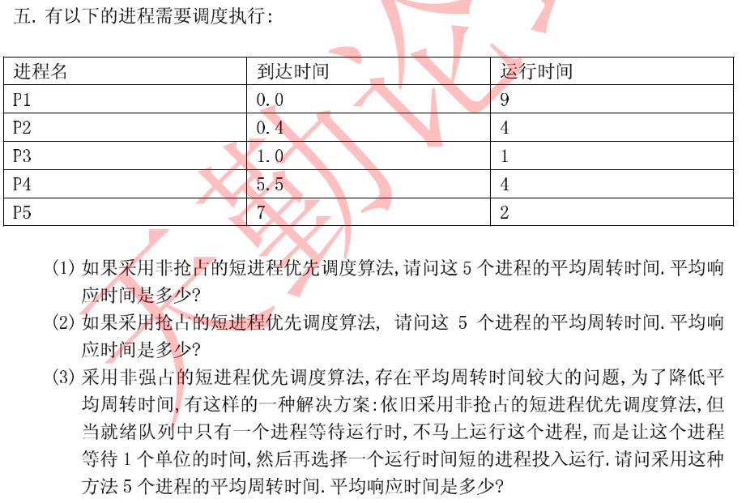
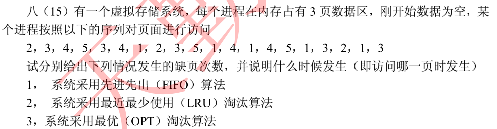
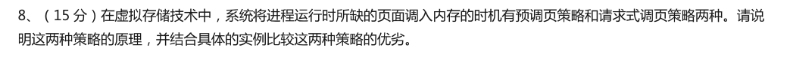
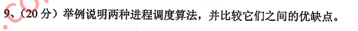
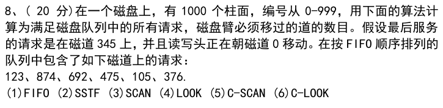
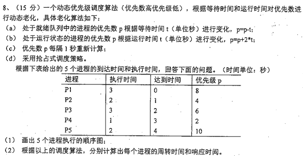
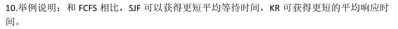
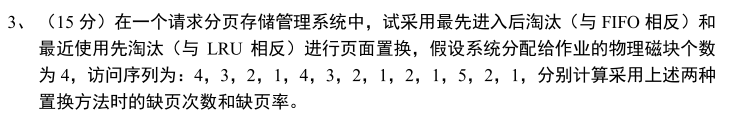

[toc]

# 调度题型汇总

> QQ：475679136制作
>
> 微店：黄学长的笔记
>
> B站：一条黄学长
>
> 只提供题目，答案见资料

调度题型包括

> 进程调度
>
> 磁盘调度
>
> 缺页调度

汇总以上三种类型题目

只提供题目，答案见资料

## 04年 进程调度

## 05年 缺页调度

## 06年 缺页调度策略比较

## 10年 调度算法比较

## 12年 磁盘调度

## 15年 进程调度

## 17年 调度算法比较

## 18年 缺页置换

## 19年 调度算法相关

## 20年 调度算法比较

