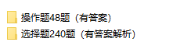

[toc]

# 复试指南

> QQ：475679136 整理
>
> 苏大计算机考研交流群：1094796091
>
> **仅仅作为参考意见，请自己辨析信息价值**

## 公告链接

分数线，查分，各种公告来源

建议每天检查一遍，防止漏掉通知

[研究生院 (suda.edu.cn)](http://yjs.suda.edu.cn/)

[计算机科学与技术学院 (suda.edu.cn)](http://scst.suda.edu.cn/)

## 去年复试方案

[2020年硕士研究生招生考试复试学生提交材料要求 (suda.edu.cn)](http://scst.suda.edu.cn/aa/9e/c11205a371358/page.htm)

[硕士研究生复试编程考试准备要点 (suda.edu.cn)](http://scst.suda.edu.cn/16/fb/c11205a268027/page.htm)

[2020年研究生入学考试复试方案](http://scst.suda.edu.cn/_upload/article/files/5b/50/58ce40d341b38a5dbd96c98d465c/b6a4c4d5-be09-4130-a5b2-627f8ab81319.pdf)

## 参考教材

官方推荐：

1、参考教材：《Python程序设计（第2版）》第1-8章，清华大学出版社，董付国；ISBN：978-7-302-43651-5。

[Python程序设计基础 (豆瓣) (douban.com)](https://book.douban.com/subject/27139151/)

> 看书，做习题，看完一遍python应该会比较熟练了

2、学习视频：中国大学MOOC（https://www.icourse163.org/）；课程名称：Python程序设计；开课学校：苏州大学；主讲：朱晓旭、赵雷、刘安、姜小峰。
[Python程序设计_苏州大学_中国大学MOOC(慕课) (icourse163.org)](https://www.icourse163.org/course/SUDA-1206947804?tid=1450431473)

> 刷里面的题目，评论区老师贴的leetcode题目也做一下

## 相关资源

- 面试

英语不好的去把专业单词背了：

[计算机单词卡 | Quizlet](https://quizlet.com/cn/397997024/计算机-flash-cards/)

推荐一个公众号：程序员宝藏，里面有一些面试题的汇总，可以去看看，这里就不放了

- 上机

往年复试题目汇总：

[hhmy27/SUDA_UNGEE_CODE: 包含了苏州大学考研初复试的所有算法题，欢迎添加你的答案 (github.com)](https://github.com/hhmy27/SUDA_UNGEE_CODE)

[Zaaachary/Python-Foundation-Suda: Python Foundation; Soochow University Python; 苏州大学复试上机 (github.com)](https://github.com/Zaaachary/Python-Foundation-Suda)

里面有官方的习题集：

[2020级Python语言程序设计课程](http://192.168.125.3/python/)

## 复试流程

- 面试

- 上机，指定语言Python

### 面试

面试一般有下面的环节：

- 自我介绍

  中英文都要准备，以防万一

  介绍主要是简短精确，姓名，籍贯，毕业院校，四六级情况，本科获奖情况，以及一切能体现你编程能力的东西

- 一小段CS相关英语翻译

  **翻译文本的来源就是苏大本科生用的英文教材，从教材里面摘抄一段过来作为题目**

- 计算机专业相关的问题

  涉及的范围很广，包括并且不局限于数据库、计算机网络、操作系统、数据结构，平时多看多学

### 上机

- 选择题

  很常规的题目

- 编程

  说不好具体怎么考，应对的关键是提高代码能力，代码能力上去了它怎么考都能写出来

## 复试建议

- 提高编程能力

机试决定了你能不能上岸，机试做不好就直接被刷了，很可惜。

苏大官方指定那本教材最好看完，把上面例题和练习题做一遍，不要嫌烦。

学完了可以刷力扣，刷简单题就够了，时不时刷一些中等也可以。题目可以去MOOC苏大python的评论区看，老师会贴题目

苏大的机试说真的不难，编程能力好一些的人很快就能做完。

- 复习计算机专业课

面试的时候会抽专业课题目，不管你是跨考生还是本专业的考生，最好都看一下，下面是推荐书目：

[计算机网络 (豆瓣) (douban.com)](https://book.douban.com/subject/2970300/)

[数据库系统概论（第5版） (豆瓣) (douban.com)](https://book.douban.com/subject/26317662/)

[大话数据结构 (豆瓣) (douban.com)](https://book.douban.com/subject/6424904/)

[算法笔记 (豆瓣) (douban.com)](https://book.douban.com/subject/26827295/)

还有离散数学，计算机组成原理，Linux，面向对象的知识最好也读下

面试题目范围真的很广，CS本来就是很大的领域，只能平时多积累。

至少让老师觉得你具有一个计算机本科生的平均素质，不要什么都不会。

另外考察的问题不限于课本，还有实际开发遇到的问题，例如：char和varchar的区别

- 积累

这个真没什么好说的，学习只有坚持二字，没有捷径。

## 更多信息

查看我之前的经验帖，之前陆续写了一些复试联系导师、研究生学费的信息，限于篇幅就不在这里贴了

## 题目

个人整理了一些**题目**，帮助复习，需要的话联系我购买。

本科试题

等级考试试题

习题集

3个练习+文件操作专题+8份试卷

