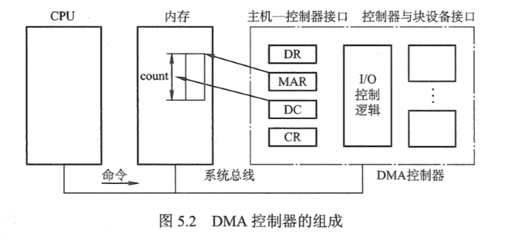

[toc]

# 操作系统复试题  

## **第一章、计算机系统概述**

***快速唤起记忆的知识框架***

### **1.操作系统的目标和功能？（什么是操作系统？）**

(1)**方便性**（极大方便了用户，使计算机变得易学易用）

(2)**有效性**（一层含义：提高系统资源的利用率；二层含义：提高系统的吞吐量）

(3)**可扩充性**（OS广泛采用微内核技术，能够方便地添加新的功能模块）

(4)**开放性**（遵循国际标准，使得各种软硬件能够彼此兼容）

功能：分配资源，隔离硬件软件，提供服务和接口，实现对资源的抽象（文件系统，进程管理）

> **1.操作系统是计算机资源的管理者**
>
> **处理机管理**（进程控制、进程同步、进程通信、死锁处理、处理机调度）
> **存储器管理**（提高内存利用率，内存的分配与回收、地址映射、内存保护与共享、内存扩充）
> **文件管理**（计算机中的信息都是以文件的形式存在的）
> **设备管理**（完成用户的I/O请求，方便用户使用设备、并提高设备的利用率**）**
>
> **2.操作系统为用户提供使用计算机硬件系统的接口**
>
> **命令接口**（用户通过控制台或终端输入操作命令，向系统提供各种服务要求）
> **程序接口**（由`系统调用`组成，用户在程序中使用这些系统调用来请求操作系统为其提供服务）
> **图形接口** 最常见的`图形用户界面GUI`（最终还是通过调用程序接口实现的）
>
> **3.操作系统用作扩充机器**
>
> 没有任何软件支持的计算机称为裸机，实际呈现在用户面前的计算机系统是经过若干层软件改造的计算机。操作系统将裸机改造成功能更强、使用更方便的机器。我们将覆盖了软件的机器称为扩充机器或虚拟机。

------

### **2.操作系统的运行机制?**

> **1.内核程序和应用程序(内核态和用户态)**
>
> 在计算机系统中，通常CPU执行两种不同性质的程序：一种是操作系统内核程序；另一种是用户自编程序或系统外层的应用程序。内核程序是应用程序的”管理者”。“管理程序“可以执行一些特权指令，而”被管理程序“出于安全考虑不能执行这些指令。所谓特权指令，是指计算机中不允许用户直接使用的指令，如：I/O指令、置中断指令，存取用于内存保护的寄存器，送程序状态字到程序状态字寄存器等指令。
> 操作系统在具体实现上划分了用户态（目态）和核心态（管态），以严格区分两类程序。
>
> **2.层次式结构**
>
> 操作系统的各项功能分别被设置在不同的层次上。一些与硬件关联较紧密的模块，诸如时钟管理、中断管理、设备驱动等处于最底层。其次是运行频率较高的程序，诸如进程管理、存储管理和设备管理等。 上面的这两部分内容构成了操作系统的内核，这部分内容的指令操作工作在核心态。
>
> **3.内核**
>
> 内核是计算机上配置的底层软件，是计算机功能的延伸，包括以下4个方面的内容：
> 1）**时钟管理** 时钟的第一功能是计时，操作系统需要通过时钟管理，向用户提供标准的系统时间。其次，通过时钟中断的管理，可以实现进程的切换。在分时操作系统中，采用时间片轮转调度的实现；在实时系统中，按截至时间控制运行的实现；在批处理系统中，通过时钟管理来衡量一个作业的运行程度等。
> 2）**中断机制** 引入中断技术的初衷是提高多道程序运行环境中CPU的利用率，主要针对外部设备。后来逐步得到发展，形成了多种类型，成为操作系统各项操作的基础。如，键盘或鼠标信息的输入、进程的管理和调度、系统功能的调用、设备驱动、文件访问等。都依赖于中断机制。可以说，现代操作系统是靠中断驱动的软件。中断机制中，只有一小部分功能属于内核，负责保护和恢复中断现场的信息，转移控制权到相关的处理程序。这样可以减少中断的处理时间，提高系统的并行处理能力。
> 3）**原语** 操作系统底层是一些可被调用的公用小程序，它们各自完成一个规定的操作，其特点是：
> ------ 它们处于操作系统的最底层，是最接近硬件的部分。
> ------ 这些程序的运行具有原子性，其操作只能一气呵成
> ------ 这些程序的运行时间都较短，而且调用频繁。
> 定义原语的直接方法是关闭中断，让它的所有动作不可分割地进行完再打开中断。
> 4）**系统控制的数据结构及处理** 系统中用来登记状态信息的数据结构很多，比如：作业控制块、进程控制块、设备控制块、各类链表等。为了实现有效的管理，系统需要一些基本的操作，常见的操作有以下三种：
> ------ 进程管理：进程状态管理、进程调度和分配、创建和撤销进程控制块等。
> ------ 存储器管理：存储器的空间分配和回收、内存信息保护程序、代码对换程序等。
> ------ 设备管理：缓冲区管理、设备分配和回收等。

------

### **3.中断和异常？**

中断：例如，CPU和打印机的操作可以同时进行，当打印机处理完之后，会通知CPU，CPU此时发生中断，然后进行相关处理，处理完之后再回到原先的状态。
整个过程依赖于中断技术

异常：异常是为了检测和处理CPU执行时候的异常，例如除0异常，读写越界，数据越界等

> **1.中断的引入——为了支持CPU和设备之间的并行操作**
>
> 中断也称外中断，指来自CPU执行指令以外的事件的发生，如设备发出的I/O结束中断、时钟中断等。这一类中断通常是与当前执行的指令无关的事件。
>
> **2.异常的引入——表示CPU执行指令本身时出现的问题**
>
> 异常也称内中断、例外或陷入，指源自CPU执行指令内部的事件，如程序的非法操作码、地址越界、算术溢出、缺页异常等。对异常的处理一般要依赖与当前程序的运行现场，不能被屏蔽。
>
> **3.中断和异常的联系与区别**

> **4.中断执行的流程**

以上是多重中断的流程，其中，1~3步是由硬件（中断隐指令）完成的；4-9步是由中断服务程序完成的。

### **4.系统调用？**

只有OS有权限访问硬件资源，用户程序是不能访问的。但是有时候用户程序需要用到这些资源，因此OS向上提供了一系列的系统调用功能，比如说读写文件等操作供用户使用。如果程序想要访问硬件资源，可以通过系统调用来访问。
实现系统调用一方面原因是考虑安全性，如果用户自由修改访问硬件资源的话，就会有很大的隐患。第二个就是封装好API供用户使用，用户不必关心系统是如何实现这些API的，提高了使用的效率。
系统调用隔离了用户和内核，提高了操作系统的安全性，同时屏蔽了底层细节，程序直接调用即可，不需要关心实现

> 计算机系统的各种硬件资源是有限，为了更好的管理这些资源，进程是不允许直接操作的，所有对这些资源的访问都必须有操作系统控制。**也就是说操作系统是使用这些资源的唯一入口，而这个入口就是操作系统提供的系统调用**。一般地，系统调用都是通过中断实现的，比如，linux下中断号0x80就是进行系统调用的。
>
> 操作系统为用户态进程与硬件设备进行交互提供了一组接口——系统调用:1.把用户从底层的硬件编程中解放了出来;2.极大地提高了系统的安全性使用户程序具有可移植性；用户程序与具体硬件已经被抽象接口所替代。
>
> 系统调用流程图如下：

------

### **5.操作系统体系结构**

> **1.整体结构**
>
> 整体结构是把所有功能和服务都整合在一起，这种结构的OS视为一个整体。
> 优点：整合了所有功能，方便
> 缺点：难以维护、占用过多
>
> **2.层次结构**
>
> 按照功能分层，每一层之间提供服务，就像网络模型一样
> 优点：调用流程清晰，提供了简单易用的接口
> 缺点：实际操作中不好划分层次
>
> **3.模块化结构**
>
> 功能抽象成模块，需要使用的时候再实现具体的功能
> 优点：减少资源占用
> 缺点：系统的稳定性可能不好
>
> **4.微内核**
>
> 由于操作系统不断复杂，因此将一部分操作系统功能移出内核，从而降低内核的复杂性。移出的部分根据分层的原则划分成若干服务，相互独立。 在微内核结构下，操作系统被划分成小的、定义良好的模块，只有微内核这一个模块运行在内核态，其余模块运行在用户态。 因为需要频繁地在用户态和核心态之间进行切换，所以会有一定的性能损失。

---

## **第二章、进程管理**

***快速唤起记忆的知识框架***

------

### 进程和程序？

程序是静态的，包括代码和数据，而进程是动态的，也就是说进程是运行着的程序，进程拥有OS分配的堆栈，代码区，还有用于管理的PCB，而程序则没有。进程可以创建其它进程，但是程序不能创建其它程序。

### **6.进程与线程？**

进程就是程序的运行实体，当程序运行的时候，OS就会创建进程，在内存中给进程分配空间，进程拥有代码，文本，栈区，堆区，进程创建的时候会读入数据，栈区和堆区是运行的时候存放数据用的。

线程是进程的衍生概念，一个进程可能有多个线程，但是一个线程只能对应一个进程。进程在运行过程中可能会创建多个线程，同一个进程下面的线程之间传递信息、切换线程很方便。引入线程之后，线程就是OS调度的最小单位。

1. 单位：引入线程之前，进程是OS资源分配和调度的最小单位，引入线程之后,线程就是OS调度的最小单位。
2. 开销：同一个进程下面切换线程开销很小，但是不同进程之间切换进程开销很大，因为需要涉及保存上下文，切换当前进程等操作
3. 通信：同一个进程下面的线程共享资源和数据，通信很方便，但是不同进程之间的通信方式比较麻烦
4. 创建和销毁：进程拥有PCB，堆栈，创建和销毁的开销都比线程大，而线程创建或销毁的开销会比较小
5. 地址：进程拥有独立的地址空间，而线程的空间是父进程的空间
6. 安全：多线程的进程里面，只要有一个线程出错，整个进程就会崩溃，而多进程崩溃一个进程并不会影响其它进程

> **1.进程的概念与定义**
>
> 在多道程序环境下，允许多个进程并发执行，此时他们将失去封闭性，并具有间断性及不可再现性的特征。为此引入了进程的概念，以便更好地描述和控制程序的并发执行，实现操作系统的并发性和共享性。
> **进程是程序的运行过程，是系统进行资源分配和调度的一个独立单位。**
>
> **2.线程的概念和定义**
>
> 早期，在OS中能拥有资源和独立运行的基本单位是进程，然而随着计算机技术的发展，进程出现了很多弊端，一是由于进程是资源拥有者，创建、撤消与切换存在较大的时空开销，因此需要引入轻型进程；二是由于对称多处理机（SMP）出现，可以满足多个运行单位，而多个进程并行开销过大。
> **线程是操作系统能够进行运算调度的最小单位。**它被包含在进程之中，是进程中的实际运作单位。**一条线程指的是进程中一个单一顺序的控制流，每条线程执行不同的任务。**
>
> **3.进程和线程的区别**
>
> 1.进程（Process）是系统进行资源分配和调度的基本单位，线程（Thread）是CPU调度和分派的基本单位；
> 2.线程依赖于进程而存在，一个进程至少有一个线程；
> **3.进程有自己的独立地址空间，线程共享所属进程的地址空间；**
> **4.进程是拥有系统资源的一个独立单位**，而**线程自己基本上不拥有系统资源**，只拥有一点在运行中必不可少的资源(如程序计数器,一组寄存器和栈)，和其他线程共享本进程的相关资源如内存、I/O、cpu等；
> 5.在进程切换时，**涉及到整个当前进程CPU环境的保存环境的设置以及新被调度运行的CPU环境的设置**，而**线程切换只需保存和设置少量的寄存器的内容**，并不涉及存储器管理方面的操作，可见，**进程切换的开销远大于线程切换的开销；**
> 6.线程之间的通信更方便，**同一进程下的线程共享全局变量等数据**，而进程之间的通信需要以进程间通信(IPC)的方式进行；
> 7.多**线程程序只要有一个线程崩溃，整个程序就崩溃了**，但**多进程程序中一个进程崩溃并不会对其它进程造成影响，因为进程有自己的独立地址空间，因此多进程更加健壮**
>
> 4.**进程和程序的区别**
>
> （1） 程序是永存的；进程是暂时的，是程序在数据集上的一次执行，有创建有撤销，存在是暂时的； （2）程序是静态的观念，进程是动态的观念； （3）进程具有并发性，而程序没有； （4）进程是竞争计算机资源的基本单位，程序不是。 （5）进程和程序不是一一对应的： 一个程序可对应多个进程即多个进程可执行同一程序； 一个进程可以执行一个或几个程序

------

### **7.进程的通信方式？**

> **1.共享内存**
>
> 顾名思义，共享内存就是**两个进程同时共享一块内存，然后在这块内存上的数据可以共同修改和读取**，达到通信的目的。
>
> 2.管道
>
> 管道也是一种文件，一般大小是4k字节，通过管道可以读写文件实现通信
>
> **4.消息队列**
>
> **消息队列是由消息的链表，存放在内核中并由消息队列标识符标识。消息队列克服了信号传递信息少、管道只能承载无格式字节流以及缓冲区大小受限等缺点。**
>
> **5.套接字**
>
> 如果是网络通信的话可以用socket套接字，套接字是网络编程的api，**通过套接字可以不同的机器间的进程进行通信**，常用于客户端进程和服务器进程的通信。
>
> **6.信号**
>
> 信号是Unix系统中使用的最古老的进程间通信的方法之一。操作系统通过信号来通知进程系统中发生了某种预先规定好的事件（一组事件中的一个），它也是用户进程之间通信和同步的一种原始机制。**一个键盘中断或者一个错误条件（比如进程试图访问它的虚拟内存中不存在的位置等）都有可能产生一个信号。** Shell也使用信号向它的子进程发送作业控制信号。

------

### **8.进程的5种状态及转换过程？**

新建、就绪，执行，阻塞，终止

进程新建之后就会进入到就绪队列中等待调度，如果资源分配到该进程，就会进入CPU执行任务，如果执行过程中发生了某些事件必须要等待，例如等待打印机打印完成，那么该进程就会进入到阻塞态，CPU会切换其它进程执行，如果事件完成，该进程会从阻塞态进入到就绪态。如果进程在执行过程中时间片用完，那么会直接进入到就绪态，等待下一轮的使用。
进程任务完成后，就会进入终止态，这一步OS会销毁进程，回收内存空间

------

### **9.进程的调度算法有哪些？**

> **1.先来先服务 first-come first-serverd（FCFS）**
>
> 按照请求的顺序进行调度。
> 非抢占式，开销小，无饥饿问题，响应时间不确定（可能很慢）；
> 对短进程不利，对IO密集型进程不利。 IO密集型可能只是需要执行一下**打印命令的短进程**
>
> **2.最短作业优先 shortest job first（SJF）**
>
> 按**估计运行时间最短**的顺序进行调度。非抢占或非抢占式，可能导致饥饿问题；
> 对短进程提供好的响应时间，对长进程不利，对CPU密集型不利。CPU需要执行一段时间的计算，因此一般是长进程
>
> **3.优先级调度算法**
>
> 为每个进程分配一个优先级，按优先级进行调度。
> 固定的优先级调度可能会导致饥饿，为了防止低优先级的进程永远等不到调度，可以随着时间的推移增加等待进程的优先级。
>
> 4.**时间片轮转**
>
> 将所有就绪进程按 FCFS 的原则排成一个队列，用完时间片的进程排到队列最后。**抢占式**（时间片用完时），无饥饿问题，为短进程提供好的响应时间；
> 若时间片小，**进程切换频繁**，吞吐量低；若**时间片太长**，实时性得不到保证，会退化成FCFS
>
> 5.**最高响应比优先**
>
> **响应比 = 1+ 等待时间/处理时间**。同时考虑了等待时间的长短和估计需要的执行时间长短，很好的平衡了长短进程。非抢占，吞吐量高，开销可能较大，提供好的响应时间，无饥饿问题。
>
> **6.多级反馈队列调度算法**
>
> 设置多个就绪队列1、2、3...，**优先级递减，时间片递增**。只有等到优先级更高的队列为空时才会调度当前队列中的进程。如果进程用完了当前队列的时间片还未执行完，则会被移到下一队列。
> 抢占式（时间片用完时），开销可能较大，对IO型进程有利，可能会出现饥饿问题。

------

### **10.同步和互斥？**

> **1.同步**
>
> **多个进程因为合作而使得进程的执行有一定的先后顺序**。**比如某个进程需要另一个进程提供的消息**，获得消息之前进入阻塞态；
>
> **2.互斥**
>
> **多个进程在同一时刻只有一个进程能进入临界区**
>
> **3.同步机制的4个准则**
>
> 1.空闲让进 当无进程处于临界区，可允许一个请求进入临界区的进程立即进入自己的临界区
> 2.忙则等待 当已有进程进入自己的临界区，所有企图进入临界区的进程必须等待
> 3.有限等待 对要求访问临界资源的进程，应保证该进程能在有限时间内进入自己的临界区
> 4.让权等待 当进程不能进入自己的临界区，应释放处理机

------

### **11.进程同步相关概念**

> 为什么需要进程同步：进程有时候会和其他进程共享一些资源，比如内存、数据库等。当多个进程同时读写同一份共享资源的时候，可能会发生冲突。因此需要进程的同步，多个进程按顺序访问资源。
>
> **互斥量** Mutex：互斥量是内核对象，只有拥有互斥对象的线程才有访问互斥资源的权限。因为互斥对象只有一个，所以可以保证互斥资源不会被多个线程同时访问；当前拥有互斥对象的线程处理完任务后必须将互斥对象交出，以便其他线程访问该资源；
>
> **信号量** Semaphore：信号量是内核对象，它允许同一时刻多个线程访问同一资源，但是需要控制同一时刻访问此资源的最大线程数量。信号量对象保存了**最大资源计数**和**当前可用资源计数**，每增加一个线程对共享资源的访问，当前可用资源计数就减1，只要当前可用资源计数大于0，就可以发出信号量信号，如果为0，则将线程放入一个队列中等待。线程处理完共享资源后，应在离开的同时通过`ReleaseSemaphore`函数将当前可用资源数加1。如果信号量的取值只能为0或1，那么信号量就成为了互斥量；
>
> **事件** Event：允许一个线程在处理完一个任务后，主动唤醒另外一个线程执行任务。事件分为手动重置事件和自动重置事件。手动重置事件被设置为激发状态后，会唤醒所有等待的线程，而且一直保持为激发状态，直到程序重新把它设置为未激发状态。自动重置事件被设置为激发状态后，会唤醒**一个**等待中的线程，然后自动恢复为未激发状态。
>
> **临界区** Critical Section：指的是访问资源的那段代码，任意时刻只允许一个线程对临界资源进行访问。拥有临界区对象的线程可以访问该临界资源，其它试图访问该资源的线程将被挂起，直到临界区对象被释放。

------

### **12.死锁**

> **1.死锁的定义**
>
> 是指两个或两个以上的进程在执行过程中，因争夺资源而造成的一种互相等待的现象，若无外力作用，它们都将无法推进下去。此时称系统处于死锁状态或系统产生了死锁，这些永远在互相等待的进程称为死锁进程。
>
> **2.死锁原因**：
>
> ① **系统资源不足**（对不可剥夺资源的竞争）
> ② **进程推进顺序不当**（P1拥有A申请B，P2拥有B申请A）
>
> **3.产生死锁的必要条件**：
>
> ① 互斥条件：**指进程对所分配到的资源进行排它性使用**，即在一段时间内某资源只由一个进程占用。
> ② 请求和保持条件：**指进程已经保持至少一个资源，但又提出了新的资源请求**，而该资源已被其它进程占有，此时请求进程阻塞，但又对自己已获得的其它资源保持不放。
> ③ 不剥夺条件：指进程已获得的资源，在未使用完之前，**不能被剥夺**，只能在使用完时由自己释放
> ④ 环路等待条件：指在发生死锁时，**必然存在一个进程资源的环形链**。
>
> **4.处理死锁的基本方法：**
>
> ① 预防死锁：这是一种较简单和直观的事先预防的方法。方法是通过设置某些限制条件，去**破坏产生死锁的四个必要条件中的一个或者几个，来预防发生死锁**。预防死锁是一种较易实现的方法，已被广泛使用。但是由于所施加的限制条件往往太严格，可能会**导致系统资源利用率和系统吞吐量降低。**
>
> ② 避免死锁：**该方法同样是属于事先预防的策略，但它并不须事先采取各种限制措施去破坏产生死锁的的四个必要条件，而是在资源的动态分配过程中，用 某种方法去防止系统进入不安全状态，从而避免发生死锁。** 银行家算法
>
> ③ **检测死锁**：这种方法并不须事先采取任何限制性措施，也不必检查系统是否已经进入不安全区，此方法允许系统在运行过程中发生死锁。但可通过系统所设置的检测机构，及时地检测出死锁的发生，并精确地确定与死锁有关的进程和资源，然后采取适当措施，从系统中将已发生的死锁清除掉。
>
> ④ **解除死锁**：这是与检测死锁相配套的一种措施。**当检测到系统中已发生死锁时，须将进程从死锁状态中解脱出来**。常用的实施方法是撤销或挂起一些进程，以便回收一些资源，再将这些资源分配给已处于阻塞状态的进程，使之转为就绪状态，以继续运行。
>
> 检测死锁，如果发生了死锁，就按照一定的规则解除

------

### **13.什么是饥饿？与死锁有什么差别？**

> 等待时间给进程推进和响应带来明显影响时成为进程饥饿。
> 饥饿并不代表系统已经死锁，但至少有一个程序的执行被无限期地推迟。 差别： ① **进入饥饿的进程可以只有一个**，但是死锁必须大于等于两个； ② **处于饥饿状态的进程可以是一个就绪进程**，但是**死锁状态的进程必定是阻塞进程**。

------

### **14.银行家算法**

> 主要思想是**避免系统进入不安全状态**，在每次进行资源分配时，它首先检查系统是否有足够的资源满足要求，**如果有，则先试行分配，**并对分配后的新状态**进行安全性检查**。如果新状态安全，则正式分配上述资源，**否则拒绝分配上述资源**。这样就保证系统始终处于安全状态，从而避免死锁现象的发生。

------

### **15.死锁定理**

> 如果资源分配图是可以完全简化的（能消去所有的边），则没有死锁。

------

## **第三章、内存管理**

***快速唤起记忆的知识框架***

------

### ***16.内存管理应具有的功能？**

> 存储管理的主要任务是为多道程序的运行提供良好的环境，方便用户使用存储器，提高存储器的利用率以及从逻辑上扩充存储器，故应具有以下功能：	
> ① **内存的分配和回收**：**实施内存的分配，回收系统或用户释放的内存空间**。
> ② **地址变换**：提供地址变换功能，**将逻辑地址转换成物理地址**。
> ③ **扩充内存**：借助于虚拟存储技术活其他自动覆盖技术，**为用户提供比内存空间大的地址空间，从逻辑上扩充内存**。
> ④ **存储保护**：保证进入内存的各道作业都在自己的存储空间内运行，互不干扰。

### **17.将用户程序变为可在内存中执行的程序的步骤？**

> 1.编译：由编译程序将用户源代码编译成若干目标模块
> 2.链接：由链接程序将编译后形成的一组目标模块及**所需的库函数链接**在一起，**形成一个完整的装入模块**。
> 3.装入：由装**入程序将装入模块装入内存中运行**。

------

### **18.程序的链接方式有哪些？**

> ① **静态链接**：在程序运行之前，先把各个目标模块及所需库链接为一个完整的可执行程序，以后不再拆开。
> ② **装入时动态链接**：将应用程序编译后所得到的一组目标模块在**装入内存时采用边装入边链接的链接方式**。
> ③ **运行时动态链接**：知道程序运行过程中需要一些模块时，才对这些模块进行链接。

------

### **19.程序的装入方式有哪些？**

> ① 绝对装入：在编译时就知道程序将要驻留在内存的物理地址，**编译程序产生含有物理地址的目标代码**， 不适合多道程序设计。
> ② 可重定位装入：根据内存当前情况，**将装入模块装入到内存的适当位置，地址变换通常在装入时一次完成**，之后不再改变，也称静态重定位。当操作系统为程序分配一个以某地址为起始地址的连续主存 区域后，重定位时将程序中指令或操作数的逻辑地址加上这个起始地址就得到了物理地址。
> ③ 动态运行装入：允许程序运行时在内存中移动位置，把装入模块装入到内存后的所有地址都是相对地 址，**在程序执行过程中每当访问到相应指令或数据时，才将要访问的程序或数据的相对地址转换为物理地址。动态重定位的实现要依靠硬件地址变换机构。** 需要的时候再装入

------

### 如何实现内存保护

设置**上下限寄存器**，判断地址是否越界

设置**重定位寄存器**和**界地址寄存器**，界地址判断越界，重定位定位到相应的物理地址中

### **20.覆盖技术和交换技术？**

> 1.覆盖技术：
> 内存太小，拆分内存成固定区和若干个覆盖区，固定区存放最活跃的程序段，覆盖区的程序端不那么活跃，需要的时候会调入内存。优点是扩充了内存，缺点是增加编程负担
>
> 2.交换技术：
> **把暂时不用的某个程序及数据部分从内存移到外存中去**，以便腾出必要的内存空间；或者把指定的程序或数据从外存读到相应的内存中，并将控制权交给他，让其在系统上运行的一种内存扩充技术。处理器的中级（内存）调度就是采用交换技术。
> 内外存交换
>
> 3.区别： ① 与覆盖技术相比，**交换技术不要求程序员给出的程序段之间的覆盖结构**；
> ② **交换技术主要在进程和作业之间进行**，**覆盖技术主要在同一个进程或作业中进行**；
> ③ 覆盖技术只能覆盖于覆盖程序段无关的程序段，交换进程由换出和换入两个过程组成。覆盖技术只能覆盖于覆盖程序段无关的程序段，交换进程由换出和换入两个过程组成。

------

### 什么是拼接技术？

进程运行的时候可能会有碎片产生，通过拼接能够把这些碎片整合起来。

---

### **21.内存连续分配管理方式有哪些？**

> 1.**单一连续分配**
>
> 内存在此方式下分为系统区和用户区，**系统区仅提供给操作系统使用**，通常在低地址部分；用**户区是为用户提供的、除系统区之外的内存空间。这种方式无需进行内存保护。**
> 这种方式的优点是简单、无外部碎片，可以釆用覆盖技术，不需要额外的技术支持。缺点是只能用于单用户、单任务的操作系统中，有内部碎片，存储器的利用率极低。
>
> 2.**固定分区分配**
>
> 固定分区分配是最简单的一种多道程序存储管理方式，它将用户内存空间划分为若干个固定大小的区域，每个分区只装入一道作业。当有空闲分区时，便可以再从外存的后备作业队列中,选择适当大小的作业装入该分区，如此循环。
> 固定分区分配在划分分区时，有两种不同的方法。
> (1) 分区大小相等：用于利用一台计算机去控制多个相同对象的场合，缺乏灵活性。
> (2) 分区大小不等：划分为含有多个较小的分区、适量的中等分区及少量的大分区。
>
> 3.**动态分区分配**
>
> 动态分区分配又称为可变分区分配，是一种动态划分内存的分区方法。这种分区方法不预先将内存划分，而是在进程装入内存时，根据进程的大小动态地建立分区，并使分区的大小正好适合进程的需要。因此系统中分区的大小和数目是可变的。
>
> 4.**动态分区分配算法**
>
> 在进程装入或换入主存时，如果内存中有多个足够大的空闲块，操作系统必须确定分配哪个内存块给进程使用，这就是动态分区的分配策略，考虑以下几种算法：
> (1) 首次适应(First Fit)算法：空闲分区以地址递增的次序链接。分配内存时顺序查找，找到大小能满足要求的第一个空闲分区。
> (2) 最佳适应(Best Fit)算法：空闲分区按容量递增形成分区链，找到第一个能满足要求的空闲分区。
> (3) 最坏适应(Worst Fit)算法：又称最大适应(Largest Fit)算法，空闲分区以容量递减的次序链接。找到第一个能满足要求的空闲分区，也就是挑选出最大的分区。
> (4) 邻近适应(Next Fit)算法：又称循环首次适应算法，由首次适应算法演变而成。不同之处是分配内存时从上次查找结束的位置开始继续查找。

------

### **22.基本分页和请求分页内存管理方式？**

> 分页管理是一种非连续分配的内存管理方式。它通过将内存划分成固定大小的块，然后将程序划分成多个页，再通过页表将页和内存块联系起来，提高了内存的使用率。虽然这样做会有内部碎片，但是内部碎片很小，大概为半页左右。每一页的结构都是页号+偏移量，通过页号我们可以计算出内存块，通过偏移量可以得到详细的位置。
>
> 除了页号、页表、页框之外，还有一个页表寄存器用来存储页表的起始地址和长度来帮助实现逻辑地址到物理地址的变换，页表起始地址存储的是页表在内存中的位置，而页表长度是帮助我们解决越界的情况，得到页表地址之后，加上页号，我们就可以获得物理内存块的位置，然后加上页内偏移量，就是最后的物理地址了
>
> 反过来，由物理地址得到一页的操作，是先将物理地址除以一页的大小得到页号，然后剩下的就是页内偏移量
>
> 页表作为索引，也占有一定的存储空间，它指向的是页号对应的物理块。我们称页表中的一项为页表项，一个页表项的大小与页的结构有关。如果以32位逻辑空间为例，如果页内偏移量是12位，则一页大小是4KB，剩下的是20位的页号，整个内存空间一共有2^20页，也就是1024*1024=1M页，20位的页号，至少需要20位才能容纳所有的页，而为了计算方便我们一般取4的整数倍，例如这里取4Byte=32bit，那么总共就有4\*2^20B=4MB大小的页表项，所以页表就是4MB
>
> 

快表:TLB，是一种高速缓冲，存储若干个页表项，一般是频繁访问的页表项就存储在这里，如果页表项直接查TLB命中，那就会节省很多时间

多级页表：因为页表可能会很大，需要连续的内存存储，所以拆分页表成二级页表，这样做会使得访问内存的次数增加，但是不再需要那么多连续的内存空间了

---

### 分段存储管理方式

按照逻辑将进程划分成多个段，每个段大小不等。好处是方便共享信息、编程、动态链接。

进程段内需要连续，但是段之间不需要连续，段的逻辑地址结构是：段号、段内偏移量。段的页表结构是：<段号、段长(不固定)、内存中起始地址>

内存仍然分页，但是内存中存入的段长度并不固定，因此要指定段长

---

### 段页式管理方式

先分段，段内再分页。段页表由段表和页表组成，段表制定了页表的起始地址，页表指定了实际的存储地址。因为存储粒度最终是页，而且有页表作为索引，所以最终页也是可以不连续的存储

在一个进程中，段表只有一个，而页表可能有很多个

一些问题

大意就是：内存访问保护、共享信息、存储

页表项的大小依赖于页号有多少位，有多少位就需要8的整数倍位来表示，一般我们为了取整还存储成4B的整数倍，如果一个页表项需要4B来存储，而一共有20位的页号，那么总共需要4\*2^20B=4MB的连续内存来存储页表

------

### 虚拟内存管理

为什么要引入虚拟内存？————**逻辑上扩充内存大小**，引入缺页机制来实现虚拟内存。解决传统内存管理的弊端，也就是进程会一次性放入内存，而一些不常用的模块也会常驻内存。引入虚拟内存之后，进程需要的页会常驻内存中，而不需要的页会存储在硬盘中，如果需要的页在硬盘的时候，会引发中断，然后根据实际情况选择页面置换算法调入调出页面。

局部性原理？————时间局部性：一条指令执行后，不久会再次执行。空间局部性：一个存储单元被访问后，大概率其余的存储单元也会被访问。解决方法：高速缓存

管理实现方式:

1. **页表项** 增加了一些标志位
2. **中断机制** 只有引入中断才能实现调入调出
3. **地址变换机构**

注意上图中与原来不同的地方就是缺页时会产生中断。

---

### **23.页面置换算法有哪些？**

> 1.最佳（OPT）置换算法
>
> 从主存中移出永远不再需要的页面；如无这样的页面存在，则选择最长时间不需要访问的页面。于所选择的被淘汰页面将是以后永不使用的，或者是在最长时间内不再被访问的页面，这样可以保证获得最低的缺页率。 即被淘汰页面是以后永不使用或最长时间内不再访问的页面。（往后看）
>
> 但是OPT是理论上的算法，实际不能实现。因为我们无法估计内存页的访问顺序。
>
> 2.先进先出（FIFO）置换算法
>
> 是最简单的页面置换算法。这种算法的基本思想是：当需要淘汰一个页面时，总是选择驻留主存时间最长的页面进行淘汰，即先进入主存的页面先淘汰。其理由是：最早调入主存的页面不再被使用的可能性最大。 即优先淘汰最早进入内存的页面。（往前看）
>
> 需要队列的数据结构实现，并且还会放生Belady异常，导致随着内存块数量增加，缺页次数不减反增
>
> 3.最近最久未使用（LRU）算法
>
> 这种算法的基本思想是：利用局部性原理，根据一个作业在执行过程中过去的页面访问历史来推测未来的行为。它认为过去一段时间里不曾被访问过的页面，在最近的将来可能也不会再被访问。所以，这种算法的实质是：当需要淘汰一个页面时，总是选择在最近一段时间内最久不用的页面予以淘汰。 即淘汰最近最长时间未访问过的页面。（往前看）
>
> LRU性能较好，但是需要寄存器和栈的硬件支持。
>
> 4.时钟(CLOCK)置换算法
>
> LRU算法的性能接近于OPT,但是实现起来比较困难，且开销大；FIFO算法实现简单，但性能差。所以操作系统的设计者尝试了很多算法，试图用比较小的开销接近LRU的性能，这类算法都是CLOCK算法的变体。 简单的CLOCK算法是给每一帧关联一个附加位，称为使用位。当某一页首次装入主存时，该帧的使用位设置为1;当该页随后再被访问到时，它的使用位也被置为1。对于页替换算法，用于替换的候选帧集合看做一个循环缓冲区，并且有一个指针与之相关联。当某一页被替换时，该指针被设置成指向缓冲区中的下一帧。当需要替换一页时，操作系统扫描缓冲区，以查找使用位被置为0的一帧。每当遇到一个使用位为1的帧时，操作系统就将该位重新置为0；如果在这个过程开始时，缓冲区中所有帧的使用位均为0，则选择遇到的第一个帧替换；如果所有帧的使用位均为1,则指针在缓冲区中完整地循环一周，把所有使用位都置为0，并且停留在最初的位置上，替换该帧中的页。由于该算法循环地检查各页面的情况，故称为CLOCK算法，又称为最近未用(Not Recently Used, NRU)算法。

------

### 抖动、工作集、驻留集

抖动：是指频繁的调入调出页面，刚刚换出的页面可能马上又要换入内存，主要原因是系统分配的物流块数不够多，导致驻留集小于工作集大小。
驻留集：系统分配给进程的物理块数
工作集：在一段时间间隔中，进程实际访问页面的集合

---

### **24.什么是页表和快表，有什么作用？**

> 页表指出逻辑地址中的页号与所占主存块号的对应关系。作用：页式存储管理在用动态重定位方式装入作业时，要利用页表做地址转换工作。快表就是存放在高速缓冲存储器的部分页表。它起页表相同的作用。由于采用页表做地址转换，读写内存数据时CPU要访问两次主存。有了快表，有时只要访问一次高速缓冲存储器，一次主存，这样可加速查找并提高指令执行速度。

------

### **25.地址翻译的过程？**

> TLB->页表（TLB不命中）->Cache->主存（Cache不命中）->外存

------

## **第四章、文件管理**

**本章重要程度比较低**

***快速唤起记忆知识框架***

------

### **26.文件的基本操作？**

> 文件属于抽象数据类型。为了恰当地定义文件，就需要考虑有关文件的操作。操作系统提供系统调用，它对文件进行创建、写、读、定位和截断。
> ①**创建**文件：创建文件有两个必要步骤，一是在文件系统中为文件找到空间；二是在目录中为新文件创建条目，该条目记录文件名称、在文件系统中的位置及其他可能信息。
> ②**写**文件：为了写文件，执行一个系统调用，指明文件名称和要写入文件的内容。对于给定文件名称，系统搜索目录以查找文件位置。系统必须为该文件维护一个写位置的指针。每当发生写操作，便更新写指针。
> ③**读**文件：为了读文件，执行一个系统调用，指明文件名称和要读入文件块的内存位置。同样，需要搜索目录以找到相关目录项，系统维护一个读位置的指针。每当发生读操作时，更新读指针。一个进程通常只对一个文件读或写，所以当前操作位置可作为每个进程当前文件位置指针。由于读和写操作都使用同一指针，节省了空间也降低了系统复杂度。
> ④**文件重定位**（文件寻址）：按某条件搜索目录，将当前文件位置设为给定值，并且不会读、写文件。
> ⑤**删除**文件：先从目录中找到要删除文件的目录项，使之成为空项，然后回收该文件所占用的存储空间。
> ⑥**截断**文件：允许文件所有属性不变，并删除文件内容，即将其长度设为0并释放其空间。
> 这6个基本操作可以组合执行其他文件操作。例如，一个文件的复制，可以创建新文件、 从旧文件读出并写入到新文件。

------

### 文件的逻辑结构

### 文件的目录结构

---

### 文件在磁盘中的分配方式

一共有三种：

1. 连续分配，文件块连续的存放在磁盘中的位置。通过一个文件表来查询文件

   

2. 链接分配，又分为隐式链接分配和显式链接分配，思想是一样的。

   

   显示链接分配时直接有一张FAT表，查FAT表可以实现查找

   

3. 索引分配

   分配的时候，一块存放索引表，指向存放的位置，文件目录中指向该索引表就行了

   

三种分配方式的比较

连续分配直接访问一次，是最高效的，但是不适合动态增长。链接分配就像单链表一样访问某个结点，需要n次（最后一次是访问目标磁盘块），索引文件m级需要访问m+1次，m次是查表，1次是命中。

---

### 文件存储空间管理（如何表示空闲盘块）

空闲表法：

空闲链表法：

位视图法：

位示图中，1表示占用，0表示没有用。一般来说一个byte有8bit，一个字节能表示8个盘块，那么4KB大小的为试图，一共有4096*8=32768个盘块

最后一个是成组链接法，比较复杂

---

### **27.磁盘调度算法有哪些？**

> **1、先来先服务算法（FCFS）First Come First Service**
>
> 这是一种比较简单的磁盘调度算法。它根据进程请求访问磁盘的先后次序进行调度。此算法的优点是公平、简单，且每个进程的请求都能依次得到处理，不会出现某一进程的请求长期得不到满足的情况。此算法由于未对寻道进行优化，在对磁盘的访问请求比较多的情况下，此算法将降低设备服务的吞吐量，致使平均寻道时间可能较长，但各进程得到服务的响应时间的变化幅度较小。
>
> **2、最短寻道时间优先算法（SSTF） Shortest Seek Time First**
>
> 该算法选择这样的进程，其要求访问的磁道与当前磁头所在的磁道距离最近，以使每次的寻道时间最短，该算法可以得到比较好的吞吐量，但却不能保证平均寻道时间最短。其缺点是对用户的服务请求的响应机会不是均等的，因而导致响应时间的变化幅度很大。在服务请求很多的情况下，对内外边缘磁道的请求将会无限期的被延迟，有些请求的响应时间将不可预期。
>
> **3、扫描算法（SCAN）电梯调度**
>
> 扫描算法不仅考虑到欲访问的磁道与当前磁道的距离，更优先考虑的是磁头的当前移动方向。例如，当磁头正在自里向外移动时，扫描算法所选择的下一个访问对象应是其欲访问的磁道既在当前磁道之外，又是距离最近的。这样自里向外地访问，直到再无更外的磁道需要访问才将磁臂换向，自外向里移动。这时，同样也是每次选择这样的进程来调度，即其要访问的磁道，在当前磁道之内，从而避免了饥饿现象的出现。由于这种算法中磁头移动的规律颇似电梯的运行，故又称为电梯调度算法。此算法基本上克服了最短寻道时间优先算法的服务集中于中间磁道和响应时间变化比较大的缺点，而具有最短寻道时间优先算法的优点即吞吐量较大，平均响应时间较小，但由于是摆动式的扫描方法，两侧磁道被访问的频率仍低于中间磁道。
>
> **4、循环扫描算法（CSCAN）**
>
> 循环扫描算法是对扫描算法的改进。如果对磁道的访问请求是均匀分布的，当磁头到达磁盘的一端，并反向运动时落在磁头之后的访问请求相对较少。这是由于这些磁道刚被处理，而磁盘另一端的请求密度相当高，且这些访问请求等待的时间较长，为了解决这种情况，循环扫描算法规定磁头单向移动。例如，只自里向外移动，当磁头移到最外的被访问磁道时，磁头立即返回到最里的欲访磁道，即将最小磁道号紧接着最大磁道号构成循环，进行扫描。

------

## **第五章、输入输出管理**

***快速唤起记忆知识框架***

### **28.I/O控制方式有哪些？**

> **1.程序直接控制方式**    轮询
>
> CPU不断检测I/O设备是否读取完成 
> 早期的计算机系统中， 没有中断系统，所以CPU和I/O设备进行通信，传输数据时CPU速度远快于I/O设备，于是CPU需要不断测试I/O设备，看其是否完成了传输。 

> 2.**中断驱动方式**
>
> 引入中断，使得I/O设备能够通过中断CPU来处理数据。 传输单位 字
> 当某进程要启动某个 I/O 设备工作时，便由 CPU 向相应的设备控制器发出一条 I/O 命令，然后立即返回继续执行原来的任务。仅当输完一个数据时，才需 CPU 花费极短的时间去做些中断处理。

> **3.DMA方式（直接存储器访问）**
>
> 在内存中开辟一块区域存放数据，当输入数据满的时候再通知CPU处理，这一步传输单元从字变成了数据块
> 通过在I/O设备和内存之间开启一个可以直接传输数据的通路，采用DMA控制器来控制一个数据块的传输，CPU只需在一个数据块传输开始阶段设置好传输所需的控制信息，并在传输结束阶段做进一步处理。

> **4.I/O通道控制方式**
>
> 虽然DMA方式比起中断方式来已经显著地减少了CPU的干预，即已由以字（节）为单位的干预减少到以数据块为单位的干预。但CPU每发出一条I/O指令，也只能去读/写一个连续的数据块。而当我们需要一次去读多个数据块且将它们分别传送到不同的内存区域，或者相反时，则需由CPU分别发出多条I/O指令及进行多次中断处理才能完成。
>
>  ---- 通道控制方式与DMA控制方式类似，也是一种以内存为中心，实现设备与内存直接交换数据的控制方式。 
> ---- 与DMA控制方式相比，通道方式所需要的CPU干预更少，而且可以做到一个通道控制多台设备，从而进一步减轻了CPU负担。
>  ---- 通道本质上是一个简单的处理器，专门负责输入、输出控制，具有执行I/O指令的能力，并通过执行通道I/O程序来控制I/O操作。
>  ---- 通道的指令系统比较简单，一般只有数据传送指令、设备控制指令等。
>
> 
>
> 

------

### **29.Spooling技术？**

设备：输入设备、输出设备
内存：输入缓冲区、输出缓冲区
进程：输入进程、输出进程
磁盘：输入井、输出井

引入SPOOLing技术后，OS会对请求打印机的行为放到一个队列里面按顺序执行，而不是像之前一样如果有进程在执行就直接拒绝请求。
输入数据先会经过输入缓冲区放到输入井中，当CPU需要数据的时候，直接将数据从输入井读入到内存中。
输出数据的时候，输出进程会先把输出的数据通过输出缓冲区放到输出井中，然后当输出设备空闲的时候，再由输出井通过输出缓冲区传输到输出设备里面。

> 虚拟性是OS的四大特性之一。如果说可以通过多道程序技术将一台物理CPU虚拟为多台逻辑CPU，从而允许多个用户共享一台主机，那么，通过**SPOOling技术便可将一台物理I/O设备虚拟为多台逻辑I/O设备**，**同样允许多个用户共享一台物理I/O设备**。
>
> SPOOLing技术是对脱机输入、输出系统的模拟。相应地，SPOOLing系统必须建立在具有多道程序功能的操作系统上，而且还应有高速随机外存的支持，这通常是采用磁盘存储技术。
>
> SPOOLing系统主要有以下三部分：
> （1）输入井和输出井。这是在磁盘上开辟的两个大存储空间。输入井是模拟脱机输入时的磁盘设备，用于暂存I/Q设备输入的数据；输出井是模拟脱机输出时的磁盘，用于暂存用户程序的输出数据。
> （2）输入缓冲区和输出缓冲区。为了缓和和CPU和磁盘之间速度不匹配的矛盾，在内存中要开辟两个缓冲区；输入缓冲区和输出缓冲区。输入缓冲区用于暂存由输入设备送来的数据，以后再传送到输入井。输出缓冲区用与暂存从输出井送来的数据，以后在传送给输出设备。
> （3）输入进程SPi 和输入进程SP0。这里利用两个进程来模拟脱机I/O时的外围控制机。其中，进程SPi模拟脱机输入时的外围控制机，将用户要求的数据从输入机通过输入缓冲区再送到输入井，当CPU需要输入数据时，直接从输入井读入内存；进程SP0模拟脱机输出时的外围控制机，把用户要求输出的数据从先内存送到输出井，待输出设备空闲时，在将输出井中的数据经过输出缓冲区送到输出设备上。
>
> SPOOLing技术的特点：
> (1)**提高了I/O速度。从对低速I/O设备进行的I/O操作变为对输入井或输出井的操作，如同脱机操作一样，提高了I/O速度，缓和了CPU与低速I/O设备速度不匹配的矛盾。**
> (2)将独占设备改造为共享设备。因为在SPOOLing系统的系统中，实际上并没为任何进程分配设备，而**只是在输入井或输出井中为进程分配一个存储区和建立一张I/O请求表。这样，便把独占设备改造为共享设备**。
> (3)实现了虚拟设备功能。多个进程同时使用一独享设备，而对每一进程而言，都认为自己独占这一设备，从而实现了设备的虚拟分配。不过，该设备是逻辑上的设备。

---

