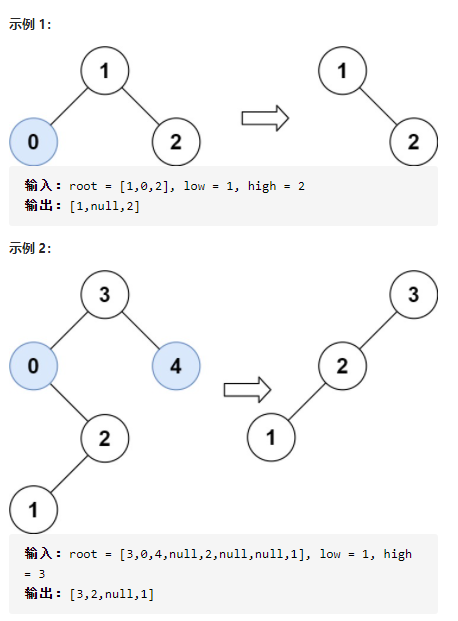

[toc]

# 声明

> QQ：475679136制作
>
> 免责声明：题型、题目仅供参考，所列题目、题型与考研并无任何关系

## 数据结构

### 一 判断题 10分 错误需说明原因

1. 通过对堆栈S操作：Push(S,1), Push(S,2), Pop(S), Push(S,3), Pop(S), Pop(S),输出的序列为：123。
2. 对任何数据结构链式存储结构一定优于顺序存储结构。
3. 度为2的有序树是二叉树。
4. 中序遍历一棵二叉排序树可以得到一个有序的序列。
5. 层次遍历一个堆可以得到有序的序列。

### 二 简答题 20分

1. 已知先序、中序遍历结果为：ABECDFGHIJ，EBCDAFHIGJ，构造相应的二叉树，并写出其后序遍历结果。


2. 将序列（12，70，33，65，24，56，48，92，86，33）调整为大顶堆，写出构造大顶堆的过程。


### 三 算法题 15分

>  将两个升序链表合并为一个新的 **升序** 链表并返回。新链表是通过拼接给定的两个链表的所有节点组成的。 
>
> **示例：**
>
> ```
> 输入：1->2->4, 1->3->4
> 输出：1->1->2->3->4->4
> ```


### 四 算法题 15分

> 给定一棵二叉树，想象自己站在它的右侧，按照从顶部到底部的顺序，返回从右侧所能看到的节点值。
>
> 示例:
>
> ```
> 输入: [1,2,3,null,5,null,4]
> 输出: [1, 3, 4]
> 解释:
> 
>    1            <---
>  /   \
> 2     3         <---
>  \     \
>   5     4       <---
> ```


### 五 算法题 15分

> 给你二叉搜索树的根节点 root ，同时给定最小边界low 和最大边界 high。通过修剪二叉搜索树，使得所有节点的值在[low, high]中。修剪树不应该改变保留在树中的元素的相对结构（即，如果没有被移除，原有的父代子代关系都应当保留）。 可以证明，存在唯一的答案。
>
> 所以结果应当返回修剪好的二叉搜索树的新的根节点。注意，根节点可能会根据给定的边界发生改变。
>
> 


## 操作系统

### 一 判断题 错误需说明原因 20分

1. 进程控制块中的所有信息必须常驻内存
2. 如P和V操作的信号量S初值为4，则现在S＝－1，表示有1个进程在等待该信号量。
3. 在页式虚拟存储系统中, 页面长度是根据程序长度动态地分配的
4. CPU可以直接存取外存上的信息
5. 在页式存储管理中，块内位移量等于页内位移量是因为页和块的大小相等
6. 进程从新建状态转换到就绪状态的工作由低级调度完成
7. 任意2个线程都能共享同一个进程的资源。
8. 置换在内存中驻留时间最长的页面的置换算法是FIFO
9. 人们已经观察到在两次缺页中断之间执行的指令数与分配给进程的页框数直接成比例。如果可用内存加倍，缺页中断间的平均间隔也加倍。假设一条普通指令需要1μs，但是如果发生了缺页中断，就需要2001μs （即2ms处理缺页中断），如果一个进程运行了60s，期间发生了15000次缺页中断，如果可用内存是原来的两倍，那么这个进程运行需要30s。
10. 一般而言，在所有的逻辑文件结构中，直接文件的访问效率最高。


### 二 简答题 10分

> 讨论页的大小对分页系统性能的影响。


### 三 大题 15分

> 三个进程P1、P2、P3互斥使用一个包含N(N>0)个单元的缓冲区。P1每次用produce()生成一个正整数并用put()送入缓冲区某一空单元中；P2每次用getodd()从该缓冲区中取出一个奇数并用countodd() 统计奇数个数；P3每次用geteven()从该缓冲区中取出一个偶数，并用counteven()统计偶数个数。请用信号量机制实现这三个进程的同步与互斥活动，并说明所定义信号量的含义，要求用伪代码描述。


### 四 大题 15分

>假定某采用分页式存储管理的系统中，主存容量为1MB，被分成256块，块号为0，1，2，……，255。某作业的地址空间占4页，其页号为0，1，2，3，被分配到主存的第2，4，1，5块中。回答：
>
>（1）主存地址应该用多少位来表示？
>
>（2）作业每一页的长度是多少？
>
>（3）逻辑地址中的页内偏移应用多少位来表示？
>
>（4）写出作业中的每一页在主存块中的起始地址。


### 五 大题 15分

> 一个分页存储系统，页表存放在内存：
>
> （1）如果访问一次内存需要 200ns，则访问一个内存单元需要多少时间？
>
> （2）如果系统采用三级页表，则访问一个内存单元需要多少时间？
>
> （3）如果系统引入联想寄存器，90%的页表项可以在快表中命中，则访问一个内存单元需要多少时间？（假设访问一次快表需要 10ns）


