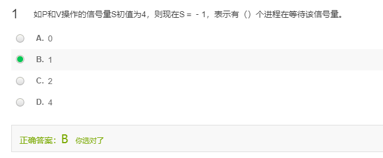
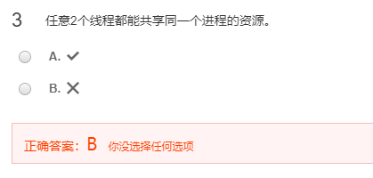
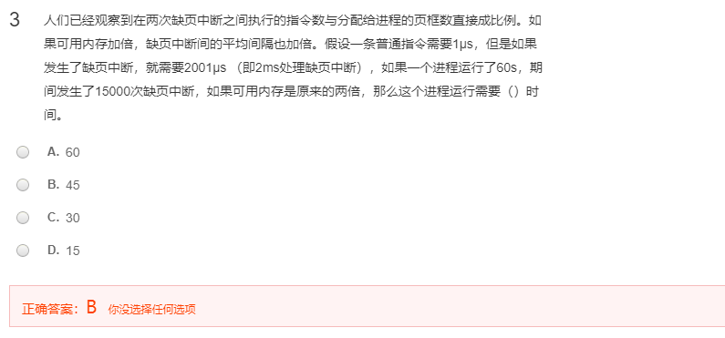
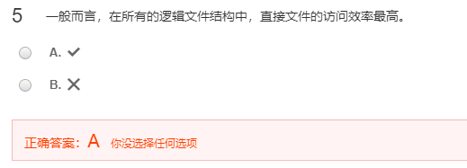
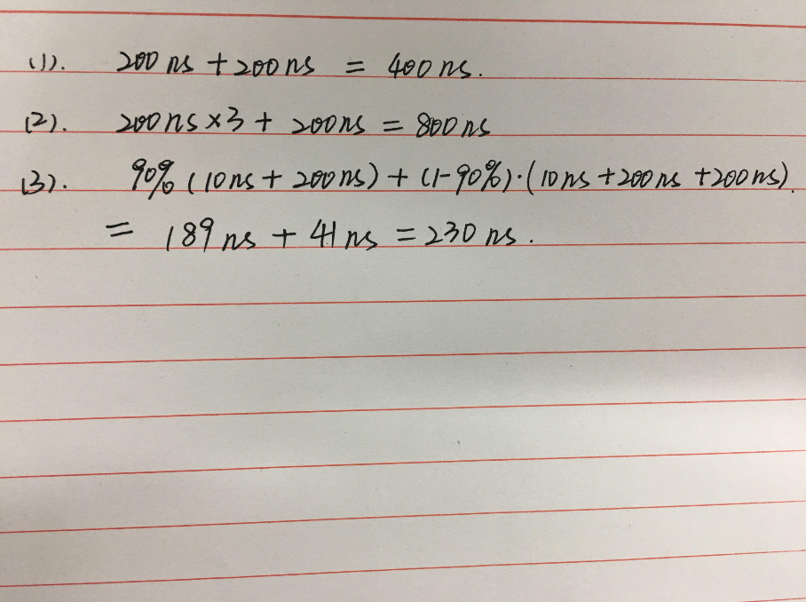

[toc]

# 答案

> QQ：475679136制作
>
> 免责声明：题型、题目仅供参考，所列题目、题型与考研并无任何关系

## 数据结构

> 数据结构的算法题都出自leetcode，题解里面有详细的解法，为了节约篇幅，这里我只贴自己的思路和解法，需要看更多解法可以自己去题解区翻看

### 一

1. F，231

2. F，需要随机访问的数据则顺序存储结构更好

3. F，一棵度为二的有序树与一棵二叉树的区别在于: 有序树的结点次序是相对于另一结点而言的，如果有序树中的子树只有一个孩子时，这个孩子结点就无须区分其左右次序，而二叉树无论其孩子数是否为2，均需确定其左右次序，也就是说二叉树的结点次序不是相对于另一结点而言而是确定的。

   ref：https://www.nowcoder.com/questionTerminal/1180be1f7f2848bbb87ae30288372489

4. T

5. F，根据堆的性质，此时不一定能得到有序序列，例如[10,3,7]是一个大顶堆，但是遍历得到10，3，7无序

### 二

两道题均出自苏大本科试卷，答案略，等群里大部分人做完就能得到答案

### 三

> ref: [21. 合并两个有序链表](https://leetcode-cn.com/problems/merge-two-sorted-lists/)
>
> 题解：[21. 合并两个有序链表 题解 - 力扣（LeetCode） (leetcode-cn.com)](https://leetcode-cn.com/problems/merge-two-sorted-lists/solution/)
>
> 可以递归解决，也可以迭代解

迭代写法

```c++
/**
 * Definition for singly-linked list.
 * struct ListNode {
 *     int val;
 *     ListNode *next;
 *     ListNode() : val(0), next(nullptr) {}
 *     ListNode(int x) : val(x), next(nullptr) {}
 *     ListNode(int x, ListNode *next) : val(x), next(next) {}
 * };
 */
ListNode* mergeTwoLists(ListNode* l1, ListNode* l2) {
    ListNode* H = new ListNode(-1);
    ListNode* tail = H;
    while(l1&&l2){
        if(l1->val<=l2->val){
            tail->next = l1; 
            tail = l1;
            l1 = l1->next;
        }else{
            tail->next = l2; 
            tail = l2;
            l2 = l2->next;
        }
    }
    while(l1){
        tail->next = l1;
        tail = l1;
        l1 = l1->next;
    }
    while(l2){
        tail->next = l2;
        tail = l2;
        l2 = l2->next;
    }
    return H->next;
}
```

递归写法

假设`mergeTwoLists`可以合并两个单链表

1. 边界情况

   当l1为空或者l2为空的时候，直接返回另一个不为空的链表即可，极端情况两个链表为空，那么返回任意一个链表都行

2. 一般操作

   考虑合并后的链表升序，我们需要对两个不为空的链表递归，下面假设`l1->val <= l2->val`

   那么我们根据当前两个链表的首结点大小关系来取出`l1`做为头结点，然后我们得到一个链表的头结点，紧接着我们需要指定头结点的next结点，由于`mergeTwoLists`可以合并两个单链表并且返回，那么我们直接传递`mergeTwoLists(l1->next,l2)`即可

   ```c++
   // l1 即为返回的单链表头结点，这一步更新头结点的下一个结点
   l1->next = mergeTwoLists(l1->next,l2);
   ```

3. 返回部分

   返回部分实际上就是上一步取出来的头结点

   ```c++
   return l1;
   ```

答案：

```c++
ListNode* mergeTwoLists(ListNode* l1, ListNode* l2) {
    if(l1 == nullptr)
        return l2;
    else if(l2 == nullptr)
        return l1;
    else{
        if(l1->val <= l2->val){
            l1->next = mergeTwoLists(l1->next,l2);
            return l1;
        }else{
            l2->next = mergeTwoLists(l1,l2->next);
            return l2;
        }
    }
}
```


### 四

> ref：[199. 二叉树的右视图](https://leetcode-cn.com/problems/binary-tree-right-side-view/)
>
> 题解：[199. 二叉树的右视图 题解 - 力扣（LeetCode） (leetcode-cn.com)](https://leetcode-cn.com/problems/binary-tree-right-side-view/solution/)
>
> 可以BFS也可以DFS

BFS：

```c++
/**
 * Definition for a binary tree node.
 * struct TreeNode {
 *     int val;
 *     TreeNode *left;
 *     TreeNode *right;
 *     TreeNode(int x) : val(x), left(NULL), right(NULL) {}
 * };
 */

vector<int> rightSideView(TreeNode* root) {
    vector<int> ans;
    if(!root)
        return ans;
    queue<TreeNode*> que;
    que.push(root);
    while(!que.empty()){
        int len = que.size();
        for(int i=0;i<len;i++){
            TreeNode* node = que.front();
            if(i==len-1)
                ans.push_back(node->val);
            que.pop();
            if(node->left) que.push(node->left);
            if(node->right) que.push(node->right);
        }
    }

    return ans;
}
```


### 五

> ref：[669. 修剪二叉搜索树](https://leetcode-cn.com/problems/trim-a-binary-search-tree/)
>
> 题解：[669. 修剪二叉搜索树 题解 - 力扣（LeetCode） (leetcode-cn.com)](https://leetcode-cn.com/problems/trim-a-binary-search-tree/solution/)
>
> 考察递归的思想

注意这是一颗二叉搜索树，应该能利用到二叉搜索树的性质来遍历
然后给定区间是$[low,high]$
一颗二叉搜索树的定义是左小右大的，那么一共还是三种情况，设根节点的值是val
则

1. low<=val<=high
	无事发生，但是要继续判断左右子树，删除掉值域外的结点
2. val<low
	根节点都小于low了，根据二叉搜索树的性质来看，此时根节点的左子树所有value都会小于low，无需递归左子树，但是可能右子树会大于low，所以要递归判断右子树
3. val>high
	根节点的值大于high，是val<low的镜像情况，无需递归右子树，但是左子树仍然可能存在符合的结点

根据上述三种情况，我们**假设**trimBST能够根据low和high的范围来修建一个二叉搜索树，并且返回修剪后的结点
然后依次设计trimBST里面的三个操作

1. 边界情况 
	root为空的时候我们直接返回root就行
	还有一个特殊情况，就是这个根节点无左右孩子，但是它当前的值不属于$[low,high]$这个区间，那么我们也是直接返回None，表示删除了这个节点
2. 一般情况（当前层次需要执行的操作）
	其实就是我们上面分析的三种情况，唯一麻烦的地方，就是我们要更新根节点，但是更新根节点的情况只会在2、3这两种情况下发生，发生的时候必有一棵子树被舍弃，我们直接将另一个孩子结点作为新的根节点返回即可
3. 返回
	依然是根据三种情况来返回
	1 返回root，其左右子树更新为trimBST(root.left,...)，trimBST(root.right,...)
	2 返回trimBST(root.right,...)
	3 返回trimBST(root.left,...)
	

写出伪代码

```python
	def trimBST(root,low,high):
		if 根节点为空:
			return None
		if 根节点左右子树为空，并且根节点的值不属于[low,high]
			return None
		if low<=root.val<=high:
			root.left = trimBST(root.left,low,high)
			root.right = trimBST(root.right,low,high)
			return root
		elif root.val<low:
			return trimBST(root.right,low,high)
		elif root.val>high:
			return trimBST(root.left,low,high)
```

上述代码的if逻辑有些混乱，更改后更加简洁，无左右孩子子树的情况不需要额外放出来

```python
class Solution:
    def trimBST(self, root: TreeNode, low: int, high: int) -> TreeNode:
        # 边界情况
        if not root:
            return root
        
        val = root.val
        if val<low:
            return self.trimBST(root.right,low,high)
        elif val>high:
            return self.trimBST(root.left,low,high)
            
        root.left = self.trimBST(root.left,low,high)
        root.right = self.trimBST(root.right,low,high)
        return root
```


### 


## 操作系统

> 三、四大题出自苏大本科试卷，最后一道题出自MOOC

### 一

> ref:
>
> [《操作系统》试题库-判断题 - 百度文库 (baidu.com)](https://wenku.baidu.com/view/284810c058f5f61fb73666ac.html)
>
> [操作系统_中国大学MOOC(慕课) (icourse163.org)](https://www.icourse163.org/learn/SUDA-1001752241?tid=1450173443#/learn/content?type=detail&id=1214322173&cid=1217928485)

1. F

2. T

   

3. F，页面长度固定

4. F，通过内存

5. T

6. F，是高级调度

   

7. F，必须是同一个父进程下的线程

   

8. T

9. F，是45s，30+15（缺页时间）s

   

10. T

    

### 二

> ref：[操作系统_中国大学MOOC(慕课) (icourse163.org)](https://www.icourse163.org/learn/SUDA-1001752241?tid=1450173443#/learn/content?type=detail&id=1214322173&cid=1217928486)
>
> 

老师没有给出标准答案

答题的时候从分页系统的知识点入手

例如：

分页过小可能会导致缺页频繁，导致频繁换入换出，降低系统新能

分页过大可能会导致内碎片过多，浪费存储空间

### 三

（1）缓冲区是一互斥资源，因此设互斥信号量mutex。

（2）同步问题：P1、P2因为奇数的放置与取用而同步，设同步信号量odd；P1、P3因为偶数的放置与取用而同步，设同步信号量even；P1、P2、P3因为共享缓冲区，设同步信号量empty。

```
Semaphore mutex=1;

Semaphore odd=0; Semaphore even=0;

Semaphore empty=N;

main()

cobegin

{

process P1

while(1){

  number=produce();

  wait(empty);

  wait(mutex);

  put();

  signal(mutex);

  if(number % 2==0)

     signal(even);

  else

     signal(odd);

}

process P2

while (1){

   wait(odd);

   wait(mutex);

   getodd();

   signal(mutex);

   signal(empty);

   countodd();

}

process P3

while (1){

   wait(even);

   wait(mutex);

   geteven();

   signal(mutex);

   signal(empty);

   counteven();

}

}

coend

```

### 四

答：

（1）由于主存容量为 1MB，而 1M等于2的20次方，因而主存地址应用20位来表示。

（2）1MB的主存空间被分成256块，因而每一块的长度为2的20次方／2的8次方＝2的12次方＝4096字节。

（3）在页式存储管理的系统中，作业信息分页的大小应该与主存分块的大小一致，故作业每一页的长度应为4096个字节。于是，逻辑地址中的页内地址部分应占12位。

（4）因为主存块的大小为4096B（4KB），块的编号从0开始，主存的绝对地址也是从0开始的，故每个主存块的起始地址为：块长*块号=4K*块号。

  现作业被分成四页（页号为0，1，2，3）且分别装入到第2，4，1，5块中。主存块起始地址应依次为：8K，16K，4K，20K。

### 五

